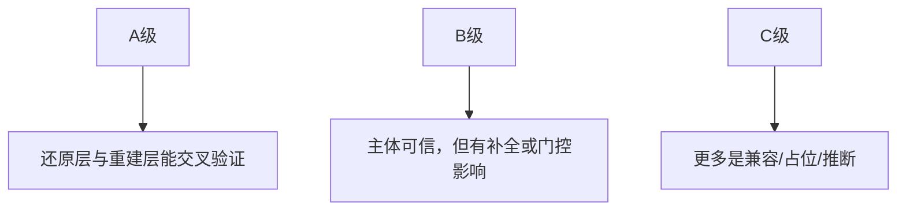

---
tags:
  - 附录
  - 方法论
---

# 附录A：逆向方法与证据分级

这一附录给出本书统一使用的证据等级。它的目标很简单：**避免把“能跑”误读成“原貌”，避免把“有代码”误读成“已上线”。**

---

## A.1 四类材料

| 材料 | 含义 | 典型位置 |
|---|---|---|
| 还原层源码 | 直接从 Source Map 恢复出的主要源码 | `claude-code-sourcemap/restored-src/src/` |
| 可运行补全层 | 以可运行、可研究为目标的重建树 | `OpenClaudeCode/src/` |
| Shim | 为缺失依赖补接口或兼容层 | `OpenClaudeCode/shims/` |
| Vendor | 为缺失原生/外部实现提供源替代 | `OpenClaudeCode/vendor/` |

---

## A.2 证据等级

| 等级 | 说明 | 在本书中的写法 |
|---|---|---|
| A | 多处交叉验证，逻辑完整 | 可直接作为主要论据 |
| B | 主体可信，但局部需谨慎 | 会明确标注“可能受补全影响” |
| C | 只作参考，不宜下结论 | 会明显加“推测/补全层”提醒 |

---

## A.3 三步判断法

1. 先看它是不是存在于 `claude-code-sourcemap/restored-src/src/`。
2. 再看 `OpenClaudeCode/src/` 是否存在对应实现或调用链。
3. 最后看它是否被 `feature()`、GrowthBook 或 shim 包裹。

---

## A.4 写作时的引用规则

- 引用 `src/` 的核心主链代码，默认优先用 A 级。
- 涉及 `shims/`、`vendor/`、隐藏 gate、实验入口时，必须加提醒。
- 任何“未来方向”判断都要基于多处证据，而不是单一 flag。

---

## A.5 本书最常见的误区提醒

| 误区 | 正确做法 |
|---|---|
| 看到目录就当功能已上线 | 先看 gate 与主链接入 |
| 看到 OpenClaudeCode 代码就当 Anthropic 原貌 | 先问它是否是补全层 |
| 看到 shim 就完全忽略 | 它仍能揭示接口边界 |
| 只看单文件不看调用链 | 交叉验证 QueryEngine / tools / commands / settings |

!!! success "附录A结论"
    逆向阅读最重要的不是“看得多快”，而是“证据层分得清”。只有先把还原层、补全层、门控层和兼容层分开，后面的分析才站得住。
