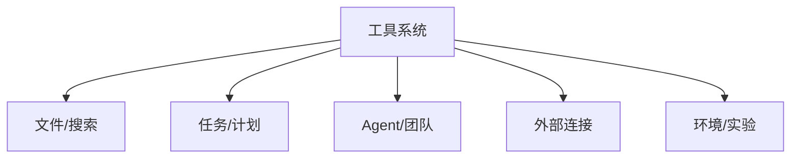

---
tags:
  - 附录
  - 工具
---

# 附录B：54 个工具速查手册

本书把 Claude Code 的工具体系理解为：**53 个顶层工具目录 + 1 个运行时 MCP 包装入口**。这就是“54 类工具”的由来。

---

## B.1 工具总览图



---

## B.2 按类别速查

| 类别 | 代表工具 |
|---|---|
| 文件与搜索 | `FileReadTool` `FileEditTool` `FileWriteTool` `GlobTool` `GrepTool` `NotebookEditTool` |
| 任务与计划 | `TaskCreateTool` `TaskGetTool` `TaskListTool` `TaskUpdateTool` `TaskStopTool` `TaskOutputTool` `TodoWriteTool` |
| Agent 与团队 | `AgentTool` `TeamCreateTool` `TeamDeleteTool` `SendMessageTool` `SkillTool` |
| 外部连接 | `MCPTool` `ListMcpResourcesTool` `ReadMcpResourceTool` `WebFetchTool` `WebSearchTool` `WebBrowserTool` |
| 模式与环境 | `EnterPlanModeTool` `ExitPlanModeTool` `EnterWorktreeTool` `ExitWorktreeTool` `ConfigTool` |
| 平台/实验 | `BriefTool` `SleepTool` `RemoteTriggerTool` `MonitorTool` `SnipTool` `WorkflowTool` |

---

## B.3 顶层工具目录清单

```text
AgentTool
AskUserQuestionTool
BashTool
BriefTool
ConfigTool
DiscoverSkillsTool
EnterPlanModeTool
EnterWorktreeTool
ExitPlanModeTool
ExitWorktreeTool
FileEditTool
FileReadTool
FileWriteTool
GlobTool
GrepTool
LSPTool
ListMcpResourcesTool
MCPTool
McpAuthTool
MonitorTool
NotebookEditTool
OverflowTestTool
PowerShellTool
REPLTool
ReadMcpResourceTool
RemoteTriggerTool
ReviewArtifactTool
ScheduleCronTool
SendMessageTool
SendUserFileTool
SkillTool
SleepTool
SnipTool
SyntheticOutputTool
TaskCreateTool
TaskGetTool
TaskListTool
TaskOutputTool
TaskStopTool
TaskUpdateTool
TeamCreateTool
TeamDeleteTool
TerminalCaptureTool
TodoWriteTool
ToolSearchTool
TungstenTool
VerifyPlanExecutionTool
WebBrowserTool
WebFetchTool
WebSearchTool
WorkflowTool
shared
testing
```

补充说明：

- `MCPTool` 是运行时包装入口，会把外部 MCP server 暴露出来的工具也接成统一 Tool。
- `shared/` 与 `testing/` 更像支撑目录，但它们也属于工具层的一部分。

---

## B.4 快速定位建议

| 想找什么 | 优先看哪里 |
|---|---|
| 工具统一协议 | `src/Tool.ts` |
| 工具池与启停逻辑 | `src/tools.ts` |
| 某个具体工具 | `src/tools/<ToolName>/` |
| 运行时外接工具 | `src/services/mcp/` + `src/tools/MCPTool/` |

!!! success "附录B结论"
    工具系统最重要的不是工具数量，而是它们全部会回到同一协议、同一权限和同一主循环里。这正是 Claude Code 工具层真正强大的地方。
