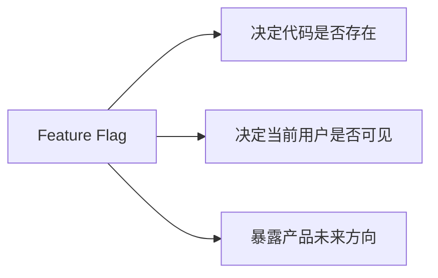

---
tags:
  - 附录
  - Feature Flag
---

# 附录D：89 个 Feature Flag

这一附录基于本地源码重新统计，确认当前可识别的唯一 `feature('...')` 标记共 **89 个**。

---

## D.1 它们为什么重要



---

## D.2 按主题分组

| 主题 | 代表 flag |
|---|---|
| 主动与后台 | `KAIROS` `PROACTIVE` `AGENT_TRIGGERS` `MONITOR_TOOL` |
| 上下文与压缩 | `CONTEXT_COLLAPSE` `HISTORY_SNIP` `REACTIVE_COMPACT` `CACHED_MICROCOMPACT` |
| 协作与远程 | `COORDINATOR_MODE` `UDS_INBOX` `BRIDGE_MODE` `CCR_REMOTE_SETUP` |
| 多模态与界面 | `VOICE_MODE` `BUDDY` `TERMINAL_PANEL` `MESSAGE_ACTIONS` |
| 扩展与生态 | `MCP_SKILLS` `MCP_RICH_OUTPUT` `WORKFLOW_SCRIPTS` `WEB_BROWSER_TOOL` |

---

## D.3 全量清单（按字母序）

```text
ABLATION_BASELINE
AGENT_MEMORY_SNAPSHOT
AGENT_TRIGGERS
AGENT_TRIGGERS_REMOTE
ALLOW_TEST_VERSIONS
ANTI_DISTILLATION_CC
AUTO_THEME
AWAY_SUMMARY
BASH_CLASSIFIER
BG_SESSIONS
BREAK_CACHE_COMMAND
BRIDGE_MODE
BUDDY
BUILDING_CLAUDE_APPS
BUILTIN_EXPLORE_PLAN_AGENTS
BYOC_ENVIRONMENT_RUNNER
CACHED_MICROCOMPACT
CCR_AUTO_CONNECT
CCR_MIRROR
CCR_REMOTE_SETUP
CHICAGO_MCP
COMMIT_ATTRIBUTION
COMPACTION_REMINDERS
CONNECTOR_TEXT
CONTEXT_COLLAPSE
COORDINATOR_MODE
COWORKER_TYPE_TELEMETRY
DAEMON
DIRECT_CONNECT
DOWNLOAD_USER_SETTINGS
DUMP_SYSTEM_PROMPT
ENHANCED_TELEMETRY_BETA
EXPERIMENTAL_SKILL_SEARCH
EXTRACT_MEMORIES
FILE_PERSISTENCE
FORK_SUBAGENT
HARD_FAIL
HISTORY_PICKER
HISTORY_SNIP
HOOK_PROMPTS
IS_LIBC_GLIBC
IS_LIBC_MUSL
KAIROS
KAIROS_BRIEF
KAIROS_CHANNELS
KAIROS_DREAM
KAIROS_GITHUB_WEBHOOKS
KAIROS_PUSH_NOTIFICATION
LODESTONE
MCP_RICH_OUTPUT
MCP_SKILLS
MEMORY_SHAPE_TELEMETRY
MESSAGE_ACTIONS
MONITOR_TOOL
NATIVE_CLIENT_ATTESTATION
NATIVE_CLIPBOARD_IMAGE
NEW_INIT
OVERFLOW_TEST_TOOL
PERFETTO_TRACING
POWERSHELL_AUTO_MODE
PROACTIVE
PROMPT_CACHE_BREAK_DETECTION
QUICK_SEARCH
REACTIVE_COMPACT
REVIEW_ARTIFACT
RUN_SKILL_GENERATOR
SELF_HOSTED_RUNNER
SHOT_STATS
SKILL_IMPROVEMENT
SLOW_OPERATION_LOGGING
SSH_REMOTE
STREAMLINED_OUTPUT
TEAMMEM
TEMPLATES
TERMINAL_PANEL
TOKEN_BUDGET
TORCH
TRANSCRIPT_CLASSIFIER
TREE_SITTER_BASH
TREE_SITTER_BASH_SHADOW
UDS_INBOX
ULTRAPLAN
ULTRATHINK
UNATTENDED_RETRY
UPLOAD_USER_SETTINGS
VERIFICATION_AGENT
VOICE_MODE
WEB_BROWSER_TOOL
WORKFLOW_SCRIPTS
```

---

## D.4 阅读提醒

- Flag 存在，不代表功能默认开启。
- 同一个能力可能同时受编译期和运行期 gate 控制。
- 想判断某 flag 是否重要，要看它是否进入主链、是否有配套治理、是否跨多目录出现。

!!! success "附录D结论"
    89 个 flag 组成的，不只是开关表，而是一张产品路线图。越是跨越工具、UI、主循环、设置与 analytics 多处出现的 flag，越值得重点关注。
