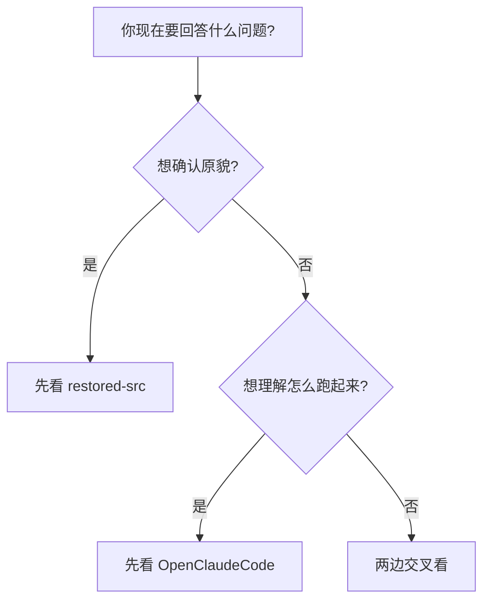

---
tags:
  - 附录
  - 差异矩阵
---

# 附录E：还原层与补全层差异矩阵

这一附录把 `claude-code-sourcemap` 与 `OpenClaudeCode` 的关系做成一张表，方便你在阅读时随时回来看“这个结论到底站在什么证据上”。

---

## E.1 快速对照

| 维度 | `claude-code-sourcemap` | `OpenClaudeCode` |
|---|---|---|
| 主要目标 | 尽量还原已发布包的源码形态 | 尽量补全到可运行、可研究 |
| `src` 文件数 | 1884 | 1989 |
| 辅助目录 | 以还原层为主 | 额外含 `shims/` 与 `vendor/` |
| 最适合做什么 | 证据基底、调用链考证 | 运行验证、结构补全、目录导航 |

---

## E.2 模块级差异矩阵

| 模块 | 还原层可信度 | OpenClaudeCode 价值 | 阅读建议 |
|---|---|---|---|
| `query.ts` / `QueryEngine.ts` | 高 | 高 | 可作为核心主证据 |
| `Tool.ts` / `tools.ts` | 高 | 高 | 适合双线交叉看 |
| `commands.ts` / `commands/` | 高 | 高 | 适合做功能全景导航 |
| `bridge/` | 中高 | 高 | OpenClaudeCode 更利于研究整体结构 |
| `memdir/` | 高 | 高 | 两边互证效果好 |
| `shims/` | 无 | 中 | 只看接口与补全策略，别当原作 |
| `vendor/` | 无 | 中 | 用于理解托底能力，不宜直接推官方设计 |

---

## E.3 什么时候优先看哪一套

---

## E.4 本书的默认原则

1. 核心执行链优先引用还原层。
2. 涉及运行时补全、shim、vendor、兼容逻辑时优先说明 OpenClaudeCode 角色。
3. 只在 OpenClaudeCode 出现、无法与还原层互证的结论，自动降一档可信度。

---

## E.5 最终结论

`claude-code-sourcemap` 和 `OpenClaudeCode` 的关系，不是“谁真谁假”，而是“谁更像证据基底，谁更像运行补全”。两者一起读，才最接近严肃源码研究应有的姿势。

!!! success "附录E结论"
    还原层帮你守住“别过度想象”，补全层帮你守住“别只停留在碎片理解”。真正可靠的结论，几乎都来自两边的交叉验证。
