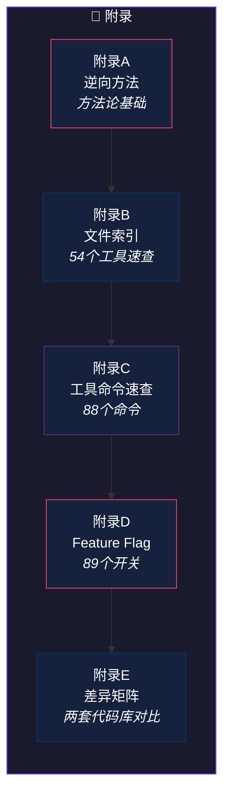

# 附录

> *工具书的价值在于随时查阅。这些附录是全书的"速查手册"。*
>
> 本部分提供五份参考资料：**逆向方法论**、**文件索引**、**工具命令速查**、**Feature Flag 清单**、**差异矩阵**。

---

## 附录总览

---

## 附录速览

| 附录 | 标题 | 内容 |
|------|------|------|
| A | [逆向方法与证据分级](appendix-a.md) | Source Map V3 规范、VLQ 编码、证据分级标准 |
| B | [54 个工具速查手册](appendix-b.md) | 每个工具的名称、用途、参数、权限、并发安全性 |
| C | [88 个命令速查手册](appendix-c.md) | 每个斜杠命令的名称、功能、参数、可见性 |
| D | [89 个 Feature Flag](appendix-d.md) | 每个 Flag 的名称、用途、关联模块、类型 |
| E | [差异矩阵](appendix-e.md) | sourcemap 还原层 vs OpenClaudeCode 补全层逐模块对比 |

---

!!! tip "使用建议"
    附录适合在阅读正文时**随时翻阅**。建议收藏本页作为速查入口。

!!! note "即将上线"
    附录内容正在整理中，敬请期待。
