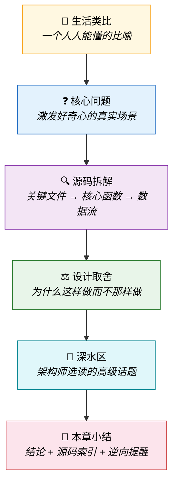
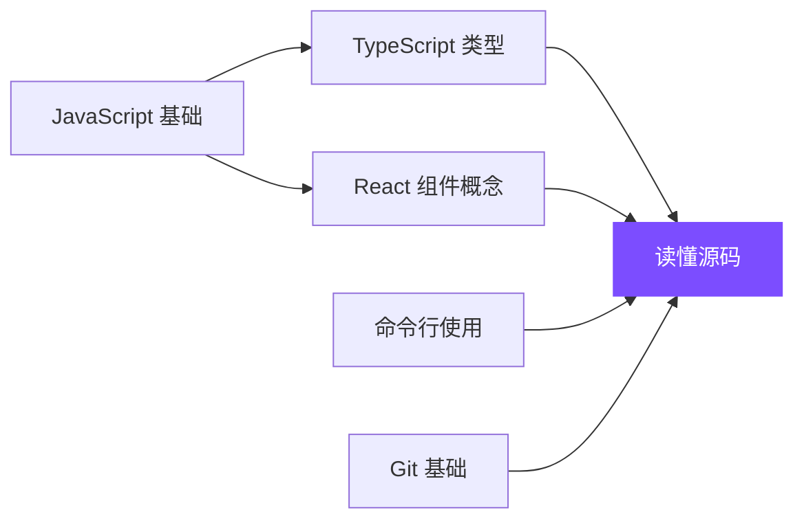

# 阅读指南

## 每章的阅读地图

本书每一章都遵循相同的结构，方便不同水平的读者各取所需：

!!! tip "所有人都读"
    **生活类比** + **核心问题** —— 建立直觉，激发好奇心

!!! info "有基础的读者继续"
    **源码拆解** + **设计取舍** —— 理解"怎么做"和"为什么"

!!! abstract "架构师选读"
    **深水区** —— 高级话题、边界情况、竞品对比

---

## 特殊标记说明

本书使用以下标记帮助你快速定位内容：

### 可信度等级

每个源码引用都标注可信度：

| 等级 | 标记 | 含义 |
|------|------|------|
| **A级** | A | 确认原始 — Source Map 直接还原 |
| **B级** | B | 高度可信 — 主体原始，少量补全 |
| **C级** | C | 补全推测 — shim/stub/fallback |

### 逆向提醒

每章末尾的逆向提醒用三个图标区分：

- ✅ **RELIABLE**：可以放心引用的分析
- ⚠️ **CAUTION**：需要注意版本差异或可能的变化
- ❌ **SHIM/STUB**：来自补全层，不代表官方实现

---

## 技术准备

阅读本书不需要成为 TypeScript 专家，但以下基础知识会帮助你更好地理解：

**第2章**会为你补充必要的背景知识，即使你目前只熟悉其中一两项也没关系。
