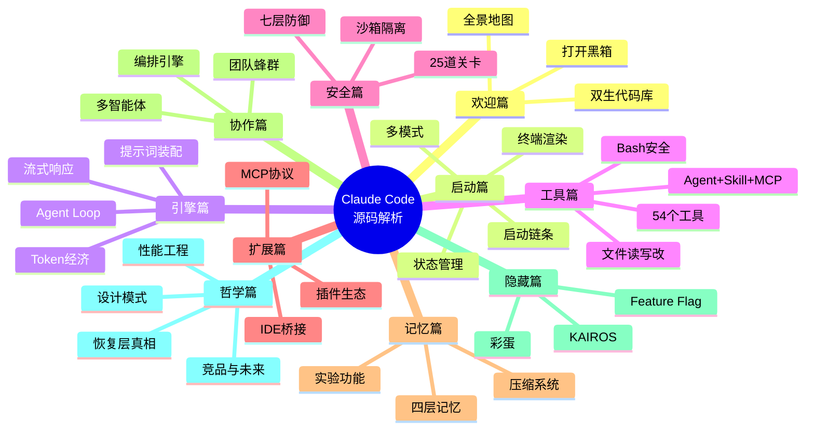

---
hide:
  - navigation
  - toc
---

# Claude Code 源码解析红宝书

**基于 v2.1.88 双生逆向源码的设计思想深度解析**

*从高中生到架构师，一本书，三种读法，同一条路径*

1,884

TypeScript 文件

512,664

行源代码

54

内置工具

88

斜杠命令

89

Feature Flag

[开始阅读 :material-arrow-right:](guide.md){ .md-button .md-button--primary }
[第一编：欢迎来到源码的世界 :material-book-open-variant:](part1/index.md){ .md-button }

---

## 这本书讲什么

---

## 四条设计思想主线

!!! tip "主线一：不是聊天壳"
    Claude Code 不是套了个壳的 ChatGPT——它是一个**会调用工具的任务执行器**

!!! tip "主线二：铁三角"
    核心架构 = **上下文装配** + **Agent Loop** + **工具编排**

!!! tip "主线三：最难的不是生成"
    真正的工程挑战在于**权限、安全、压缩、恢复、一致性**

!!! tip "主线四：两套代码库"
    "能跑起来"不等于"官方原始设计"——严格区分**还原层**与**补全层**

---

## 全书结构一览

| 编 | 主题 | 章节 | 生活类比 |
|---|------|------|----------|
| 第一编 | [欢迎来到源码的世界](part1/index.md) | 1-4 | 拆开收音机 |
| 第二编 | [程序是怎么启动的](part2/index.md) | 5-8 | 汽车点火 |
| 第三编 | [AI 是怎么思考的](part3/index.md) | 9-13 | 厨师做菜 |
| 第四编 | [AI 的双手——工具系统](part4/index.md) | 14-19 | 电器插头标准 |
| 第五编 | [安全防线](part5/index.md) | 20-24 | 机场安检 |
| 第六编 | [连接世界](part6/index.md) | 25-28 | USB 接口 |
| 第七编 | [记忆与遗忘](part7/index.md) | 29-32 | 人的记忆系统 |
| 第八编 | [AI 团队](part8/index.md) | 33-35 | 蜜蜂分工 |
| 第九编 | [冰山之下](part9/index.md) | 36-38 | 隐藏关卡 |
| 第十编 | [站在巨人肩膀上](part10/index.md) | 39-42 | 武术心法 |

---

## 三种读法

=== "🌱 探索路径（初学者）"

    **推荐章节**：1 → 4 → 5 → 8 → 9 → 11 → 14 → 16 → 20 → 29 → 33 → 36 → 39 → 42

    每章只读**生活类比**和**核心问题**部分，跳过深水区。你会理解一个真实大型软件的设计思路。

=== "🔧 实战路径（开发者）"

    按编顺序通读，**选读深水区**。你会获得可复用的架构模式和 CLI 开发实战经验。

=== "🏗️ 架构路径（架构师）"

    先读**第3章**（证据边界）和**第41章**（恢复层真相），再按兴趣深入所有**深水区**。
