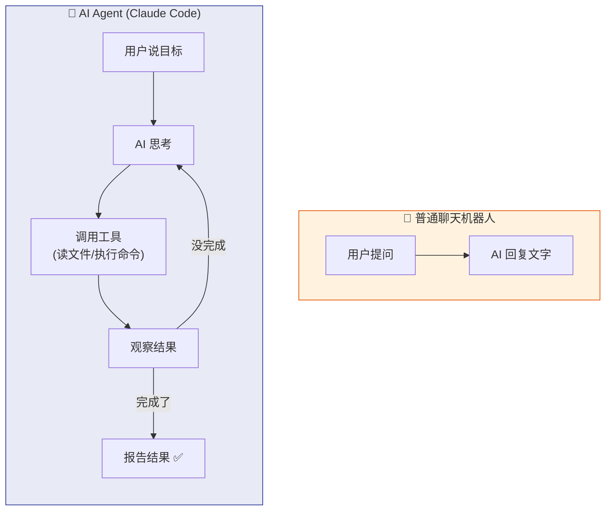
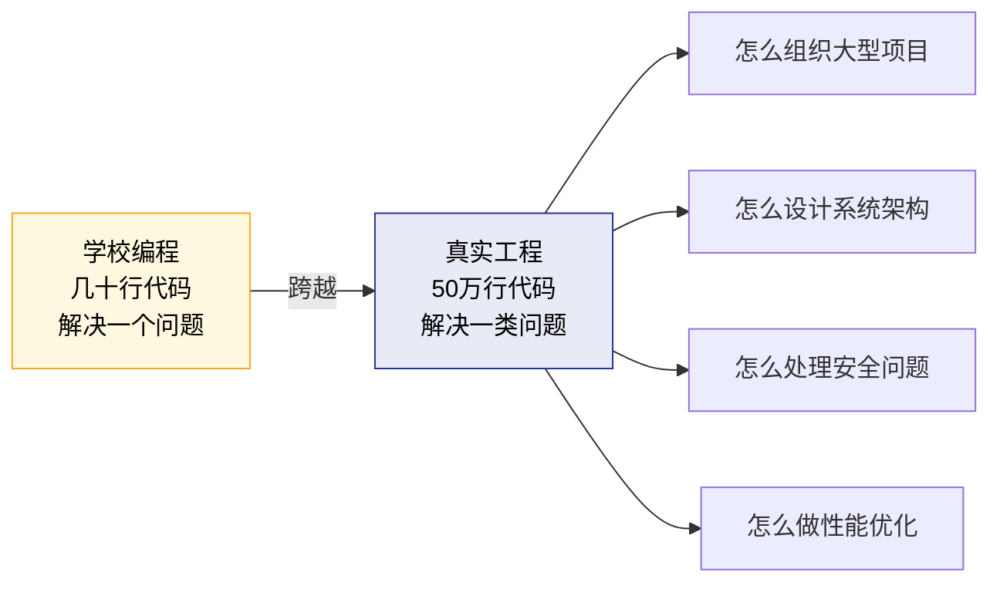
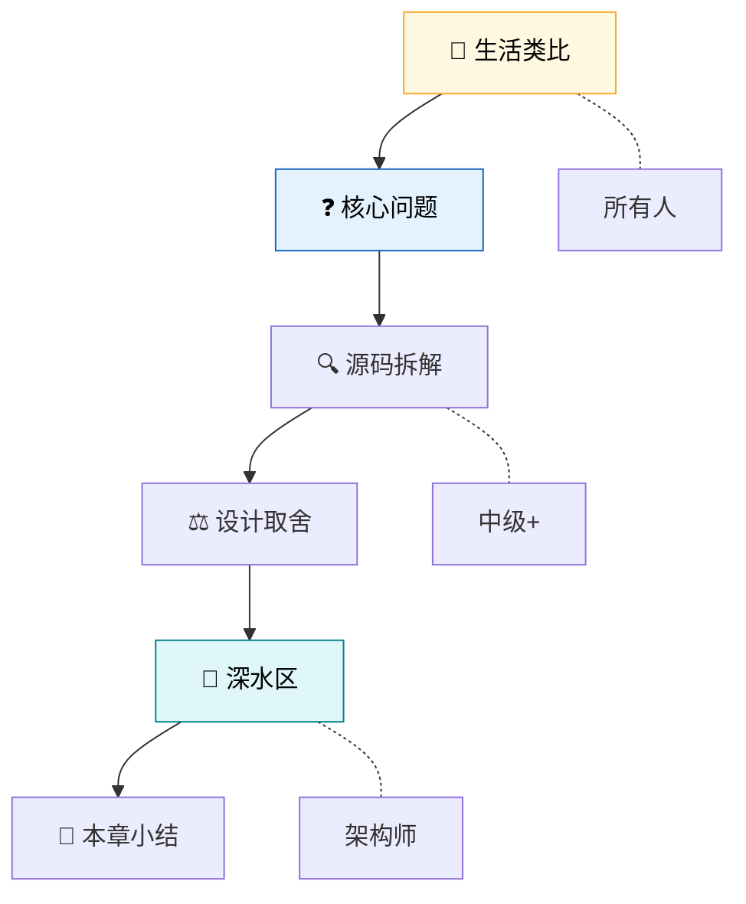
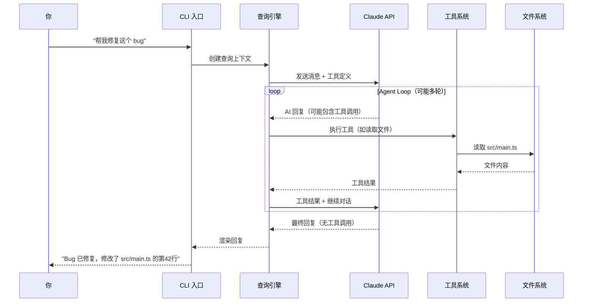

---
tags:
  - 入门
  - 架构总览
---

# 第1章：打开黑箱——AI 编程助手的秘密

!!! tip "生活类比"
    你用过收音机吗？拧旋钮就能换台，但你知道里面发生了什么吗？拆开收音机看到电路板的那一刻，"换台"从魔法变成了物理。**读源码就是"拆开收音机"。**

!!! question "这一章要回答的问题"
    **你在终端输入一句话，AI 帮你改了代码——中间到底发生了什么？**

    你每天都在用 AI 编程助手，但它不是魔法。从你敲下一行自然语言，到代码被修改、文件被保存，中间有一条完整的执行链条。理解这条链条，是理解一切的起点。

---

## 1.1 Claude Code 是什么

### 一个运行在终端里的 AI 编程助手

你可能用过网页版的 Claude 对话——在浏览器里输入问题，AI 回复文字。Claude Code 不一样，它运行在你的**终端（Terminal）**里：

```bash
$ claude
╭─────────────────────────────────────╮
│ ✻ Welcome to Claude Code!           │
│                                     │
│   /help for available commands      │
╰─────────────────────────────────────╯

> 帮我修复这个 bug
```

### 不只是"说话"——能"做事"

网页版 Claude 只能给你建议。Claude Code 可以**真正动手**：


这背后是 **54 个内置工具**在支撑——文件读写、Shell 执行、代码搜索、网页获取……AI 不只是"说"，它可以"做"。

### Agent 与 Chatbot 的根本区别



这个**"思考 → 行动 → 观察 → 再思考"**的循环，就是所谓的 **Agent Loop**——它是整个 Claude Code 的心脏，我们将在第11章深入剖析。

---

## 1.2 为什么要读源码

### 打开黑箱：从魔法到工程

当你知道了 Claude Code 的内部机制，很多"魔法"就变成了可以理解的工程：

| 你的疑问 | 源码给出的答案 | 对应章节 |
|----------|---------------|---------|
| "它怎么知道要改哪个文件？" | 工具系统告诉 AI 可以做什么 | 第14章 |
| "它为什么有时候出错？" | Agent Loop 的停止条件和错误处理 | 第11章 |
| "它怎么保证不搞坏我的代码？" | 七层安全防御体系 | 第20章 |
| "它怎么记住我之前说的？" | 四层记忆架构 | 第29章 |
| "多个 AI 能一起工作？" | 三种多智能体路径 | 第33章 |

### 学习真实世界的工程

学校里的编程作业通常几十行代码解决一个小问题。Claude Code 有 **512,664 行代码**，分布在 **1,884 个文件**里。读它就像从练习本走进建筑工地：



### 站在巨人肩膀上

Claude Code 是 Anthropic 顶级工程师们的作品。他们的代码体现了多年的工程经验。理解他们的设计决策——**为什么这样做、为什么不那样做**——比学任何课程都管用。

---

## 1.3 这本书怎么读

### 三种读法

本书为三种读者设计了三条路径：

=== "🌱 探索路径"

    **适合**：高中生、编程初学者

    每章只读 **生活类比** 和 **核心问题**，跳过代码细节和深水区。你会建立对大型软件设计的直觉——这比任何教科书都生动。

    **推荐路线**：1 → 4 → 5 → 8 → 11 → 14 → 20 → 29 → 39 → 42（10章精选）

=== "🔧 实战路径"

    **适合**：有经验的开发者

    按编顺序通读，**重点看源码拆解和设计取舍**，深水区选读。你会获得可复用的架构模式。

    **推荐路线**：按编顺序

=== "🏗️ 架构路径"

    **适合**：架构师、AI Agent 开发者

    先读**第3章**和**第41章**确立证据边界，再按兴趣深入每章的**深水区**。

    **推荐路线**：3 → 41 → 11 → 14 → 20 → 25 → 33 → 39

### 每章的结构

每一章都遵循相同的阅读地图：



### 不需要读懂每一行代码

本书的目标是理解**设计思想**，不是逐行翻译代码。关键代码会附上解释，跳过细节不影响理解主线。

---

## 一条命令的完整旅程——预览

在深入各章之前，先预览一下全景：当你输入 `帮我修复这个 bug` 时，Claude Code 内部发生了什么：



这条旅程涉及本书几乎所有核心概念：

- **CLI 入口**（第5章）→ **查询引擎**（第10章）→ **Agent Loop**（第11章）
- **工具系统**（第14章）→ **文件工具**（第17章）→ **权限系统**（第21章）
- **流式响应**（第12章）→ **Token 管理**（第13章）

---

!!! abstract "🔭 深水区（架构师选读）"
    **AI Agent 框架在技术光谱中的位置**

    Claude Code 采用的是"**单模型、多工具、循环驱动**"的 Agent 架构——不依赖多模型编排（如 AutoGPT 的 GPT-4 + GPT-3.5 分工），也不依赖框架抽象（如 LangChain 的链式调用），而是让一个 Claude 模型在 `while(true)` 循环中自主决策工具调用。

    这种架构的优势是**简洁和可控**——所有决策出自同一个模型，不存在多模型协调的一致性问题。代价是**单模型的能力上限即整个系统的上限**——但 Claude 模型本身的能力足够强，使这个取舍在当前阶段是合理的。

    源码中的 `query.ts`（1,729行）就是这个循环的完整实现。我们将在第11章逐行拆解它。

---

!!! success "本章小结"
    **一句话**：Claude Code 是一个能读写文件、执行命令的命令行 AI 助手，读它的源码就是拆开黑箱理解 AI 编程工具的真实运作方式。

!!! info "关键源码索引"
    | 文件 | 职责 | 可信度 |
    |------|------|--------|
    | `src/bootstrap-entry.ts` | 5行启动入口 | <span class="reliability-a">A</span> |
    | `src/entrypoints/cli.tsx` | CLI 命令路由（302行） | <span class="reliability-a">A</span> |
    | `src/main.tsx` | 主协调器（4,683行） | <span class="reliability-a">A</span> |
    | `src/query.ts` | Agent Loop 核心（1,729行） | <span class="reliability-a">A</span> |
    | `src/Tool.ts` | 工具统一接口（792行） | <span class="reliability-a">A</span> |

!!! warning "逆向提醒"
    - ✅ **RELIABLE**：CLI 启动链条和 Agent Loop 的存在——完整的 Source Map 还原
    - ⚠️ **CAUTION**：部分内部配置项（如模型名称、API 端点）可能随版本变化
    - ❌ **SHIM/STUB**：无——本章为概述章节，不涉及特定实现细节
