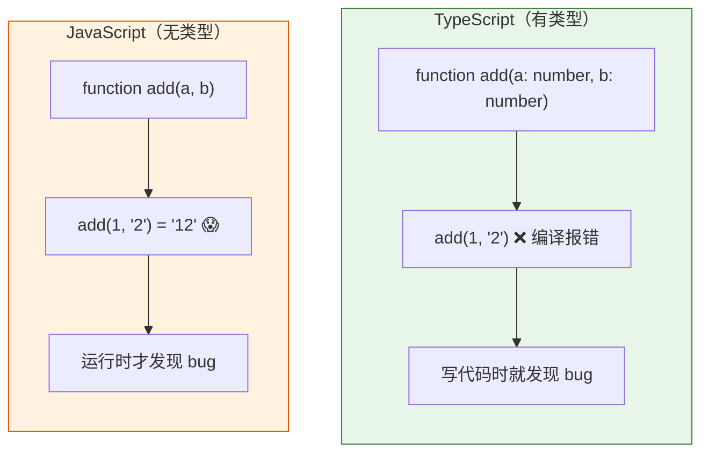
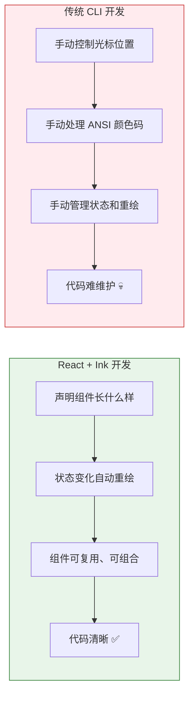
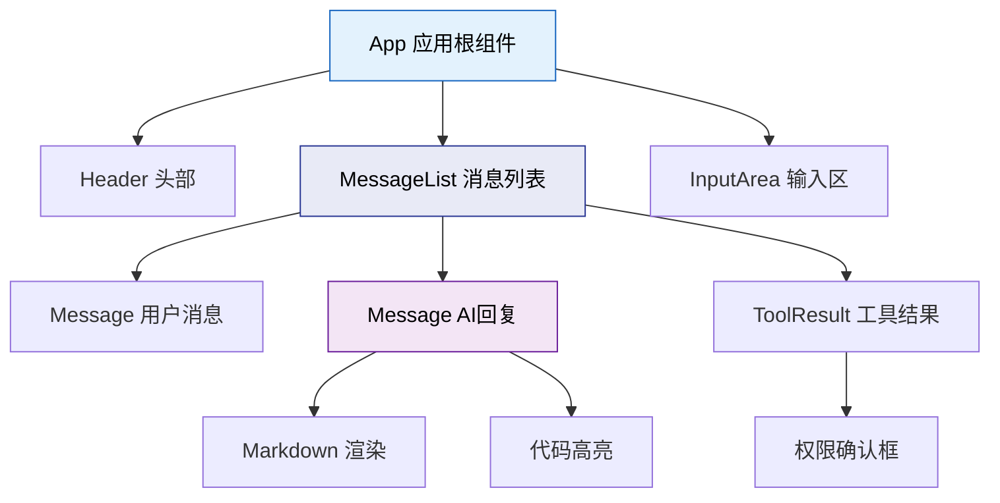
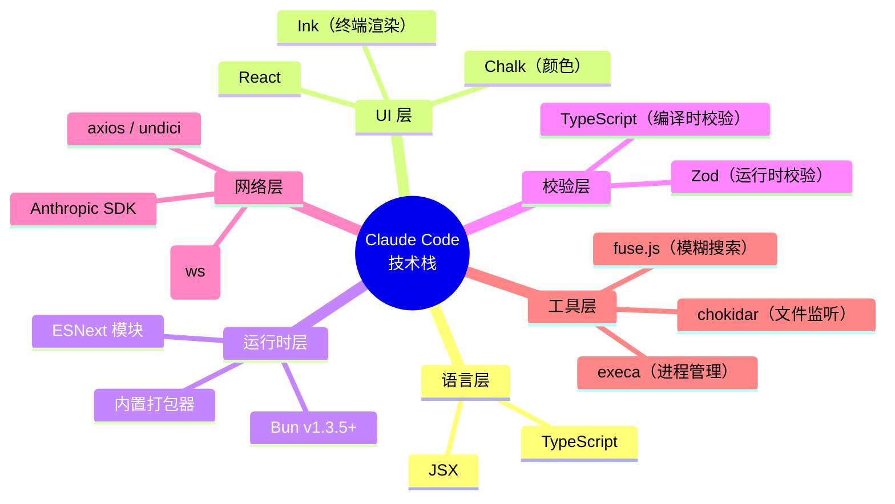
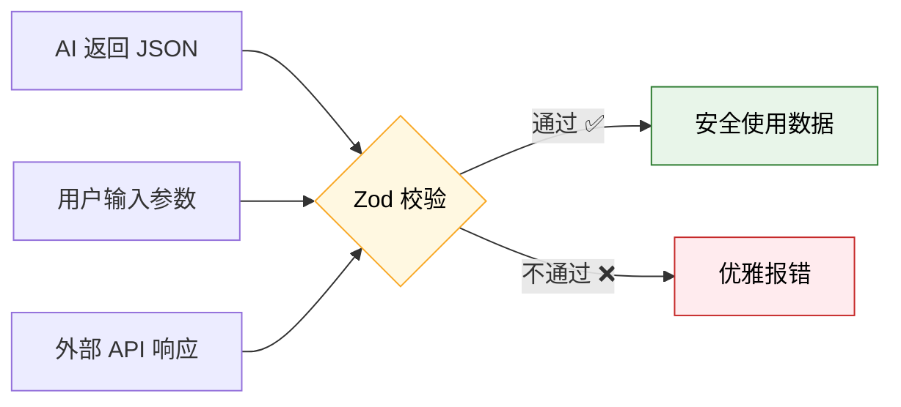

---
tags:
  - 入门
  - 技术栈
---

# 第2章：你需要知道的背景知识

!!! tip "生活类比"
    学开车之前，你至少要知道方向盘、油门、刹车在哪里。你不需要会修发动机，但要认识这几个零件。读 Claude Code 源码也一样——先认识四个核心"零件"就够了：**TypeScript 是发动机的语言，React+Ink 是仪表盘，Bun 是涡轮增压器，Zod 是安全气囊。**

!!! question "这一章要回答的问题"
    **TypeScript、React、Bun、Zod 是什么？Claude Code 为什么选这些技术？**

    技术选型不是拍脑袋。Claude Code 选择 TypeScript 而非 Python，选择 React 而非直接打印字符，选择 Bun 而非 Node.js——每个选择都有工程上的理由。了解这些背景，你才能看懂后面的源码。

---

## 2.1 TypeScript：给 JavaScript 穿上铠甲

### 为什么 50 万行代码需要类型

JavaScript 是动态类型语言——一个变量可以上一秒是数字、下一秒变成字符串。写 50 行脚本时这很灵活，但在 **512,664 行**的大项目中，没有类型就像在黑暗中走钢丝：



TypeScript 在编译阶段就能发现类型错误，不用等到用户面前崩溃。当 AI 返回的 JSON 缺少字段时，TypeScript 能在你按下保存键时就告诉你，而不是在线上出事故。

### Claude Code 的 TypeScript 配置

打开 `tsconfig.json`，最关键的几行：

```json
{
  "compilerOptions": {
    "target": "ESNext",
    "module": "ESNext",
    "moduleResolution": "bundler",
    "jsx": "react-jsx",
    "strict": false,
    "types": ["bun"]
  }
}
```

| 配置项 | 含义 | 为什么这样选 |
|--------|------|-------------|
| `target: "ESNext"` | 编译到最新 JS 标准 | Bun 运行时支持最新语法，不需要降级 |
| `jsx: "react-jsx"` | 支持 JSX 语法 | 因为用了 React+Ink 做终端 UI |
| `strict: false` | 没有开启最严格模式 | 50 万行代码全部严格化成本太高 |
| `types: ["bun"]` | 加载 Bun 的类型定义 | 让 TypeScript 认识 Bun 的 API |

### 你需要记住的 TypeScript 基础

读后面的源码时，你会反复遇到这些语法：

| 语法 | 含义 | 示例 |
|------|------|------|
| `x: Type` | 类型标注 | `name: string` |
| `Type[]` | 数组类型 | `tools: Tool[]` |
| `T extends U` | 泛型约束 | `function parse<T extends Schema>()` |
| `interface` | 接口定义 | `interface ToolInput { ... }` |
| `as` | 类型断言 | `result as ToolOutput` |
| `?.` | 可选链 | `config?.model?.name` |

---

## 2.2 React 与 Ink：终端里的"前端框架"

### 命令行也需要 UI 框架吗？

你可能觉得终端程序就是 `console.log`——打印一行文字而已。但看看 Claude Code 的界面：有彩色文字、有实时更新的进度条、有可交互的确认对话框、有 Markdown 渲染……这些用 `console.log` 拼出来要写多少 `if-else`？



### 组件思维：把 UI 拆成积木

React 的核心思想是**组件化**——把界面拆成独立的、可复用的积木块：



在 Claude Code 中，**Ink** 框架让 React 组件渲染到终端而非浏览器。`<Box>` 替代 `<div>`，`<Text>` 替代 `<span>`——概念完全一样，只是渲染目标从像素变成了字符。

### 声明式 vs 命令式

传统 CLI：你要告诉计算机"先清屏、在第 3 行第 5 列打印蓝色文字、光标移到下一行……"——这叫**命令式**。

React 方式：你只说"我要一个蓝色文字组件，内容是这个"——React 自动算出怎么画、状态变了自动重绘——这叫**声明式**。

`package.json` 中的关键依赖：

| 依赖 | 版本要求 | 角色 |
|------|---------|------|
| `react` | * | UI 组件模型 |
| `react-reconciler` | * | React 自定义渲染器核心 |
| `ink` | * | 终端渲染适配层 |
| `chalk` | * | 终端颜色与样式 |
| `cli-boxes` | * | 终端边框与布局 |
| `wrap-ansi` | * | 文本自动换行 |

Claude Code 甚至自研了一套 Ink 实现（`src/ink/` 目录），对官方 Ink 做了深度定制——这是为了解决终端环境下的特殊渲染需求。

---

## 2.3 Bun 运行时与 Zod 校验

### Bun：更快的 JavaScript 引擎



Bun 是一个用 Zig 语言编写的 JavaScript 运行时。和 Node.js 做同样的事，但有三个关键优势：

| 对比维度 | Node.js | Bun |
|----------|---------|-----|
| 冷启动速度 | ~200ms | ~50ms |
| 包管理器 | npm/yarn/pnpm（需额外安装） | 内置 |
| 打包能力 | 需要 webpack/esbuild | 内置 |
| TypeScript | 需要 ts-node 或编译 | 原生支持 |

`package.json` 中明确声明了 `"packageManager": "bun@1.3.5"`，并且启动脚本直接使用 `bun run`：

```json
"scripts": {
    "dev": "bun run ./src/bootstrap-entry.ts",
    "start": "bun run ./src/bootstrap-entry.ts"
}
```

对 CLI 工具来说，**冷启动速度是关键体验**。用户输入 `claude` 后等待 200ms 还是 50ms，感受完全不同。Bun 的内置打包器还能把整个项目打成单个 `cli.js` 文件，简化分发。

### Zod：运行时的最后一道防线

TypeScript 的类型只在编译时有效——代码运行起来后，类型信息就消失了。但 AI 返回的 JSON、用户输入的参数、外部 API 的响应——这些都是**运行时**才到达的数据。谁来保证它们符合预期？

**Zod** 就是运行时的类型守卫：



在 Claude Code 中，每个工具（Tool）的输入参数都用 Zod 定义 Schema：

- 编译时：TypeScript 确保**你写的代码**类型正确
- 运行时：Zod 确保**外部传入的数据**格式正确
- 给 AI：Zod Schema 还能自动转成 JSON Schema，告诉 Claude 模型每个工具需要什么参数

这就是**双层类型安全**——编译时和运行时各守一层，不留死角。

### 其他关键依赖一览

`package.json` 中的 97 个依赖各有分工，这里列出你在后续章节会频繁遇到的：

| 依赖 | 用途 | 出现章节 |
|------|------|---------|
| `@anthropic-ai/sdk` | Claude API 客户端 | 第9章 |
| `@modelcontextprotocol/sdk` | MCP 协议客户端 | 第25章 |
| `commander` (extra-typings) | 命令行参数解析 | 第5章 |
| `execa` | 子进程管理 | 第15章 |
| `chokidar` | 文件系统监听 | 第17章 |
| `marked` | Markdown 解析 | 第12章 |
| `highlight.js` | 代码语法高亮 | 第12章 |
| `fuse.js` | 模糊搜索 | 第16章 |
| `@opentelemetry/*` | 可观测性追踪 | 第36章 |
| `@growthbook/growthbook` | 功能开关（Feature Flag） | 第35章 |
| `ws` | WebSocket 通信 | 第26章 |

---

=== "🌱 探索路径"

    记住四个零件的**角色**就够了：TypeScript = 安全网，React+Ink = 终端 UI 框架，Bun = 快速引擎，Zod = 数据守卫。不需要深入语法。

=== "🔧 实战路径"

    建议打开 `package.json` 和 `tsconfig.json` 实际看一遍。特别注意 `"strict": false` 和 `"types": ["bun"]`——这两个配置影响你读源码时 IDE 的提示。

=== "🏗️ 架构路径"

    关注**技术选型的取舍**：为什么 `strict: false`？为什么自研 Ink 而非用官方版？为什么 97 个依赖全部用 `*` 通配版本？这些决策反映了工程优先级的排序。

---

!!! abstract "🔭 深水区（架构师选读）"
    **TypeScript 的类型体操在 Claude Code 中的应用**

    Claude Code 中有不少高级类型应用。`Tool<Input, Output, Progress>` 泛型让 54 个工具在定义阶段就能获得完整的类型推导——输入参数的 Zod Schema 自动推导出 TypeScript 类型，工具的返回值类型自动传递给调用方。`DeepImmutable<T>` 递归地将对象所有层级设为只读，防止状态被意外修改。`type-fest` 库提供了额外的工具类型如 `PartialDeep`、`SetRequired` 等。

    另一个值得注意的设计：`package.json` 中所有依赖版本都使用 `"*"` 通配符。这不是偷懒——因为这是还原项目，实际发布时 Bun 的打包器会将所有依赖打入单文件 `cli.js`，版本在打包时已经锁定。消费者安装的是打包产物，不会触发依赖解析。

---

!!! success "本章小结"
    **一句话**：TypeScript 提供编译时类型安全，React+Ink 实现声明式终端 UI，Bun 加速启动与打包，Zod 守卫运行时数据——这四个"零件"是理解 Claude Code 源码的前置知识。

!!! info "关键源码索引"
    | 文件 | 职责 | 可信度 |
    |------|------|--------|
    | `package.json` | 97 个依赖声明与启动脚本 | <span class="reliability-a">A</span> |
    | `tsconfig.json` | TypeScript 编译配置（29行） | <span class="reliability-a">A</span> |
    | `src/ink/` | 自研 Ink 终端渲染框架 | <span class="reliability-a">A</span> |
    | `src/types/` | 全局类型定义 | <span class="reliability-a">A</span> |
    | `src/Tool.ts` | 工具泛型接口（792行） | <span class="reliability-a">A</span> |

!!! warning "逆向提醒"
    - ✅ **RELIABLE**：`package.json` 中的依赖列表和脚本定义——与 npm 发布包一致
    - ⚠️ **CAUTION**：`tsconfig.json` 的部分编译选项可能与 Anthropic 内部发布配置不同
    - ❌ **SHIM/STUB**：无——本章为背景知识章节，不涉及特定实现细节
