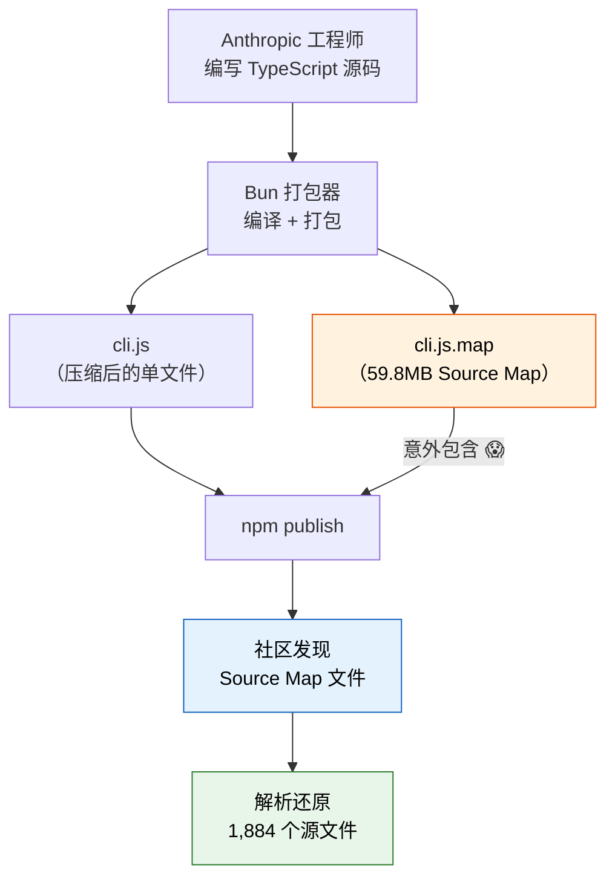
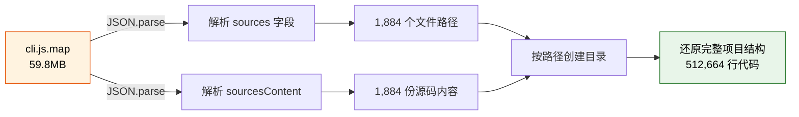
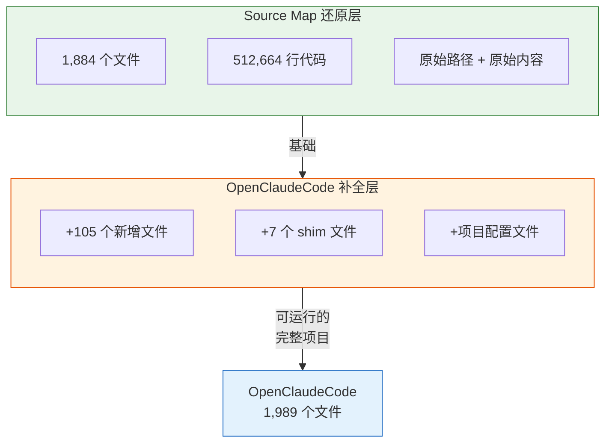
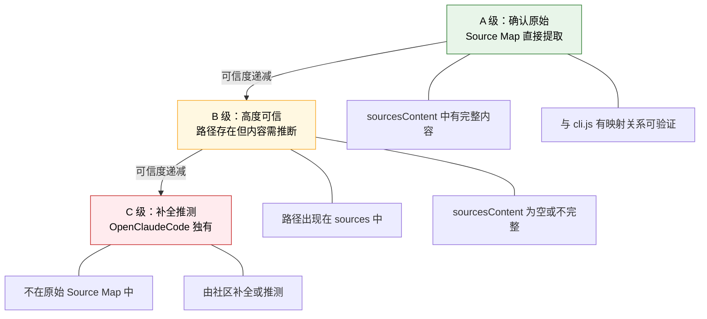

---
tags:
  - 入门
  - 逆向工程
  - 可信度
---

# 第3章：双生代码库：我们到底在看什么

!!! tip "生活类比"
    考古学家挖出一座古城遗址，发现了两份拼图。第一份是从废墟中原样挖出的碎片（Source Map 还原）——虽然有些地方模糊了，但每一块都是真迹。第二份是有人参照碎片、补上缺失部分后重建的完整拼图（OpenClaudeCode）——更完整，但你必须分清**哪些是原始的、哪些是后来补的**。读源码的第一课不是"怎么读"，而是**"你看到的可信吗"**。

!!! question "这一章要回答的问题"
    **一份 59.8MB 的文件泄露了整个源码——但"看到的"都可信吗？**

    源码逆向不像正常阅读开源项目——你看到的每一行代码都需要评估其可信度。理解两套代码库的来源和差异，是后续所有分析的基础。没有这个判断力，你可能会把社区补全代码当成 Anthropic 的原始设计来学习。

---

## 3.1 Source Map 泄露事件

### npm 包中的意外

Claude Code 作为 npm 包 `@anthropic-ai/claude-code` 发布。正常情况下，发布的只有打包后的 `cli.js`——一个压缩混淆过的单文件。但在某个版本中，`cli.js.map` 被意外包含在了 npm 包里。

这个 **59.8MB** 的 Source Map 文件，包含了几乎完整的源码信息。



### 什么是 Source Map

Source Map 是一种标准技术（V3 版本），最初用于浏览器调试——让你在浏览器中调试压缩代码时，能看到原始的源码位置。它的核心结构：

```json
{
  "version": 3,
  "sources": ["src/main.tsx", "src/query.ts", "...共1884个"],
  "sourcesContent": ["文件1的完整内容", "文件2的完整内容", "..."],
  "mappings": "AAAA,SAAS,IAAI,MAAM;..."
}
```

- `sources`：所有原始文件的路径列表
- `sourcesContent`：每个文件的**完整源码内容**
- `mappings`：压缩代码与原始代码的位置映射（VLQ 编码）

正是 `sourcesContent` 字段，让我们能完整还原出每个源文件的内容——包括注释、空行、原始格式。

### 1,884 个文件的还原

通过解析 Source Map 的 `sources` 和 `sourcesContent` 字段，社区还原出了 **1,884 个原始文件**，总计约 **512,664 行代码**。文件路径、目录结构、甚至开发者的注释都被完整保留。



这就是本书的**主要分析对象**——从 Source Map 中还原的原始代码。

---

## 3.2 两套代码库的关系

### 第一层：Source Map 还原（1,884 个文件）

直接从 `cli.js.map` 中提取的代码，拥有最高可信度：

- 每个文件都有明确的原始路径（如 `src/main.tsx`、`src/query.ts`）
- 代码内容来自 `sourcesContent` 字段，未经第三方修改
- 与 `cli.js` 中的实际执行代码有映射关系可以交叉验证

### 第二层：OpenClaudeCode 补全（1,989 个文件）

社区项目 OpenClaudeCode 在 Source Map 还原的基础上做了增强：

- 新增了约 **105 个文件**（1,989 - 1,884 = 105）
- 补全了缺失的类型声明文件（`.d.ts`）
- 添加了 `package.json`、`tsconfig.json` 等项目配置
- 引入了 7 个 **shim** 文件来填补运行时缺失



### 7 个 Shim 文件——社区的"桥梁"

OpenClaudeCode 引入了 7 个 shim（垫片）来让还原代码能实际运行。这些 shim 替代了 Anthropic 内部的私有模块：

| Shim 名称 | 替代目标 | 功能 |
|-----------|---------|------|
| `ant-claude-for-chrome-mcp` | `@ant/claude-for-chrome-mcp` | Chrome 浏览器 MCP 集成 |
| `ant-computer-use-input` | `@ant/computer-use-input` | 计算机操作输入处理 |
| `ant-computer-use-mcp` | `@ant/computer-use-mcp` | 计算机操作 MCP 服务 |
| `ant-computer-use-swift` | `@ant/computer-use-swift` | macOS 原生交互（Swift） |
| `color-diff-napi` | `color-diff-napi` | 颜色差异对比（原生模块） |
| `modifiers-napi` | `modifiers-napi` | 键盘修饰键检测（原生模块） |
| `url-handler-napi` | `url-handler-napi` | URL 协议处理（原生模块） |

在 `package.json` 中，这些 shim 通过 `file:` 协议引用本地目录：

```json
{
  "@ant/claude-for-chrome-mcp": "file:./shims/ant-claude-for-chrome-mcp",
  "@ant/computer-use-input": "file:./shims/ant-computer-use-input",
  "color-diff-napi": "file:./shims/color-diff-napi"
}
```

每个 shim 目录都包含一个 `index.ts` 和 `package.json`——它们是社区根据代码上下文**推测**的实现，不是 Anthropic 的原始代码。

---

## 3.3 可信度分级：A / B / C 三级标准

### 为什么需要分级

这不是一个开源项目——我们看到的代码是逆向还原的。不同来源的代码可信度不同，如果不加区分地引用，就会把推测当成事实。本书为每个源码引用标注可信度等级：



### A 级：确认原始

**来源**：直接从 Source Map 的 `sourcesContent` 中提取的文件。

**特征**：

- 文件内容与 `cli.js` 中的打包代码有精确的行列映射关系
- 包含原始的注释、空行、代码格式
- 经过 `mappings` 字段交叉验证

**代表文件**：`src/main.tsx`（4,690行）、`src/query.ts`（1,729行）、`src/Tool.ts`（792行）

本书 **90% 以上的分析**基于 A 级文件。

### B 级：高度可信

**来源**：路径存在于 Source Map 的 `sources` 字段中，但 `sourcesContent` 对应位置为空或不完整。

**特征**：

- 我们知道这个文件**存在**，但不确定其完整内容
- 可以通过上下文（import 关系、类型引用）推断部分内容
- 需要结合 OpenClaudeCode 的补全来理解

**处理方式**：本书引用 B 级文件时，会标注"内容基于上下文推断"。

### C 级：补全推测

**来源**：OpenClaudeCode 独有的文件，不在原始 Source Map 中。

**特征**：

- 7 个 shim 文件全部属于 C 级
- 部分类型声明文件属于 C 级
- 可能正确，也可能与 Anthropic 真实实现有偏差

**处理方式**：本书引用 C 级文件时，会明确标注"社区补全，仅供参考"，避免误导。

### 可信度在表格中的标记

在后续章节的"关键源码索引"表格中，你会看到这样的标记：

| 可信度标记 | 含义 | 使用建议 |
|-----------|------|---------|
| <span class="reliability-a">A</span> | Source Map 直接还原 | 可放心引用作为分析依据 |
| B | 路径可信，内容需验证 | 结合上下文谨慎引用 |
| C | 社区补全 / Shim | 仅作参考，不作为结论依据 |

---

=== "🌱 探索路径"

    记住一个核心结论：**我们有两套代码，一套是"原版拼图碎片"（1,884 文件），一套是"补全后的完整拼图"（1,989 文件）。看到 A 级标记的代码可以信赖，看到 C 级的要打个问号。**

=== "🔧 实战路径"

    建议自己动手用 `JSON.parse` 解析一下 Source Map 文件，亲眼看看 `sources` 和 `sourcesContent` 的结构。理解逆向还原的过程，能帮你判断后续遇到的任何可疑代码。

=== "🏗️ 架构路径"

    重点关注 7 个 shim 的设计——它们代表了 Anthropic 私有模块的**接口边界**。即使 shim 的实现是推测的，但它的接口签名（函数名、参数类型）大概率是准确的，因为调用方的代码是 A 级可信的。从接口反推实现，是逆向工程的核心方法论。

---

!!! abstract "🔭 深水区（架构师选读）"
    **Source Map V3 的编码机制**

    Source Map V3 的核心是 `mappings` 字段——一串用分号和逗号分隔的 VLQ（Variable-Length Quantity）编码字符串。每个分号代表生成文件（`cli.js`）的一行，每个逗号分隔的段（segment）包含 4-5 个 VLQ 编码数字：生成列号、源文件索引、源文件行号、源文件列号、以及可选的名称索引。

    VLQ 编码使用 6-bit 分组和 Base64 字符集，将整数压缩为可变长度的字符串。例如，数字 0 编码为 `A`，数字 1 编码为 `C`，较大的数字需要多个字符。所有数值都是**相对于上一个段的增量**，这种差分编码大幅减小了文件体积。

    理解这个格式后，你甚至可以写一个 Source Map 解析器：读取 `mappings`，逐字符解码 VLQ，重建原始文件和打包文件之间的完整映射关系。这也是验证还原质量的终极手段。

---

!!! success "本章小结"
    **一句话**：Claude Code 的源码来自 Source Map 泄露（1,884 个原始文件）和社区补全（OpenClaudeCode，共 1,989 个文件），读源码时必须区分 A / B / C 三级可信度——这是贯穿全书的方法论基础。

!!! info "关键源码索引"
    | 文件 | 职责 | 可信度 |
    |------|------|--------|
    | `cli.js.map` | 59.8MB Source Map 文件 | <span class="reliability-a">A</span> |
    | Source Map 还原（1,884 文件） | 原始还原代码 | <span class="reliability-a">A</span> |
    | OpenClaudeCode 根目录（1,989 文件） | 社区补全代码 | B/C |
    | `shims/ant-claude-for-chrome-mcp/` | Chrome MCP 集成垫片 | C |
    | `shims/ant-computer-use-input/` | 计算机操作输入垫片 | C |
    | `shims/ant-computer-use-mcp/` | 计算机操作 MCP 垫片 | C |
    | `shims/ant-computer-use-swift/` | macOS 原生交互垫片 | C |
    | `shims/color-diff-napi/` | 颜色差异对比垫片 | C |
    | `shims/modifiers-napi/` | 键盘修饰键垫片 | C |
    | `shims/url-handler-napi/` | URL 协议处理垫片 | C |

!!! warning "逆向提醒"
    - ✅ **RELIABLE**：`sourcesContent` 中直接提取的 1,884 个文件内容——未经第三方修改
    - ⚠️ **CAUTION**：OpenClaudeCode 新增的 105 个文件需要与 A 级代码交叉验证后使用
    - ❌ **SHIM/STUB**：7 个 shim 文件为社区推测实现，接口签名可信但内部实现可能与真实代码不同
