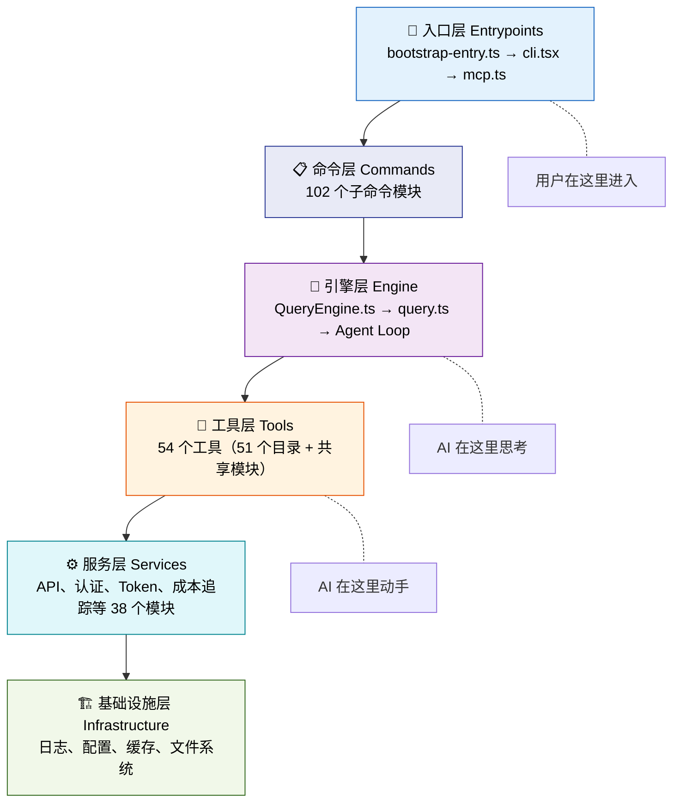
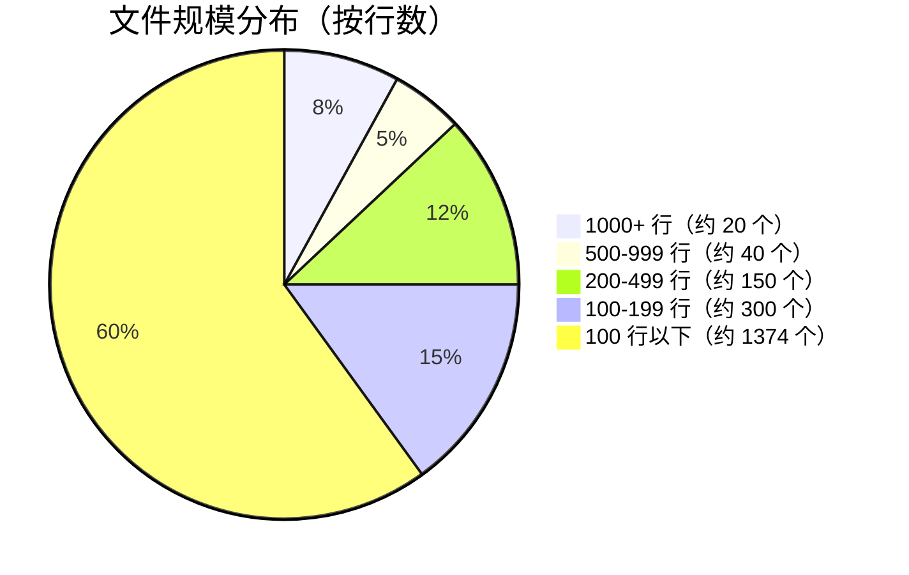
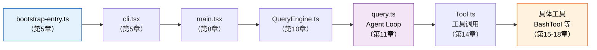
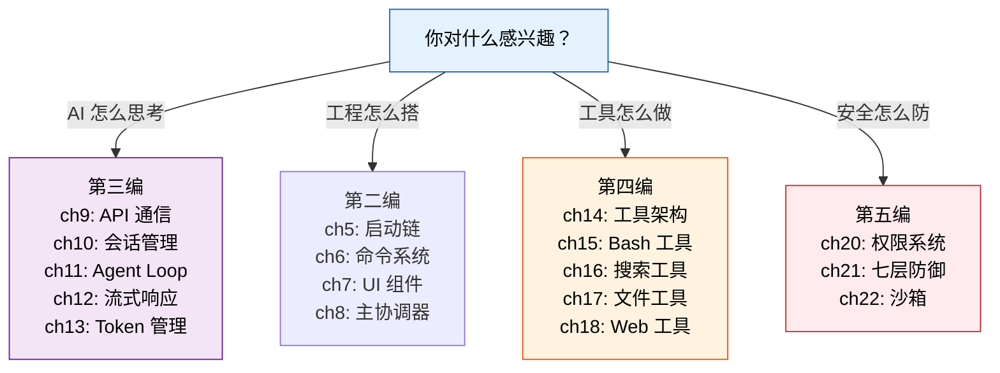
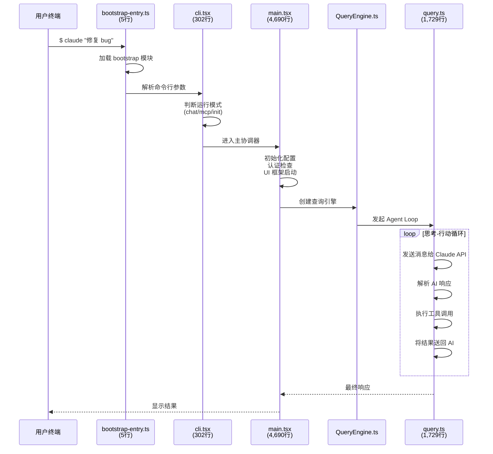
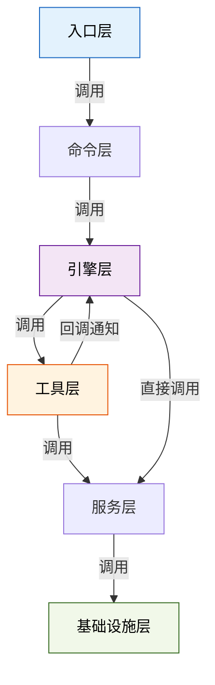

---
tags:
  - 入门
  - 架构总览
  - 导航
---

# 第4章：源码全景地图：给 1,884 个文件画导航图

!!! tip "生活类比"
    第一次走进一座大城市，你需要一张地图。不需要记住每条街道的名字，只要知道**"商业区在东边、住宅区在西边、市政府在中心"**就能找到方向。1,884 个文件就是一座城市——本章就是那张地图。

!!! question "这一章要回答的问题"
    **面对 1,884 个文件、512,664 行代码，应该从哪里开始读？怎么不迷路？**

    直接打开一个 50 万行的项目，很容易陷入细节迷宫——你可能花一小时读完一个文件，却发现它只是个工具函数。你需要先俯瞰全局——哪些是核心文件、哪些是辅助设施、各模块之间是什么关系。有了这张地图，再深入任何一个角落都不会迷失方向。

---

## 4.1 六大架构层次

### 从用户输入到 AI 响应的分层

打开 `src/` 目录，你会看到 38 个子目录和 22 个顶层文件。它们不是随意堆放的，而是遵循清晰的**六层架构**：



### 入口层（Entrypoints）——一切从这里开始

用户输入 `claude` 命令后，执行链从这里启动：

| 文件 | 行数 | 职责 |
|------|------|------|
| `src/bootstrap-entry.ts` | 5 | 最小启动入口，加载 bootstrap 模块 |
| `src/entrypoints/cli.tsx` | 302 | CLI 命令路由与模式判断 |
| `src/entrypoints/mcp.ts` | — | MCP 服务器模式入口 |
| `src/entrypoints/init.ts` | — | 项目初始化入口 |

入口层的文件数量极少，但地位最高——它们决定了用户的请求走哪条路径。

### 命令层（Commands）——102 个子命令

`src/commands/` 目录下有 **102 个模块**，每个处理一个具体的子命令：

- **核心交互**：chat、compact、resume
- **项目管理**：init、config、doctor
- **开发工具**：commit、review、ship
- **高级功能**：agents、mcp、bridge、tasks

所有子命令通过 `src/commands.ts`（754行）统一注册和分发。

### 引擎层（Engine）——AI 的"大脑"

| 文件 | 行数 | 职责 |
|------|------|------|
| `src/QueryEngine.ts` | — | 会话管理，维护对话上下文 |
| `src/query.ts` | 1,729 | Agent Loop 核心——AI 的"思考循环" |
| `src/query/` | — | 查询相关的辅助模块 |
| `src/context.ts` | — | 上下文注入，决定 AI"知道什么" |

引擎层是整个系统最核心的部分——它决定了 AI **怎么思考**和**什么时候停下来**。

### 工具层（Tools）——54 个工具

`src/tools/` 目录下有 **51 个工具子目录** + 共享模块，加上 `src/Tool.ts`（792行）定义的统一接口，构成完整的工具系统：

```
src/tools/
├── BashTool/          # Shell 命令执行
├── FileReadTool/      # 文件读取
├── FileWriteTool/     # 文件写入
├── FileEditTool/      # 文件编辑
├── GrepTool/          # 内容搜索
├── GlobTool/          # 文件名搜索
├── WebFetchTool/      # 网页获取
├── AgentTool/         # 子 Agent 生成
├── MCPTool/           # MCP 工具调用
├── ...                # 还有 42 个工具
├── shared/            # 工具间共享代码
└── utils.ts           # 工具通用函数
```

### 服务层（Services）——基础通信

`src/services/` 目录下有 **38 个模块**，提供 API 通信、认证、遥测等基础服务：

- **API 客户端**：与 Claude API 通信
- **OAuth 认证**：用户身份验证
- **Token 估算**：计算消耗的 Token 数量
- **成本追踪**：`cost-tracker.ts` 记录每次请求的花费
- **MCP 服务**：Model Context Protocol 客户端
- **分析与遥测**：OpenTelemetry 集成

### 基础设施层（Infrastructure）——支撑一切的地基

分散在多个目录中，不直接参与 AI 逻辑，但支撑整个系统运转：

| 目录 | 职责 |
|------|------|
| `src/utils/` | 通用工具函数 |
| `src/constants/` | 全局常量 |
| `src/types/` | 类型定义 |
| `src/state/` | 状态管理 |
| `src/ink/` | 自研终端渲染 |
| `src/hooks/` | React Hooks |
| `src/schemas/` | 数据校验 Schema |
| `src/migrations/` | 数据迁移 |

---

## 4.2 关键文件 Top 20

### 文件规模分布

1,884 个文件的规模分布极不均匀——少数"巨型"文件承载了核心逻辑，大量"小"文件各司其职：



超过 **70%** 的文件不到 100 行——它们是螺丝钉，重要但不需要逐个研究。真正需要深入的是那 **Top 20** 文件。

### 超大文件（1000+ 行）——系统的支柱

| 排名 | 文件 | 行数 | 职责 | 对应章节 |
|------|------|------|------|---------|
| 1 | `src/main.tsx` | 4,690 | 主协调器——启动、配置、认证、UI | 第8章 |
| 2 | `src/query.ts` | 1,729 | Agent Loop 核心 | 第11章 |
| 3 | `src/Tool.ts` | 792 | 工具统一接口 | 第14章 |
| 4 | `src/commands.ts` | 754 | 命令注册中心 | 第6章 |
| 5 | `src/entrypoints/cli.tsx` | 302 | CLI 入口路由 | 第5章 |

### 不要忽略的"小"文件

有些文件虽然行数少，但地位关键：

| 文件 | 行数 | 为什么重要 |
|------|------|-----------|
| `src/bootstrap-entry.ts` | 5 | **一切的起点**——整条启动链从这里开始 |
| `src/context.ts` | — | 决定 AI"看到"什么信息 |
| `src/cost-tracker.ts` | — | 每次请求的 Token 和费用记录 |
| `src/tasks.ts` | — | 多 Agent 任务管理 |
| `src/tools.ts` | — | 工具注册清单 |

---

## 4.3 三条阅读路线

### 路线一：按执行链读（推荐新手）

跟着一条命令从输入到输出的完整旅程：



这条路线让你理解**一次请求的完整生命周期**——从用户按下回车到 AI 修改代码。

### 路线二：按兴趣跳读



### 路线三：按编顺序读（最完整）

从第一编到最后一编，渐进式深入。每一编都在前一编的基础上展开：

| 编 | 主题 | 章节范围 | 核心关注 |
|----|------|---------|---------|
| 第一编 | 欢迎来到源码的世界 | ch1-4 | 建立全局认知 |
| 第二编 | 启动与入口 | ch5-8 | 代码怎么组织 |
| 第三编 | AI 引擎 | ch9-13 | AI 怎么工作 |
| 第四编 | 工具系统 | ch14-18 | AI 怎么动手 |
| 第五编 | 安全与权限 | ch19-22 | 怎么保证安全 |

### 启动链预览：从 5 行到 4,690 行

在深入后续章节之前，先看看 Claude Code 启动时的完整调用链：



从 5 行的 `bootstrap-entry.ts` 开始，到 4,690 行的 `main.tsx`，再到 1,729 行的 `query.ts`——这条链路的细节将在第5章到第11章逐一展开。

---

### 模块依赖关系概览

六大层次之间的依赖关系遵循"**上层依赖下层，下层不依赖上层**"的原则：



注意 Tools → Engine 之间存在一条**反向箭头**（回调通知）——工具执行完毕后需要通知引擎。这不是"下层依赖上层"的违反，而是通过回调函数和事件机制实现的**控制反转**。这种设计在第14章会详细讨论。

---

=== "🌱 探索路径"

    记住六层架构的名字和职责就够了：**入口 → 命令 → 引擎 → 工具 → 服务 → 基础设施**。当后面章节提到某个文件时，你能迅速定位它在哪一层。

=== "🔧 实战路径"

    建议在 IDE 中打开 `src/` 目录，对照本章的 Top 20 文件列表，分别打开看看文件头部的 import 语句——这能帮你快速建立模块间的依赖关系感。

=== "🏗️ 架构路径"

    关注**层次边界的设计**：每层之间通过什么接口通信？`Tool` 接口的泛型参数如何保证类型安全？`QueryContext` 抽象如何解耦引擎和工具？这些接口设计是大型项目架构的精髓。

---

!!! abstract "🔭 深水区（架构师选读）"
    **循环依赖与接口隔离**

    大型 TypeScript 项目不可避免地会遇到模块间的循环依赖问题。Claude Code 通过严格的层次隔离来缓解——下层不依赖上层，同层通过**接口而非实现**通信。但在 tools 和 services 之间仍然存在一些"回调式"的依赖关系。

    具体来说，`Tool` 接口定义了 `execute(input, context)` 方法，其中 `context` 参数来自引擎层——但 `Tool.ts` 本身不 import 引擎层的具体实现，而是依赖一个抽象的 `ToolContext` 类型。这就是**依赖倒置原则**的应用：高层模块和低层模块都依赖抽象，而非具体实现。

    如果你想可视化整个项目的依赖图，可以使用 `madge` 工具：`npx madge --ts-config tsconfig.json src/ --image deps.svg`。但要做好心理准备——1,989 个文件的依赖图会非常壮观。

---

!!! success "本章小结"
    **一句话**：1,884 个文件分布在六个架构层次中——入口、命令、引擎、工具、服务、基础设施。抓住 Top 20 关键文件和三条阅读路线（执行链 / 兴趣跳读 / 编顺序），就能不迷路地探索整个代码库。

!!! info "关键源码索引"
    | 文件 | 职责 | 可信度 |
    |------|------|--------|
    | `src/`（38 子目录 + 22 顶层文件） | 源码根目录 | <span class="reliability-a">A</span> |
    | `src/main.tsx` | 主协调器（4,690行） | <span class="reliability-a">A</span> |
    | `src/query.ts` | Agent Loop 核心（1,729行） | <span class="reliability-a">A</span> |
    | `src/Tool.ts` | 工具统一接口（792行） | <span class="reliability-a">A</span> |
    | `src/commands.ts` | 命令注册中心（754行） | <span class="reliability-a">A</span> |
    | `src/bootstrap-entry.ts` | 5行启动入口 | <span class="reliability-a">A</span> |
    | `src/entrypoints/cli.tsx` | CLI 命令路由（302行） | <span class="reliability-a">A</span> |
    | `src/tools/`（54 个工具） | 工具实现目录 | <span class="reliability-a">A</span> |
    | `src/services/`（38 个模块） | 基础服务目录 | <span class="reliability-a">A</span> |
    | `src/commands/`（102 个模块） | 子命令目录 | <span class="reliability-a">A</span> |

!!! warning "逆向提醒"
    - ✅ **RELIABLE**：目录结构和文件路径——Source Map 直接提供，完全可信
    - ⚠️ **CAUTION**：文件行数统计基于还原版本，可能与 Anthropic 最新内部版本有差异
    - ❌ **SHIM/STUB**：部分子目录下的 `index.ts` 文件可能是 OpenClaudeCode 补全，引用时需交叉验证
