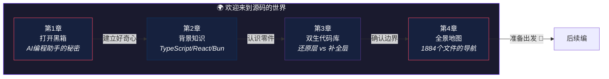
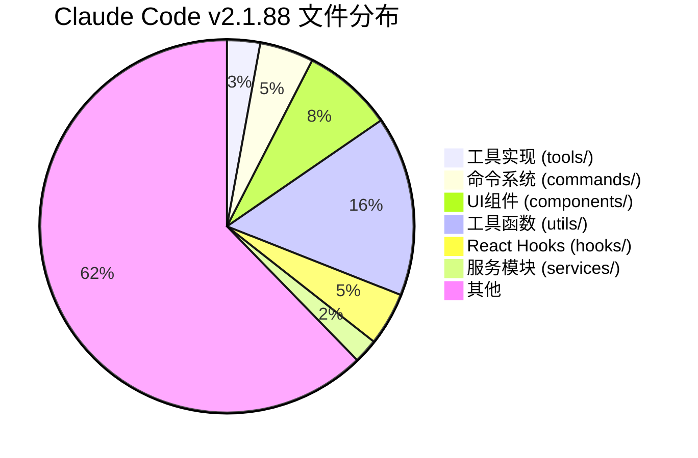

# 第一编：欢迎来到源码的世界

> *打开黑箱之前，先建立好奇心和方向感。*
>
> 本编不写一行源码分析——我们先回答三个前置问题：**我们在看什么**、**怎么确认它可信**、**从哪里开始读**。

---

## 本编总览

---

## 本编四章速览

| 章 | 标题 | 核心问题 | 生活类比 |
|---|------|----------|----------|
| 1 | [打开黑箱](chapter01.md) | 你在终端输入一句话，AI 帮你改了代码——中间到底发生了什么？ | 拆开收音机 |
| 2 | [背景知识](chapter02.md) | TypeScript、React、CLI 是什么？为什么选它们？ | 学开车前先认识仪表盘 |
| 3 | [双生代码库](chapter03.md) | 59.8MB 的文件泄露了源码——但看到的都可信吗？ | 考古现场的两份拼图 |
| 4 | [全景地图](chapter04.md) | 面对 1884 个文件，从哪里开始？怎么不迷路？ | 第一次走进大城市 |

---

## 设计思想主线

!!! tip "本编建立的认知基础"
    1. Claude Code **不是聊天壳**——它是一个能读写文件、执行命令的任务执行器
    2. 源码来自 **两套逆向代码库**——必须区分"原始还原"和"社区补全"
    3. **可信度分级**（A/B/C 三级）是后续所有分析的基础
    4. 掌握 **六大架构层次**，后面怎么深入都不会迷路

---

## 推荐路径

=== "🌱 初学者"

    四章全读，**重点看生活类比和核心问题**。不需要理解所有技术细节，建立直觉即可。

=== "🔧 开发者"

    第1章快速浏览，**第2章按需跳过已熟悉的技术**，第3-4章仔细读。

=== "🏗️ 架构师"

    第1-2章跳过，**直接从第3章开始**——证据边界是一切分析的前提。第4章的深水区值得细读。

---

## 代码库数字画像

!!! info "两套代码库对比"
    | 维度 | sourcemap 还原层 | OpenClaudeCode 补全层 |
    |------|-----------------|---------------------|
    | 文件数 | 1,884 | 1,989 (+105) |
    | 可运行 | 否 | 是 |
    | Shim | 无 | 7 个 |
    | 可信度 | A 级为主 | A/B/C 混合 |
