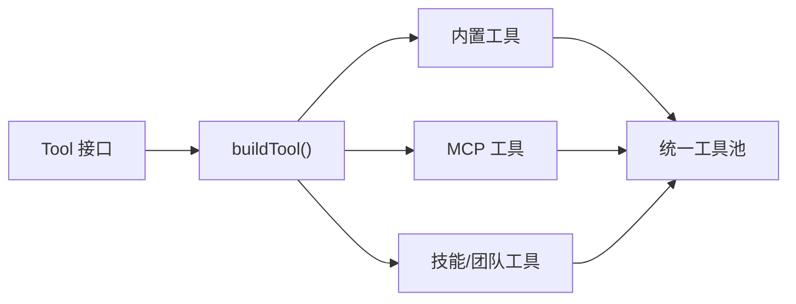
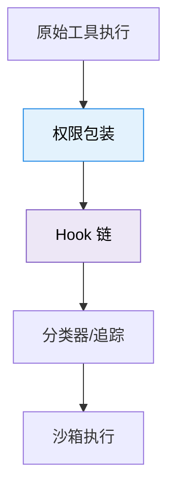
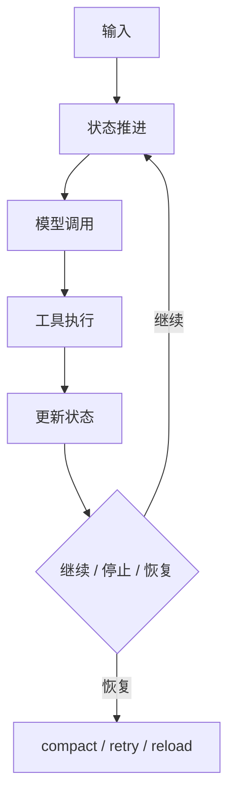
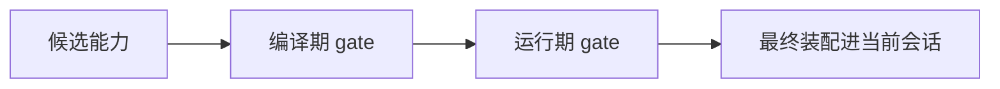
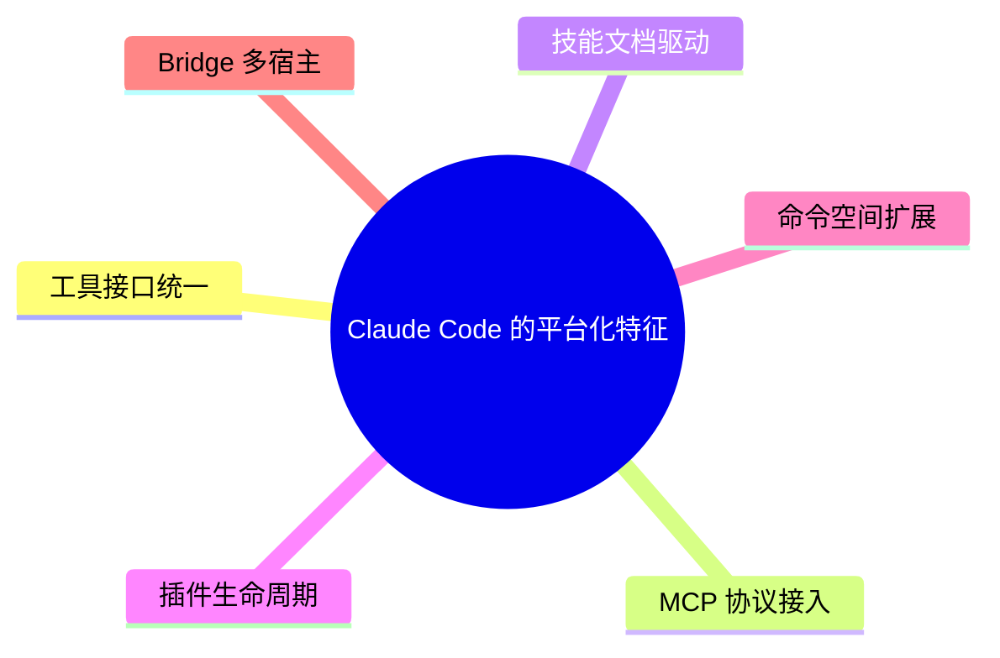

---
tags:
  - Patterns
  - 第十编
---

# 第39章：设计模式：带走的架构智慧

!!! tip "生活类比：武术心法"
    学会一套拳，不如看懂它背后的发力原理。读源码也一样，看完几万行实现之后，真正能带走的，是那些能迁移到别的项目里的通用模式。

!!! question "这一章先回答一个问题"
    如果把 Claude Code 所有具体业务都拿掉，只保留“值得抄走的工程思想”，最重要的会是哪几条？

这章不再追某个单文件，而是提炼横跨全书的几种模式：统一协议、分层治理、显式入口、条件装配、后台化运行与可恢复执行。

---

## 39.1 策略 + 工厂：先统一接口，再让能力自由增长

Claude Code 最鲜明的一条主线，就是工具系统。`Tool.ts` 先定义共同协议，`buildTool()` 再用工厂式方式统一装配，`tools.ts` 则把不同来源的工具拼成同一池子。

这套设计最值得学的地方是：先把入口统一，再允许行为多样。这样新增能力时，不必反复发明一套新框架。

---

## 39.2 装饰器 + 中间件：横切关注点不要长进业务里

权限检查、Hook、日志、分类器、沙箱这些能力，都不是某个工具的“核心业务”，却又必须发生在执行路径上。Claude Code 的处理方式非常成熟：让这些横切关注点作为包装层和中间件链存在。

这让工具本身可以聚焦“做什么”，而不必背着一堆与业务无关的治理逻辑。

---

## 39.3 状态机 + 可恢复执行：让 Agent 不只是“会循环”

`query.ts` 和 `QueryEngine.ts` 里最珍贵的，不是有个 `while (true)`，而是：

- 有明确状态
- 有退出条件
- 有错误恢复
- 有压缩边界
- 有继续执行的入口

真正好的 Agent 系统，不是“能跑起来”，而是“中断之后还能接着跑”。

---

## 39.4 条件装配：功能很多，但默认体验不能失控

Claude Code 的大量 `feature()`、GrowthBook 和动态加载，说明它大量使用了条件装配模式：

- 某些能力只在特定构建进入
- 某些能力只在特定用户/组织启用
- 某些命令和工具只在当前上下文暴露

这比“所有能力永远全部打开”更克制，也更适合长期演化。

---

## 39.5 平台模式：Claude Code 不是只想做产品

MCP、技能、插件、命令系统这些组合在一起，说明 Claude Code 不是只想做一个“内置功能足够多的 CLI”，而是正在长成一个平台。

这类架构最难得的不是某个功能多强，而是它开始具备“承载别人能力”的能力。

---

## 39.6 本章心法：六条值得带走的工程原则

1. 先统一接口，再扩展能力。
2. 让横切关注点离开业务核心。
3. Agent 必须是状态机，而不是一次性函数。
4. 可恢复性和可继续性比“首次执行很聪明”更重要。
5. 平台能力必须回到同一治理框架中。
6. 大系统不要害怕门控，要害怕无门控扩张。

!!! abstract "🔭 深水区（架构师选读）"
    Claude Code 真正迷人的地方，不是它用了某个时髦 AI 技术，而是它把大量经典软件工程思想重新放进 Agent 场景里：统一协议、横切治理、状态机、平台化、条件装配、可恢复执行。这些思想不会随模型迭代过时。

!!! success "本章小结"
    如果只带走一句话，那就是：Claude Code 的优秀并不神秘，它把传统软件工程里的好模式，用一种非常现代的方式重新组合进了 Agent 产品。

!!! info "关键源码索引"
    - 工具协议：[Tool.ts](/Users/champion/Documents/develop/Warwolf/OpenClaudeCode/src/Tool.ts)
    - 工具池装配：[tools.ts](/Users/champion/Documents/develop/Warwolf/OpenClaudeCode/src/tools.ts)
    - Agent 主循环：[query.ts](/Users/champion/Documents/develop/Warwolf/OpenClaudeCode/src/query.ts)
    - 会话引擎：[QueryEngine.ts](/Users/champion/Documents/develop/Warwolf/OpenClaudeCode/src/QueryEngine.ts)
    - 命令系统：[commands.ts](/Users/champion/Documents/develop/Warwolf/OpenClaudeCode/src/commands.ts)
    - Bridge 分层：[bridgeMain.ts](/Users/champion/Documents/develop/Warwolf/OpenClaudeCode/src/bridge/bridgeMain.ts)

!!! warning "逆向提醒"
    设计模式是本书的分析视角，不是官方术语。它们的价值在于帮助你迁移工程思想，而不是要求你逐字对应每个 GoF 名称。
