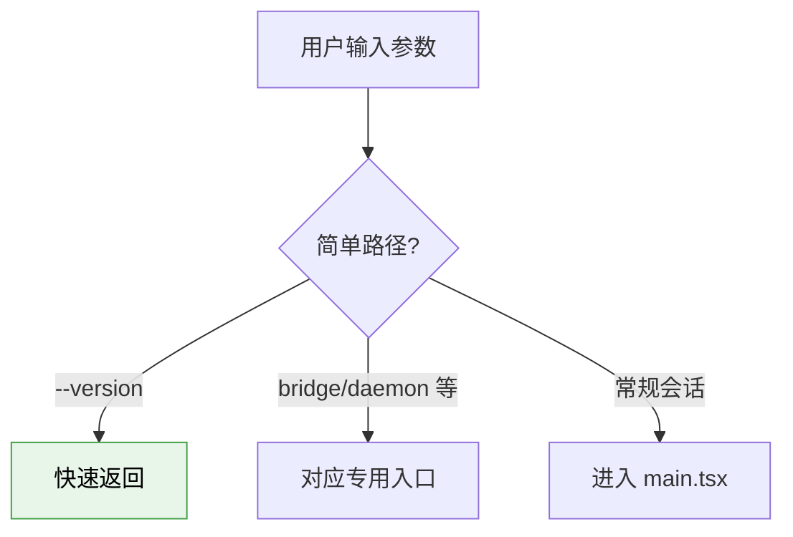
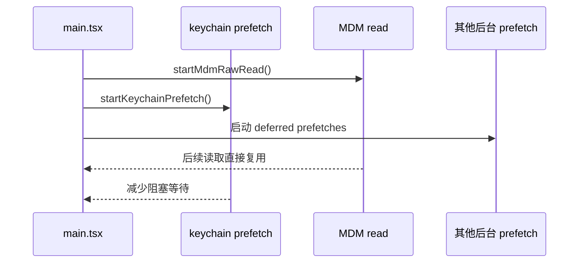
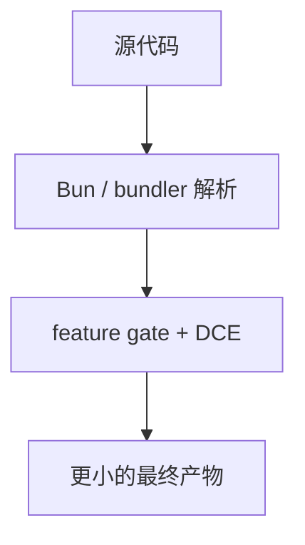
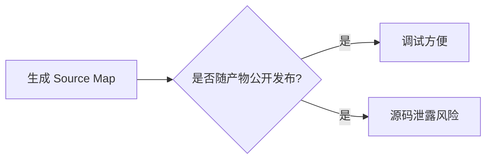

---
tags:
  - Performance
  - 第十编
---

# 第40章：性能工程：为什么它能在终端里跑得这么顺

!!! tip "生活类比：F1 赛车调校"
    一辆快车不是只靠发动机大，而是靠每个细节都不浪费。Claude Code 的启动性能也是这样做出来的。

!!! question "这一章先回答一个问题"
    一个接近两千个 TypeScript 文件、带 UI、带工具、带认证、带桥接、带插件的系统，为什么还能做成一个日常使用不拖泥带水的 CLI？

因为它在启动链、导入方式、预取、缓存和构建策略上都做了非常激进的优化。

---

## 40.1 第一招：入口链尽可能薄

`bootstrap-entry.ts` 只有三件事：

- 确保 bootstrap macro
- 立刻进入 CLI 入口
- 不提前加载重模块

这么做的价值很直接：越早的入口越薄，越容易把后面的复杂度延后。

---

## 40.2 第二招：`cli.tsx` 里塞满了 fast path

`cli.tsx` 明确写着：所有 import 都尽量动态化，`--version` 这种路径要做到几乎零额外加载。源码里还能看到很多分流点：

- `--version`
- bridge 路径
- daemon 路径
- templates 路径
- `--worktree --tmux` fast path

这是一种非常典型的 CLI 优化思路：别让最简单的请求为最复杂的系统买单。

---

## 40.3 第三招：重模块导入时并行做预取

`main.tsx` 开头的注释几乎可以当成性能工程教科书：

- MDM 子进程提早启动
- keychain 预取提早启动
- 一批认证与系统上下文预取在后台展开
- MCP 资源预热被延后到安全时机

这里最值得学的地方是：**用户还在想要输入什么时，系统就已经开始把大概率要用到的东西准备起来了。**

---

## 40.4 第四招：把“缓存”做成多层，而不是单点

从 GrowthBook、metrics、Grove、MCP resource prefetch 这些模块都能看到，Claude Code 非常喜欢“内存缓存 + 磁盘缓存 + 后台刷新”的组合。

这类设计对 CLI 特别重要，因为 CLI 的一个核心痛点就是“每次重开进程都像重新冷启动一次”。

---

## 40.5 第五招：构建系统主动为裁剪服务

`package.json`、`tsconfig.json` 和源码里的 `feature()` 一起构成了一个很强的构建层策略：

- `moduleResolution: bundler`
- 大量 feature gate
- shims/vendor 显式纳入编译边界

这说明性能工程并不只是运行时调优，也包括“从构建时就别把无关代码带进来”。

---

## 40.6 Source Map 事件给的教训：性能和安全必须一起看

`OpenClaudeCode/package.json` 里直白写着：这是 “reconstructed from source maps” 的 restored tree。对我们读者来说，这是礼物；对任何产品团队来说，这是严肃的发布与构建教训。

构建安全和性能工程看似是两回事，实际上都属于“发布产物控制”的一部分。

!!! abstract "🔭 深水区（架构师选读）"
    Claude Code 的性能工程告诉我们一个很现实的道理：大型 CLI 想顺滑，不靠一招鲜，而靠入口瘦身、参数分流、动态导入、并行预取、多层缓存和构建裁剪一起发生。任何单点优化都救不了系统级迟钝。

!!! success "本章小结"
    Claude Code 能快，不是因为它“小”，而是因为它在每一层都避免了不必要的等待：薄入口、快路径、后台预取、多层缓存和构建裁剪缺一不可。

!!! info "关键源码索引"
    - 最薄入口：[bootstrap-entry.ts](/Users/champion/Documents/develop/Warwolf/OpenClaudeCode/src/bootstrap-entry.ts#L1)
    - `cli.tsx` fast path 说明：[cli.tsx](/Users/champion/Documents/develop/Warwolf/OpenClaudeCode/src/entrypoints/cli.tsx#L30)
    - `--version` fast path：[cli.tsx](/Users/champion/Documents/develop/Warwolf/OpenClaudeCode/src/entrypoints/cli.tsx#L36)
    - bridge / daemon / worktree 分流：[cli.tsx](/Users/champion/Documents/develop/Warwolf/OpenClaudeCode/src/entrypoints/cli.tsx#L113)
    - `main.tsx` 顶层预取注释：[main.tsx](/Users/champion/Documents/develop/Warwolf/OpenClaudeCode/src/main.tsx#L1)
    - deferred prefetches：[main.tsx](/Users/champion/Documents/develop/Warwolf/OpenClaudeCode/src/main.tsx#L383)
    - `package.json` restored 标记：[package.json](/Users/champion/Documents/develop/Warwolf/OpenClaudeCode/package.json#L3)
    - `moduleResolution: bundler`：[tsconfig.json](/Users/champion/Documents/develop/Warwolf/OpenClaudeCode/tsconfig.json#L5)

!!! warning "逆向提醒"
    我们能明确看到大量性能策略和构建边界，但打包脚本与发布流水线的全部细节并不都在仓库里。因此，本章可以高度可信地分析“代码如何优化启动”，但无法完整还原 Anthropic 内部 CI/CD 全貌。
