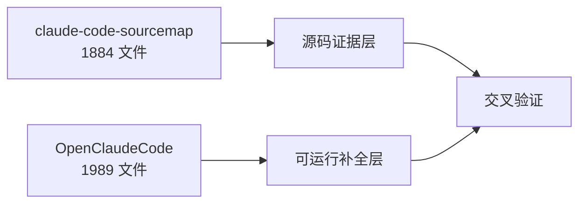
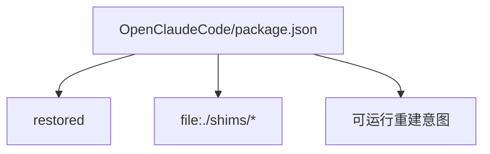
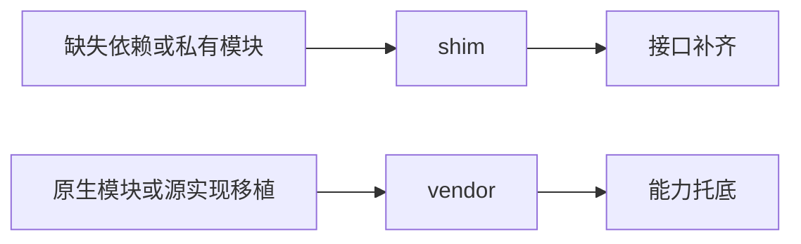
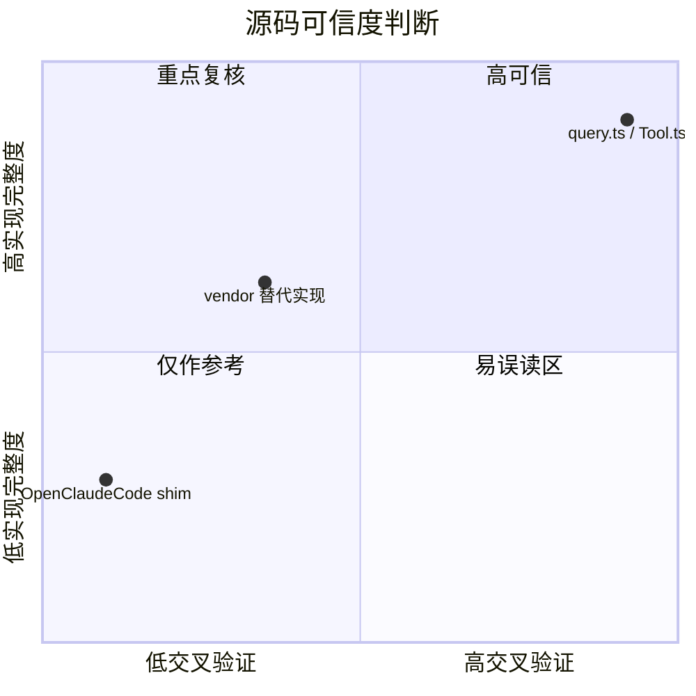

---
tags:
  - Recovery
  - 第十编
---

# 第41章：恢复层真相：哪些是原貌，哪些是补全

!!! tip "生活类比：修复古画"
    修复师越高明，越会让补笔不刺眼；但做研究的人，恰恰必须知道哪里是原画、哪里是修复。读 OpenClaudeCode 也一样。

!!! question "这一章先回答一个问题"
    当我们说“基于源码分析 Claude Code”时，哪些代码可以当成 Anthropic 原貌，哪些只能当成为了让仓库可运行而做的补全层？

这一章是全书最重要的边界提醒之一。因为如果不先分清证据层级，你会很容易把 shim 的取舍误判成官方设计。

---

## 41.1 两套代码库不是竞争关系，而是证据互补关系

本书始终围绕两套材料展开：

- `claude-code-sourcemap/restored-src/src`：更接近还原层
- `OpenClaudeCode/src`：更接近可运行重建层

我们刚刚重新核对过文件数：

- 还原层 `src` 下 `ts/tsx` 文件：1884
- OpenClaudeCode `src` 下 `ts/tsx` 文件：1989
- `shims/` 文件：16
- `vendor/` 文件：4

这组数字本身就说明：OpenClaudeCode 不是单纯复制，而是为了可运行多补了一层东西。

---

## 41.2 `package.json` 已经把“补全层身份”写明了

`OpenClaudeCode/package.json` 直接写着：

- 版本：`999.0.0-restored`
- 描述：`Restored Claude Code source tree reconstructed from source maps.`

再加上它把多个依赖指向本地 `file:./shims/...`，这几乎是明示：

- 这里有大量还原代码
- 也有明确的兼容和补全代码

从写书方法论上说，这比任何猜测都更直接。

---

## 41.3 `shims/` 与 `vendor/` 的角色不同，别混为一谈

这两个目录都不属于“核心还原源码”，但性质不同：

| 目录 | 更像什么 | 典型作用 |
|---|---|---|
| `shims/` | 兼容补片 | 补齐缺失模块接口，让仓库可跑 |
| `vendor/` | 附带源实现 | 把原生/外部依赖的源代码搬进来或替代掉 |

所以不能简单地说“不是 src 就都不可信”。更准确的说法是：**可信度取决于它在证据链里的位置**。

---

## 41.4 哪些模块通常可以高信任，哪些必须降级看待

高信任区域通常有这些特征：

- 同时存在于 sourcemap restored 与 OpenClaudeCode
- 逻辑复杂、调用链完整、上下文自洽
- 没有明显的占位注释或空实现

典型如：

- `query.ts`
- `QueryEngine.ts`
- `Tool.ts`
- `tools.ts`
- 大量 UI 与状态管理代码

需要谨慎的区域通常是：

- `shims/`
- 与私有服务、原生能力强绑定的模块
- 只在 OpenClaudeCode 出现、在 restored 层找不到交叉验证的补片

---

## 41.5 这章最重要的方法论：别把“能跑”误当成“原作”

OpenClaudeCode 的价值非常大，因为它让我们：

- 看到更完整的运行形态
- 理解缺失模块怎么被补
- 验证某些调用链是否能通

但它不能自动回答“这是不是 Anthropic 当初就这么写的”。

!!! abstract "🔭 深水区（架构师选读）"
    对逆向源码分析来说，最危险的不是信息不足，而是证据层混淆。还原层、补全层、shim、vendor、stub、fallback 这些概念如果不分开，所有结论都会被稀释。你越想写一本严肃的源码书，就越要先写清楚自己的证据边界。

!!! success "本章小结"
    `claude-code-sourcemap` 和 `OpenClaudeCode` 必须双线阅读：前者更像原貌证据，后者更像运行补全。`shims/` 与 `vendor/` 的存在不是问题，问题是把它们误当作官方原始设计。

!!! info "关键源码索引"
    - OpenClaudeCode restored 标记：`package.json`
    - 本地 shim 依赖入口：`package.json`
    - `vendor/` 与 `shims/` 编译边界：`tsconfig.json`
    - 仓库说明中的 compatibility 提示：`AGENTS.md`
    - shim 目录示例：`shims/`
    - vendor 目录示例：`vendor/`

!!! warning "逆向提醒"
    这一章本身就是全书最大的“逆向提醒”。如果你引用的是 `shims/` 或只存在于 OpenClaudeCode 的兼容代码，必须明确标注它的证据等级，不能伪装成官方实现细节。
