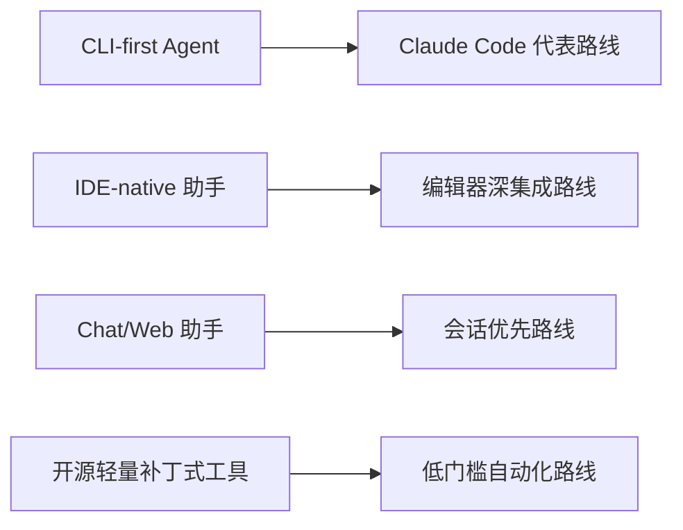
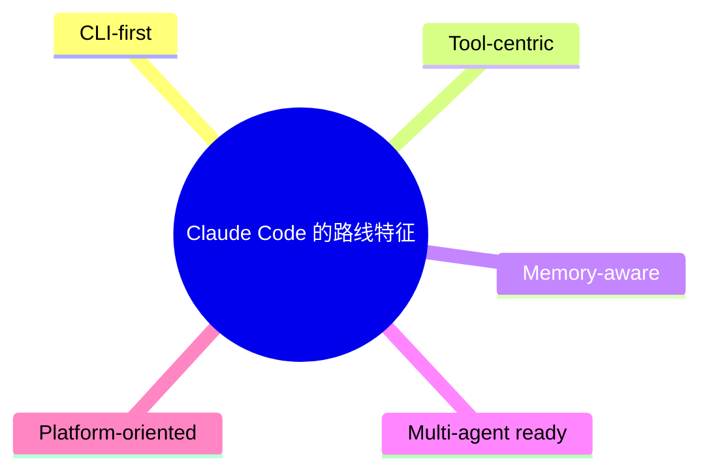
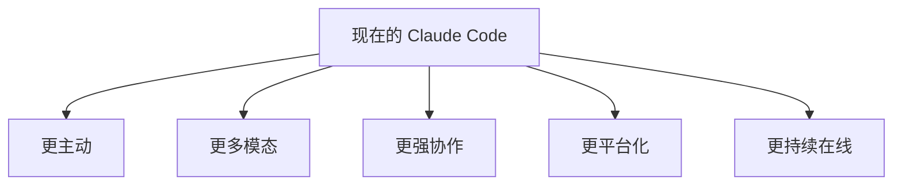
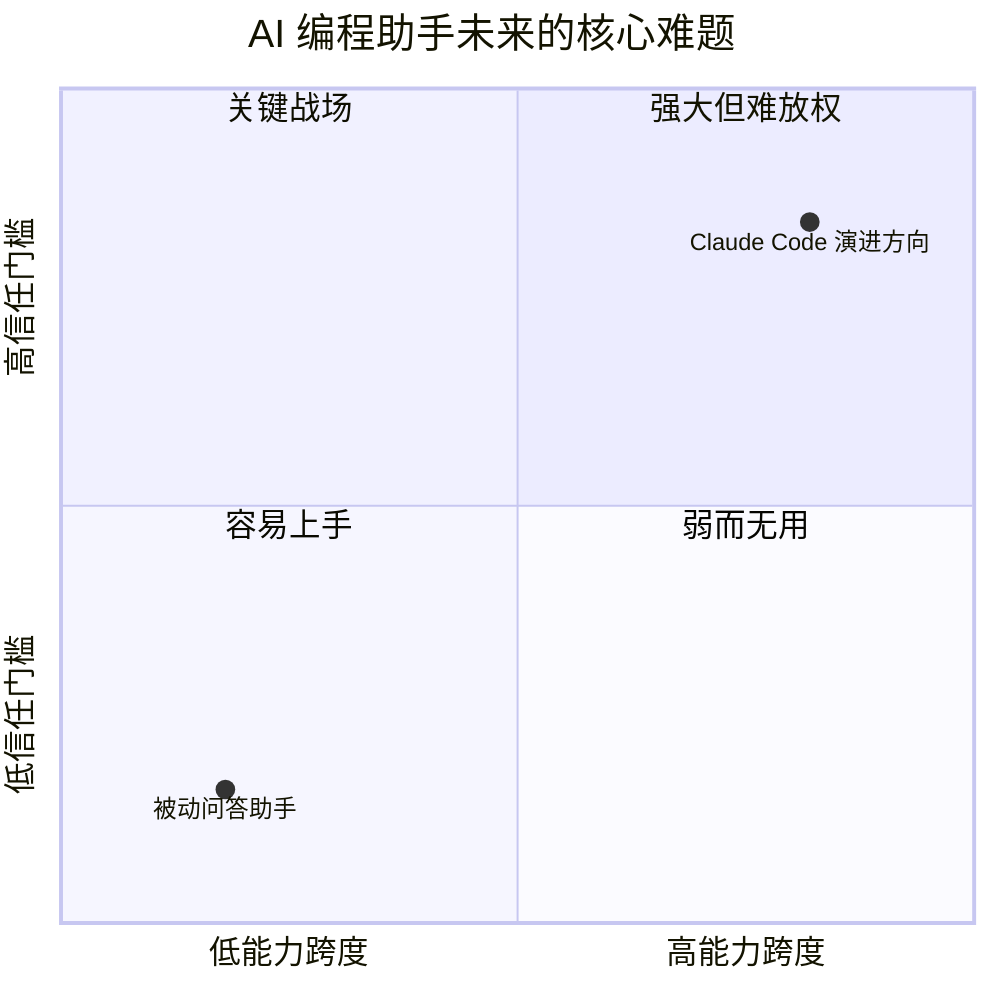

---
tags:
  - Future
  - 第十编
---

# 第42章：竞品与未来：Claude Code 站在什么位置

!!! tip "生活类比：地图坐标"
    了解一座城市，不只要看它自己，还要看它位于哪条交通线上、和周边城市是什么关系。Claude Code 也是如此。

!!! question "这一章先回答一个问题"
    如果把 Claude Code 放到更大的 AI 编程路线图里，它究竟代表了哪种思路？它的源码又透露了哪些未来方向？

这一章不做“排行榜”，而做“路线比较”。重点不是谁赢谁输，而是不同产品在架构层面押了什么注。

---

## 42.1 四条常见路线里，Claude Code 更像“CLI-first 平台型 Agent”

从源码看，Claude Code 的路线非常鲜明：

- CLI-first
- QueryEngine 为核心
- 工具池驱动
- Bridge 把能力送进 IDE
- MCP 让它长成平台

这让 Claude Code 在整个版图里的位置很独特：它不是最“像聊天”，也不是最“像 IDE 插件”，而是最强调**统一执行内核 + 外部宿主扩展**。

---

## 42.2 如果按架构维度看，它最突出的有五点

1. Agent Loop 做得深，而不是只做单步调用。
2. 工具与权限治理被放在核心位置。
3. 记忆与压缩是系统级设计，不是附属功能。
4. 多智能体被认真建模，而不是只做并行调用。
5. MCP、技能、插件说明它想做平台，而不只做产品。

这些特征组合起来，决定了 Claude Code 更适合被理解为“工程代理运行时”，而不是“会写代码的聊天框”。

---

## 42.3 源码最明确泄露出来的未来方向

如果只看功能门面，你可能会低估它。但把全书证据串起来，未来方向其实很清楚：

- KAIROS：更主动
- VOICE_MODE：更多模态
- COORDINATOR_MODE：更强编排
- AGENT_TRIGGERS / MONITOR_TOOL：更持续的后台运行
- Computer Use 相关 shim：更接近真实操作环境

这五条线并不是互相独立，而是会慢慢汇合成一种更完整的“长期在线工程代理”形态。

---

## 42.4 未来真正困难的不是能力，而是信任

Claude Code 如果继续往前走，最难的问题不会是“能不能多做点事”，而会是：

- 用户愿不愿意让它更主动
- 团队愿不愿意把更多权限交给它
- 组织能不能接受它持续在线
- 多智能体是否仍可控、可审计、可恢复

所以真正的竞赛终点，不会只是模型更强，而是**谁能把能力、安全、记忆、编排和信任同时做平衡**。

---

## 42.5 全书落点：为什么值得读 Claude Code

因为 Claude Code 的源码不是只在回答“怎么接模型 API”，而是在回答一组更难的问题：

- AI 如何拥有工具
- AI 如何被约束
- AI 如何记住长期上下文
- AI 如何与其他 AI 协作
- AI 如何从单点产品演化成平台

!!! abstract "🔭 深水区（架构师选读）"
    Claude Code 最值得研究的，不是它代表了“唯一正确路线”，而是它把当代 AI 编程助手最重要的几个难题都正面碰了一遍：工具、安全、记忆、协作、平台、主动性。哪怕你最后走另一条路线，这套源码也能帮你少踩很多坑。

!!! success "本章小结"
    Claude Code 代表的是一种 CLI-first、平台型、强治理、强记忆、强协作的 Agent 路线。它未来最可能继续向主动化、多模态、后台化和平台化推进，而真正决定上限的，将是信任与治理能力。

!!! info "关键源码索引"
    - 工具平台基准：[tools.ts](/Users/champion/Documents/develop/Warwolf/OpenClaudeCode/src/tools.ts)
    - 记忆系统基准：[memdir/](/Users/champion/Documents/develop/Warwolf/OpenClaudeCode/src/memdir)
    - 多智能体基准：[AgentTool/](/Users/champion/Documents/develop/Warwolf/OpenClaudeCode/src/tools/AgentTool)
    - Coordinator 方向：[coordinatorMode.ts](/Users/champion/Documents/develop/Warwolf/OpenClaudeCode/src/coordinator/coordinatorMode.ts)
    - Feature Flag 方向图：[growthbook.ts](/Users/champion/Documents/develop/Warwolf/OpenClaudeCode/src/services/analytics/growthbook.ts)
    - KAIROS 与主动能力入口：[tools.ts](/Users/champion/Documents/develop/Warwolf/OpenClaudeCode/src/tools.ts#L24)

!!! warning "逆向提醒"
    这一章谈的是架构路线与趋势，不是最新市场情报。所有判断都基于本书分析到的源码与设计线索，而不是对外部产品的实时功能比拼。
