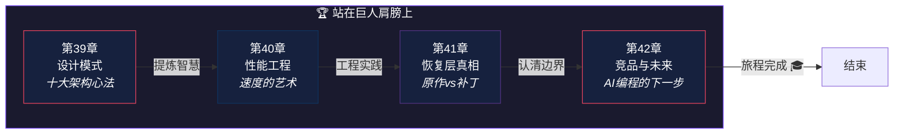

# 第十编：站在巨人肩膀上

> *武术高手不死记套路，而是从中提炼出"心法"。读源码也是：从具体代码中提炼出可复用的设计智慧。*
>
> 本编从全局视角总结 Claude Code 的架构智慧：**十大设计模式**、**性能工程**、**恢复层真相**、**竞品对比与未来展望**。

---

## 本编总览

---

## 本编四章速览

| 章 | 标题 | 核心问题 | 生活类比 |
|---|------|----------|----------|
| 39 | [设计模式](chapter39.md) | 读完50万行代码，哪些设计智慧值得带走？ | 武术心法 |
| 40 | [性能工程](chapter40.md) | 1884 个文件怎么编译成秒启的 CLI？ | F1 赛车工程 |
| 41 | [恢复层真相](chapter41.md) | 哪些代码是 Anthropic 写的？哪些是逆向者的补丁？ | 修复古画 |
| 42 | [竞品与未来](chapter42.md) | Claude Code 在 AI 编程战场上处于什么位置？ | 车厂的新能源路线之争 |

---

## 设计思想主线

!!! tip "本编建立的认知基础"
    1. 十大设计模式不依赖 AI 技术——它们是**通用的软件架构智慧**
    2. 性能工程涉及打包、分割、Tree Shaking——**每个决策都影响用户体验**
    3. Source Map 泄露给了我们教训——**构建安全不容忽视**
    4. 分辨原作和补全是读逆向代码的**必备能力**
    5. AI 编程助手的架构选择暗示了**未来方向**

---

## 推荐路径

=== "🌱 初学者"

    第39章的设计模式是全书精华浓缩——**即使没读前面38章，这一章也能独立阅读**。

=== "🔧 开发者"

    第40章的性能工程和第41章的恢复层分析是**工程实践的宝库**。

=== "🏗️ 架构师"

    第42章的竞品对比提供了**行业全景视角**——理解不同技术路线的取舍。

!!! note "即将上线"
    本编内容正在写作中，敬请期待。
