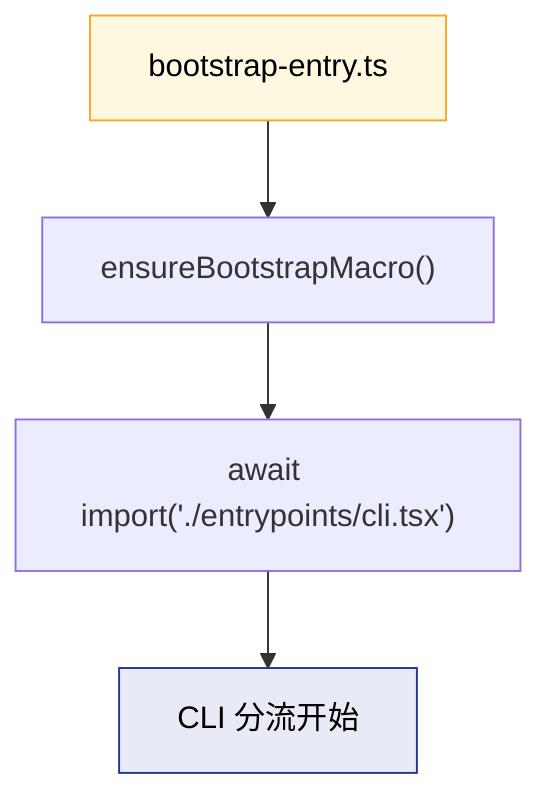
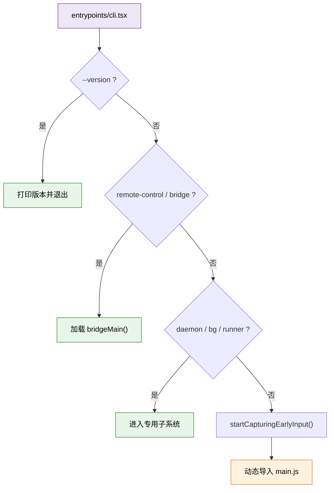
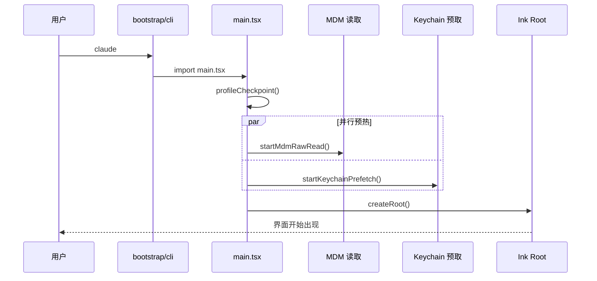
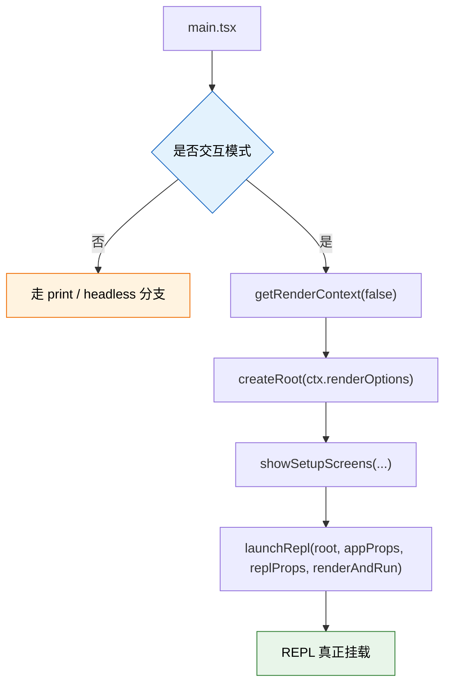
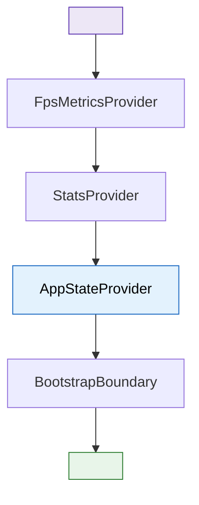
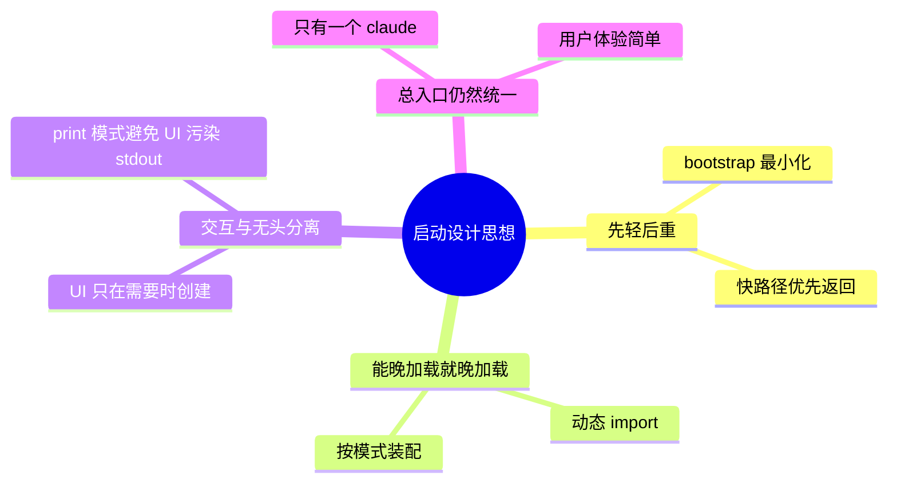

---
tags:
  - 启动链
  - 第二编
---

# 第5章：启动链条：从敲下命令到屏幕亮起

!!! tip "生活类比"
    你按下汽车启动键时，真正发生的不是“发动机突然活了”，而是一串精密动作：电瓶供电、自检、喷油、点火、仪表盘亮起。`claude` 启动也一样，**看起来只是一条命令，背后却是一条分层启动链**。

!!! question "这一章要回答的问题"
    **从你在终端输入 `claude` 到 REPL 提示符出现，中间到底经过了几层？为什么不能把所有逻辑都塞进一个文件里？**

    如果你只看表面，会以为 Claude Code 的启动过程就是“读参数，然后显示界面”。但源码告诉我们，真实情况是：**超轻入口层负责抢速度，命令分流层负责挑路线，主协调器负责装配上下文，渲染层最后把界面点亮**。

---

## 5.1 一条命令，四层启动链

先别急着看细节，先记住全景地图：


| 层级 | 代表文件 | 干什么 | 为什么单独拆出来 |
|---|---|---|---|
| 第1层 | `src/bootstrap-entry.ts` | 最小入口，先做宏初始化 | 尽量让冷启动更快 |
| 第2层 | `src/entrypoints/cli.tsx` | 检查快速路径、避免重载整个 CLI | `--version` 这类命令不该拖着 4000 多行主文件一起启动 |
| 第3层 | `src/main.tsx` | 解析参数、加载配置、搭建上下文、决定进入哪种运行模式 | 这里是总协调器 |
| 第4层 | `src/ink.ts` + `src/ink/root.ts` + `src/components/App.tsx` | 创建终端渲染根，把 REPL 真正挂载上去 | 把“业务逻辑”和“怎么画到终端”隔开 |

这套拆分有一个很重要的设计思想：

!!! info "设计思想"
    **启动链不是按“代码模块”拆，而是按“时间敏感度”拆。**

    越早执行的部分越轻，越重的部分越往后推。这和网页里的“首屏优化”是同一个思路。

---

## 5.2 第一跳：`bootstrap-entry.ts` 只有 5 行

在 `OpenClaudeCode/src/bootstrap-entry.ts` 里，真正的入口短得惊人：

```ts
import { ensureBootstrapMacro } from './bootstrapMacro'

ensureBootstrapMacro()

await import('./entrypoints/cli.tsx')
```

这 5 行说明了两件事：

1. **先做宏初始化，再进入 CLI**
2. **CLI 用动态导入，而不是顶层静态导入**

动态导入的意义是什么？很像开商场时，先打开总电源，不会一上来就把所有店铺的灯都打开。只有当你真的走到那一层，才按需通电。



### 为什么入口越短越好

命令行工具和网页首页有一个共同点：**第一次响应非常重要**。用户打出 `claude --version`，如果也要等一大堆 React、Ink、插件、认证逻辑初始化完，体验会非常差。

所以 Claude Code 的第一跳几乎不做业务，只做“把舞台搭好”。

---

## 5.3 第二跳：`entrypoints/cli.tsx` 是“高速收费站”

真正聪明的地方出现在 `claude-code-sourcemap/restored-src/src/entrypoints/cli.tsx`。这个文件不是完整主程序，而是一个**快速分流器**。

### 先拦下那些根本不需要完整启动的命令

源码里最典型的几个快速路径：

- `--version` / `-v`：直接打印版本，立即退出
- `remote-control`：直接走桥接模式
- `daemon` / `--daemon-worker`：直接进入守护进程路径
- `ps` / `logs` / `attach` / `kill` / `--bg`：直接走后台会话管理
- `environment-runner` / `self-hosted-runner`：直接进入无头运行器
- `--worktree --tmux`：优先处理 tmux/worktree 特殊分支



### 一个很重要的性能技巧：按需动态导入

在 `entrypoints/cli.tsx` 中，几乎每条快速路径都写成这样：

```ts
const { bridgeMain } = await import('../bridge/bridgeMain.js')
await bridgeMain(args.slice(1))
return
```

意思是：

- 你没走桥接模式，就**完全不用加载**桥接代码
- 你没走后台模式，就**完全不用加载**后台会话管理代码
- 你只是查版本，就连 `main.tsx` 都不用读

这就是“把重模块推迟到真正需要的那一刻”。

### 真正的完整启动只在最后发生

分流器的尾声非常关键：

```ts
const { startCapturingEarlyInput } = await import('../utils/earlyInput.js')
startCapturingEarlyInput()

const { main: cliMain } = await import('../main.js')
await cliMain()
```

在这一刻，Claude Code 才真正决定：“好，现在确实需要完整主程序了。”

---

## 5.4 第三跳：`main.tsx` 是总装车间

如果说 `entrypoints/cli.tsx` 是收费站，`main.tsx` 就是整车总装厂。它不再只负责“分流”，而是开始做真正昂贵但必要的准备工作。

### 一上来先做并行预热

`OpenClaudeCode/src/main.tsx` 的开头注释写得非常直白：某些副作用必须在最早时刻并行发起。比如：

- `profileCheckpoint('main_tsx_entry')`：启动性能打点
- `startMdmRawRead()`：发起 MDM 配置读取
- `startKeychainPrefetch()`：预取钥匙串里的认证信息



你可以把它理解成饭店后厨：客人还没点单，厨师就先把高汤热上、刀具摆好、常用食材拿出来。这样真正开始做菜时就不会手忙脚乱。

### 为什么这些副作用要“顶层启动”

源码注释甚至给出了性能解释：

- MDM 读取与后续导入并行，可以节省大约 100ms 量级等待
- Keychain 预取能避免后面同步读取认证信息拖慢启动

这说明 Claude Code 团队并不是“感觉慢”，而是在**用数据驱动启动优化**。

---

## 5.5 只有交互模式，才真的创建 Ink 根节点

`main.tsx` 里有一个非常值得初学者记住的判断：

> Ink root is only needed for interactive sessions.

翻成人话就是：**只有你真的要进入交互 REPL，才创建终端 UI 根节点。**

### 交互模式的关键动作

在 `main.tsx` 的交互路径里，重要步骤大致是：

1. 获取渲染上下文 `getRenderContext(false)`
2. 动态导入 `createRoot`
3. `root = await createRoot(ctx.renderOptions)`
4. 显示 trust / onboarding / setup screens
5. 最后 `launchRepl(...)`



为什么这么设计？

- `--print` 模式不需要复杂 UI
- 无头模式如果也 patch console、挂 Ink，会干扰标准输出
- 交互模式则必须要完整 UI、快捷键、标题栏、状态栏等能力

也就是说，Claude Code 启动的目标不是“永远把所有系统都启动起来”，而是“**根据当前模式只启动需要的那部分**”。

---

## 5.6 第四跳：`launchRepl()` 把 App 和 REPL 组装起来

在 `OpenClaudeCode/src/replLauncher.tsx` 里，`launchRepl()` 的职责非常清楚：

```ts
const { App } = await import('./components/App.js')
const { REPL } = await import('./screens/REPL.js')

await renderAndRun(
  root,
  <App {...appProps}>
    <REPL {...replProps} />
  </App>,
)
```

这段代码像在搭舞台：

- `App` 是总外壳，提供上下文
- `REPL` 是真正的交互主界面
- `renderAndRun` 负责把整棵组件树挂到终端

### `App` 不是摆设，它负责注入上下文

`components/App.tsx` 里，`App` 会套上这些提供器：

- `FpsMetricsProvider`
- `StatsProvider`
- `AppStateProvider`
- `BootstrapBoundary`



这很像玩游戏时加载场景：

- 先把引擎挂上
- 再把全局状态挂上
- 再放一个“出错保护罩”
- 最后才把真正的场景内容放进去

---

## 5.7 为什么不直接一个 `main()` 写到底

这是本章最值得记住的工程思想。

如果你是第一次写 CLI，很可能会这样做：

```text
main()
  解析参数
  初始化认证
  初始化配置
  初始化 UI
  初始化插件
  创建 REPL
```

这样的问题是：

- `--version` 也会被迫跑一大堆没用逻辑
- 任何一个功能变重，所有模式一起变慢
- 交互模式和无头模式会互相拖累
- 每加一种模式，`main()` 都会继续膨胀

Claude Code 的做法更像高速公路立交桥：



这套架构兼顾了两件看似冲突的事：

- 对用户来说，入口只有一个：`claude`
- 对内部实现来说，路径可以非常分层、非常精细

---

!!! abstract "🔭 深水区（架构师选读）"
    **Claude Code 的启动链本质上是一套“冷启动预算管理”方案。**

    `bootstrap-entry.ts` 极小化、`entrypoints/cli.tsx` 大量动态导入、`main.tsx` 早期并行预热、Ink 根节点只在交互模式创建，这四个决策都在服务同一件事：**让用户尽快看到第一个有效反馈，同时不把所有模式绑死在同一条最慢路径上。**

    很多团队做 CLI 会先把功能做对，再慢慢优化性能；Claude Code 的源码明显表现出另一种成熟度：**它从一开始就在把“启动速度”视为架构问题，而不是后期小修小补。**

---

!!! success "本章小结"
    **一句话**：Claude Code 的启动不是“一口气跑到头”，而是经过 `bootstrap-entry`、`cli` 分流、`main` 总装、`Ink/REPL` 挂载四层链条，层层只做当下最该做的事。

!!! info "关键源码索引"
    | 证据层 | 文件 | 本章关注点 |
    |---|---|---|
    | 还原层 | `claude-code-sourcemap/restored-src/src/entrypoints/cli.tsx:33-42` | `--version` 快速路径 |
    | 还原层 | `claude-code-sourcemap/restored-src/src/entrypoints/cli.tsx:108-160` | bridge 快速路径 |
    | 还原层 | `claude-code-sourcemap/restored-src/src/entrypoints/cli.tsx:287-298` | 最终导入 `main.js` |
    | 补全层 | `OpenClaudeCode/src/bootstrap-entry.ts:1-5` | 极简启动入口 |
    | 补全层 | `OpenClaudeCode/src/main.tsx:1-20` | 顶层并行预热 |
    | 补全层 | `OpenClaudeCode/src/main.tsx:2217-2248` | 交互模式创建 Ink 根节点 |
    | 补全层 | `OpenClaudeCode/src/replLauncher.tsx:12-21` | 挂载 `App` 与 `REPL` |
    | 补全层 | `OpenClaudeCode/src/components/App.tsx:46-95` | 注入 AppState / Stats / FPS 上下文 |

!!! warning "逆向提醒"
    - ✅ **可信度高**：启动分层、动态导入、快路径分流，这些在还原层和补全层都能互相印证
    - ⚠️ **需留意差异**：`OpenClaudeCode` 为了可运行性补齐了部分外围依赖，但启动骨架本身与还原层高度一致
    - ❌ **不要误读**：某些 ant-only 或 feature flag 分支不等于所有发行版本都会启用
