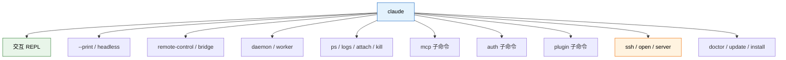
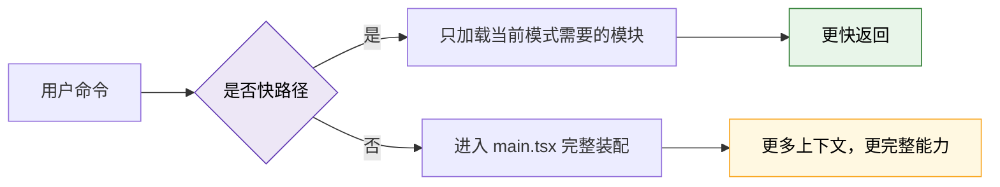
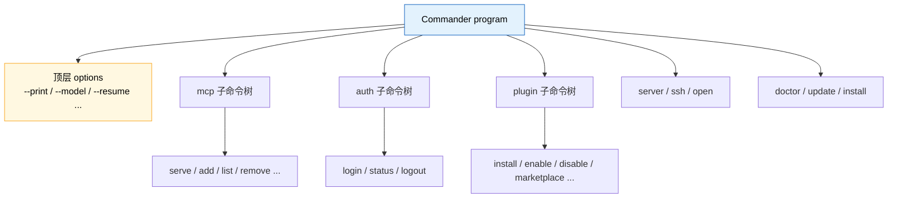
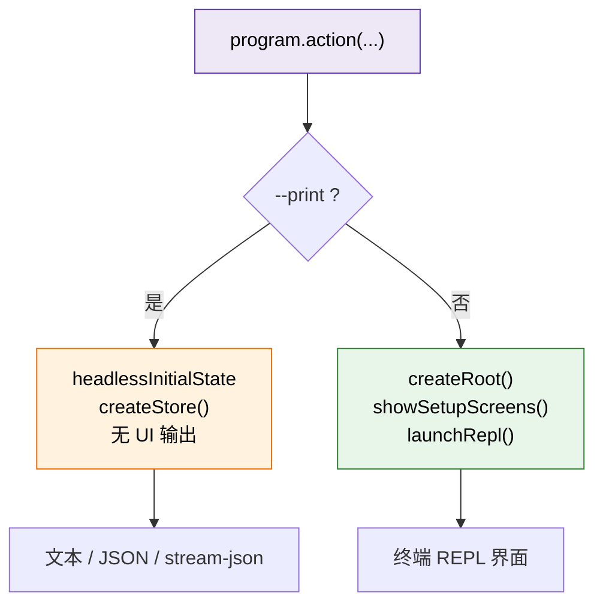
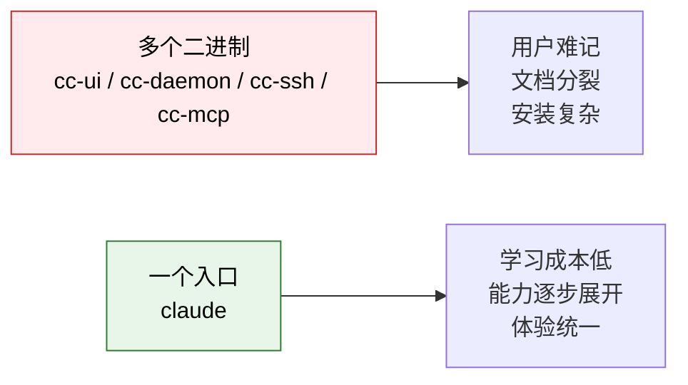

---
tags:
  - 模式矩阵
  - 第二编
---

# 第6章：多面手：同一个程序的10种模式

!!! tip "生活类比"
    瑞士军刀只有一个手柄，却能翻出刀、剪刀、开瓶器、锉刀。Claude Code 也是这样：用户看到的只是一个 `claude`，但它背后能翻出很多不同“刀片”。

!!! question "这一章要回答的问题"
    **为什么同一个程序要支持这么多模式？这些模式为什么不会互相绊脚？**

    交互 REPL、`--print` 无头模式、远程桥接、守护进程、后台会话、插件管理、认证管理……如果这些能力都做成独立二进制，用户会记不住；如果全部塞进一个大函数，工程师会崩溃。Claude Code 的做法，是把“**一个入口**”和“**多条执行路线**”同时保住。

---

## 6.1 先建立一个认知：`claude` 不是一种模式，而是一个总入口

很多初学者会误以为：

> `claude` = 终端聊天界面

其实不是。更准确的说法是：

> `claude` = 一套命令分发平台，REPL 只是其中最常见的一种运行方式



这就是本章的主角：**模式矩阵**。

---

## 6.2 第一层分流：入口文件先拦截“高频快路径”

`entrypoints/cli.tsx` 不是完整 CLI，而是一个**轻量总闸门**。它先判断你是不是走某些特定路径，如果是，就直接导入专用模块；如果不是，再进入 `main.tsx`。

### 从源码里能数出至少 10 类代表性模式

下面这张表不是“所有命令的完整清单”，而是最值得理解的 10 类模式：

| 模式 | 触发方式 | 主要入口证据 | 设计意图 |
|---|---|---|---|
| 1. 交互 REPL | `claude` | `main.tsx` action handler + `launchRepl()` | 默认主路径 |
| 2. 无头输出 | `claude -p` / `--print` | `main.tsx` headless 分支 | 给脚本、管道、SDK 用 |
| 3. 版本查询 | `--version` | `entrypoints/cli.tsx:36-42` | 零重载快速返回 |
| 4. 远程桥接 | `remote-control` / `bridge` | `entrypoints/cli.tsx:108-160` | 本地 CLI 变成桥接器 |
| 5. 守护进程 | `daemon` | `entrypoints/cli.tsx:164-179` | 后台长驻服务 |
| 6. 后台会话 | `ps / logs / attach / kill / --bg` | `entrypoints/cli.tsx:182-208` | 管理分离会话 |
| 7. 模板任务 | `new / list / reply` | `entrypoints/cli.tsx:211-221` | 模板工作流专门路径 |
| 8. 环境运行器 | `environment-runner` | `entrypoints/cli.tsx:224-232` | 无头执行环境 |
| 9. 自托管运行器 | `self-hosted-runner` | `entrypoints/cli.tsx:235-244` | 对接自托管服务 |
| 10. 远程会话族 | `ssh` / `open` / `server` | `main.tsx:3968+`, `4052+`, `4065+` | 本地 UI 连接远程执行 |

### 为什么先在入口层分流，而不是都等进 `main.tsx`

原因很简单：不是每条命令都值得付出完整启动成本。



这和大型网站的路由网关很像：健康检查、静态资源、API 网关、完整页面渲染，不会走同一条最重路径。

---

## 6.3 第二层分流：`main.tsx` 里的 Commander 像“总控面板”

进入 `main.tsx` 后，Claude Code 用 `CommanderCommand` 建立完整命令系统：

```ts
const program = new CommanderCommand()
  .configureHelp(createSortedHelpConfig())
  .enablePositionalOptions()
```

然后围绕这个 `program` 挂上：

- 顶层选项：`--print`、`--model`、`--permission-mode`、`--settings` 等
- 子命令树：`mcp`、`auth`、`plugin`、`server`、`ssh`、`open`、`doctor`、`update`……



### 这意味着什么

进入 `main.tsx` 后，Claude Code 的模式切换不再只是“读 argv 然后 if-else”，而是进入一套正式的命令框架。

好处有三个：

1. **帮助文档自动生成**
2. **参数校验集中管理**
3. **模式的边界更清楚**

这对大型 CLI 非常重要。命令一多，如果没有 Commander 这类结构化框架，很快就会变成一团乱麻。

---

## 6.4 第三层分流：同一个 action handler，继续拆成交互与无头

即使到了顶层 `program.action(async (prompt, options) => { ... })`，Claude Code 仍然不会“一条路跑到底”。

### 同一套参数，不同的运行引擎

最核心的一刀是：

- **交互模式**：创建 Ink root，最后 `launchRepl()`
- **无头模式**：创建 `headlessStore`，直接跑 headless/print 流程



### 为什么 `--print` 不复用 REPL

因为二者的目标完全不同：

| 模式 | 最优先目标 |
|---|---|
| 交互 REPL | 给人看，支持输入、重绘、快捷键、状态栏 |
| `--print` | 给程序看，输出稳定、可解析、不要污染 stdout |

如果强行让 `--print` 走 REPL，那会遇到很多问题：

- Ink patch console 会影响标准输出
- ANSI 样式会污染 JSON
- 状态栏、提示框、标题栏都成了噪声

所以 Claude Code 明确分成两套运行体验，但又尽量让它们共享同一套核心状态和查询逻辑。

---

## 6.5 远程模式并不是“另一个产品”，而是同一个入口的分支

很多工具一旦加远程能力，就会分裂成另一套客户端。Claude Code 这里做得更优雅：远程能力仍然是 `claude` 这一个入口上的不同分支。

### 远程相关的几条主要路径

| 路径 | 作用 | 用户感受 |
|---|---|---|
| `remote-control` | 本地机器作为 bridge 环境 | 像把 CLI 变成桥 |
| `server` | 启动 Claude Code 会话服务器 | 像把 CLI 变成服务端 |
| `open <cc-url>` | 连接已有会话服务器 | 像远程登录 |
| `ssh <host> [dir]` | 通过 SSH 在远端运行 Claude Code | UI 在本地，执行在远端 |

这一点特别能体现 Claude Code 的产品哲学：

!!! info "设计思想"
    它没有把“本地模式”和“远程模式”做成两个产品，而是把它们视为**同一任务执行框架在不同运行环境中的展开形式**。

这比“再做一个远程版客户端”更难，但也更统一。

---

## 6.6 多模式如何避免互相打架

这是很多初学者最关心的问题：一个程序支持这么多模式，不会越改越乱吗？

Claude Code 的答案主要有三点：

### 1. 先按层分流，再按模式装配

- 入口层先拦快路径
- 主程序层再挂子命令
- action handler 再做交互/无头拆分
- 真正执行前再按模式拼装上下文

### 2. 重模块尽量动态导入

你没用 bridge，就不导 bridge。

你没用 daemon，就不导 daemon。

你没开交互，就不创建 Ink root。

### 3. 用户只记一个命令

从产品角度看，这一点非常值钱：



这就是“**对用户收敛，对内部分层**”的经典工程取舍。

---

!!! abstract "🔭 深水区（架构师选读）"
    Claude Code 的“多模式”本质上不是命令行参数技巧，而是**单入口、多运行时人格**。

    入口文件用动态导入和 feature flag 保住冷启动性能；`main.tsx` 用 Commander 保住命令结构化；action handler 再根据交互/无头/远程实际场景创建不同的运行容器。这样既避免了“一套代码复制成多个产品”，又避免了“所有模式挤在同一条最重路径上”。

    代价也很明显：`main.tsx` 会变得非常大，模式之间的边界要靠严格分层和持续重构来维持。这也是为什么读源码时要始终分清：**入口分流、命令注册、运行时装配，是三件不同的事。**

---

!!! success "本章小结"
    **一句话**：`claude` 不是“一个终端聊天程序”，而是一个统一入口下的多模式平台，靠入口快路径、Commander 命令树和运行时分支三层分流来保持既统一又不混乱。

!!! info "关键源码索引"
    | 证据层 | 文件 | 本章关注点 |
    |---|---|---|
    | 还原层 | `claude-code-sourcemap/restored-src/src/entrypoints/cli.tsx:33-179` | 版本、bridge、daemon 等快路径 |
    | 还原层 | `claude-code-sourcemap/restored-src/src/entrypoints/cli.tsx:182-298` | 后台会话、runner、worktree、导入 `main.js` |
    | 补全层 | `OpenClaudeCode/src/main.tsx:908-1013` | Commander 顶层 program 与 options |
    | 补全层 | `OpenClaudeCode/src/main.tsx:2618-2659` | `--print` / headless 状态装配 |
    | 补全层 | `OpenClaudeCode/src/main.tsx:3140-3208` | 交互 REPL、direct connect、SSH 远程 |
    | 补全层 | `OpenClaudeCode/src/main.tsx:3900-4498` | `mcp`、`auth`、`plugin`、`server` 等子命令树 |

!!! warning "逆向提醒"
    - ✅ **可信度高**：模式矩阵与命令树在还原层和补全层都很清晰
    - ⚠️ **不要把 feature flag 当默认功能**：有些模式受构建目标或权限门控控制
    - ⚠️ **“10种模式”是阅读框架，不是全部命令总数**：真实源码里的分支比这更多
