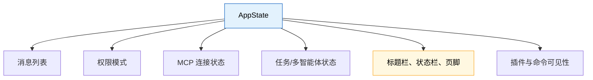
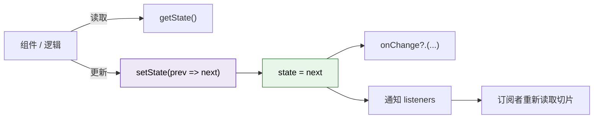
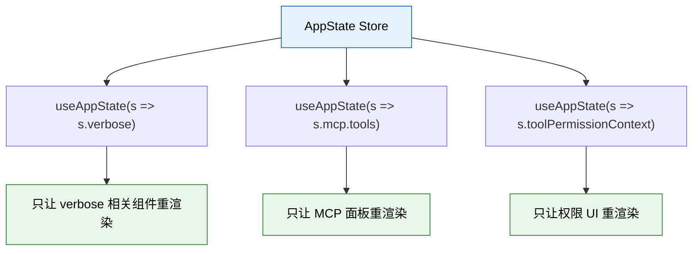
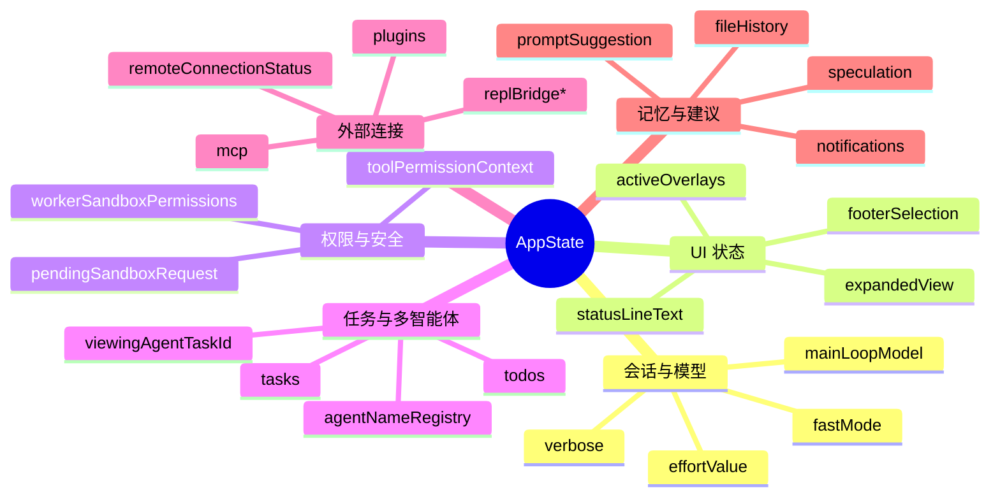
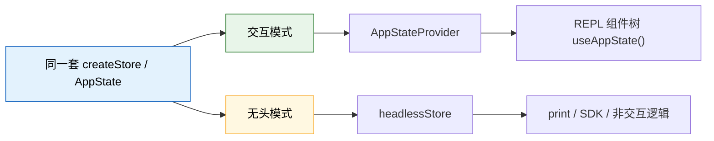

---
tags:
  - 状态管理
  - 第二编
---

# 第7章：程序的"记忆"：状态管理的艺术

!!! tip "生活类比"
    你一边做数学题，一边还记得老师刚刚说的提示、桌上放着哪张草稿纸、上一步算到了哪里——这叫**工作记忆**。程序也需要这种“当前脑内状态”，否则每次都要从头回忆。

!!! question "这一章要回答的问题"
    **Claude Code 这种大型交互程序，用什么保存“当前状态”？为什么不用 Redux，也不直接用一堆全局变量？**

    终端里显示哪条消息、当前权限模式是什么、哪些 MCP 工具已连接、是否在远程桥接、有没有后台任务、终端标题显示什么……这些都不是“数据库里的永久数据”，而是**会不断变化的运行时状态**。本章就是要拆开 Claude Code 的“短期记忆系统”。

---

## 7.1 为什么大型 CLI 也逃不过状态管理

很多初学者觉得只有前端网页才需要状态管理。其实 Claude Code 这种交互式 CLI 更需要。

### 你看到的每一块界面都依赖状态



如果没有一套稳定的状态管理方案，会很快掉进两个坑：

| 坑 | 会发生什么 |
|---|---|
| 全局变量到处飞 | 谁改了状态、什么时候改的，没人说得清 |
| 所有组件全量重渲染 | 稍微改一点状态，整个终端 UI 都抖一遍 |

Claude Code 的选择很有意思：**不用 Redux 那种重型框架，而是自己写了一个极小 store，再用 React 的 `useSyncExternalStore` 订阅切片。**

---

## 7.2 `createStore()`：状态底座只有 34 行

先看 `OpenClaudeCode/src/state/store.ts`，整个 store 核心只有几十行：

```ts
export function createStore<T>(initialState: T, onChange?: OnChange<T>): Store<T> {
  let state = initialState
  const listeners = new Set<Listener>()

  return {
    getState: () => state,
    setState: updater => { ... },
    subscribe: listener => { ... },
  }
}
```

### 它做的事其实非常朴素

- `getState()`：读当前状态
- `setState(updater)`：基于旧状态算出新状态
- `subscribe(listener)`：当状态变化时通知订阅者



### 为什么说它“像 Zustand，但更小”

它的风格很像很多轻量状态库：

- 没有 reducer 模板代码
- 没有 action type 字符串
- 没有复杂 middleware 管道
- 更新方式就是一个函数：`prev => next`

这对 Claude Code 来说特别合适，因为它的状态变化经常来自：

- 工具执行完成
- 权限状态变更
- 会话恢复完成
- 插件/MCP 动态重载
- REPL 输入与快捷键事件

这些场景要的是**灵活、低摩擦**，不是 ceremony（繁文缛节）。

---

## 7.3 `AppStateProvider`：把 store 送进整棵组件树

只有 store 还不够，还得把它安全地送到 React 组件树里。这就是 `AppStateProvider` 的工作。

### Provider 做了三件关键事

1. 创建 store（只创建一次）
2. 用 React Context 把 store 向下传
3. 监听外部设置变化，同步回 AppState

`AppStateProvider` 里有几个特别值得记住的点。

#### 1. 不允许嵌套 Provider

源码里直接写了：

```ts
if (hasAppStateContext) {
  throw new Error("AppStateProvider can not be nested within another AppStateProvider")
}
```

这很好理解。状态容器一旦套娃，开发者就很容易分不清自己读到的是哪一层状态。

#### 2. store 用 `useState(() => createStore(...))` 固定住

这意味着 Provider 自己不会因为父组件重渲染就重新创建 store。对大型交互程序来说，这一点非常关键。

#### 3. 组件只订阅自己需要的那一小块状态

真正优雅的地方在 `useAppState(selector)`：

```ts
return useSyncExternalStore(store.subscribe, get, get)
```

它要求你传一个 selector，例如：

```ts
const verbose = useAppState(s => s.verbose)
const model = useAppState(s => s.mainLoopModel)
```

也就是说，**组件不需要知道整个世界，只拿它关心的那一片。**



这就是为什么源码里还专门提醒你：

- 不要在 selector 里返回新对象
- 最好多次调用 hook，分别拿独立字段

因为这样才能让渲染足够精准。

---

## 7.4 `AppState` 到底装了什么

`AppStateStore.ts` 里的 `AppState` 非常大，但你不必被吓到。把它按“功能分区”看，就容易多了。



### 初学者最该先记住的 6 类状态

| 类别 | 代表字段 | 作用 |
|---|---|---|
| 会话基础 | `verbose`、`mainLoopModel` | 当前对话用什么风格、什么模型 |
| 视图状态 | `expandedView`、`footerSelection` | 当前 UI 展开什么、焦点在哪 |
| 权限状态 | `toolPermissionContext` | 当前允许什么工具、处于哪种权限模式 |
| 任务状态 | `tasks`、`viewingAgentTaskId` | 多智能体和后台任务的运行情况 |
| 外部连接 | `mcp`、`plugins`、`replBridge*` | 外部能力接入和远程桥接 |
| 辅助能力 | `promptSuggestion`、`fileHistory` | 建议输入、文件历史、推测状态 |

### 默认状态不是“空白”，而是“可运行起点”

`getDefaultAppState()` 返回的并不只是空对象，它已经给出了一套能启动会话的默认形状：

- `verbose: false`
- `expandedView: 'none'`
- `toolPermissionContext.mode` 根据环境初始化为 `default` 或 `plan`
- `mcp.clients/tools/commands/resources` 先从空开始
- `plugins.enabled/disabled` 先留空壳
- `thinkingEnabled`、`promptSuggestionEnabled` 会走默认策略

这就像电脑开机后的 BIOS 默认设置。它并不包含用户任务，但已经给系统一个稳定起跑姿势。

---

## 7.5 交互模式和无头模式，居然共用同一套状态底座

这一点非常漂亮，也非常值得学习。

### 在交互模式里：状态通过 Provider 进 UI 树

路径大致是：

- `App.tsx` 创建 `<AppStateProvider initialState=...>`
- REPL 里的组件通过 `useAppState()` 读取切片

### 在无头模式里：状态通过 `createStore()` 直接给逻辑层

`main.tsx` 的 headless 分支会这样做：

```ts
const defaultState = getDefaultAppState()
const headlessInitialState = { ...defaultState, ... }
const headlessStore = createStore(headlessInitialState, onChangeAppState)
```



这说明 Claude Code 团队没有把“交互程序状态”和“无头模式状态”各写一套，而是抽出了一个更底层、更中性的状态底座。

这非常像一辆车：

- 交互模式像“你坐在驾驶位自己开”
- 无头模式像“把车放到测试台上跑程序”

方向不同，但底盘是同一个。

---

## 7.6 为什么这套方案比 Redux 更适合 Claude Code

这不是说 Redux 不好，而是**工程要看场景**。

| 对比项 | Redux 式方案 | Claude Code 方案 |
|---|---|---|
| 更新方式 | action + reducer | `setState(prev => next)` |
| 模板代码 | 较多 | 很少 |
| 对 CLI 适配 | 需要额外组织 | 天然直接 |
| 精准订阅 | 可以，但配置更多 | `useSyncExternalStore(selector)` 直接做 |
| 学习成本 | 中等 | 较低 |

Claude Code 的状态问题不是“多人协作修改浏览器页面”，而是“**终端里的大量即时状态 + 工具执行 + 会话切换 + 权限变化**”。这种场景下，轻量和可嵌入性更重要。

不过它也有代价：

- `AppState` 会越来越大
- 状态更新缺少强约束时，容易出现“谁都能改”
- 需要团队自己维护好命名、分层和 selector 习惯

所以这套方案的关键前提不是框架神奇，而是团队 discipline（自律）够强。

---

!!! abstract "🔭 深水区（架构师选读）"
    Claude Code 的状态层可以概括成一句话：**用最小 Store 内核，换最大的运行时适配性。**

    `createStore()` 本身极小，既能嵌进 React，也能直接用于 headless；`AppStateProvider` 负责 UI 世界的桥接；`useSyncExternalStore` 负责精准订阅。这样它既不像 Redux 那样偏“前端框架化”，也不像全局变量那样失控，更接近一种“工程化的内存总线”。

    真正的难点不在 API，而在 AppState 规模膨胀后的治理：哪些字段应当持久化，哪些只活一帧，哪些属于权限域，哪些属于 UI 域。读这类源码时，你会发现：**状态管理从来不只是技术问题，更是建模能力问题。**

---

!!! success "本章小结"
    **一句话**：Claude Code 用一个极小的自研 store 做状态底座，再用 `AppStateProvider + useSyncExternalStore` 把它安全、高效地接进 React 和无头逻辑两边。

!!! info "关键源码索引"
    | 证据层 | 文件 | 本章关注点 |
    |---|---|---|
    | 补全层 | `OpenClaudeCode/src/state/store.ts:1-34` | 极简 store 核心 |
    | 补全层 | `OpenClaudeCode/src/state/AppState.tsx:37-109` | Provider 创建与注入 store |
    | 补全层 | `OpenClaudeCode/src/state/AppState.tsx:117-198` | `useAppState` / `useSetAppState` / `useSyncExternalStore` |
    | 补全层 | `OpenClaudeCode/src/state/AppStateStore.ts:89-240` | AppState 类型分区 |
    | 补全层 | `OpenClaudeCode/src/state/AppStateStore.ts:456-569` | 默认状态初始化 |
    | 补全层 | `OpenClaudeCode/src/main.tsx:2629-2659` | headless 分支复用同一底座 |
    | 还原层 | `claude-code-sourcemap/restored-src/src/state/store.ts` | 还原层中同样存在轻量 store 骨架 |

!!! warning "逆向提醒"
    - ✅ **可信度高**：状态层的总体架构和 API 非常清楚
    - ⚠️ **字段规模大**：`AppState` 很多分支受 feature flag 和构建目标影响，阅读时要分“核心字段”和“条件字段”
    - ⚠️ **不要误解为 React 专属**：这套状态底座故意设计成既能服务 UI，也能服务无头逻辑
