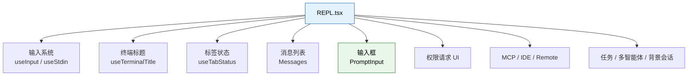
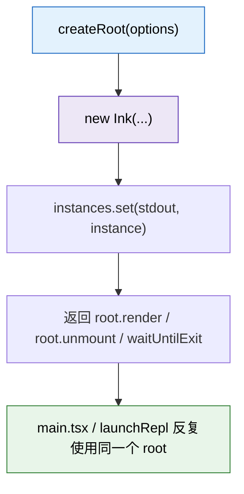
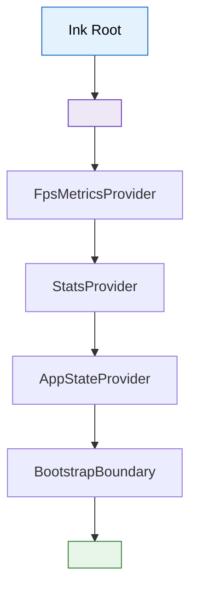
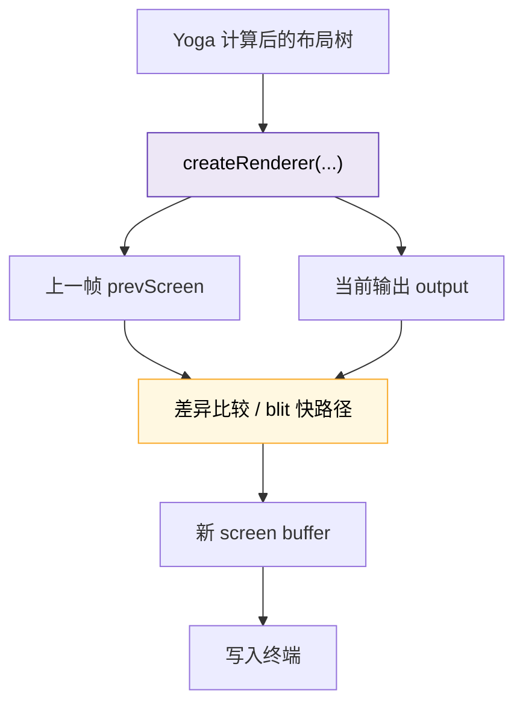
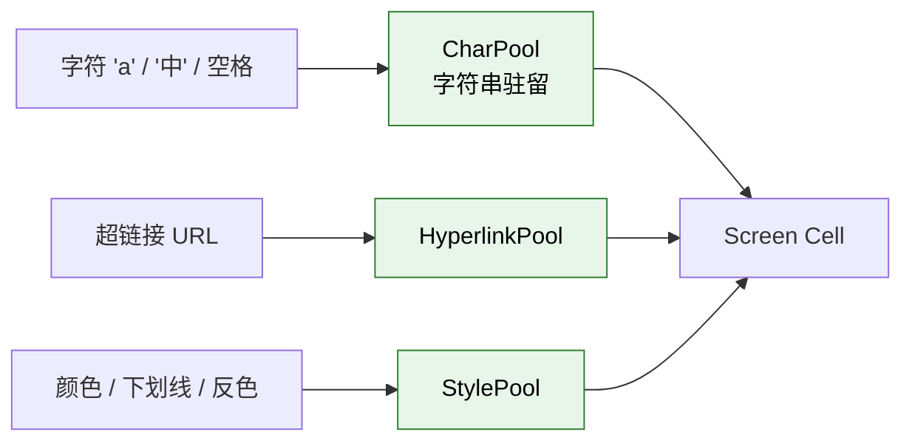
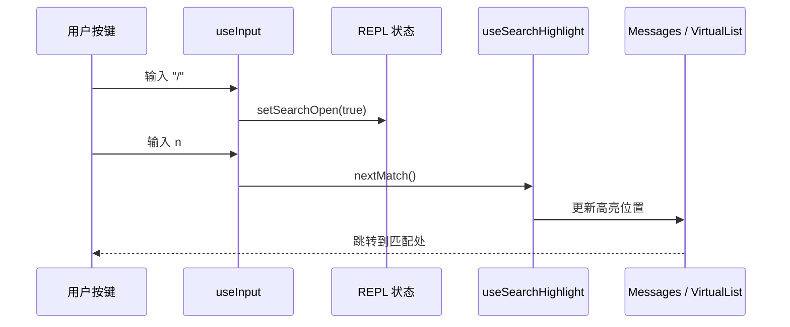

---
tags:
  - 终端UI
  - 第二编
---

# 第8章：终端里的"前端"：React如何画出CLI

!!! tip "生活类比"
    用乐高搭控制面板时，你不会先想“我要打印第 17 个字符”，而是先想“这里需要一个屏幕、这里需要一排按钮、这里需要一个状态灯”。Claude Code 的终端 UI 也是这样搭出来的：**先想组件，再想渲染**。

!!! question "这一章要回答的问题"
    **终端明明只有字符和颜色，为什么 Claude Code 还要上 React、上自研 Ink、上布局引擎？直接 `console.log` 不就行了吗？**

    这是很多人第一次读 Claude Code 源码时最惊讶的地方：它不像传统 CLI 那样大量 `stdout.write(...)`，而是搭了一整套“终端版前端框架”。本章就来拆这件事。

---

## 8.1 先别看代码，先回答一个问题：终端界面复杂到什么程度

如果 Claude Code 只是输出一段文字，那确实不需要 React。

但真实情况是，它的 REPL 要同时处理：

- 消息列表
- Markdown 渲染
- 工具调用进度
- 权限确认框
- 状态栏/标题栏/页脚
- 快捷键输入
- 搜索高亮
- 全屏 transcript 视图
- 远程桥接状态
- 多智能体任务树

`OpenClaudeCode/src/screens/REPL.tsx` 本身就有 **5000+ 行**，开头导入的 hook 和组件已经说明一切。



如果用 `console.log` 硬拼，会立刻遇到这些问题：

| 问题 | 直接打印会怎样 |
|---|---|
| 状态变化后局部刷新 | 很难，只能粗暴重画 |
| 输入与输出并存 | 光标位置管理会非常痛苦 |
| 高亮、选择、搜索 | 要自己维护字符缓冲区 |
| 多组件协作 | 会变成庞大的 if-else |

所以 Claude Code 选择的是：**把终端当成一种“特殊的渲染目标”，而不是低级输出流。**

---

## 8.2 `ink.ts`：对外暴露“像前端一样”的终端 API

`OpenClaudeCode/src/ink.ts` 是一个很重要的门面层。

### 它做的第一件事：自动包上主题

源码里最关键的 3 行是：

```ts
function withTheme(node: ReactNode): ReactNode {
  return createElement(ThemeProvider, null, node)
}
```

然后无论你是 `render(node)` 还是 `createRoot().render(node)`，都会自动先过 `withTheme(node)`。

这说明 Claude Code 并不是把 Ink 当成裸渲染器，而是强行在最外层加了一套设计系统。


### 它做的第二件事：重新导出终端版“前端原语”

在这个文件里，你会看到一堆熟悉又陌生的东西：

- `Box`
- `Text`
- `Button`
- `Link`
- `useInput`
- `useTerminalTitle`
- `useTabStatus`
- `useTerminalViewport`

这非常像一个自定义 UI 框架的公共入口。对调用方来说，不需要知道底下是怎么写 ANSI、怎么 diff 屏幕、怎么处理 alt-screen，只需要像写 React 组件一样使用。

---

## 8.3 `root.ts`：真正把 React 世界挂到终端上的地方

如果说 `ink.ts` 是门面，`ink/root.ts` 就是真正的渲染根。

### 它提供了两个层级的 API

| API | 含义 | 适合什么场景 |
|---|---|---|
| `renderSync` / 默认 `render()` | 一次性挂载输出 | 简单渲染 |
| `createRoot()` | 先创建 root，再多次 `render(node)` | 交互式会话、顺序多屏切换 |

对 Claude Code 这种 REPL 来说，`createRoot()` 更重要，因为会话不是“一次渲染完就结束”，而是要长时间活着、不断重绘。

### `createRoot()` 背后的思路非常像 `react-dom`



源码注释甚至直接说了：

> A managed Ink root, similar to react-dom's createRoot API.

也就是说，Claude Code 在终端里复刻的不是简单打印，而是**一整套“挂载根节点 -> 渲染 -> 更新 -> 卸载”的前端心智模型**。

---

## 8.4 `App` 外壳：先注入上下文，再让 REPL 登场

`launchRepl()` 并不会直接渲染 `<REPL />`，而是先包一层 `<App>`。

在 `components/App.tsx` 里，`App` 会把这些上下文一层层包进去：

- `FpsMetricsProvider`
- `StatsProvider`
- `AppStateProvider`
- `BootstrapBoundary`



### 为什么要有 `BootstrapBoundary`

这就像浏览器世界的 Error Boundary。终端程序没有浏览器 DevTools 帮你兜底，一旦初始化时组件树炸掉，至少得给用户一个清楚的错误信息，而不是屏幕直接坏掉。

这说明 Claude Code 团队不是只关心“渲染成功的路径”，也在关心“渲染失败时怎么优雅地失败”。

---

## 8.5 真正难的地方：不是画出来，而是高效地“改出来”

很多人第一次听说终端 UI，会以为难点在“怎么画彩色文字”。其实真正难的是：

> **上一帧和这一帧只有一点点变化时，如何只改必要部分，而不是整屏重画到闪烁？**

这就是 `ink/renderer.ts` 和 `ink/screen.ts` 的价值。

### `renderer.ts`：根据布局结果生成新的一帧

`createRenderer(node, stylePool)` 会返回一个 renderer，它会：

1. 读取前一帧和后一帧缓冲
2. 检查 Yoga 布局尺寸是否合法
3. 创建或复用 `screen`
4. 调用 `renderNodeToOutput(...)`
5. 只在必要时放弃 blit 快路径

源码里有一句特别能说明思路：

> When clean, blit restores the O(unchanged) fast path for steady-state frames.

翻成人话：**如果前一帧没被污染，就尽量走“复制没变区域”的快路径。**



### `screen.ts`：把字符池、样式池、链接池都池化起来

`screen.ts` 里最让架构师眼前一亮的，是这些对象：

- `CharPool`
- `HyperlinkPool`
- `StylePool`

它们的核心想法都一样：**不要重复存同样的东西，用整数 ID 代替重复字符串和样式数组。**



这背后其实是一个非常“系统程序员”的思路：

- 用整数比较代替字符串比较
- 用池化减少内存分配
- 用缓存减少重复序列化 ANSI

所以你可以说，Claude Code 的终端渲染栈并不是“前端味很重”，而是**前端抽象 + 系统级优化**同时存在。

---

## 8.6 `REPL.tsx`：像前端应用一样接键盘、标题栏、搜索栏

当你看到 `REPL.tsx` 里的这些调用时，就会彻底意识到它不是传统 CLI：

- `useTerminalTitle(...)`
- `useTabStatus(...)`
- `useInput(...)`
- `useSearchHighlight()`

### 终端标题和标签状态都是 Hook 驱动的

例如：

- `useTerminalTitle(...)` 控制终端标题栏
- `useTabStatus(...)` 控制终端标签栏状态

这和浏览器里 `useEffect(() => document.title = ...)` 的心智模型很像，只不过目标从浏览器 tab 变成了终端窗口。

### 搜索不是“命令”，而是 REPL 内部状态机

在 transcript 模式下，`useInput(...)` 会接管 `/`、`n`、`N` 等输入：

- `/`：打开搜索
- `n`：跳下一个匹配
- `N`：跳上一个匹配

这说明 Claude Code 的输入系统已经不是“读一行文本再提交”，而更像一个真正的 TUI 应用。



这就是为什么第 8 章的标题是“终端里的前端”。从交互模型上看，它和单页应用已经很接近了。

---

## 8.7 为什么 Claude Code 不满足于官方 Ink

这本书一个很重要的发现是：Claude Code 并不是“简单用了 Ink”，而是围绕它做了大量自研。

### 你能从目录结构直接看出它的野心

`src/ink/` 下面不是几个小工具，而是一整套子系统：

- root
- renderer
- screen
- terminal
- events
- hooks
- components
- termio

这说明官方抽象不够时，团队选择的是**把终端渲染栈往下钻透**，而不是凑合。

### 为什么要这么做

因为 Claude Code 面临的不是普通 CLI 的需求，而是：

- 大量持续流式更新
- 长消息与虚拟列表
- alt-screen 全屏体验
- 搜索与选择覆盖层
- 多智能体任务树
- 复杂权限弹窗与状态面板

官方 Ink 提供了起点，但不一定能直接覆盖这些边界场景。

---

!!! abstract "🔭 深水区（架构师选读）"
    Claude Code 的终端 UI 架构最有意思的地方，在于它把三个世界缝在了一起：

    1. **React 的声明式组件模型**
    2. **Yoga/缓冲区/ANSI diff 的底层渲染优化**
    3. **CLI 独有的输入、终端标题、alt-screen、scrollback 语义**

    这不是“把网页搬到终端”，而是“把前端的抽象能力移植到终端，再用系统级手法把性能拉回来”。所以读这一层源码时，最值得学的不是某个 Hook 名字，而是一个方法论：**高层抽象负责组织复杂度，底层优化负责守住性能。**

---

!!! success "本章小结"
    **一句话**：Claude Code 之所以能在终端里做出接近前端应用的体验，是因为它把 React 组件模型、自研 Ink 根节点、屏幕缓冲区和终端事件系统整合成了一套完整的渲染栈。

!!! info "关键源码索引"
    | 证据层 | 文件 | 本章关注点 |
    |---|---|---|
    | 补全层 | `OpenClaudeCode/src/ink.ts:12-31` | `withTheme`、`render()`、`createRoot()` 门面层 |
    | 补全层 | `OpenClaudeCode/src/ink/root.ts:62-157` | 终端版 `createRoot` 与实例管理 |
    | 补全层 | `OpenClaudeCode/src/components/App.tsx:46-95` | App 外壳与上下文注入 |
    | 补全层 | `OpenClaudeCode/src/ink/renderer.ts:31-177` | 帧渲染、alt-screen、blit 快路径 |
    | 补全层 | `OpenClaudeCode/src/ink/screen.ts:21-220` | `CharPool` / `StylePool` 等池化设计 |
    | 补全层 | `OpenClaudeCode/src/screens/REPL.tsx:12-30` | REPL 顶层依赖规模 |
    | 补全层 | `OpenClaudeCode/src/screens/REPL.tsx:517` | 终端标题 Hook |
    | 补全层 | `OpenClaudeCode/src/screens/REPL.tsx:1205-1207` | 终端标签状态 Hook |
    | 补全层 | `OpenClaudeCode/src/screens/REPL.tsx:4253-4294` | transcript 搜索输入逻辑 |
    | 还原层 | `claude-code-sourcemap/restored-src/src/screens/REPL.tsx` | 交互层的还原证据 |

!!! warning "逆向提醒"
    - ✅ **可信度高**：自研 Ink 渲染栈、REPL 交互方式、屏幕缓冲优化都能直接从源码看出
    - ⚠️ **细节复杂**：`screen.ts` 和 `renderer.ts` 很底层，第一次阅读应先抓住“池化 + 差分 + alt-screen”三条主线
    - ⚠️ **不要把它当网页 UI**：它借用了 React 的思维，但约束来自终端，不是浏览器
