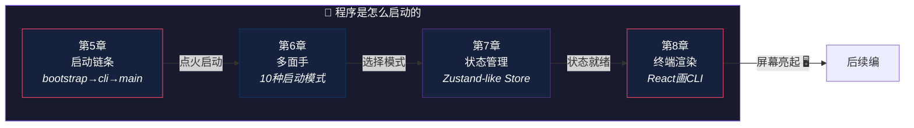

# 第二编：程序是怎么启动的

> *汽车点火不只是拧钥匙——从电路检测到发动机运转，每一步都不能少。*
>
> 本编解剖 Claude Code 从 `claude` 命令输入到 REPL 就绪的完整启动链条：**入口引导**、**多模式分发**、**状态初始化**、**终端渲染**。

---

## 本编总览

---

## 本编四章速览

| 章 | 标题 | 核心问题 | 生活类比 |
|---|------|----------|----------|
| 5 | [启动链条](chapter05.md) | 从敲下命令到 REPL 就绪，中间经过几层？ | 汽车点火链条 |
| 6 | [多面手](chapter06.md) | 同一个 npm 包为什么支持 10+ 种启动模式？ | 瑞士军刀 |
| 7 | [状态管理](chapter07.md) | Redux 太重、全局变量太乱——用什么管状态？ | 大脑的工作记忆 |
| 8 | [终端渲染](chapter08.md) | 终端只有字符和颜色，为什么还用 React？ | 乐高搭控制面板 |

---

## 设计思想主线

!!! tip "本编建立的认知基础"
    1. 启动不是"打开就完了"——**配置加载、认证验证、UI 初始化、插件注册**都在启动链条中
    2. 单一代码库管理多种模式（CLI / SDK / MCP Server）——**模式隔离**是关键
    3. 自研轻量状态库代替 Redux——**够用就好**的工程哲学
    4. 终端里的 React 是**重写后的 Ink 框架**——声明式 UI 不只属于浏览器

---

## 推荐路径

=== "🌱 初学者"

    从第5章的生活类比开始，理解"启动链条"的概念。**第8章的终端渲染最有趣**——原来终端也能用 React！

=== "🔧 开发者"

    重点看第6章的多模式架构和第7章的状态管理。**自研 Store 的设计值得学习**。

=== "🏗️ 架构师"

    关注第6章的模式隔离策略和第8章的 Ink 重写决策——**什么时候该用社区方案、什么时候该自研**。

!!! note "即将上线"
    本编内容正在写作中，敬请期待。
