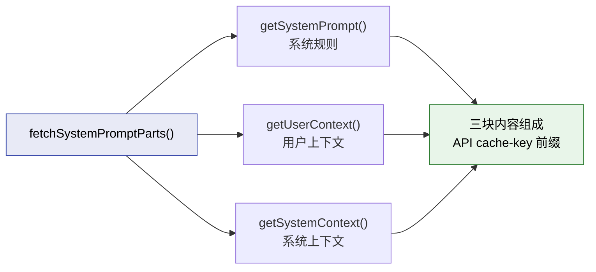
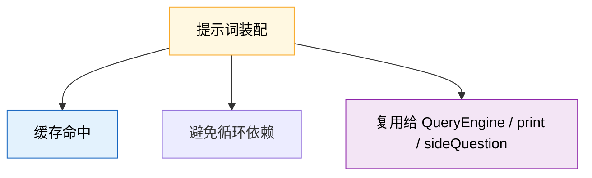
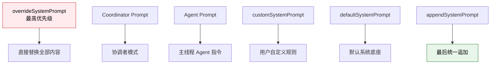
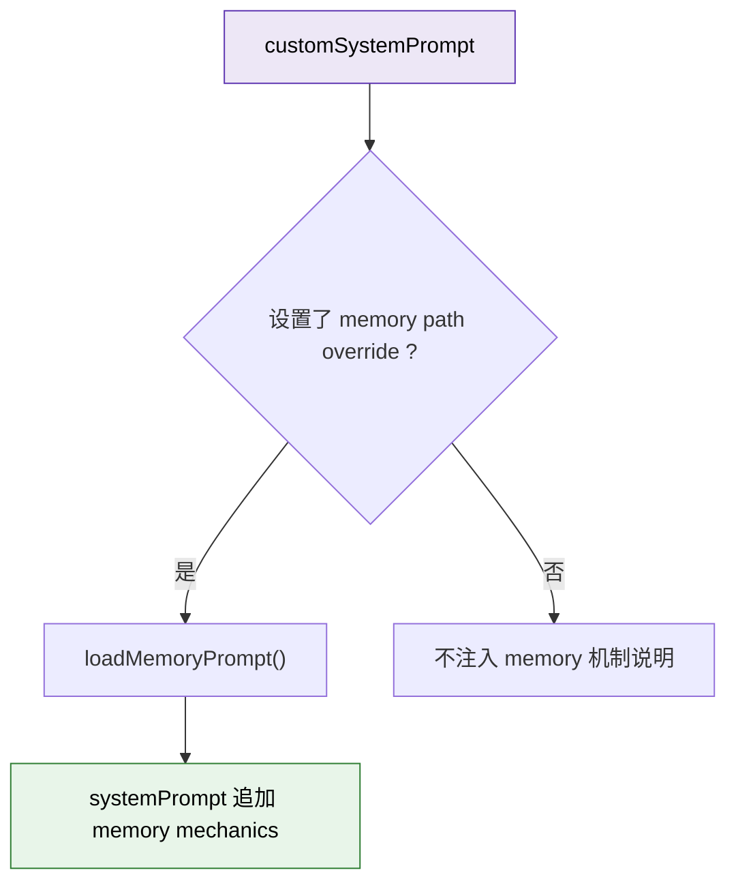

---
tags:
  - 提示词工程
  - 第三编
---

# 第9章：提示词装配厂：AI上班前的"早报"

!!! tip "生活类比"
    一个新员工第一天来公司，不会被直接扔到工位上就开始干活。通常会先拿到一套资料：公司规则、团队分工、项目背景、常见流程、不能踩的坑。**Claude Code 每次开工前，也会先给模型发一份“入职资料包”。**

!!! question "这一章要回答的问题"
    **在你说第一个字之前，Claude Code 已经给 AI 塞了多少背景知识？这些背景知识又是按什么顺序装进去的？**

    很多人把 system prompt 想成一大段神秘咒语。但源码里真正发生的事更像一条装配线：**先收集通用规则，再拼装运行时上下文，再把项目记忆和额外要求叠上去，最后还要考虑缓存命中率和成本。**

---

## 9.1 先别想成“一段大 prompt”，它其实是三块前缀

在 `utils/queryContext.ts` 里，Claude Code 把每次请求真正依赖的“上下文前缀”拆成三块：

- `defaultSystemPrompt`
- `userContext`
- `systemContext`

而且是并行取回的，不是串行慢慢拼：

这件事非常重要，因为它告诉我们：

1. **Claude Code 不把所有信息都塞进 system prompt**
2. **有些内容属于“系统规则”，有些属于“用户现场”，还有些是“运行时环境”**
3. **这三块共同影响缓存命中和后续循环**

### 为什么这里要专门拆成一个 `queryContext.ts`

文件开头的注释已经点破了设计动机：这部分逻辑之所以被抽到独立文件里，是为了避免依赖环，同时把“缓存安全前缀”定义得足够稳定。

### 自定义 system prompt 为什么会跳过默认构建

`fetchSystemPromptParts()` 里有一个很值得初学者记住的判断：

- 如果传入了 `customSystemPrompt`
- 就不再构建默认 `getSystemPrompt()`
- 同时也跳过 `getSystemContext()`

这意味着“自定义提示词”不是在默认提示词后面再追加一段，而是**直接替换默认底座**。这和很多人以为的“多加一句”完全不同。

!!! info "源码证据"
    `OpenClaudeCode/src/utils/queryContext.ts:29-73` 明确写出了三块上下文的并行获取与 custom prompt 的替换规则。

---

## 9.2 真正的装配顺序：谁覆盖谁，谁追加谁

如果说上一节是在“备料”，那这一节就是“总装”。真正决定最后发给模型的 system prompt 长什么样的，是 `buildEffectiveSystemPrompt()`。

它的优先级在注释里写得非常清楚：

换成大白话就是：

| 场景 | 最终 system prompt 怎么来 |
|---|---|
| 有 `overrideSystemPrompt` | 直接整包替换 |
| 协调者模式开启 | 用 coordinator prompt 当主干 |
| 有主线程 agent | 默认情况下 agent prompt 替换默认 prompt |
| 开启 proactive / KAIROS | agent prompt 不替换，而是追加到默认 prompt 后 |
| 有 `customSystemPrompt` | 替换默认 prompt |
| 有 `appendSystemPrompt` | 无论前面选了谁，最后都可以再加一层 |

这套规则很像公司内部的“层层发文”：

- 总部通知可以覆盖部门通知
- 特殊项目组会有自己的工作守则
- 最后领导还可以再补一句“今天注意这个”

### 为什么 `appendSystemPrompt` 永远留在最后

因为它常常扮演的是“最后一条临时要求”：

- 这次回答请更简洁
- 这次重点关注某个目录
- 这次不要调用某类工具

如果不放在最后，它很容易被前面的规则吞掉注意力。

### 一个很容易忽略的细节：Agent Prompt 不总是替换默认 Prompt

在 `PROACTIVE` 或 `KAIROS` 模式下，源码不是“把默认 prompt 丢掉再上 agent prompt”，而是：

- 保留默认 prompt
- 再追加一段 `# Custom Agent Instructions`

这个设计说明 Claude Code 已经不把 agent 看成“另一个聊天机器人”，而是看成**跑在统一底座上的一类角色**。

!!! info "源码证据"
    `OpenClaudeCode/src/utils/systemPrompt.ts:28-120` 给出了完整优先级；其中 `:99-113` 明确写出 proactive / KAIROS 模式下的追加策略。

---

## 9.3 项目记忆怎么进来：不是神秘感知，而是文件装配

很多初学者会问一个很自然的问题：

> Claude Code 怎么知道这个项目的特殊约定？  
> 它又怎么记住我之前说过的话？

答案不是“它自己突然懂了”，而是：**Claude Code 把文件系统里的记忆和规则，主动装进了模型能读到的位置。**

### REPL 启动时，会先把 `CLAUDE.md` 和规则文件读进缓存

在 `screens/REPL.tsx` 里，初始化阶段就会调用 `getMemoryFiles()`，把找到的 `CLAUDE.md / rules` 文件塞进 `readFileState`。

这说明 Claude Code 不是“每到需要时临时扫盘”，而是提前把这类高价值规则文件放进一个统一缓存里。

### Memory prompt 不是聊天记录，而是一套“怎么记”的规则

`memdir/memdir.ts` 里最有意思的一点是：`loadMemoryPrompt()` 注入的不是具体记忆内容本身，而是**如何使用 MEMORY.md 的行为规则**。

源码里能看到这些事实：

- `ENTRYPOINT_NAME` 固定为 `MEMORY.md`
- 有 `MAX_ENTRYPOINT_LINES = 200`
- 有 `MAX_ENTRYPOINT_BYTES = 25_000`
- 超长时会截断，并附上 warning
- `loadMemoryPrompt()` 会在需要时确保 memory 目录存在

这就像老师发给你一本“学习档案使用手册”，不是把你过去所有考试卷都钉进去，而是先规定：

- 哪些内容该记
- 哪些不该记
- 文件放哪里
- 格式怎么写

### QueryEngine 还能在特定条件下注入“记忆机制说明”

`QueryEngine.ts` 里还有个很妙的判断：

- 如果 SDK 调用者提供了 `customSystemPrompt`
- 同时设置了 `CLAUDE_COWORK_MEMORY_PATH_OVERRIDE`
- 那就额外注入 `memoryMechanicsPrompt`

也就是说，Claude Code 连“自定义 system prompt 场景下，模型还知不知道怎么写 memory”都考虑到了。

这类设计特别值得架构师注意，因为它反映出一个成熟系统会主动处理“定制化之后会不会把默认能力弄丢”的问题。

!!! info "源码证据"
    - `OpenClaudeCode/src/screens/REPL.tsx:3830-3849`：启动时把 `CLAUDE.md / rules` 放进 `readFileState`
    - `OpenClaudeCode/src/memdir/memdir.ts:34-38`：`MEMORY.md` 的入口定义与尺寸上限
    - `OpenClaudeCode/src/memdir/memdir.ts:419-507`：`loadMemoryPrompt()` 的自动记忆注入逻辑
    - `OpenClaudeCode/src/QueryEngine.ts:310-325`：特定条件下注入 `memoryMechanicsPrompt`

---

## 9.4 为什么提示词工程已经变成“提示词基础设施”

如果你只把 prompt 当成一段文案，会错过 Claude Code 最有价值的设计思想。

真正重要的是：**它已经把 prompt 当成基础设施来管理了。**

最典型的证据，就是 `SYSTEM_PROMPT_DYNAMIC_BOUNDARY`。

源码注释直接说：

- 这个边界前面的内容属于静态、可全局缓存内容
- 后面的内容属于用户和会话相关内容，不应共享缓存
- 不能随便改位置，否则要同步改缓存逻辑

在 `constants/prompts.ts` 的尾部，系统提示词最终是这么返回的：

1. 先放静态部分  
2. 中间打一个边界标记  
3. 再拼动态 section

这就不是“写 prompt”，而是在做：

- 分层
- 标记
- 缓存友好化
- 成本优化
- 可演化的组装策略

### 再看 `query.ts` 就更清楚了

模型真正被调用时，并不是只收到 `systemPrompt`，而是：

- `messages: prependUserContext(messagesForQuery, userContext)`
- `systemPrompt: fullSystemPrompt`

也就是说，Claude Code 不是把“所有上下文混成一坨”，而是让不同类型的信息走各自更合适的通道。

!!! info "设计思想"
    **从 Claude Code 的源码看，Prompt Engineering 已经升级成 Harness Engineering。**

    重点不再是“我写一句多厉害的话”，而是“我怎么把规则、上下文、角色、缓存边界、成本控制装成一套稳定可维护的系统”。

---

!!! abstract "🔭 深水区（架构师选读）"
    第 9 章最值得记住的不是某一句 system prompt 文案，而是它背后的**装配哲学**：

    1. 先定义哪些信息属于稳定底座，哪些属于现场变量  
    2. 再决定哪些该走 system prompt，哪些该走 userContext  
    3. 再把缓存边界明确到字符串常量  
    4. 最后才谈 wording

    这和搭数据库、消息队列、配置中心很像。真正成熟的 AI 产品，不会把 prompt 当“灵感”，而会把它当“基础设施”。

---

!!! success "本章小结"
    **一句话**：Claude Code 的提示词不是一段孤零零的大字符串，而是由 `systemPrompt + userContext + systemContext` 组成的装配体系，还要同时兼顾角色优先级、项目记忆、缓存边界和成本控制。

!!! info "关键源码索引"
    | 证据层 | 文件 | 本章关注点 |
    |---|---|---|
    | 补全层 | `OpenClaudeCode/src/utils/queryContext.ts:29-73` | 三块上下文的并行获取 |
    | 补全层 | `OpenClaudeCode/src/utils/systemPrompt.ts:28-120` | system prompt 的优先级与覆盖规则 |
    | 补全层 | `OpenClaudeCode/src/constants/prompts.ts:105-115` | 动静态 prompt 边界常量 |
    | 补全层 | `OpenClaudeCode/src/constants/prompts.ts:560-576` | 静态部分、边界标记、动态部分的最终拼装 |
    | 补全层 | `OpenClaudeCode/src/QueryEngine.ts:284-325` | QueryEngine 中的 system prompt 总装 |
    | 补全层 | `OpenClaudeCode/src/screens/REPL.tsx:3830-3849` | `CLAUDE.md / rules` 的启动期加载 |
    | 补全层 | `OpenClaudeCode/src/memdir/memdir.ts:419-507` | memory prompt 的注入与自动目录保障 |

!!! warning "逆向提醒"
    - ✅ **可信度高**：prompt 的三段式结构、优先级策略、动静态边界，在源码中都有直接注释和实现
    - ⚠️ **要分清楚**：`MEMORY.md` 的“行为规则注入”和“具体记忆内容注入”不是一回事
    - ❌ **不要误读**：`customSystemPrompt` 在很多路径里是“替换默认底座”，不是“在默认底座后面多加一句”
