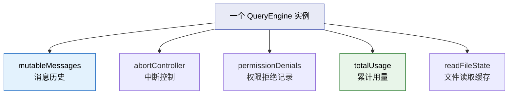
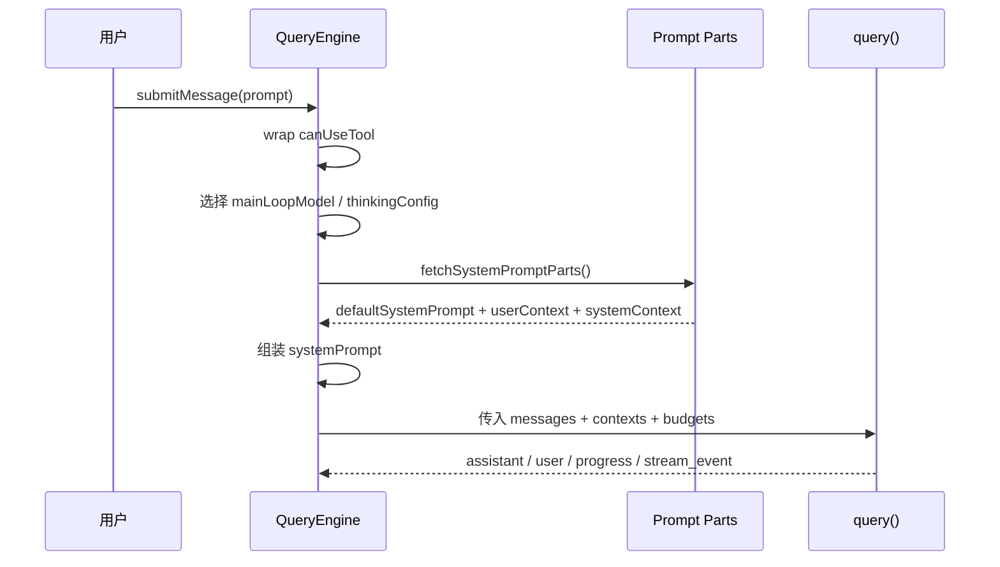
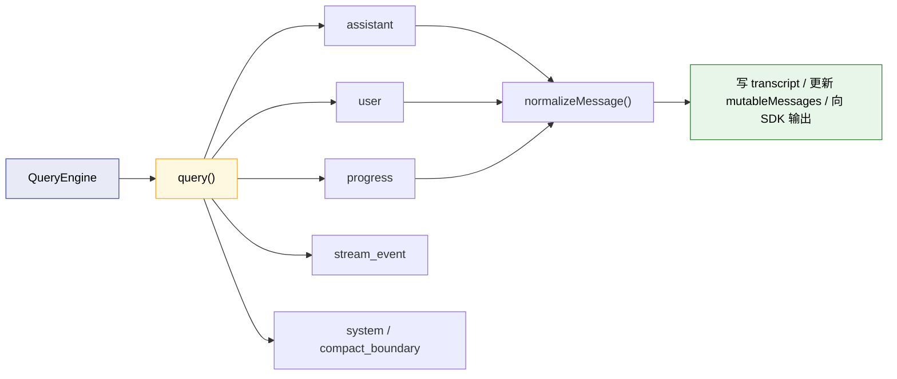
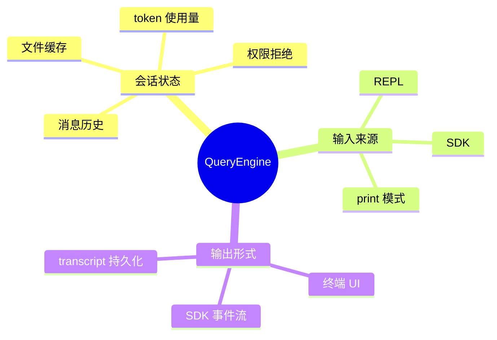

---
tags:
  - 会话引擎
  - 第三编
---

# 第10章：会话引擎：不只是聊天那么简单

!!! tip "生活类比"
    你下棋时，真正负责“这盘棋现在是什么局面、谁走到哪一步、还能不能悔棋”的，不是棋子本身，而是棋盘背后的规则系统。**QueryEngine 就是 Claude Code 的“棋盘引擎”。**

!!! question "这一章要回答的问题"
    **直接调 API 不行吗？为什么还要专门抽出一个 `QueryEngine`？**

    对一个 demo 来说，也许“拿到用户输入 -> 调模型 -> 打印回复”就够了。但对一个真正能长期对话、能调用工具、能记录成本、能被 SDK 复用的 AI 产品来说，这远远不够。Claude Code 需要一个专门管理“整场对话”的引擎。

---

## 10.1 `QueryEngine` 不是 API 封装，而是“整段会话的总管”

`QueryEngine.ts` 的类注释写得很直白：

- 它拥有一段会话的生命周期
- 一次会话里可以多次 `submitMessage()`
- 状态会跨 turn 持续存在

这五块字段已经说明它管的不是“某次请求”，而是“整段会话”：

| 字段 | 它保存什么 | 为什么要跨轮次保留 |
|---|---|---|
| `mutableMessages` | 所有消息历史 | 下一轮要继续看得见上一轮 |
| `abortController` | 中断信号 | 用户随时可能打断当前任务 |
| `permissionDenials` | 被拒绝的工具调用 | SDK 需要知道哪些工具没被放行 |
| `totalUsage` | 累计 token/usage | 会话成本不能每轮归零 |
| `readFileState` | 读过的文件缓存 | 减少重复读盘，提高一致性 |

### 这和“普通聊天页面”的根本区别

普通聊天页面往往只关心“把上一轮消息显示出来”。  
而 Claude Code 的会话引擎还要关心：

- 是否调用过工具
- 哪些权限被拒绝
- 文件缓存是否还是最新
- 成本是不是超预算
- 会话是否需要落盘持久化

这已经不是“聊天框”了，而是一个**任务执行会话容器**。

!!! info "源码证据"
    `OpenClaudeCode/src/QueryEngine.ts:176-206` 直接定义了 QueryEngine 的职责与核心状态。

---

## 10.2 `submitMessage()` 并不是“发一句话”，而是启动一整轮编排

`submitMessage()` 看起来像一个简单名字，但它干的事非常多：

1. 解构当前配置
2. 包装 `canUseTool`，顺手记录 permission denial
3. 选择模型与 thinking 配置
4. 取回 system prompt / userContext / systemContext
5. 组装 `processUserInputContext`
6. 最后才把这些东西交给 `query()`

### 一个很容易忽略的细节：拒绝权限也会被会话引擎记住

`submitMessage()` 里会把原始 `canUseTool` 包一层，如果结果不是 `allow`，就把：

- `tool_name`
- `tool_use_id`
- `tool_input`

记录到 `permissionDenials` 里。

这很像公司的门禁系统，不只是负责“让不让进”，还会留下记录，供后续汇总和审计。

### 模型和 thinking 配置也是在这里定下来的

引擎不会把这些决定完全丢给下层：

- 如果用户指定模型，就解析用户指定值
- 否则走默认主模型
- 如果没有显式 thinking 配置，就根据默认策略决定是 `adaptive` 还是 `disabled`

这说明 QueryEngine 不只是转发器，它还承担了**会话级运行策略决策**。

### System prompt 不是 REPL 专属能力

`QueryEngine` 在这里自己调用 `fetchSystemPromptParts()` 和 `asSystemPrompt(...)`，说明这套 prompt 装配逻辑已经从 UI 中抽离出来了。SDK/headless 路径不需要 React，也能完整跑起来。

!!! info "源码证据"
    `OpenClaudeCode/src/QueryEngine.ts:209-325` 展示了 `submitMessage()` 前半段的核心编排过程。

---

## 10.3 真正的核心动作：把上下文交给 `query()`，再把结果重新组织回来

`QueryEngine` 最关键的一步发生在 `:675-686`：

它把下面这些东西统一交给 `query()`：

- `messages`
- `systemPrompt`
- `userContext`
- `systemContext`
- `wrappedCanUseTool`
- `toolUseContext`
- `fallbackModel`
- `maxTurns`
- `taskBudget`

然后它自己不直接“计算答案”，而是**消费 `query()` 这个异步生成器吐出来的各种消息**。

### 为什么这样拆层很聪明

因为 `query()` 专注于：

- Agent Loop
- 模型流式调用
- 工具结果回填
- 停止条件判断

而 `QueryEngine` 专注于：

- 会话级状态保存
- transcript 记录
- SDK 输出格式
- 总成本和总 usage 累计

这就像厨房里把“炒菜的人”和“传菜结账的人”分开。一个负责把菜做好，另一个负责保证整顿饭的秩序。

### `QueryEngine` 处理的消息类型比你想的多

它不仅处理：

- `assistant`
- `user`

还处理：

- `progress`
- `stream_event`
- `attachment`
- `system`
- `tool_use_summary`
- `tombstone`

这说明 AI 会话在工程上根本不只是“用户消息”和“模型回复”两个对象，而是一整套事件流。

!!! info "源码证据"
    - `OpenClaudeCode/src/QueryEngine.ts:675-686`：把完整上下文交给 `query()`
    - `OpenClaudeCode/src/QueryEngine.ts:687-970`：对各类消息做 transcript、归一化和 SDK 输出处理

---

## 10.4 为什么 headless / SDK 能复用同一颗核心

`QueryEngine` 的类注释里有一句很关键的话：

> 它被抽出来，是为了同时服务 headless / SDK 路径，并在未来逐步服务 REPL。

换句话说，Claude Code 的设计方向不是：

- REPL 一套逻辑
- SDK 再写一套类似逻辑

而是：

- 把真正通用的“会话核心”抽出来
- UI 只是壳
- SDK 只是另一种输出方式

### 这对初学者意味着什么

当你以后自己做 AI 应用时，不要一上来把所有逻辑糊在页面组件里。更好的方式是先问自己：

- 哪部分是“会话核心”？
- 哪部分只是“展示层”？
- 哪部分是“对外接口层”？

Claude Code 的 QueryEngine 正是在回答这个问题。

### 这对架构师意味着什么

一旦会话核心和 UI 解耦，很多能力就自然出来了：

- CLI 可以复用
- SDK 可以复用
- 远程桥接可以复用
- 历史恢复可以复用

换句话说，**它让 Claude Code 从“一个终端程序”变成了“一套会话内核”。**

---

!!! abstract "🔭 深水区（架构师选读）"
    QueryEngine 最妙的地方，不是它做了很多事，而是它**管住了边界**：

    - 它不自己写 UI
    - 不自己实现工具
    - 不自己直连具体输入控件
    - 也不把 transcript 逻辑散落到每个组件

    它只做一件大事：**把一次次用户输入，组织成可持续、多轮、可恢复、可统计的会话。**

    这就是很多 AI demo 和 AI 产品之间的分水岭。demo 只有“一次回答”，产品必须有“会话内核”。

---

!!! success "本章小结"
    **一句话**：`QueryEngine` 不是一个简单的模型调用器，而是 Claude Code 的会话中枢，负责组织上下文、驱动 `query()`、积累历史与成本，并把同一套核心能力同时服务给 REPL 和 SDK。

!!! info "关键源码索引"
    | 证据层 | 文件 | 本章关注点 |
    |---|---|---|
    | 补全层 | `OpenClaudeCode/src/QueryEngine.ts:176-206` | QueryEngine 的职责与持久状态 |
    | 补全层 | `OpenClaudeCode/src/QueryEngine.ts:209-325` | `submitMessage()` 的前置编排 |
    | 补全层 | `OpenClaudeCode/src/QueryEngine.ts:675-686` | 把完整上下文交给 `query()` |
    | 补全层 | `OpenClaudeCode/src/QueryEngine.ts:687-970` | 对流式结果、进度、系统消息的统一处理 |
    | 补全层 | `OpenClaudeCode/src/utils/queryContext.ts:29-73` | 会话前缀上下文的构建来源 |

!!! warning "逆向提醒"
    - ✅ **可信度高**：QueryEngine 的定位、状态字段和 `submitMessage()` 主路径都能直接从源码读出来
    - ⚠️ **要注意边界**：它不是单独完成所有工作，而是把具体推理循环委托给 `query()`
    - ❌ **不要误解**：`QueryEngine` 不是“给 REPL 专门做的类”，它的设计目标从一开始就是 headless / SDK 复用
