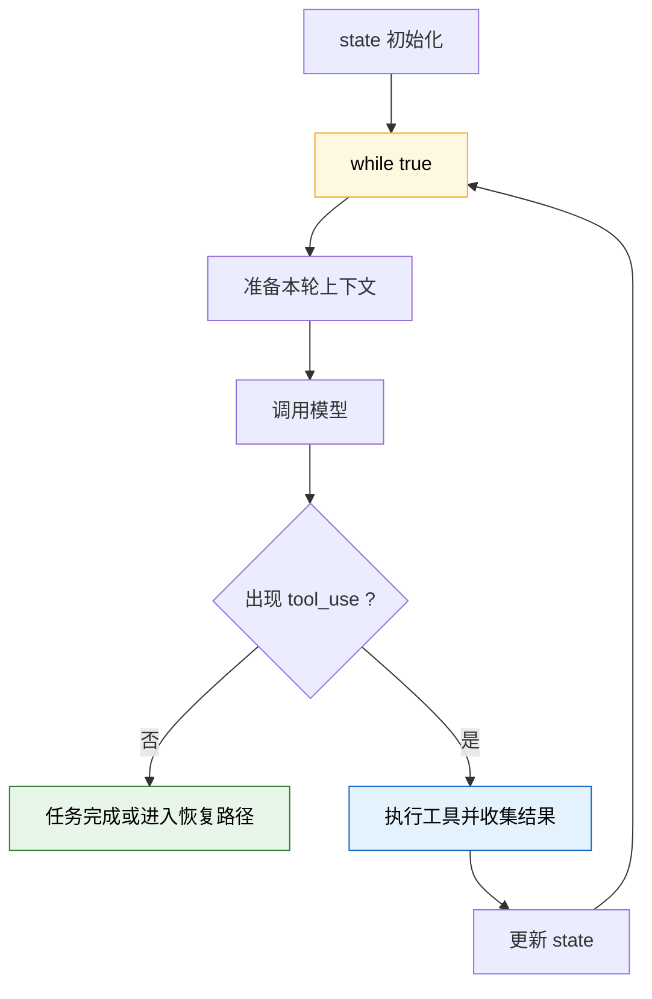
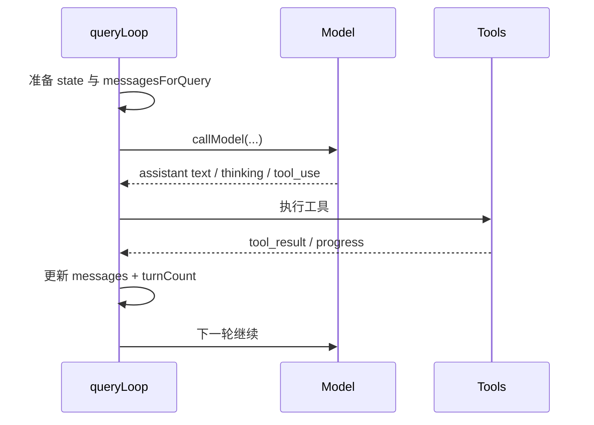
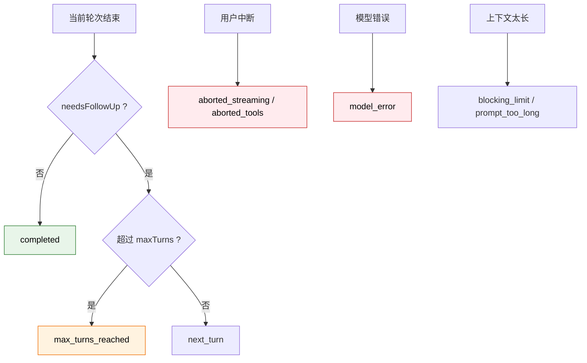
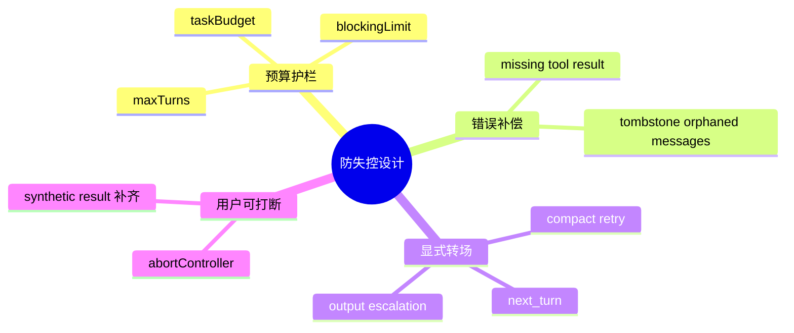

---
tags:
  - Agent Loop
  - 第三编
---

# 第11章：Agent Loop：AI工作的核心循环

!!! tip "生活类比"
    厨师做菜不是“看一眼菜单，然后瞬间端菜上桌”。真实过程是：看菜单、拿食材、下锅、尝味道、不对就调整，再继续。**Claude Code 的 Agent 也是这样工作的：想一步、做一步、看结果、再决定下一步。**

!!! question "这一章要回答的问题"
    **一个 Agent 到底是靠什么“自己持续干活”的？真的是一个 `while(true)` 吗？**

    如果你把 Claude Code 想成“模型回一次话就结束”，你会完全看不懂它为什么能读文件、跑命令、修完 bug 再回来汇报。真正让它动起来的，是 `query.ts` 里那套持续推进任务的循环。

---

## 11.1 概念上像 ReAct，源码里真的有一个 `while (true)`

很多资料会把 Agent Loop 讲成一句抽象口号：

> 思考 -> 行动 -> 观察 -> 再思考

Claude Code 没停留在概念层。`query.ts` 里真的定义了一个 `State`，然后在 `queryLoop()` 中进入：

```ts
// eslint-disable-next-line no-constant-condition
while (true) {
  ...
}
```



### 这不是“简单循环”，而是“状态机循环”

`State` 里带着这些跨轮次信息：

- `messages`
- `toolUseContext`
- `autoCompactTracking`
- `maxOutputTokensRecoveryCount`
- `hasAttemptedReactiveCompact`
- `pendingToolUseSummary`
- `turnCount`
- `transition`

也就是说，每次循环不是“重新开始”，而是带着上一轮留下的状态继续前进。

### `taskBudgetRemaining` 为什么不放进 `State`

源码注释还专门写了：`taskBudgetRemaining` 不放在 `State` 里，是为了不去污染多个 `continue` 路径。这个细节很像资深工程师会做的事：

- 需要跨迭代保留
- 但不值得塞进每次状态转移对象里

这说明 Claude Code 的循环实现，已经在认真处理**状态边界和维护成本**。

!!! info "源码证据"
    `OpenClaudeCode/src/query.ts:181-307` 定义了 `QueryParams`、`State` 与 `queryLoop()` 的 `while (true)` 主循环。

---

## 11.2 一轮循环里真正发生了什么

进入每一轮以后，Claude Code 大致按这个顺序做事：

1. 准备当前 `messagesForQuery`
2. 初始化 `assistantMessages`、`toolResults`、`toolUseBlocks`
3. 如果开启流式工具执行，就创建 `StreamingToolExecutor`
4. 先检查是否已经触到上下文 blocking limit
5. 调用模型开始流式返回
6. 收集文本、thinking、tool_use
7. 若有工具结果，拼回消息历史，进入下一轮
8. 若没有工具调用，任务可能完成



### 一个极其关键的判断：不能只信 `stop_reason === 'tool_use'`

源码里有一句非常值钱的注释：

> `stop_reason === 'tool_use' is unreliable`

所以 Claude Code 真正依赖的不是 stop reason，而是：

- 在流式过程中有没有收到 `tool_use` block
- 如果收到了，就把它们放进 `toolUseBlocks`
- 用 `needsFollowUp = true` 作为是否继续循环的信号

这非常像做后端工程时的经验法则：

- 不要盲信一个看起来方便但不稳定的字段
- 要自己根据更可靠的底层证据建判断条件

### 流式工具执行器在这里登场

如果开了 `streamingToolExecution`，`query.ts` 会在拿到 `tool_use` block 的同时，把它交给 `StreamingToolExecutor`。这意味着：

- 模型还在流式吐内容
- 工具已经可以提前排队，甚至开始跑

这就是 Claude Code“看起来特别流畅”的关键之一。

!!! info "源码证据"
    `OpenClaudeCode/src/query.ts:545-568` 初始化每轮核心容器；`OpenClaudeCode/src/query.ts:653-708` 调模型；`OpenClaudeCode/src/query.ts:821-852` 在流式过程中收集工具块并与执行器联动。

---

## 11.3 循环什么时候停：五种典型出口

一个真正可靠的 Agent Loop，不难在“会继续”，难在“知道什么时候该停”。

Claude Code 主要有几类出口：



### 1. 没有后续工具调用，正常完成

如果本轮流式结束后 `needsFollowUp` 仍然是 `false`，就说明模型没有再请求工具，循环可以走向完成或进入恢复判断。

### 2. 达到 `maxTurns`

当有工具结果、准备递归进入下一轮时，代码会先算：

- `nextTurnCount = turnCount + 1`
- 如果超过 `maxTurns`
- 直接产出 `max_turns_reached` 附件并返回

甚至连“用户在工具执行阶段中断了”的路径，也会顺手检查 maxTurns，避免系统在中断情况下丢失这个限制信号。

### 3. 用户中断

当 `abortController.signal.aborted` 触发时：

- 如果用了 `StreamingToolExecutor`，要先消费剩余结果，补齐必要的 synthetic tool_result
- 然后再发中断消息
- 最后返回 `aborted_streaming` 或 `aborted_tools`

这说明中断不是“粗暴停机”，而是**先把会话补到可恢复的一致状态**。

### 4. 模型错误

如果 `callModel` 真抛出异常，`query.ts` 会：

- `yieldMissingToolResultBlocks(...)`
- 再给用户一个真实 API error
- 返回 `model_error`

也就是说，即使模型在半路坏掉，Claude Code 也会尽量补上那些已经发出 `tool_use` 但还没等到 `tool_result` 的空洞。

### 5. 上下文过长与恢复失败

如果 token 早已到了 blocking limit，Claude Code 会直接生成 `PROMPT_TOO_LONG_ERROR_MESSAGE` 返回，而不会傻傻继续打 API。

!!! info "源码证据"
    - `OpenClaudeCode/src/query.ts:637-646`：blocking limit 直接阻断
    - `OpenClaudeCode/src/query.ts:1498-1515`：中断工具后仍然检查 `maxTurns`
    - `OpenClaudeCode/src/query.ts:1678-1711`：递归进入下一轮前检查 `maxTurns`
    - `OpenClaudeCode/src/query.ts:977-996`：模型错误时补齐缺失的 tool result

---

## 11.4 为什么这个循环不会轻易失控

“AI 会不会陷入死循环？”这是最自然的担忧。Claude Code 的回答不是一句“不会”，而是一层层保险。

### 保险一：阻断过长上下文

在每轮正式打模型之前，它会先用 `calculateTokenWarningState(...)` 检查是否已经到 blocking limit。

这相当于厨师上菜前先看煤气还够不够，别做到一半锅都要熄火了。

### 保险二：Fallback 不是简单重试，而是会清理“半截消息”

如果流式过程中触发 fallback model：

- 之前已经出来的半截 assistant message 会先 tombstone 掉
- `StreamingToolExecutor` 会 discard
- `assistantMessages / toolResults / toolUseBlocks` 都会被清空

这一步特别讲究，因为“半截 thinking block”或“旧 tool_use_id 对应的新 tool_result”都会让后续对话历史变脏。

### 保险三：转场理由是显式记录的

`State.transition` 不是装饰字段，它会清楚记录这次继续是因为：

- `next_turn`
- `reactive_compact_retry`
- `max_output_tokens_escalate`
- `token_budget_continuation`

这让测试和调试都能判断：系统究竟是为什么继续跑下去的。



### 最值得记住的工程思想

Claude Code 的 Agent Loop 之所以稳，不是因为“模型很聪明”，而是因为循环外面和里面都围了很多护栏：

- 预算护栏
- 上下文护栏
- 一致性护栏
- 中断护栏

这也是你自己做 Agent 时最该学的地方。

---

!!! abstract "🔭 深水区（架构师选读）"
    第 11 章最有价值的一点，是它把“Agent Loop”从一个概念词，变成了一套**可调试、可约束、可恢复的循环控制器**。

    很多人讲 ReAct，会把重点放在“模型会想，会做”。Claude Code 源码告诉我们，真正难的是：

    - 什么时候继续
    - 什么时候终止
    - 错一半时怎么补齐
    - 中断时怎么不把历史搞脏
    - fallback 时怎么不留下孤儿消息

    这就是为什么 AI Agent 的核心难题，不是“会不会生成”，而是“能不能稳定运行”。

---

!!! success "本章小结"
    **一句话**：Claude Code 的 Agent Loop 真的是一个 `while (true)` 驱动的多轮状态机，它通过 `tool_use` 检测、显式转场、预算限制、错误补偿和中断补齐，把“想 -> 做 -> 看 -> 再来”这件事做成了可靠工程。

!!! info "关键源码索引"
    | 证据层 | 文件 | 本章关注点 |
    |---|---|---|
    | 补全层 | `OpenClaudeCode/src/query.ts:181-307` | `QueryParams`、`State` 与 `while (true)` 主循环 |
    | 补全层 | `OpenClaudeCode/src/query.ts:545-568` | 每轮循环的核心容器初始化 |
    | 补全层 | `OpenClaudeCode/src/query.ts:637-708` | blocking limit 检查与模型调用 |
    | 补全层 | `OpenClaudeCode/src/query.ts:821-852` | 识别 `tool_use` 并联动流式工具执行 |
    | 补全层 | `OpenClaudeCode/src/query.ts:977-1051` | 模型错误和中断时的补偿逻辑 |
    | 补全层 | `OpenClaudeCode/src/query.ts:1498-1515` | 中断路径上的 `maxTurns` 处理 |
    | 补全层 | `OpenClaudeCode/src/query.ts:1678-1725` | 递归进入下一轮前的转场与终止判断 |

!!! warning "逆向提醒"
    - ✅ **可信度高**：`while (true)`、`State`、`needsFollowUp`、`maxTurns` 和各类 return reason 都是源码直出
    - ⚠️ **需要纠正旧印象**：它不只是“一个 while 循环”，更是“状态机 + 恢复路径 + 护栏系统”
    - ❌ **不要误读**：继续下一轮的判断不是单纯靠 `stop_reason === tool_use`，源码明确说这个字段并不可靠
