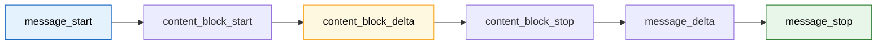
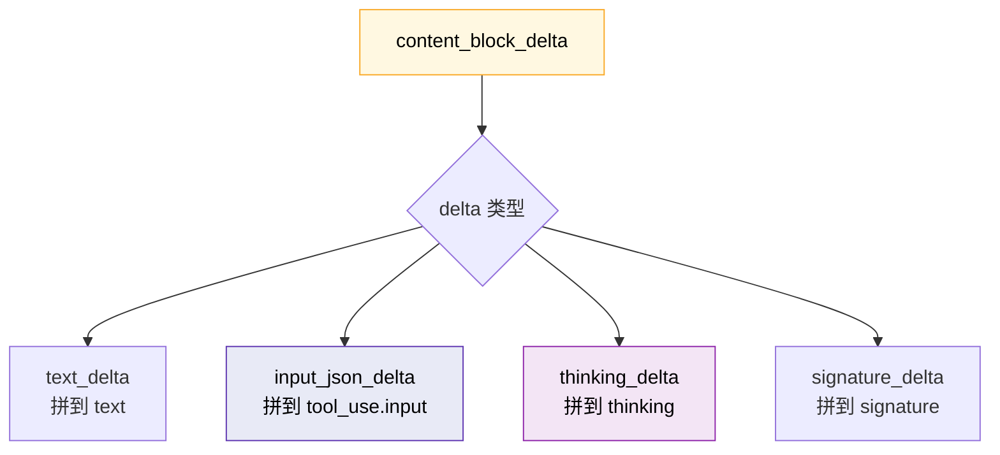
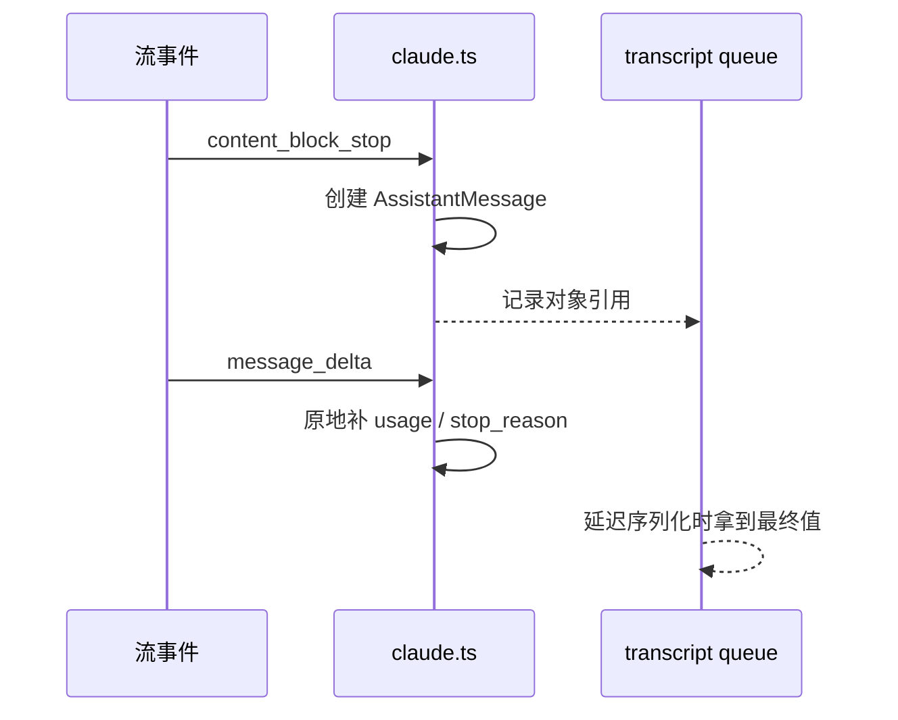
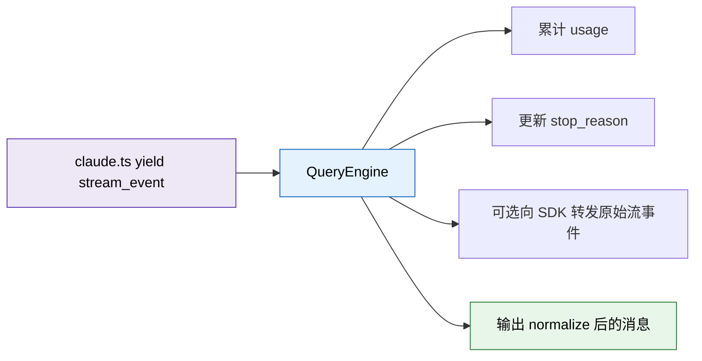
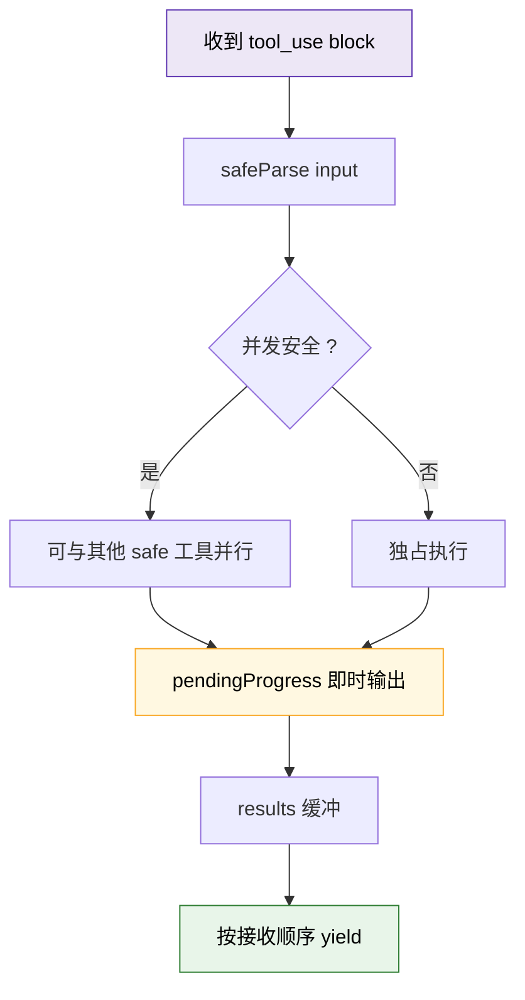

---
tags:
  - 流式响应
  - 第三编
---

# 第12章：流式响应：为什么回复一个字一个字蹦出来

!!! tip "生活类比"
    你口渴的时候，希望得到的是“马上拧开水龙头就能喝到第一口水”，而不是“等水桶装满 30 秒再一起倒给你”。**流式响应就是 AI 世界的水龙头。**

!!! question "这一章要回答的问题"
    **如果等 AI 全部生成完再显示，会发生什么？Claude Code 又是怎么把“模型内部正在生成的半成品”安全地变成终端上的实时输出的？**

    这一章最关键的一点是：流式响应不是“界面好看一点”的小优化，而是 Claude Code 整个体验和工具编排速度的核心基础设施。

---

## 12.1 SSE 事件在 `claude.ts` 里被拆成了可持续生长的内容块

真正处理流式事件的关键逻辑在 `services/api/claude.ts`。

它收到的不是“一整条最终消息”，而是一连串事件：

- `message_start`
- `content_block_start`
- `content_block_delta`
- `content_block_stop`
- `message_delta`
- `message_stop`

### `message_start` 先定框架

`message_start` 到来时，代码会：

- 记录 `partialMessage`
- 计算 TTFT（首字节时间）
- 累加初始 usage

这就像直播开始前，先把摄像机、时间戳、计数器都架好。

### `content_block_start` 按块开槽位

Claude Code 不会假设“接下来全是普通文本”。它会根据块类型分别开不同槽位：

- `tool_use`
- `server_tool_use`
- `text`
- `thinking`

而且初始化方式不同：

- `tool_use.input` 先设为空字符串
- `text.text` 先设为空
- `thinking.thinking` 和 `signature` 分开攒

这很像仓库管理员先把不同货架分好：生鲜、文具、易碎品不能全堆一块。

### `content_block_delta` 才是真正一点点长出来的部分

源码里分别处理了：

- `input_json_delta`
- `text_delta`
- `thinking_delta`
- `signature_delta`

也就是说，Claude Code 不只是“边收到边显示文字”，它还在流式拼：

- 工具输入 JSON
- thinking 内容
- thinking 签名

!!! info "源码证据"
    `OpenClaudeCode/src/services/api/claude.ts:1980-2169` 详细展示了各种流式事件和 block delta 的拼接逻辑。

---

## 12.2 一条 assistant message 其实是“分块结束时”才真正成形的

很多人以为模型每吐一个字，Claude Code 就立刻创建一条完整 assistant message。其实不是。

真正的 assistant message 出现在 `content_block_stop`：

- 取出当前 block
- `normalizeContentFromAPI(...)`
- 生成标准化后的 `AssistantMessage`
- `yield m`

也就是说，**Claude Code 不是按“字符”建消息，而是按“内容块”建消息。**

### 为什么这样做更稳

因为不同块的语义不同：

- 文本块可以直接显示
- thinking 块要特殊处理
- tool_use 块要等 JSON 足够完整

如果不按块，而是按字符生硬推给上层，整个系统会非常混乱。

### `message_delta` 还要回头补 usage 和 stop_reason

更微妙的是：assistant message 在 `content_block_stop` 就 yield 了，但最终：

- `usage`
- `stop_reason`

这两个关键信息却是在后面的 `message_delta` 里才到。

所以源码做了一件很“工程脑”的事：

- 直接**原地修改**最后那条已创建消息的字段
- 而不是重新创建一个新对象

原因注释写得特别清楚：transcript 写队列拿的是对象引用，如果这里替换对象，延迟落盘时会拿到旧对象。

这类细节特别适合学习：真正稳定的流式系统，很多时候胜负就在这些“对象什么时候生成、什么时候补全”的边界处理上。

!!! info "源码证据"
    `OpenClaudeCode/src/services/api/claude.ts:2171-2248` 展示了 `content_block_stop` 产出消息，以及 `message_delta` 回填 `usage / stop_reason` 的过程。

---

## 12.3 QueryEngine 一边吃事件，一边把它们变成用户看得懂的东西

流式事件不是直接“裸奔到终端”的。`QueryEngine` 会再接一层：

- 在 `message_start` 时重置当前消息 usage
- 在 `message_delta` 时累积 usage 并记录 stop_reason
- 在 `message_stop` 时把当前 usage 累加到总 usage
- 如果 `includePartialMessages` 开启，还能把原始 `stream_event` 再往外吐给 SDK

### 这说明了一个重要架构原则

`claude.ts` 关心的是“怎么从 API 流里拼出正确内容”。  
`QueryEngine` 关心的是“怎么把这些内容纳入整场会话的账本和 transcript”。

职责非常清楚：

- 下层负责还原真实流
- 上层负责管理会话语义

### 为什么 `stream_event` 也值得保留

因为对 SDK 场景来说，有时候调用者并不只想拿“最终文字”，而是想自己做：

- 实时进度 UI
- 调试面板
- streaming analytics
- 自定义转译层

如果底层不保留这些原始事件，上层扩展空间就会大大变小。

!!! info "源码证据"
    `OpenClaudeCode/src/QueryEngine.ts:788-826` 展示了 QueryEngine 如何吸收并转发 `stream_event`。

---

## 12.4 工具为什么也能“边流边准备”：`StreamingToolExecutor`

Claude Code 的流式体验之所以高级，不是因为它只会一边吐文字，而是因为工具调用也被接到了这条流式链上。

`StreamingToolExecutor` 的职责是：

- 工具块一出现就排队
- 能并发的工具并发执行
- 不能并发的工具独占执行
- 结果按收到顺序吐回
- 进度消息提前显示

### 并发不是乱跑，而是带约束的

`StreamingToolExecutor` 不会粗暴地把所有工具都扔进 `Promise.all`。

它先问：

- 输入能不能通过 schema
- 这个工具是不是 `isConcurrencySafe`
- 当前有没有别的非并发安全工具在执行

这很像高速公路收费站：

- 小轿车可以多车道并行
- 超宽货车要单独走

### 中断和 fallback 也有自己的“善后逻辑”

如果遇到：

- `user_interrupted`
- `streaming_fallback`
- `sibling_error`

`StreamingToolExecutor` 不会静默丢掉，而是会构造 synthetic error message 补齐 `tool_result`。

这意味着即使在流式过程中出事故，消息历史仍然是闭环的。

### 为什么 Bash 出错会中断兄弟工具

源码里有个非常真实的经验判断：

- 只有 Bash 工具出错时，才会主动取消兄弟工具
- 因为 Bash 命令常常有隐含依赖链

比如：

- `mkdir` 失败了
- 后面的 `cd`、`ls`、`npm test` 多半也没意义

但像 WebFetch、ReadFile 这类工具，彼此失败往往没有因果关系，就没必要全盘中止。

!!! info "源码证据"
    - `OpenClaudeCode/src/services/tools/StreamingToolExecutor.ts:34-151`：工具排队与并发规则
    - `OpenClaudeCode/src/services/tools/StreamingToolExecutor.ts:153-259`：中断原因与 synthetic error
    - `OpenClaudeCode/src/services/tools/StreamingToolExecutor.ts:261-347`：执行、进度输出和剩余结果消费

---

!!! abstract "🔭 深水区（架构师选读）"
    流式响应最容易被低估的地方，是大家往往只把它看成“更快显示首字”的 UI 优化。Claude Code 的源码告诉我们，真正的流式系统至少有三层：

    1. **协议层流式**：SSE 事件如何被拆分和累积  
    2. **语义层流式**：什么时候才能说“一条消息已经成立”  
    3. **工具层流式**：工具能不能在模型还没说完前就提前进入执行状态

    只有三层一起做好，用户才会觉得它“聪明、快、顺”。否则要么是假流式，要么只是闪烁着输出几个字，但系统本体仍然很迟钝。

---

!!! success "本章小结"
    **一句话**：Claude Code 的流式响应不是简单地“把文字一点点打印出来”，而是从 SSE 事件、消息块拼装、usage 回填，到工具并发和中断补偿，全链路都做成了可持续流动的系统。

!!! info "关键源码索引"
    | 证据层 | 文件 | 本章关注点 |
    |---|---|---|
    | 补全层 | `OpenClaudeCode/src/services/api/claude.ts:1980-2169` | `message_start / content_block_delta` 等流式事件处理 |
    | 补全层 | `OpenClaudeCode/src/services/api/claude.ts:2171-2248` | 在块结束时创建消息，并在 `message_delta` 回填 usage |
    | 补全层 | `OpenClaudeCode/src/services/api/claude.ts:2299-2303` | 向上层统一吐出 `stream_event` |
    | 补全层 | `OpenClaudeCode/src/QueryEngine.ts:788-826` | QueryEngine 对流式事件的会话级处理 |
    | 补全层 | `OpenClaudeCode/src/services/tools/StreamingToolExecutor.ts:34-151` | 工具的流式排队与并发 |
    | 补全层 | `OpenClaudeCode/src/services/tools/StreamingToolExecutor.ts:153-259` | 中断、fallback、兄弟工具取消策略 |

!!! warning "逆向提醒"
    - ✅ **可信度高**：SSE 事件形态、消息分块、tool stream 执行器都能在源码中直接看到
    - ⚠️ **要分清层次**：assistant message 的创建时机和 `usage / stop_reason` 的最终到达时机不是同一个瞬间
    - ❌ **不要误解**：流式不只是前端表现层；工具调度和 transcript 一致性也深度依赖流式设计
