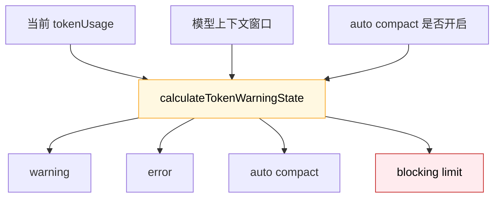
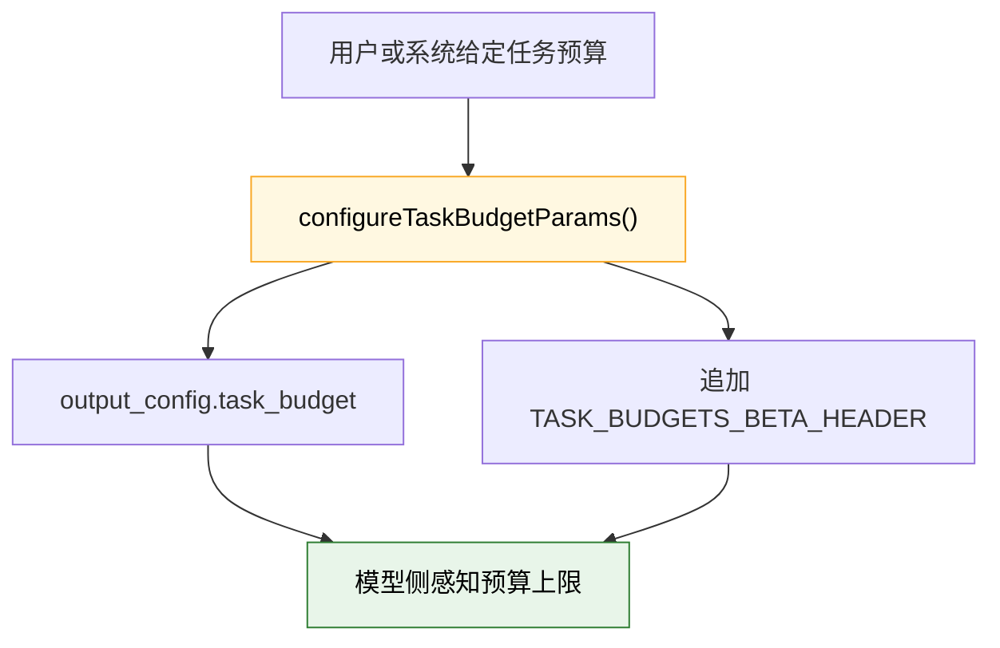
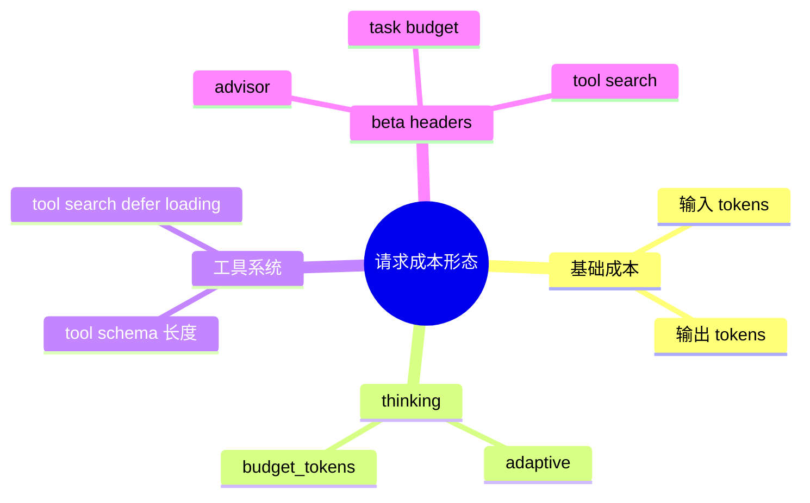

---
tags:
  - Token经济学
  - 第三编
---

# 第13章：Token经济学：每个字都有价格

!!! tip "生活类比"
    手机流量套餐很好理解：你不是“爱怎么用就怎么用”，而是在固定额度里分配给视频、聊天、下载、导航。**Claude Code 里的 token 也是预算，不只是技术指标，更是产品成本。**

!!! question "这一章要回答的问题"
    **Claude Code 怎么知道自己会不会“超套餐”？它又是怎么把静态规则、动态上下文、thinking、tool search 这些都装进有限预算里的？**

    如果不理解 token 经济学，你会把很多现象看成随机：为什么有时自动压缩？为什么 prompt 里要放边界标记？为什么任务预算要跨 compact 继续算？其实这些都和“钱”和“窗口”有关。

---

## 13.1 先算账：Claude Code 并不等到 API 报错才知道自己快满了

在 `services/compact/autoCompact.ts` 里，`calculateTokenWarningState(...)` 会根据：

- 当前 tokenUsage
- 模型上下文窗口
- 是否开启 auto compact

算出一组关键状态：

- `percentLeft`
- `isAboveWarningThreshold`
- `isAboveErrorThreshold`
- `isAboveAutoCompactThreshold`
- `isAtBlockingLimit`

这说明 Claude Code 的策略不是：

- “先猛跑”
- “撞墙以后再说”

而是：

- 提前估算
- 提前预警
- 真到危险线时再阻断

### 为什么 `blocking limit` 和 `auto compact threshold` 要分开

这两个阈值不是一回事：

- `auto compact threshold`：系统还想自己救一下
- `blocking limit`：再往前走就危险，必须停

换成生活类比：

- 油表见底灯亮了，不代表车马上趴窝
- 但真到完全没油，系统就该阻止你继续赌运气

### `query.ts` 会在打 API 前先做 blocking 检查

如果当前上下文已经到了 blocking limit，`query.ts` 会直接返回 `PROMPT_TOO_LONG_ERROR_MESSAGE`，而不是发一笔大概率失败的请求出去。

这不是“小优化”，而是**真钱优化**。

!!! info "源码证据"
    - `OpenClaudeCode/src/services/compact/autoCompact.ts:93-145`：warning / error / auto compact / blocking 四档判断
    - `OpenClaudeCode/src/query.ts:628-646`：真正打模型前的 blocking limit 预检

---

## 13.2 为什么 prompt caching 能省钱：因为 prompt 被分成了静态和动态两半

第 9 章讲过 `SYSTEM_PROMPT_DYNAMIC_BOUNDARY`，这里我们从“钱”的角度再看一次。

`constants/prompts.ts` 里专门定义了一个边界标记：

- 前面是静态、跨组织可缓存内容
- 后面是用户和会话相关动态内容

而在最终返回 system prompt 数组时，源码明确做了：

1. 静态 section  
2. 边界 marker  
3. 动态 section

### 这背后真正节省的是哪部分钱

多轮任务里最稳定的，往往不是用户消息，而是这些大块内容：

- 系统规则
- 工具说明
- 输出风格
- 安全要求

如果每一轮都把这些内容当成“全新输入”重新计算，会很浪费。  
所以 Claude Code 不只是“写 prompt”，而是**把 prompt 做成缓存友好结构**。

### 为啥注释反复强调“不要随便移动边界”

因为一旦边界位置改了，相关缓存逻辑和 API 端的分割也得跟着改。  
这就像数据库 schema 的分区键，不是你想换位置就换位置。

换句话说，这个字符串常量不是文案细节，而是**成本架构的一部分**。

!!! info "源码证据"
    - `OpenClaudeCode/src/constants/prompts.ts:105-115`：动静态边界常量定义
    - `OpenClaudeCode/src/constants/prompts.ts:560-576`：边界在最终 system prompt 里的插入位置

---

## 13.3 Task Budget：不只是“最多几轮”，而是“这次任务允许花多少 token”

很多人会把 `maxTurns` 和预算混为一谈，其实不是。

- `maxTurns` 管的是循环次数
- `taskBudget` 管的是 token 预算

在 `services/api/claude.ts` 里，Claude Code 会把任务预算编码成：

- `type: 'tokens'`
- `total`
- `remaining`

并在需要时把 `TASK_BUDGETS_BETA_HEADER` 加进请求。

### 更高级的一点：预算会跨 compact 继续扣

`query.ts` 里有一段特别漂亮的注释：

- 如果 compact 发生了
- 服务器只看得到压缩后的摘要
- 它就会低估之前已经花掉的上下文

所以 Claude Code 自己维护了一个 `taskBudgetRemaining`：

- compact 前，服务器自己能看全量历史，先不用额外处理
- compact 后，客户端会把“被摘要掉的那部分上下文成本”继续从 remaining 里扣掉

这就像公司报销系统：你把明细装订成摘要，不代表财务可以假装前面那几页没花钱。

### 为什么这很重要

如果没有这层补偿，compact 会带来一个错觉：

- 上下文变短了
- 看起来预算又富裕了

但实际上，那只是“账单被折叠了”，不是“钱回来了”。

!!! info "源码证据"
    - `OpenClaudeCode/src/services/api/claude.ts:473-500`：`task_budget` 的 API 参数编码
    - `OpenClaudeCode/src/query.ts:282-291`：`taskBudgetRemaining` 的设计目的
    - `OpenClaudeCode/src/query.ts:504-515`：compact 前上下文成本的扣减
    - `OpenClaudeCode/src/query.ts:699-705`：把 total / remaining 带回模型调用
    - `OpenClaudeCode/src/query.ts:1135-1145`：恢复路径下继续扣减 budget

---

## 13.4 成本不只是 token 数量，还受请求形态影响

到这里你可能会问：

> 既然都按 token 算，为什么还要讲 thinking、advisor、tool search、betas？

因为这些开关会改变**一次请求长什么样**，而请求形态又会影响 token 的花法。

### Thinking 会占输出预算

在 `claude.ts` 里，如果 thinking 开启，系统会根据模型能力决定：

- 支持 adaptive 的模型：走 `type: 'adaptive'`
- 不支持 adaptive 的模型：走 `budget_tokens`

而且 thinking budget 还会被限制在 `maxOutputTokens - 1` 之内。

这说明“thinking 不是白送的”，它是输出预算的一部分。

### Tool search 会带 beta header，还会动态筛工具

如果工具搜索开启，系统会：

- 判断哪些工具是 deferred
- 根据历史里有没有 `tool_reference` 决定是否把工具声明真正带上
- 再追加对应的 tool-search beta header

这既影响提示词长度，也影响请求元数据。

### Advisor 和其他 server-side tool 也会改变请求形态

当 advisor 启用时，会追加 advisor beta header，还可能选择一个专门的 advisor model。  
这意味着“同样一句用户输入”，实际请求体并不总是同一形状。

### 这就是“Token 经济学”比“Token 计数”更重要的原因

`Token 计数` 是问：

- 这次用了多少 token？

`Token 经济学` 是问：

- 这些 token 为什么会花在这里？
- 哪部分是结构性开销？
- 哪部分可以缓存？
- 哪部分是为了质量提升而主动付出的成本？

Claude Code 的源码显然站在第二种视角上。

!!! info "源码证据"
    - `OpenClaudeCode/src/services/api/claude.ts:1064-1181`：betas、advisor、tool search 的请求形态调整
    - `OpenClaudeCode/src/services/api/claude.ts:1591-1628`：thinking 的 adaptive / budget 选择

---

!!! abstract "🔭 深水区（架构师选读）"
    第 13 章最值得带走的，不是“token 很贵”这句废话，而是 Claude Code 对成本的态度：

    - 它在客户端提前估算  
    - 在 prompt 层做缓存友好切分  
    - 在循环层做 blocking / compact / budget 护栏  
    - 在 API 层显式编码 task budget 和 betas  
    - 在请求形态层承认 thinking、advisor、tool search 都会改变成本结构

    这说明它把成本当成架构问题，而不是财务报表上的事后统计。

---

!!! success "本章小结"
    **一句话**：Claude Code 的 Token 经济学不是“事后看看花了多少”，而是从 warning 阈值、prompt caching、task budget、thinking 配置到 beta header，整条链路都在主动管理成本和上下文窗口。

!!! info "关键源码索引"
    | 证据层 | 文件 | 本章关注点 |
    |---|---|---|
    | 补全层 | `OpenClaudeCode/src/services/compact/autoCompact.ts:93-145` | token warning / error / blocking 计算 |
    | 补全层 | `OpenClaudeCode/src/query.ts:628-646` | 正式请求前的 blocking limit 检查 |
    | 补全层 | `OpenClaudeCode/src/constants/prompts.ts:105-115` | prompt 动静态边界 |
    | 补全层 | `OpenClaudeCode/src/constants/prompts.ts:560-576` | 静态前缀与动态尾部拼接 |
    | 补全层 | `OpenClaudeCode/src/services/api/claude.ts:473-500` | `task_budget` API 参数 |
    | 补全层 | `OpenClaudeCode/src/query.ts:282-291` | compact 后继续追踪 remaining budget |
    | 补全层 | `OpenClaudeCode/src/query.ts:504-515` | compact 时预算扣减 |
    | 补全层 | `OpenClaudeCode/src/services/api/claude.ts:1064-1181` | advisor / tool search / beta headers |
    | 补全层 | `OpenClaudeCode/src/services/api/claude.ts:1591-1628` | thinking 的预算选择 |

!!! warning "逆向提醒"
    - ✅ **可信度高**：blocking、task budget、dynamic boundary、thinking 配置都能直接在源码里定位
    - ⚠️ **要避免简化**：`maxTurns` 不是 token budget，compact 也不等于“成本归零”
    - ❌ **不要误读**：prompt caching 节省的不是“所有输入”，而是边界前那一大段稳定前缀
