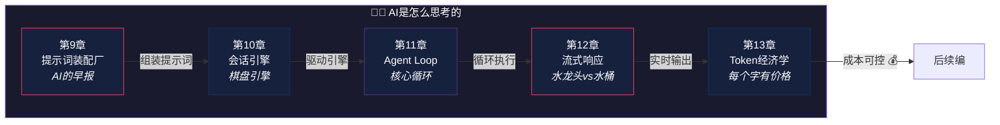

# 第三编：AI是怎么思考的

> *厨师做菜的循环：看菜单、备食材、烹饪、尝味道、调整、上菜。AI 的工作循环也是如此。*
>
> 本编深入 Claude Code 的"大脑"：**提示词组装**、**会话引擎**、**Agent Loop**、**流式响应**、**Token 经济学**。

---

## 本编总览

---

## 本编五章速览

| 章 | 标题 | 核心问题 | 生活类比 |
|---|------|----------|----------|
| 9 | [提示词装配厂](chapter09.md) | 在你说第一个字之前，AI 已经收到了多少"背景知识"？ | 新员工的培训手册 |
| 10 | [会话引擎](chapter10.md) | 直接调 API 不行吗？为什么还要抽出"引擎"？ | 下棋的棋盘引擎 |
| 11 | [Agent Loop](chapter11.md) | 一个 `while(true)` 怎么支撑整个 AI 助手？ | 厨师做菜的循环 |
| 12 | [流式响应](chapter12.md) | 回复为什么一个字一个字蹦出来？ | 水龙头 vs 水桶 |
| 13 | [Token经济学](chapter13.md) | 怎么在有限"流量"里完成更多任务？ | 手机流量套餐 |

---

## 设计思想主线

!!! tip "本编建立的认知基础"
    1. System prompt 在用户说第一句话之前就已组装完成——**几千 token 的"早报"决定 AI 行为质量**
    2. QueryEngine 封装了多轮对话、工具分发、中断恢复等复杂性——**上层只需"发问题、收答案"**
    3. Agent Loop 的核心是一个 `while(true)`——**简单但不容易**
    4. 流式响应把用户感知延迟从 30 秒压到 2 秒——**体验工程的典范**
    5. Token 是真金白银——**prompt caching 可省 70-90% 成本**

---

## 推荐路径

=== "🌱 初学者"

    第11章的 Agent Loop 是最核心的概念——**理解"想→做→看→再来"的循环就理解了 AI Agent 的本质**。

=== "🔧 开发者"

    第9章和第10章揭示了生产级 AI 应用的工程细节。**prompt 组装和会话管理是自建 AI 应用的必修课**。

=== "🏗️ 架构师"

    第13章的 Token 经济学直接影响产品的商业可行性。**成本控制是 AI 产品从 demo 到产品的关键一步**。

!!! success "阅读建议"
    如果你第一次读 Claude Code 源码，建议按 **第9章 → 第10章 → 第11章 → 第12章 → 第13章** 的顺序通读。这样会先建立“提示词底座”，再理解“会话引擎”，最后再把 Agent Loop、流式响应和 Token 成本串成一条完整主线。
