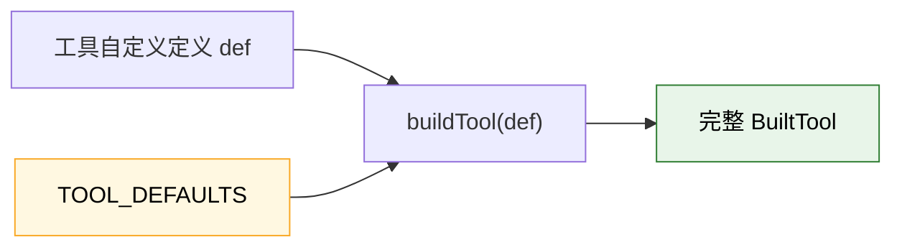
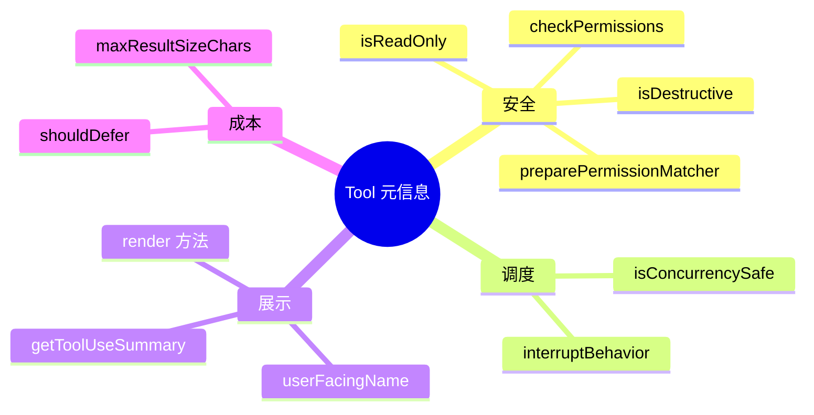
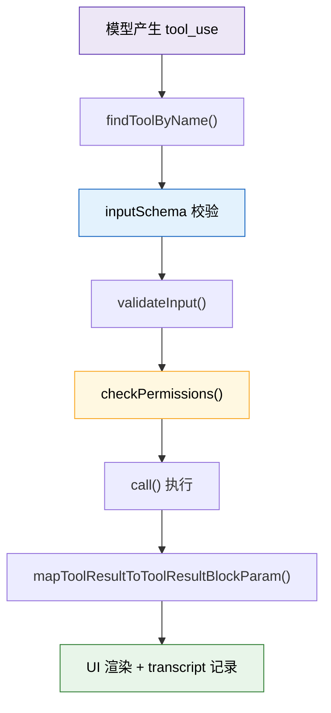

---
tags:
  - 工具接口
  - 第四编
---

# 第14章：工具的统一语言：54个工具的共同规则

!!! tip "生活类比"
    家里有冰箱、电视、台灯、手机充电器，但墙上的插座并不会为每件电器单独定制。它们能共存，是因为背后有一套统一标准。**Claude Code 的 `Tool` 接口，就是 54 个工具共用的“插座标准”。**

!!! question "这一章要回答的问题"
    **文件读取、Shell 执行、网页搜索、子智能体派遣，这些看起来完全不同的能力，为什么都能放进同一条执行管线里？**

    如果每种工具都有自己的参数格式、权限逻辑和展示方式，Claude Code 会很快失控。源码真正高明的地方在于：它先定义了一门统一语言，再让每个工具用这门语言“填空”。

---

## 14.1 `Tool` 不是一个函数，而是一整份能力合同

`Tool.ts` 里的 `Tool<Input, Output, P>` 泛型类型，很像一份标准合同。它要求每个工具都说清楚：

- 我叫什么
- 我接受什么输入
- 我怎么执行
- 我怎么检查权限
- 我是不是只读
- 我能不能并发
- 用户打断我时怎么办
- 我的结果该怎么映射成 tool_result

```mermaid
flowchart TD
    A["Tool<Input, Output, Progress>"] --> B["name / aliases"]
    A --> C["inputSchema / outputSchema"]
    A --> D["call()"]
    A --> E["validateInput() / checkPermissions()"]
    A --> F["isReadOnly() / isConcurrencySafe()"]
    A --> G["render / mapToolResult"]

    style A fill:#e8eaf6,stroke:#3949ab,color:#000
    style C fill:#e3f2fd,stroke:#1565c0,color:#000
    style G fill:#e8f5e9,stroke:#2e7d32,color:#000
```

### 为什么这里要用泛型

因为每个工具都长得不一样：

- Bash 的输入是 `command`
- FileRead 的输入是 `file_path + offset + limit`
- WebSearch 的输入是 `query + domains`

但统一接口让系统仍然能在编译期知道：

- 这个工具的输入长什么样
- 这个工具的输出长什么样
- 它的 progress 数据长什么样

对初学者来说，这相当于：

- “所有工具都要交作业”
- 但每门课交的作业内容不同
- 老师依然可以用一套总规则管理全班

### 一个特别值得注意的字段：`searchHint`

`Tool` 不只定义运行行为，还定义“怎么被模型找到”。`searchHint` 的注释写得很清楚：这是给 ToolSearch 用的能力短语。

也就是说，Claude Code 的工具系统已经不是“把工具挂上去”那么简单，而是连“模型如何发现工具”都纳入了统一类型。

!!! info "源码证据"
    `OpenClaudeCode/src/Tool.ts:362-520` 定义了 `Tool` 的核心合同字段。

---

## 14.2 `buildTool()` 的意义：不是少写代码，而是统一默认行为

如果只靠接口约束，每个工具还是得自己实现一堆重复样板。  
Claude Code 的做法更进一步：用 `buildTool()` 和 `TOOL_DEFAULTS` 把默认行为集中起来。

默认值里最关键的几条：

- `isEnabled: () => true`
- `isConcurrencySafe: () => false`
- `isReadOnly: () => false`
- `isDestructive: () => false`
- `checkPermissions: allow`
- `userFacingName: () => def.name`

### 这套默认值背后的设计哲学很实用

它不是“给工具开绿灯”，而是：

- 默认假设**不并发安全**
- 默认假设**不是只读**
- 默认假设**不是破坏性操作**
- 默认把权限交给总权限系统处理

也就是说，Claude Code 对工具采取的是一种“保守默认”。

### `buildTool()` 解决的是一致性问题

新增一个工具时，开发者只要提供差异部分：

- 名字
- schema
- call
- 特殊权限逻辑

剩下那些通用行为自动继承。  
这让 54 个工具的“长相”非常统一。

### `toolMatchesName()` 和 `findToolByName()` 是整个工具生态的路标

别小看这两个小函数。它们决定了：

- 工具怎么被查找到
- alias 如何兼容重命名
- StreamingToolExecutor、ToolSearch、MCP 适配层都怎么定位具体工具

很多系统最后会因为“名字匹配规则混乱”而产生幽灵 bug。Claude Code 这里做得很克制。

!!! info "源码证据"
    - `OpenClaudeCode/src/Tool.ts:348-359`：工具查找与别名匹配
    - `OpenClaudeCode/src/Tool.ts:757-792`：`TOOL_DEFAULTS` 与 `buildTool()`

---

## 14.3 统一接口最厉害的地方，是把“风险特征”也标准化了

很多人第一次看工具接口，只关注 `call()`。其实更值钱的是这些“风险描述字段”：

- `isReadOnly`
- `isConcurrencySafe`
- `interruptBehavior`
- `preparePermissionMatcher`
- `maxResultSizeChars`
- `isSearchOrReadCommand`

### 为什么这很重要

因为 Claude Code 不是“调用一个函数”就结束了。  
它还要知道：

- 这个工具能不能和别的工具并发
- 用户输入新消息时要不要取消它
- 这个结果要不要持久化到磁盘
- 这个调用是不是应该在 UI 里折叠显示成“读/搜”操作

换句话说，工具不仅是功能单元，还是**调度单元、权限单元、显示单元、成本单元**。

### `maxResultSizeChars` 是一个特别容易被忽略的系统设计点

这个字段说明工具结果不是想返回多少就返回多少。  
如果结果太大，系统会考虑把内容持久化到磁盘，再给模型一个预览或路径。

这和第 13 章的 token 经济学直接连起来了：

- 工具系统不是“只负责产出”
- 它还要为上下文窗口负责

!!! info "设计思想"
    **Claude Code 把工具当成“可被编排的资源”，而不是“随手调的函数”。**

---

## 14.4 一次工具调用，到底会经历哪些步骤

统一接口最直观的价值，是所有工具都能走同一条主流水线：

### 这条流水线带来的三个好处

1. **新增工具更容易**  
   只要遵守合同，自动接上既有系统。

2. **调试路径统一**  
   出问题时知道该看 schema、权限、执行还是结果映射。

3. **系统功能可以横向扩展**  
   比如流式执行、权限规则、ToolSearch、MCP 注入，都能复用同一条总线。

### 所以第 14 章真正讲的不是“54 个工具”

而是 Claude Code 先发明了一种“工具语言”，然后所有工具都用这门语言说话。  
只要语言没坏，工具数量再多，系统也不会立刻崩。

---

!!! abstract "🔭 深水区（架构师选读）"
    很多团队做工具系统时，第一反应是“先做几把工具出来再说”。Claude Code 的做法恰恰相反：**先把抽象做稳，再把工具往里放**。

    这让工具系统从一开始就具备了四种扩展能力：

    - 类型扩展：泛型和 schema 让新工具长得一致  
    - 执行扩展：统一执行流水线  
    - 权限扩展：权限系统不必为每个工具单独重写  
    - 平台扩展：MCP、Skill、Agent 都能接入同一套合同

    第 14 章是整本书很关键的一章，因为后面所有工具章节，本质上都在解释这份合同的不同填写方式。

---

!!! success "本章小结"
    **一句话**：Claude Code 不是先堆出 54 个工具，再想办法管理它们；它是先定义了一套 `Tool` 合同和 `buildTool()` 默认行为，再让所有工具用同一门语言接入系统。**

!!! info "关键源码索引"
    | 证据层 | 文件 | 本章关注点 |
    |---|---|---|
    | 补全层 | `OpenClaudeCode/src/Tool.ts:348-359` | 工具查找与 alias 匹配 |
    | 补全层 | `OpenClaudeCode/src/Tool.ts:362-520` | `Tool<Input, Output, Progress>` 主合同 |
    | 补全层 | `OpenClaudeCode/src/Tool.ts:757-792` | `TOOL_DEFAULTS` 与 `buildTool()` |

!!! warning "逆向提醒"
    - ✅ **可信度高**：接口字段、默认行为、buildTool 组装过程都在源码里有直接定义
    - ⚠️ **要看整体**：`Tool` 不只是 `call()`，更重要的是围绕它的并发、权限、展示、持久化元信息
    - ❌ **不要误解**：默认 `checkPermissions=allow` 不等于所有工具天然安全，很多工具会显式覆写这条默认值
