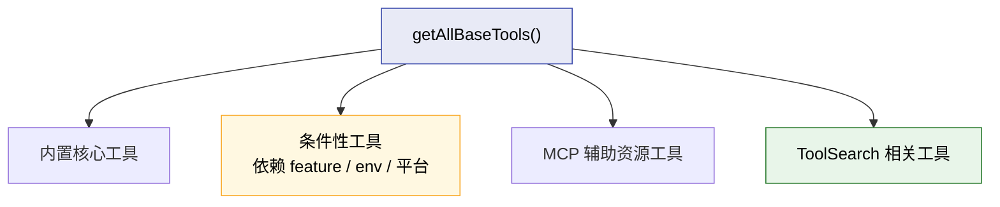
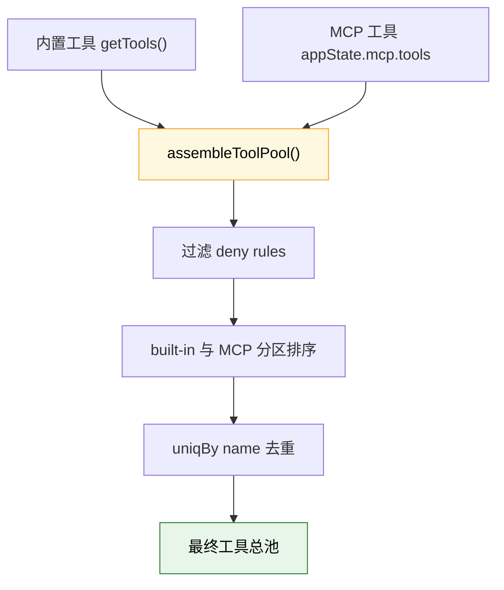
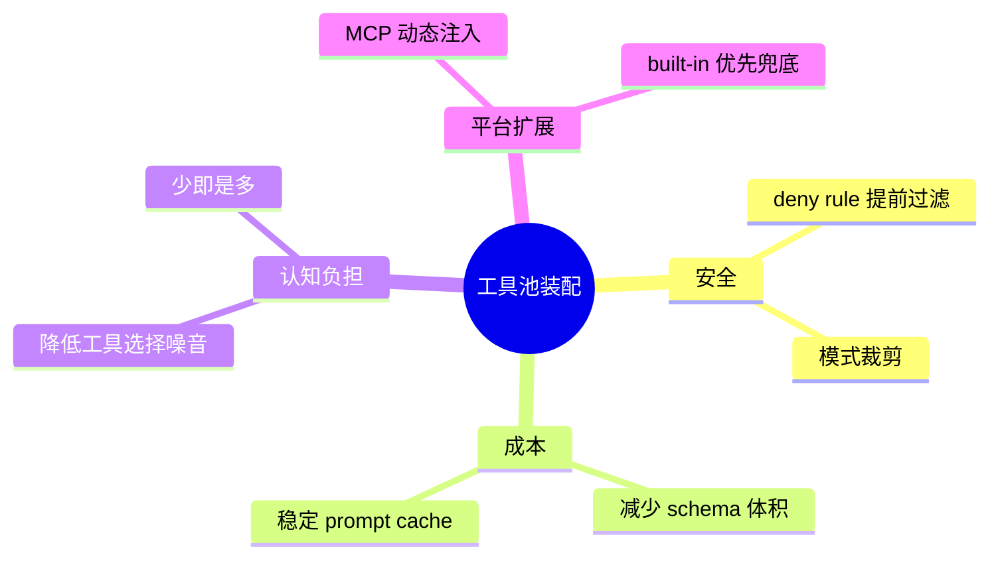

---
tags:
  - 工具池装配
  - 第四编
---

# 第15章：工具池装配：不是所有工具都随时可用

!!! tip "生活类比"
    水管工上门修水龙头，不会背着整家五金店来。他会先看任务，再决定带扳手、胶带还是测压表。**Claude Code 也一样：不是所有工具都应该一直摊在模型面前。**

!!! question "这一章要回答的问题"
    **如果 54 个工具全开，会发生什么？Claude Code 又是怎么决定“这次会话里，模型手边到底有哪些工具”的？**

    这一章最重要的认知转变是：`tools.ts` 不是一个“工具清单文件”，而是一个**工具装配车间**。

---

## 15.1 第一层：先定义“当前环境下可能存在的全部基础工具”

`getAllBaseTools()` 是工具系统的第一道大门。  
它定义的不是“这轮一定能用哪些工具”，而是：

> 在当前环境、当前构建、当前 feature gate 条件下，**理论上可用的基础工具全集**。

在这份列表里，你能看到很典型的分层：

- 永远重要的：`AgentTool`、`BashTool`、`FileReadTool`、`FileEditTool`、`FileWriteTool`
- 条件出现的：`GlobTool`、`GrepTool`、`LSPTool`、`REPLTool`
- 依赖环境变量或 feature 的：worktree、workflow、monitor、cron、powershell
- 与 MCP 资源相关的辅助工具：`ListMcpResourcesTool`、`ReadMcpResourceTool`

### 为什么源码特别强调“这必须和缓存策略保持同步”

`tools.ts` 的注释明确写了：

> 这个列表必须和 system caching 配置保持同步。

原因很简单：工具清单本身会进入 prompt。  
如果基础工具的排序和内容一直乱变，prompt cache 就很难稳定命中。

这再次说明，工具装配不是单纯的功能问题，也是**上下文成本问题**。

!!! info "源码证据"
    `OpenClaudeCode/src/tools.ts:193-250` 定义了当前环境下的基础工具全集。

---

## 15.2 第二层：按模式和权限先把工具池裁一遍

真正给模型用之前，还要再过几道筛子。  
`getTools(permissionContext)` 负责做这件事。

它至少做了三层过滤：

1. **模式过滤**  
   比如 `CLAUDE_CODE_SIMPLE` 只保留少量原始工具。

2. **deny rule 过滤**  
   如果权限上下文里有 blanket deny，工具在模型看见之前就被拿掉。

3. **REPL 特殊处理**  
   如果启用了 REPL，会隐藏某些 primitive tools，避免直接暴露。

### `SIMPLE` 模式很有代表性

源码里写得很直白：简单模式下，只保留：

- `BashTool`
- `FileReadTool`
- `FileEditTool`

这说明“工具池装配”不是装饰行为，而是会直接改变 Claude Code 的能力边界。

### 为什么 deny rule 要在“模型看到之前”就生效

因为和其事后拦截，不如事前不暴露。  
如果一个工具本来就肯定不能用，还把 schema 塞进 prompt，只会带来两种坏处：

- 浪费 token
- 让模型做无意义尝试

这和前端里“禁用按钮”比“点了再弹错”更好，是同一个道理。

### REPL 模式为什么还要隐藏 primitive tools

注释点得很清楚：当 REPL 开启时，某些原始工具依然能在 VM 内部用，但不应该直接暴露给模型。  
这是典型的“内部实现能力”和“外部公开接口”分离。

!!! info "源码证据"
    `OpenClaudeCode/src/tools.ts:271-327` 展示了模式、deny rule、REPL 和 `isEnabled()` 的多层过滤。

---

## 15.3 第三层：把内置工具和 MCP 工具拼成一个稳定的总池

有了“当前允许的内置工具”以后，还不够。Claude Code 还要把运行时连进来的 MCP 工具一起拼上去。

真正负责这件事的是 `assembleToolPool()`：

1. 先拿到 built-in tools  
2. 再过滤 MCP tools 的 deny rules  
3. 最后按名称排序并去重  

### 这里最值钱的细节：为什么要“分区排序”

源码注释写得非常到位：

- built-in tools 作为连续前缀
- MCP tools 排在后面
- 这样做是为了 **prompt-cache stability**

如果用“全量平铺排序”，只要某个 MCP 工具名字刚好插进内置工具中间，后面的序列化顺序就全变了，缓存键也跟着大面积失效。

这说明 `assembleToolPool()` 看起来只是数组操作，实际上是在做：

- 平台扩展
- 名称冲突处理
- prompt 稳定性维护

### 为什么 built-in 工具在同名冲突时优先

`uniqBy` 保留插入顺序，而 built-in 工具先排在前面。  
这意味着如果出现同名冲突：

- 内置工具赢
- MCP 工具被去掉

这是一种很保守、很合理的默认策略，因为内置工具的行为更可控、更被系统理解。

!!! info "源码证据"
    `OpenClaudeCode/src/tools.ts:329-389` 展示了内置工具与 MCP 工具的合并、排序和去重策略。

---

## 15.4 所以“工具池装配”到底在解决什么问题

到这里，我们可以把第 15 章真正讲的东西总结成四个关键词：

### 为什么“少即是多”在工具系统里尤其成立

工具不是越多越好。  
对模型来说，每多一个工具，就多一份：

- schema 负担
- 选择负担
- 误用风险

所以优秀的工具系统，不是“把所有能力都摊平”，而是“按场景给出最合适的一把工具箱”。

### 这也是为什么 Claude Code 能从 CLI 长成平台

如果工具池不能动态装配：

- MCP 很难接进来
- 子智能体拿不到自己的独立工具集
- 简化模式和 REPL 模式也会互相干扰

所以第 15 章其实是在解释 Claude Code 的一个底层平台能力：  
**它可以根据上下文，重组自己的“手”。**

---

!!! abstract "🔭 深水区（架构师选读）"
    工具池装配的本质，是把三类看似无关的问题压到同一个函数里解决：

    - 哪些工具应该被看见  
    - 这些工具怎么排顺序  
    - 这个顺序会不会打坏缓存

    这很像数据库里的查询规划器，不只是“把东西列出来”，而是把“安全、性能、扩展、稳定性”同时纳入考虑。Claude Code 在 `tools.ts` 里表现出的成熟度，远远超过一般 demo 级 AI 工具项目。

---

!!! success "本章小结"
    **一句话**：`tools.ts` 不是一份静态清单，而是一条装配流水线：先确定当前环境下可能存在的基础工具，再按模式和权限裁剪，最后和 MCP 工具合并成一份对缓存友好、对模型友好的最终工具池。**

!!! info "关键源码索引"
    | 证据层 | 文件 | 本章关注点 |
    |---|---|---|
    | 补全层 | `OpenClaudeCode/src/tools.ts:193-250` | 基础工具全集 |
    | 补全层 | `OpenClaudeCode/src/tools.ts:271-327` | 模式过滤、deny rules、REPL 特殊处理 |
    | 补全层 | `OpenClaudeCode/src/tools.ts:329-389` | `assembleToolPool()` 合并 built-in 与 MCP 工具 |

!!! warning "逆向提醒"
    - ✅ **可信度高**：基础工具列表、simple 模式、deny rule 过滤和 MCP 合并策略都能直接定位
    - ⚠️ **要注意动态性**：最终工具池不是常量，会随模式、权限、MCP 连接状态变化
    - ❌ **不要误读**：`getAllBaseTools()` 不等于“本轮模型一定可见的工具”；真正给模型看的还要经过后续多轮过滤
