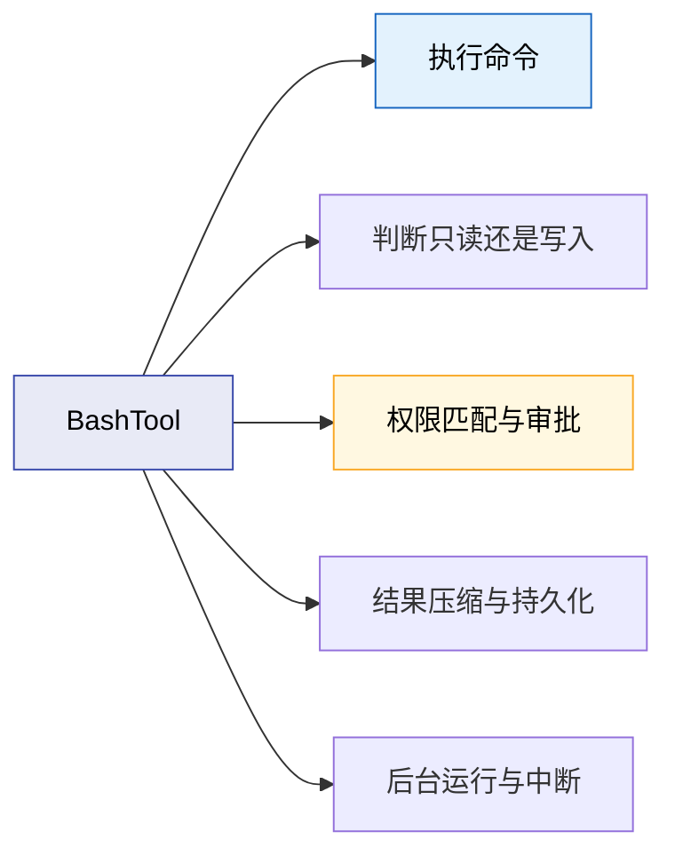
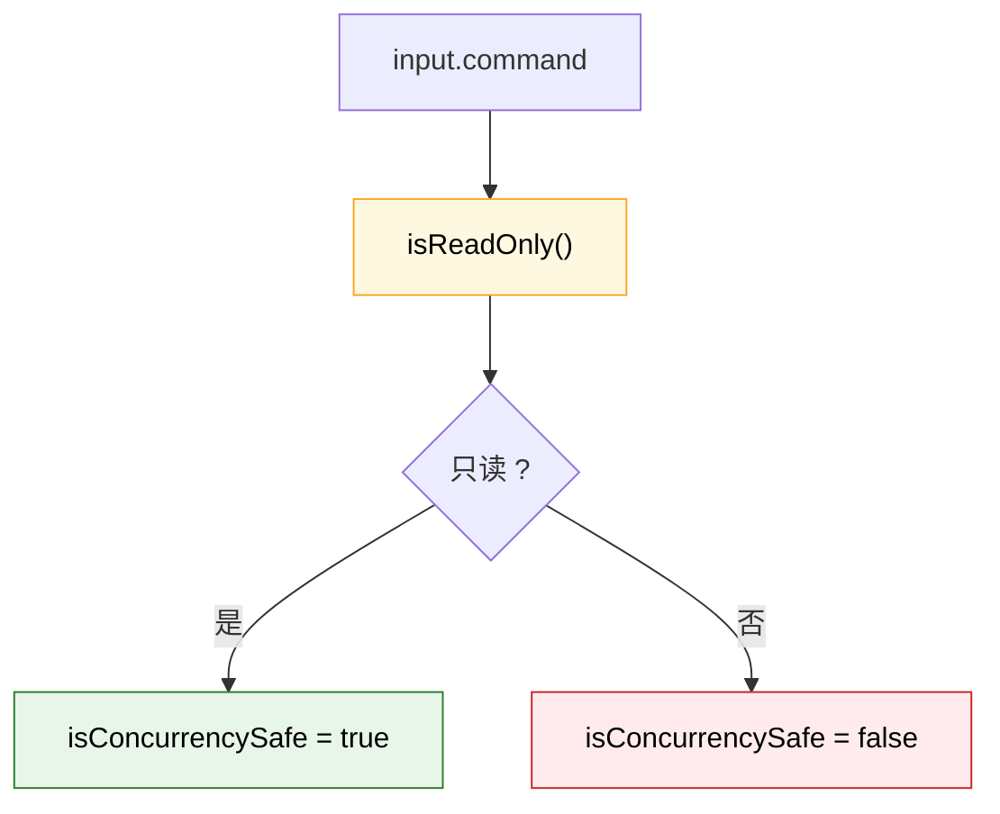
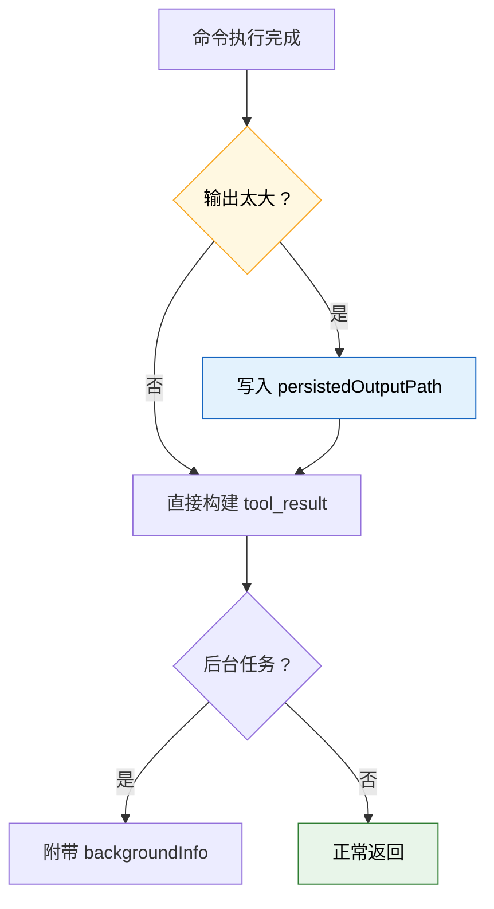

---
tags:
  - Bash工具
  - 第四编
---

# 第16章：Bash工具：最强大也最危险的能力

!!! tip "生活类比"
    给 AI 一把万能钥匙，效率会暴涨；但万能钥匙的问题也很明显：它开的不只是该开的门。**BashTool 就是 Claude Code 手里那把最强的钥匙。**

!!! question "这一章要回答的问题"
    **Claude Code 为什么还要保留一个能跑 Shell 的 BashTool？既然它这么危险，为什么不干脆全用专用工具替代？**

    答案很现实：专用工具再多，也覆盖不了真实开发环境的全部需求。BashTool 是“最后的通用能力”，但也因此必须被包上最多的约束。

---

## 16.1 BashTool 表面上是一个普通 Tool，实际上是“能力兜底”

在 `BashTool.tsx` 里，它照样通过 `buildTool()` 注册：

- `name = Bash`
- `searchHint = execute shell commands`
- `strict = true`
- `maxResultSizeChars = 30_000`

这说明一个很重要的事实：

> Bash 不是系统外的“特权旁路”，而是工具体系内的正式成员。

也正因为它是正式成员，Claude Code 才能把：

- 权限系统
- 并发系统
- transcript 系统
- 结果持久化系统

全部套在它身上。

### 为什么专用工具越多，Bash 仍然不会消失

因为真实开发任务总会出现这些情况：

- 需要调用项目自己的脚本
- 需要运行测试、构建、安装依赖
- 需要使用仓库里独有的命令组合

这类事情很难靠若干固定专用工具完全覆盖。  
所以 BashTool 的价值不是“优雅”，而是“兜底”。

!!! info "源码证据"
    `OpenClaudeCode/src/tools/BashTool/BashTool.tsx:420-443` 展示了 BashTool 作为正式 Tool 的注册形态。

---

## 16.2 Claude Code 不会把所有 Bash 命令都当成一样危险

BashTool 最有意思的一点，是它并不是“命令一律高危”。  
源码里显式区分了只读和非只读，并把并发安全绑定到这个判断上。

### 这背后的逻辑非常符合直觉

- 只读命令  
  比如 `ls`、`cat`、`git status`，通常可以更大胆地并发。

- 会改状态的命令  
  比如安装依赖、改文件、跑有副作用的脚本，就应该更保守。

源码里 `isConcurrencySafe(input)` 直接写成：

> 取决于 `isReadOnly(input)`

这说明 Claude Code 并不是通过“工具名字”判断安全，而是通过**输入语义**判断。

### `userFacingName()` 还有一个很妙的细节

如果命令里是一个就地修改文件的 `sed`，BashTool 会把这个调用在 UI 里渲染得更像一次文件编辑，而不是冷冰冰的 Shell 命令。

这说明 BashTool 并不想把自己永远呈现成“黑箱命令”，而是在尽量把用户体验对齐到更可理解的动作语义。

!!! info "源码证据"
    `OpenClaudeCode/src/tools/BashTool/BashTool.tsx:434-503` 展示了只读判断、并发安全判断和 user-facing name 逻辑。

---

## 16.3 真正危险的不是“执行命令”四个字，而是命令结构本身

Claude Code 没有靠简单字符串匹配来做 Bash 安全。  
`preparePermissionMatcher()` 里会先调用 `parseForSecurity(command)`，把命令拆成结构，再做匹配。

### 为什么要做到这一步

因为类似这样的命令：

- `ls && git push`
- `FOO=bar git push`

不能靠简单的“字符串里有没有 git”来判断。  
源码注释说得很清楚：如果不拆子命令，像 `Bash(git *)` 这种权限规则就可能被复合命令绕过去。

### 这就是“从模式匹配到语义匹配”的升级

这类设计非常像安全工程里的成熟路线：

- 低级做法：搜关键词
- 高级做法：分析结构

Claude Code 在 BashTool 上明显已经走到了第二层。

### `validateInput()` 还会拦截某些“表面合法、实际很糟”的命令

比如源码里会检测一些阻塞式 `sleep` 模式，并建议：

- 真要长期跑，请后台运行
- 持续监控流式事件时，请用 Monitor tool

这说明 BashTool 不只是怕“危险命令”，它也在防“糟糕的使用方式”。

!!! info "源码证据"
    `OpenClaudeCode/src/tools/BashTool/BashTool.tsx:445-467` 展示了结构化 permission matcher；`OpenClaudeCode/src/tools/BashTool/BashTool.tsx:524-540` 展示了输入验证与权限委托。

---

## 16.4 BashTool 的结果不是“随便打一坨 stdout”就完事

BashTool 还有三件特别工程化的事情：

1. **大输出会被持久化到磁盘**
2. **长任务可以转后台**
3. **中断信息会被显式补进 tool_result**

### 为什么大输出要落盘

因为像测试日志、构建产物、长 diff 这种内容：

- UI 未必适合全展示
- 模型也未必适合全吞下去

所以 Claude Code 会生成预览，再把完整结果放进持久化路径。这和第 13 章讲的 token 预算是一体两面。

### 为什么后台信息也要写进结果

因为“已经转后台”本身就是用户需要知道的系统事实。  
源码里会根据不同情况拼出不同的 backgroundInfo：

- 自动后台化
- 用户手动后台化
- 普通后台任务

这意味着 BashTool 的返回值不只是“命令输出”，还包含**任务状态语义**。

### 中断不会变成沉默失败

如果命令被中止，tool result 里会明确补上：

`Command was aborted before completion`

这对排查非常重要。最糟糕的系统不是报错，而是“突然没声了”。

---

!!! abstract "🔭 深水区（架构师选读）"
    BashTool 是 Claude Code 工具系统的压力测试器。只要 BashTool 能被放进统一接口并且还能保持：

    - 权限可控
    - 并发可控
    - 输出可控
    - 中断可控
    - UI 语义可控

    那说明整套 Tool 架构是真的有韧性。

    从源码看，Claude Code 对 Bash 的态度不是“能不用就别用”，而是“必须保留，但要把它关在最多护栏里”。这是非常成熟的工程选择。

---

!!! success "本章小结"
    **一句话**：BashTool 是 Claude Code 最强大的通用兜底能力，但它并不是系统外的特权后门，而是被纳入统一工具合同、权限分析、输出持久化和后台任务体系中的“高风险正式成员”。**

!!! info "关键源码索引"
    | 证据层 | 文件 | 本章关注点 |
    |---|---|---|
    | 补全层 | `OpenClaudeCode/src/tools/BashTool/BashTool.tsx:420-443` | BashTool 的基础注册与行为定位 |
    | 补全层 | `OpenClaudeCode/src/tools/BashTool/BashTool.tsx:434-503` | 只读判断、并发安全、UI 命名 |
    | 补全层 | `OpenClaudeCode/src/tools/BashTool/BashTool.tsx:445-467` | 结构化权限匹配 |
    | 补全层 | `OpenClaudeCode/src/tools/BashTool/BashTool.tsx:524-540` | 输入验证与权限委托 |
    | 补全层 | `OpenClaudeCode/src/tools/BashTool/BashTool.tsx:555-620` | 结果映射、持久化输出与后台信息 |

!!! warning "逆向提醒"
    - ✅ **可信度高**：只读判断、并发策略、permission matcher、后台输出信息都在源码里直接可见
    - ⚠️ **要分清楚**：BashTool 危险，不等于每条 Bash 命令都同样危险；源码明确区分了只读与写入语义
    - ❌ **不要误解**：专用工具越多，不代表 BashTool 会消失；它承担的是“能力兜底”，不是“首选路径”
