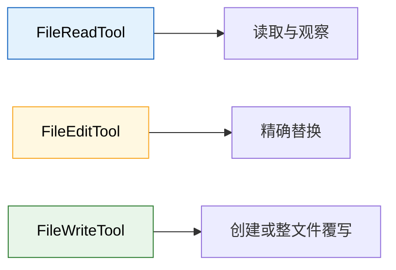
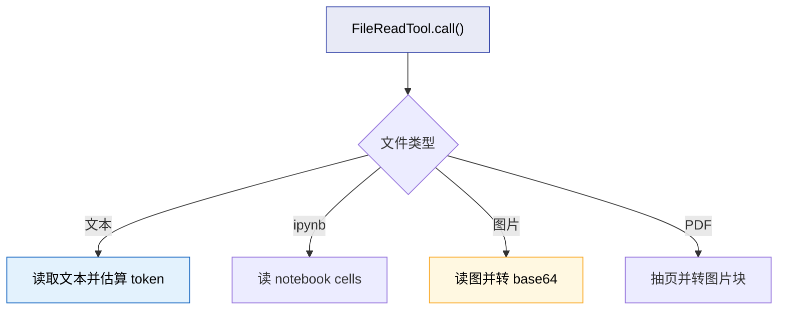
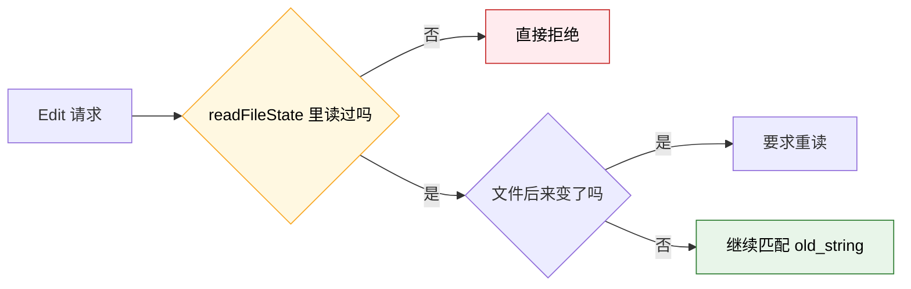
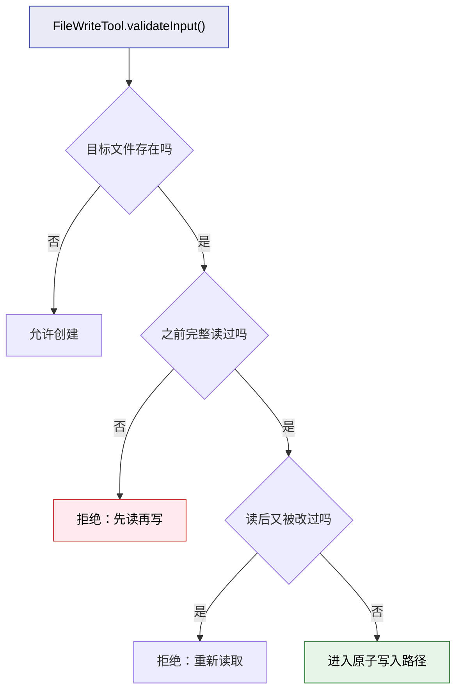

---
tags:
  - 文件工具
  - 第四编
---

# 第17章：文件工具：读、写、改的学问

!!! tip "生活类比"
    图书馆里至少有三个不同的柜台：借书、修书、归档新书。虽然都和“书”有关，但流程完全不同。**Claude Code 的文件工具也是这样：Read、Edit、Write 明明都碰文件，却故意拆成三把不同的工具。**

!!! question "这一章要回答的问题"
    **AI 说“把这里改一下”，为什么 Claude Code 不让它直接靠 `sed` 或一把万能文件工具搞定？**

    因为文件操作最怕的不是“不会改”，而是“改错地方”“覆盖掉别人刚改的内容”“读到半截就去写”。文件工具的分工，本身就是安全设计。

---

## 17.1 三把工具，三种责任，不要混成一把万能刀

第四编里最能体现“分工就是防线”的，就是 Read / Edit / Write 这三者。

| 工具 | 主要职责 | 风险类型 | 为什么不能合并 |
|---|---|---|---|
| Read | 看清当前事实 | 低 | 不该背负写入风险 |
| Edit | 在已知文件上做精确替换 | 中 | 需要唯一匹配和上下文约束 |
| Write | 创建或整体覆写文件 | 高 | 需要更强的 freshness 和原子性保护 |

### Claude Code 的思想很明确

不是“功能越全越方便”，而是：

- 让每把工具只负责一种动作
- 让每种动作匹配一套最合适的约束

这比一把 `FileTool.doAnything()` 更啰嗦，但也更可靠。

---

## 17.2 Read 工具不是“读文本”，而是“统一读各种文件对象”

`FileReadTool` 很容易被误解成“读个文本文件”。  
其实从源码看，它处理的东西远比这多：

- 普通文本
- notebook
- image
- PDF 指定页范围

### 它为什么默认是并发安全、只读安全

源码里这两条写得很直接：

- `isConcurrencySafe() => true`
- `isReadOnly() => true`

这说明对系统调度器来说，Read 是最容易并发跑的一类工具。

### 它还负责控制“读太多”

`FileReadTool` 会做：

- `pages` 参数校验
- token 估算
- 必要时调用 API 计 token
- 超过阈值就报 `MaxFileReadTokenExceededError`

这意味着 Read 并不是“你想读多少都行”，而是主动帮整个系统守住上下文预算。

### 为何 `maxResultSizeChars = Infinity` 反而合理

源码注释解释得很漂亮：

> Read 工具结果本来就由 maxTokens 等机制控制，如果再把它持久化到文件，再用 Read 读回来，会形成循环。

这是一种典型的系统级约束思维：  
不是“这个字段所有工具都统一处理”，而是“这个工具的语义决定它不适合走那条路径”。

!!! info "源码证据"
    - `OpenClaudeCode/src/tools/FileReadTool/FileReadTool.ts:337-418`：Read 工具的主合同与权限判断
    - `OpenClaudeCode/src/tools/FileReadTool/FileReadTool.ts:760-771`：token 校验
    - `OpenClaudeCode/src/tools/FileReadTool/FileReadTool.ts:821-920`：notebook、image、PDF 等分支读取

---

## 17.3 Edit 工具最重要的不是“能改”，而是“必须精确改”

`FileEditTool` 的整个设计，都在告诉模型一件事：

> 你不能模模糊糊地改文件，你必须清楚指出“把哪一段替换成哪一段”。

### 它会强制要求先读后改

无论在提示词说明里，还是在 `validateInput()` 里，Claude Code 都非常坚持：

- 先读
- 再改

如果 `readFileState` 里找不到这个文件，或者是 partial view，Edit 直接拒绝：

> File has not been read yet. Read it first before writing to it.

### “唯一匹配”是核心中的核心

源码里真正决定 Edit 安全性的，是这段逻辑：

- 先找 `actualOldString`
- 如果找不到，直接报错
- 统计匹配次数
- 如果匹配次数大于 1 且 `replace_all = false`
- 直接拒绝，并提示“请提供更多上下文，或者显式 replace_all”

这就是为什么本书一直强调：

- Edit 不是“按第 3 行改一下”
- 而是“对一段唯一可识别的文本做替换”

### 这比 sed 慢一点，但稳很多

如果只靠行号：

- 文件前面多插一行，定位就偏了

如果只靠很短的字符串：

- 可能一模一样出现很多次

所以 Claude Code 明确要求：

- 要么给足够长的上下文，保证唯一
- 要么诚实地说“我要全量 replace_all”

### 它还会防“你刚读完，别人就改了”

`FileEditTool` 不只检查有没有读过，还检查：

- 上次读的时间戳
- 文件当前写入时间
- 如果 Windows 时间戳可疑，还会用内容比对做兜底

如果发现内容已经变了，就抛：

`FILE_UNEXPECTEDLY_MODIFIED_ERROR`

这相当于协作文档里的“有人已经改了这段，请先刷新再编辑”。

!!! info "源码证据"
    - `OpenClaudeCode/src/tools/FileEditTool/prompt.ts:1-25`：提示词层面的“先读后改”“唯一 old_string”规则
    - `OpenClaudeCode/src/tools/FileEditTool/FileEditTool.ts:137-180`：输入验证、deny rule、UNC 风险处理
    - `OpenClaudeCode/src/tools/FileEditTool/FileEditTool.ts:275-337`：未读先改、文件变更检测、唯一匹配与 `replace_all`
    - `OpenClaudeCode/src/tools/FileEditTool/FileEditTool.ts:442-466`：真正写入前再次确认文件未被意外修改

---

## 17.4 Write 工具最怕的，是“整文件覆盖时把别人的改动抹掉”

和 Edit 不同，`FileWriteTool` 负责的是：

- 创建新文件
- 或对已有文件进行整体覆写

风险也因此更大。

### 它为什么也要求“先读后写”

如果文件本来就存在，Write 会检查：

- `readFileState` 里有没有记录
- 这个记录是不是完整读视图

如果没有，就直接拒绝：

> File has not been read yet. Read it first before writing to it.

原因很好理解：整文件覆写的风险，比精确 edit 更高。

### 它还会在真正写盘前再做一次 freshness 校验

`call()` 里先：

- `mkdir(dir)`
- 处理 file history
- 再读一次当前文件状态
- 再确认当前内容没偏离上次 read

源码注释特别强调：

> 在 freshness 检查和写入之间尽量不要插入新的异步操作，以保持原子性。

这非常像数据库事务思维：  
你不是“最终写成功就行”，而是要尽量缩小“检查完到落盘前”这段竞争窗口。

### Write 还会主动区分“创建”和“更新”

如果原文件存在：

- 生成 patch
- 记录为 `update`

如果原文件不存在：

- 记录为 `create`

这说明 Write 并不是“只会把内容写上去”，而是会尽量把结果转换成更可理解的语义。

!!! info "源码证据"
    - `OpenClaudeCode/src/tools/FileWriteTool/FileWriteTool.ts:153-221`：先读后写与 freshness 校验
    - `OpenClaudeCode/src/tools/FileWriteTool/FileWriteTool.ts:223-280`：call 中的目录准备与原子写前检查
    - `OpenClaudeCode/src/tools/FileWriteTool/FileWriteTool.ts:359-430`：update / create 两种结果分支

---

!!! abstract "🔭 深水区（架构师选读）"
    文件工具这章真正厉害的地方，是它把“看、改、写”三种动作拆成了三种不同的风险模型：

    - Read 重点防爆上下文  
    - Edit 重点防误改位置  
    - Write 重点防覆盖新鲜内容

    这就是成熟工程系统和“万能工具函数”的区别：不是把所有事情都塞进一个入口，而是让每种危险对应一套最适合的约束。

---

!!! success "本章小结"
    **一句话**：Claude Code 把文件操作拆成 Read / Edit / Write 三把专用工具，不是为了显得复杂，而是为了分别守住“看清事实”“精确替换”“避免覆盖”的三条底线。**

!!! info "关键源码索引"
    | 证据层 | 文件 | 本章关注点 |
    |---|---|---|
    | 补全层 | `OpenClaudeCode/src/tools/FileReadTool/FileReadTool.ts:337-418` | Read 的只读/并发/权限合同 |
    | 补全层 | `OpenClaudeCode/src/tools/FileReadTool/FileReadTool.ts:760-771` | Read 的 token 预算控制 |
    | 补全层 | `OpenClaudeCode/src/tools/FileEditTool/prompt.ts:1-25` | Edit 的提示词约束 |
    | 补全层 | `OpenClaudeCode/src/tools/FileEditTool/FileEditTool.ts:275-337` | 未读先改、唯一匹配、`replace_all` |
    | 补全层 | `OpenClaudeCode/src/tools/FileEditTool/FileEditTool.ts:442-466` | 写前 freshness 再确认 |
    | 补全层 | `OpenClaudeCode/src/tools/FileWriteTool/FileWriteTool.ts:153-221` | Write 的先读后写约束 |
    | 补全层 | `OpenClaudeCode/src/tools/FileWriteTool/FileWriteTool.ts:223-280` | 原子写前准备与竞争窗口控制 |
    | 补全层 | `OpenClaudeCode/src/tools/FileWriteTool/FileWriteTool.ts:359-430` | create / update 结果语义 |

!!! warning "逆向提醒"
    - ✅ **可信度高**：先读后改、唯一匹配、freshness 检查、create/update 区分都在源码里有直接实现
    - ⚠️ **要注意语义差别**：Edit 和 Write 都会写文件，但防护目标完全不同
    - ❌ **不要误读**：文件工具的“啰嗦”不是低效，而是在主动防止 AI 改错、覆盖错、读半截就乱写
