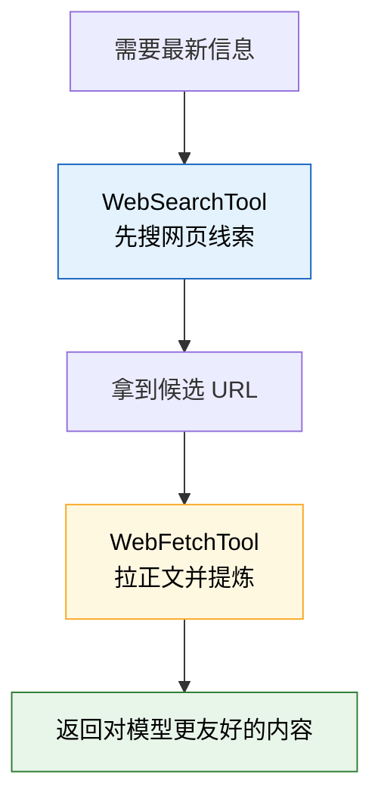
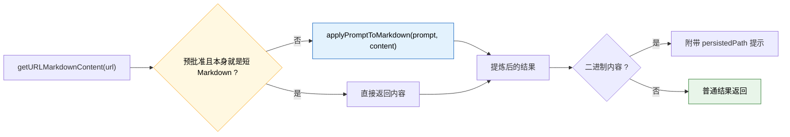
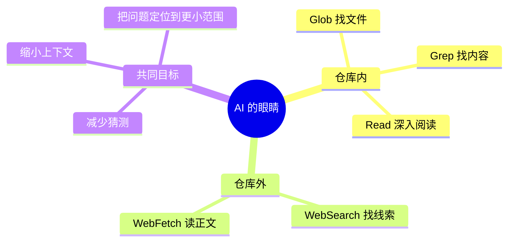

---
tags:
  - 搜索工具
  - 第四编
---

# 第18章：搜索与上网：AI的眼睛

!!! tip "生活类比"
    侦探办案至少要有两样东西：一只放大镜，用来在现场找线索；一个情报网，用来从外部获取最新消息。**Claude Code 里的 Grep / Glob 和 WebSearch / WebFetch，正好就是这两类“眼睛”。**

!!! question "这一章要回答的问题"
    **AI 怎么在你的仓库里快速找线索，又怎么在需要时把视野伸到互联网？为什么这两类能力都被设计成只读、并发安全，但权限模型却不完全相同？**

---

## 18.1 本地搜索：Grep 和 Glob 负责“在现场找证据”

本地搜索这对搭档的分工非常清楚：

- `GlobTool` 找文件
- `GrepTool` 找内容

### GrepTool：内容级搜索

从源码看，GrepTool 的核心特点是：

- `searchHint = search file contents with regex`
- `isConcurrencySafe() = true`
- `isReadOnly() = true`
- 支持 `path` 校验和分页结果输出

它甚至会把搜索结果模式分成：

- `content`
- `count`
- `files_with_matches`

这说明它不是一个简单“执行 rg 的壳”，而是有自己稳定的输出语义。

### GlobTool：文件级搜索

GlobTool 更像目录层面的侦察兵：

- 检查 `path` 是否存在且是目录
- 用 `glob(...)` 拉取文件列表
- 限制结果数
- 把路径相对化，节省 token

源码里还会在结果过多时附上：

> Results are truncated. Consider using a more specific path or pattern.

这很像一个训练有素的助手，不只是返回一大坨结果，还会顺手提示你怎么缩小范围。

### 为什么它们都被标成 `isReadOnly + isConcurrencySafe`

因为搜索最适合并发：

- 搜这个目录
- 再搜那个模式
- 不会彼此踩状态

这也是为什么 Claude Code 鼓励“多用专用搜索工具，少用 Bash 自己敲 grep”。

!!! info "源码证据"
    - `OpenClaudeCode/src/tools/GrepTool/GrepTool.ts:160-240`：Grep 的只读/并发/权限和路径校验
    - `OpenClaudeCode/src/tools/GrepTool/GrepTool.ts:254-280`：分页与结果模式映射
    - `OpenClaudeCode/src/tools/GlobTool/GlobTool.ts:94-176`：Glob 的目录校验、结果限制与相对路径输出

---

## 18.2 外部搜索：WebSearch 和 WebFetch 负责“把视野伸到仓库外”

如果 Grep / Glob 是放大镜，那么 WebSearch / WebFetch 就是情报网。

### WebSearchTool：先找，再选

它的设计很有意思：

- `shouldDefer = true`
- `max_uses = 8`
- 只有某些 provider / model 组合会启用
- 权限返回的是 `passthrough`，并附带本地允许规则建议

这说明 WebSearch 并不是一个“总在初始工具池里大张旗鼓出现”的工具，而是更偏向：

- 需要时发现
- 需要时开启
- 需要时授权

### 它甚至知道不同云厂商能力不同

源码里会根据 provider 决定是否启用：

- firstParty：可用
- vertex：只对某些 Claude 4 系列模型可用
- foundry：可用

这再次说明 Claude Code 的工具系统不是“抽象一写就完”，而是会认真处理底层提供方差异。

### WebFetchTool：不是只下载 HTML，而是把网页变成模型可消费内容

WebFetch 的输入有两个字段：

- `url`
- `prompt`

这已经暴露出它的设计思想：  
它不是“原封不动把网页搬回来”，而是“边取内容，边按目标问题提炼”。

在 `call()` 里可以看到两种路径：

- 如果是预批准 URL、内容本来就是合适长度的 Markdown：直接用
- 否则：`applyPromptToMarkdown(...)`

这意味着 WebFetch 并不是一个通用爬虫，而更像一个“网页阅读代理”。

!!! info "源码证据"
    - `OpenClaudeCode/src/tools/WebSearchTool/WebSearchTool.ts:76-152`：搜索结果结构化
    - `OpenClaudeCode/src/tools/WebSearchTool/WebSearchTool.ts:152-220`：启用条件、defer 和权限 passthrough
    - `OpenClaudeCode/src/tools/WebFetchTool/WebFetchTool.ts:66-180`：URL、域名规则与权限模型
    - `OpenClaudeCode/src/tools/WebFetchTool/WebFetchTool.ts:208-307`：抓取、转 Markdown、提炼和二进制落盘提示

---

## 18.3 为什么 Web 权限和本地搜索权限长得不一样

本地搜索工具通常只需要：

- 路径存在
- 读权限允许

而 WebFetch 还要额外关心：

- 域名是否预批准
- 是否命中 allow / ask / deny 的规则内容
- 是否跳转到别的 host

这说明“读操作”这个词虽然一样，但它的风险边界完全不同：

- 读本地代码：主要是项目权限问题
- 读外部网页：还涉及域名信任、认证资源、跳转风险

### WebFetch 对“认证网页”尤其谨慎

它的 prompt 里直接警告：

> 对需要认证或私有 URL，WebFetch 很可能失败，应该优先找专门的 MCP 工具。

这句话非常值钱，因为它体现了 Claude Code 对“正确入口”的偏好：

- 公开网页：WebFetch 可以
- 私有系统：更应该走受控连接器 / MCP

这不是技术限制而已，更是一种产品边界感。

---

## 18.4 搜索工具的真正价值：让模型别再“瞎猜”

这一章的主线并不只是列工具，而是解释 Claude Code 为什么要给模型装上“眼睛”。

一个没有搜索能力的模型，常常只能：

- 猜文件名
- 猜 API
- 猜文档版本

而 Claude Code 的设计目标很明确：  
**能查就不要猜，能找就不要拍脑袋。**

---

!!! abstract "🔭 深水区（架构师选读）"
    第 18 章把 Claude Code 的一个根本设计哲学暴露得很清楚：它不是把模型当“全知者”，而是把模型当“会主动检索证据的执行者”。

    这也是现代 Agent 系统的分水岭：

    - 弱系统：让模型靠记忆硬答  
    - 强系统：让模型先找证据，再组织答案

    Grep / Glob 负责项目内证据，WebSearch / WebFetch 负责项目外证据，两者合起来，才构成了“可工作的 AI 视野”。

---

!!! success "本章小结"
    **一句话**：Grep 和 Glob 让 Claude Code 在仓库内部精准找线索，WebSearch 和 WebFetch 让它在仓库外获取最新证据；这四个工具共同构成了 AI 的“眼睛”。**

!!! info "关键源码索引"
    | 证据层 | 文件 | 本章关注点 |
    |---|---|---|
    | 补全层 | `OpenClaudeCode/src/tools/GrepTool/GrepTool.ts:160-240` | Grep 的合同、路径校验与权限 |
    | 补全层 | `OpenClaudeCode/src/tools/GrepTool/GrepTool.ts:254-280` | Grep 的结果模式与分页 |
    | 补全层 | `OpenClaudeCode/src/tools/GlobTool/GlobTool.ts:94-176` | Glob 的目录校验与受限输出 |
    | 补全层 | `OpenClaudeCode/src/tools/WebSearchTool/WebSearchTool.ts:76-220` | WebSearch 的启用条件、defer 和权限 |
    | 补全层 | `OpenClaudeCode/src/tools/WebFetchTool/WebFetchTool.ts:66-180` | WebFetch 的域名权限与输入验证 |
    | 补全层 | `OpenClaudeCode/src/tools/WebFetchTool/WebFetchTool.ts:208-307` | WebFetch 的抓取、提炼和二进制内容处理 |

!!! warning "逆向提醒"
    - ✅ **可信度高**：本地搜索、Web 搜索和抓取的分工都能在源码里直接看到
    - ⚠️ **要看权限差异**：本地读权限和外部域名权限是两套不同问题
    - ❌ **不要误读**：WebFetch 不是万能浏览器；对认证网页和私有系统，Claude Code 更偏向 MCP 或专用连接器
