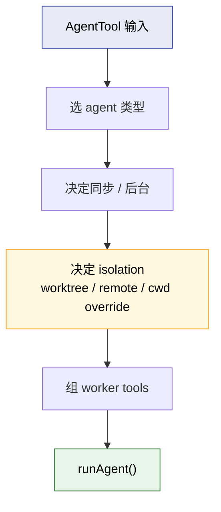
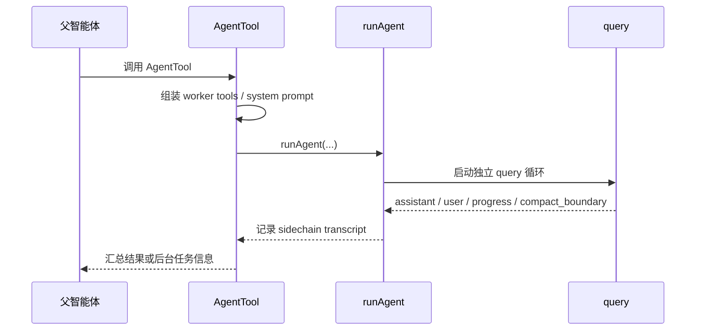
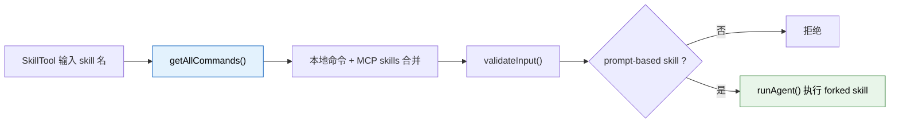
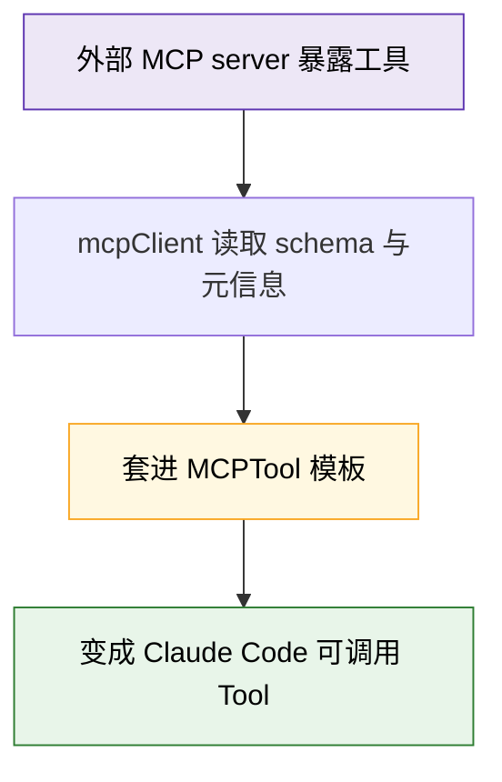
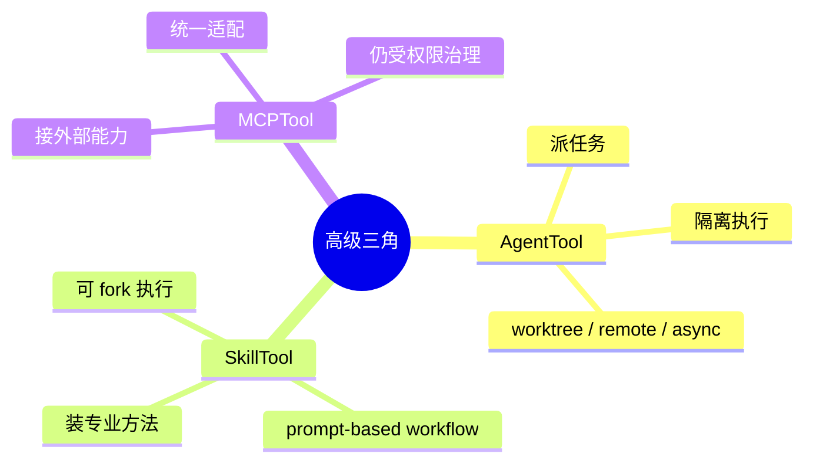

---
tags:
  - AgentTool
  - 第四编
---

# 第19章：高级三角：Agent+Skill+MCP

!!! tip "生活类比"
    一个人会干活，是能力；会带人、会学新方法、会借外部资源，才叫体系。**AgentTool、SkillTool、MCPTool 这三者，正是 Claude Code 从“单个助手”走向“平台能力”的三根支柱。**

!!! question "这一章要回答的问题"
    **Claude Code 到底只是一个会改代码的 CLI，还是一个可编排、可扩展、可接外部能力的 AI 平台？**

    第 19 章的答案是：从源码看，它明显在往后者走。

---

## 19.1 AgentTool：让 Claude Code 从“自己干”变成“会派活”

`AgentTool.tsx` 的输入 schema 已经说明了它不是普通工具：

- `description`
- `prompt`
- `subagent_type`
- `model`
- `run_in_background`
- `team_name`
- `mode`
- `isolation`
- `cwd`

### 它不是只会“开一个子进程”

AgentTool 实际上能走很多条路：

- 普通 subagent
- teammate spawn
- background async agent
- worktree isolated agent
- remote launched agent

这说明它本质上是一个**任务派发器**。

### worker 不会无脑继承父工具池

源码里有一段特别值得注意：

- worker 的工具池通过 `assembleToolPool(workerPermissionContext, appState.mcp.tools)` 单独组装
- 它使用的是 worker 自己的 permission mode
- 不直接继承父工具限制

这意味着子智能体不是父智能体的“影子”，而是一个有自己工作权限边界的执行单元。

### worktree isolation 是平台级能力，不是噱头

如果设置了 `isolation = worktree`：

- 会为 agent 创建独立 worktree
- fork path 下还会额外注入 worktree notice
- 任务结束后，没改动就自动回收；有改动就保留 worktree

这和“开一个线程”完全不是一个量级的设计。  
它已经在认真处理多智能体协作里的文件隔离问题了。

!!! info "源码证据"
    - `OpenClaudeCode/src/tools/AgentTool/AgentTool.tsx:81-155`：AgentTool 输入 / 输出 schema
    - `OpenClaudeCode/src/tools/AgentTool/AgentTool.tsx:282-316`：teammate spawn 分支
    - `OpenClaudeCode/src/tools/AgentTool/AgentTool.tsx:567-641`：worker tool pool、async 判断、worktree / cwd 装配
    - `OpenClaudeCode/src/tools/AgentTool/AgentTool.tsx:643-685`：worktree 清理与保留逻辑

---

## 19.2 `runAgent()` 说明：子智能体不是“函数调用”，而是一段独立会话

如果说 AgentTool 负责决定“派不派”，那 `runAgent()` 负责真正把一名子智能体跑起来。

从 `runAgent.ts` 的参数看，它至少关心：

- `agentDefinition`
- `promptMessages`
- `toolUseContext`
- `isAsync`
- `forkContextMessages`
- `availableTools`
- `allowedTools`
- `worktreePath`
- `description`

### `forkContextMessages` 是一个很关键的开关

源码注释写得很明确：

- 普通 agent：按自己的 system prompt、上下文和工具集运行
- fork path：为了 prompt cache 命中，要尽量保持和父请求前缀一致

这说明 Claude Code 连“父子 agent 之间的缓存连续性”都考虑到了。

### 子智能体也有自己的 transcript 和清理逻辑

`runAgent()` 不只是跑起来，还负责：

- 记录 sidechain transcript
- 处理 `max_turns_reached`
- 清理 agent 专属 MCP server
- 清理 readFileState
- 清理 todos
- 杀掉 agent 生成的后台 bash / monitor 任务

这说明子智能体不是“用完就丢的 Promise”，而是被当成一等公民去管理生命周期。

!!! info "源码证据"
    `OpenClaudeCode/src/tools/AgentTool/runAgent.ts:248-329` 展示了子智能体运行参数；`OpenClaudeCode/src/tools/AgentTool/runAgent.ts:792-859` 展示了 transcript 与清理逻辑。

---

## 19.3 SkillTool：把“技能”变成可调用的能力包

SkillTool 是这一组三角里最像“给 AI 装插件大脑”的部分。

它不是直接执行一个 shell 命令，而是：

- 校验 skill 名称
- 从本地命令和 MCP skill 中找技能
- 判断它是不是 prompt-based command
- 再决定 inline 处理还是 forked skill 执行

### 这说明 skill 不是“神秘 prompt 片段”

它是有完整生命周期的：

- 可以被发现
- 可以被校验
- 可以被权限规则匹配
- 可以被 fork 到子 agent 中执行

### SkillTool 甚至把 MCP prompt 型技能也纳进来了

`getAllCommands()` 会把：

- 本地 / bundled commands
- `loadedFrom === 'mcp'` 的 MCP skills

合并起来。

这意味着 skill 系统已经不是“本地 markdown 文件的小花活”，而是在朝统一技能总线发展。

### `executeForkedSkill()` 的平台味道很浓

在 forked skill 路径里，它会：

- 创建新 `agentId`
- 准备 forked command context
- 调 `runAgent()`
- 收集 agent messages
- 把其中的 tool_use / tool_result 转成 progress

也就是说，SkillTool 本质上是：

> 用一个更窄、更预先设计好的 prompt，把 AgentTool 的派遣能力包装成“技能调用”。

!!! info "源码证据"
    - `OpenClaudeCode/src/tools/SkillTool/SkillTool.ts:81-94`：本地命令与 MCP skills 合并
    - `OpenClaudeCode/src/tools/SkillTool/SkillTool.ts:118-260`：forked skill 的执行路径
    - `OpenClaudeCode/src/tools/SkillTool/SkillTool.ts:331-429`：SkillTool 的 schema 与输入校验

---

## 19.4 MCPTool：不是一个具体工具，而是“外部工具适配模板”

MCPTool 很容易被误解成“又一个工具”。  
其实它更像一个**适配器模板**。

源码里能看到：

- `isMcp = true`
- `inputSchema = passthrough object`
- `name = 'mcp'`
- `description / prompt / call` 都标注为会在 `mcpClient.ts` 中被覆写

### 这说明 Claude Code 的野心很清楚

它不想把“工具”只定义成自己仓库里写死的东西。  
它想定义一套标准，然后让外部能力也能变成自己的工具。

### 为什么 `inputSchema` 要用 passthrough

因为 MCP 工具的 schema 来自外部服务器，不可能在编译期全知道。  
所以 MCPTool 本体只提供一个可接任何对象的底座，再由客户端层注入真实 schema。

### 权限这里仍然要经过 Claude Code

即使是外部能力，`checkPermissions()` 也不是绕过去，而是返回 `passthrough`，继续进入 Claude Code 自己的权限体系。

这意味着 MCP 并没有把系统变成“随便接个外部服务就裸奔”，而是接进了同一套工具治理框架。

!!! info "源码证据"
    `OpenClaudeCode/src/tools/MCPTool/MCPTool.ts:13-77` 展示了 MCPTool 作为适配模板而非具体业务工具的定位。

---

## 19.5 为什么说 Agent + Skill + MCP 构成了“平台三角”

到这里，三者的分工可以非常清楚地画出来：

它们分别解决三种不同的“扩展”：

| 维度 | 对应能力 | 回答的问题 |
|---|---|---|
| 纵向扩展 | AgentTool | 一个人做不完，能不能拆任务给别人 |
| 认知扩展 | SkillTool | 不会的事，能不能临时装上方法论 |
| 外部扩展 | MCPTool | 本地没有的能力，能不能接进来 |

这就是为什么本章叫“高级三角”。  
它们共同把 Claude Code 从“一个会改代码的终端助手”推进成“一个可编排、可扩展、可联外部资源的平台”。

---

!!! abstract "🔭 深水区（架构师选读）"
    第 19 章的真正价值，不是告诉你有三个高级工具，而是让你看清 Claude Code 的平台化方向：

    - AgentTool 负责把单线程任务执行扩展成多执行体协作  
    - SkillTool 负责把经验和工作流模块化  
    - MCPTool 负责把外部世界接入同一条工具总线

    这三者加在一起，就不再是“工具多一点”，而是系统架构级别的跃迁。它意味着 Claude Code 的边界不再等于自己的仓库。

---

!!! success "本章小结"
    **一句话**：AgentTool 让 Claude Code 会派活，SkillTool 让它会按方法做事，MCPTool 让它能接入外部能力；三者合在一起，构成了 Claude Code 迈向平台化的高级三角。**

!!! info "关键源码索引"
    | 证据层 | 文件 | 本章关注点 |
    |---|---|---|
    | 补全层 | `OpenClaudeCode/src/tools/AgentTool/AgentTool.tsx:81-155` | AgentTool 输入 / 输出 schema |
    | 补全层 | `OpenClaudeCode/src/tools/AgentTool/AgentTool.tsx:282-316` | teammate spawn 路径 |
    | 补全层 | `OpenClaudeCode/src/tools/AgentTool/AgentTool.tsx:567-641` | worker tool pool、async、worktree / cwd 组装 |
    | 补全层 | `OpenClaudeCode/src/tools/AgentTool/runAgent.ts:248-329` | 子智能体运行参数与上下文 |
    | 补全层 | `OpenClaudeCode/src/tools/AgentTool/runAgent.ts:792-859` | transcript 与生命周期清理 |
    | 补全层 | `OpenClaudeCode/src/tools/SkillTool/SkillTool.ts:81-94` | 本地与 MCP skills 合并 |
    | 补全层 | `OpenClaudeCode/src/tools/SkillTool/SkillTool.ts:118-260` | forked skill 执行 |
    | 补全层 | `OpenClaudeCode/src/tools/SkillTool/SkillTool.ts:331-429` | SkillTool schema 与输入校验 |
    | 补全层 | `OpenClaudeCode/src/tools/MCPTool/MCPTool.ts:13-77` | MCPTool 适配模板 |

!!! warning "逆向提醒"
    - ✅ **可信度高**：AgentTool 的多路径派发、SkillTool 的 fork 执行、MCPTool 的适配模板性质，都能从源码直接印证
    - ⚠️ **要理解角色差别**：MCPTool 更像模板和桥接层，不是一个单独业务工具
    - ❌ **不要误读**：这三个能力不是互相替代，而是分别扩展“执行体、方法论、外部资源”三条维度
