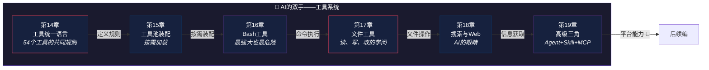

# 第四编：AI的双手——工具系统

> *所有电器用同一种插头标准——冰箱、电视、手机都不需要定制插座。*
>
> 本编解析 Claude Code 的 54 个工具如何用**统一接口**组织起来：**工具类型**、**工具池装配**、**Bash/文件/搜索三大核心工具**、**高级三角（Agent+Skill+MCP）**。

---

## 本编总览

---

## 本编六章速览

| 章 | 标题 | 核心问题 | 生活类比 |
|---|------|----------|----------|
| 14 | [工具统一语言](chapter14.md) | 功能天差地别的工具怎么用同一个 Tool 类型？ | 电器的统一插头标准 |
| 15 | [工具池装配](chapter15.md) | 54 个工具全开会怎样？ | 出门只带需要的工具 |
| 16 | [Bash工具](chapter16.md) | 能执行任意命令有多危险？ | 万能钥匙 |
| 17 | [文件工具](chapter17.md) | AI 说"改第3行"为什么不能直接 sed？ | 图书馆三个柜台 |
| 18 | [搜索与Web](chapter18.md) | AI 怎么在百万行代码中找 bug？ | 侦探的放大镜和情报网 |
| 19 | [高级三角](chapter19.md) | Claude Code 只是 CLI 还是可编程 AI 平台？ | 从独行侠到项目经理 |

---

## 设计思想主线

!!! tip "本编建立的认知基础"
    1. 统一的 Tool 接口让新增工具只需"填空"——**接口设计的力量**
    2. 工具池按模式和上下文动态装配——**不是所有工具都随时可用**
    3. BashTool 是最强大也最危险的能力——**力量越大，约束越必要**
    4. 文件工具分读/写/改三个——**分工本身就是安全防线**
    5. Agent+Skill+MCP 三角让 Claude Code 从 CLI 升级为**开放 AI 平台**

---

## 推荐路径

=== "🌱 初学者"

    从第16章 Bash 工具开始——**最直观也最震撼**。然后看第14章理解统一接口的设计。

=== "🔧 开发者"

    第14-15章的工具抽象和装配模式是**可复用的架构智慧**。第17章的文件工具设计值得细读。

=== "🏗️ 架构师"

    第19章的 Agent+Skill+MCP 三角展示了**平台化思维**——从工具到平台的演进路径。

!!! note "即将上线"
    本编内容正在写作中，敬请期待。
