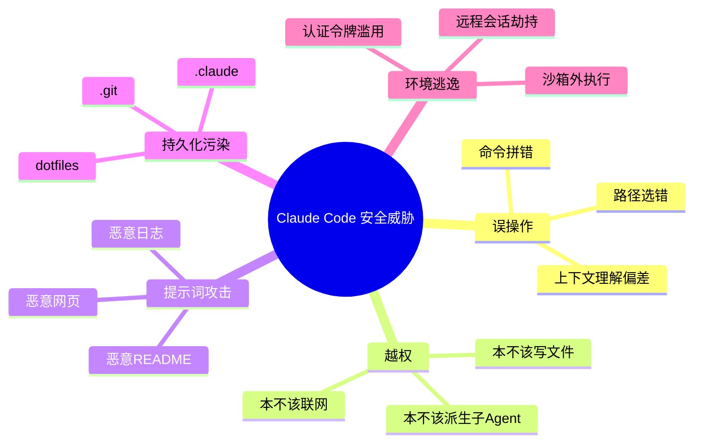
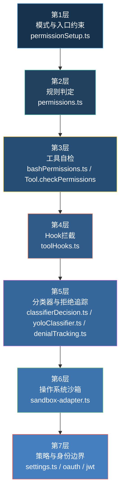
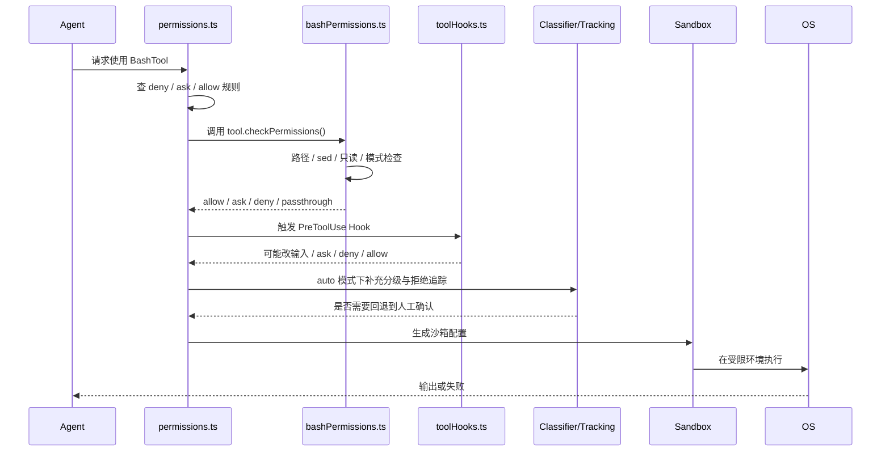
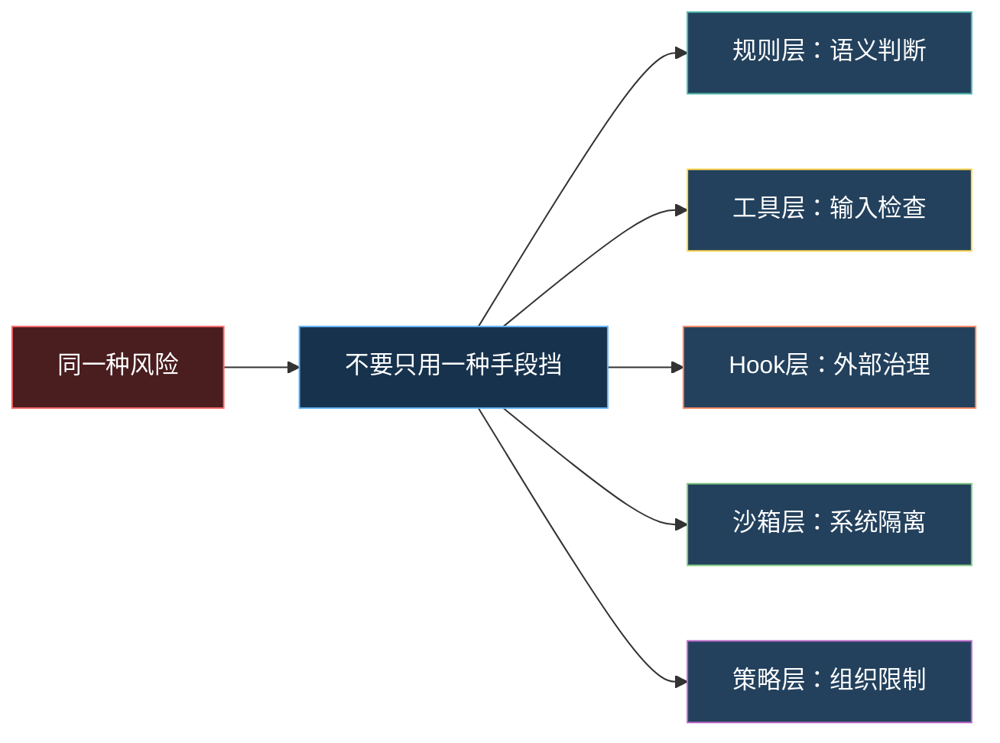
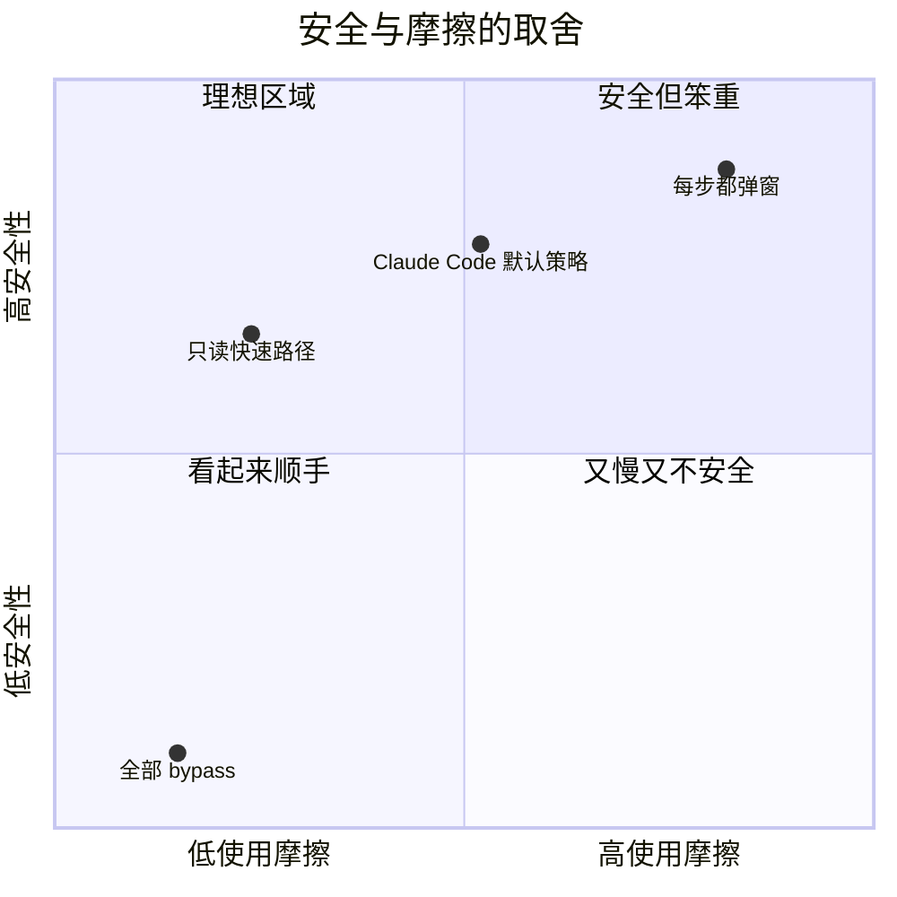

---
tags:
  - 安全
  - 第五编
---

# 第20章：七层防御：一条命令的安检之旅

!!! tip "生活类比：机场安检"
    机场不会只靠一道门保护你。行李要过 X 光，人要过安检门，可疑物还要开箱复查，最后还有隔离区和登机口复核。Claude Code 的安全设计也不是“靠 AI 自己别犯错”，而是假设它**一定会犯错**，于是把风险拆成多层来挡。

!!! question "这一章先回答一个问题"
    一个能执行 `rm -rf`、改文件、联网、开子 Agent 的 AI 助手，为什么还能被人放心地放进真实工程里？

Claude Code 的答案不是一句“我们模型很聪明”，而是一整条**源码可追踪的安全链**。从权限模式、规则匹配、工具自检，到 Hook、分类器、沙箱、策略与认证，任何一层出错，后面还有别的层补上。

---

## 20.1 先别急着看代码，先看它在防什么

源码里反复出现的不是“能力”，而是“约束”。这通常意味着作者面对的是几类真实威胁：

- **误操作**：模型本意是好的，但把路径、参数、上下文理解错了。
- **越权操作**：模型能做的事太多，顺手越过了当前任务边界。
- **提示词攻击**：恶意文件、日志、网页内容诱导模型执行危险动作。
- **持久化污染**：把风险写进 `.git`、`.claude`、shell 配置或凭据目录。
- **环境逃逸**：应用层判断失手后，命令直接碰到系统资源。

如果只靠“执行前弹个确认框”，这些风险根本挡不住。因为很多危险操作看起来像普通操作，很多普通操作连着做也会变危险。

---

## 20.2 从源码角度，可以把它归纳成七层防御

这里的“七层”不是某一个枚举常量的名字，而是我们根据调用链整理出的**分析框架**。你会在不同文件里看到这些层一起工作。

### 第 1 层：模式与入口约束

权限模式不是 UI 装饰，而是第一层开关。`PermissionMode.ts` 定义了 `default`、`plan`、`acceptEdits`、`bypassPermissions`，以及在特性开启时才出现的 `auto` 模式；`permissionSetup.ts` 再把 CLI 参数、settings、GrowthBook 门控合并成实际模式。这样一来，很多风险在“命令还没跑”之前就被模式收窄了。

### 第 2 层：规则判定

`permissions.ts` 先查整工具 deny，再查 ask，再交给工具自己的 `checkPermissions`。这是 Claude Code 最核心的一层：它先问“这类行为该不该做”，而不是先跑完再回头解释。

### 第 3 层：工具自检

最典型的是 Bash。`bashPermissions.ts` 不是一句正则，而是把路径、sed、只读命令、安全模式、沙箱自动放行、最终提示拆成多个阶段。也就是说，即使用户已经给过某些大类权限，工具自己还会继续做二次筛查。

### 第 4 层：Hook 拦截

`toolHooks.ts` 允许在工具前后插入外部治理逻辑。但它又特别小心：Hook 即使返回 `allow`，也**不会绕过** settings 里的 deny/ask 规则。这是很成熟的安全思路。

### 第 5 层：分类器与拒绝追踪

自动模式不是“全部自动通过”。`classifierDecision.ts` 先区分一批天然安全工具，剩下的交给 `yoloClassifier.ts` 做转录压缩、系统提示拼装和风险分类；`denialTracking.ts` 则负责在连续拒绝太多时回退到人工确认，避免自动模式越跑越偏。

### 第 6 层：操作系统沙箱

`sandbox-adapter.ts` 把 Claude Code 自己的权限规则翻译成底层沙箱配置，包括可写目录、禁止写入的设置文件、网络域名等。它不是“更漂亮的提示框”，而是系统级隔离。

### 第 7 层：策略与身份边界

最后还有 MDM、managed settings、OAuth、Bridge JWT 刷新这些“外围护城河”。它们不直接判断 `rm -rf`，但决定了谁能进入某种模式、谁能拿到某种令牌、哪些组织策略不可绕过。

---

## 20.3 一条 Bash 命令要过哪些检查

把源码摊开看，一条命令的安全旅程差不多是这样的：

如果我们把关键代码片段压缩成一句话，大概就是：

- `checkRuleBasedPermissions()` 先看“规则层面是否反对”。
- `tool.checkPermissions()` 再看“这个具体工具、这次具体输入有没有问题”。
- `resolveHookPermissionDecision()` 再确保“外部 Hook 的结论不能冲掉内建规则”。
- 真要跑 Bash 时，再决定是否进入沙箱。

---

## 20.4 纵深防御的关键，不是层数多，而是层与层独立

很多系统也喜欢说“我们有很多安全措施”，但其实几层都在做同一件事，失效时会一起失效。Claude Code 这套设计更有价值的地方，是它让不同层解决不同问题：

| 层 | 主要回答的问题 | 典型文件 |
|---|---|---|
| 模式层 | 这次会话总体有多激进？ | `PermissionMode.ts` |
| 规则层 | 这个工具/模式在当前上下文下该不该做？ | `permissions.ts` |
| 工具层 | 这个具体命令或路径安全吗？ | `bashPermissions.ts` |
| Hook 层 | 组织或扩展逻辑要不要追加治理？ | `toolHooks.ts` |
| 分类层 | 自动模式下是否需要再判断一次？ | `yoloClassifier.ts` |
| 沙箱层 | 就算判断错了，系统还能拦什么？ | `sandbox-adapter.ts` |
| 策略层 | 哪些配置和身份边界根本不让你碰？ | `settings.ts` / `oauth` |

这也是为什么 Claude Code 的安全代码看起来“不优雅”地分散在很多目录里。它不是偷懒，而是在避免“一个总开关失效，全盘失守”。

---

## 20.5 为什么它不追求零弹窗，也不追求零风险

安全产品最难的不是“更严”，而是“既严又能用”。源码里能看到两个平衡动作：

- 一方面，它给只读命令、安全工具、沙箱内 Bash 留了快速路径。
- 另一方面，它对危险规则、危险路径、危险 sed、危险 shell 特性采取了绕不过去的强约束。

深入一点看，你会发现它并不是把“快”和“安全”当成对立面，而是努力把**低风险操作快速化**，把**高风险操作精细化**。这是比“永远先问用户”更成熟的产品观。

!!! abstract "🔭 深水区（架构师选读）"
    这一章最值得带走的思想是：安全系统最好不要只有一个“聪明的大脑”。Claude Code 把治理拆成模式、规则、工具、Hook、分类器、沙箱、策略这几类相对独立的部件。这样就算其中一块判断失误，其他块还有机会补救。对任何带执行能力的 AI 系统来说，这种“可失败但不易失控”的设计，比追求某个单点模型判断 100% 正确更现实。

!!! success "本章小结"
    Claude Code 的安全性不是来自“模型不会犯错”，而是来自一条多层、独立、互相补位的防线。你后面读权限系统、BashTool、沙箱、认证时，都可以把它们放回这七层框架里理解。

!!! info "关键源码索引"
    - `PermissionMode` 模式定义：[PermissionMode.ts](/Users/champion/Documents/develop/Warwolf/OpenClaudeCode/src/utils/permissions/PermissionMode.ts#L21)
    - 规则判定主流程：[permissions.ts](/Users/champion/Documents/develop/Warwolf/OpenClaudeCode/src/utils/permissions/permissions.ts#L1071)
    - 最终权限决策：[permissions.ts](/Users/champion/Documents/develop/Warwolf/OpenClaudeCode/src/utils/permissions/permissions.ts#L1158)
    - 自动模式危险权限剥离：[permissionSetup.ts](/Users/champion/Documents/develop/Warwolf/OpenClaudeCode/src/utils/permissions/permissionSetup.ts#L84)
    - 危险权限扫描：[permissionSetup.ts](/Users/champion/Documents/develop/Warwolf/OpenClaudeCode/src/utils/permissions/permissionSetup.ts#L295)
    - Bash 二次检查顺序：[bashPermissions.ts](/Users/champion/Documents/develop/Warwolf/OpenClaudeCode/src/tools/BashTool/bashPermissions.ts#L1112)
    - Hook 权限合流：[toolHooks.ts](/Users/champion/Documents/develop/Warwolf/OpenClaudeCode/src/services/tools/toolHooks.ts#L321)
    - 拒绝追踪回退：[denialTracking.ts](/Users/champion/Documents/develop/Warwolf/OpenClaudeCode/src/utils/permissions/denialTracking.ts#L8)
    - 沙箱配置翻译：[sandbox-adapter.ts](/Users/champion/Documents/develop/Warwolf/OpenClaudeCode/src/utils/sandbox/sandbox-adapter.ts#L172)

!!! warning "逆向提醒"
    “七层防御”是本书根据多处源码整理出的分析框架，不是源码里某个现成常量名。真实实现是分散的：有的在权限引擎里，有的在工具内部，有的在沙箱和认证层。
