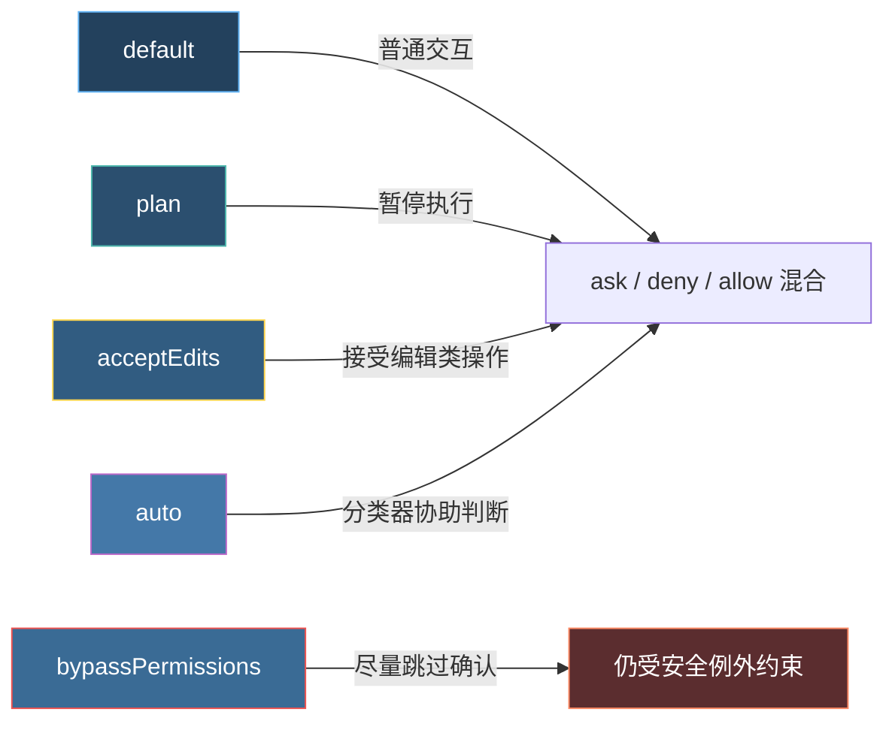
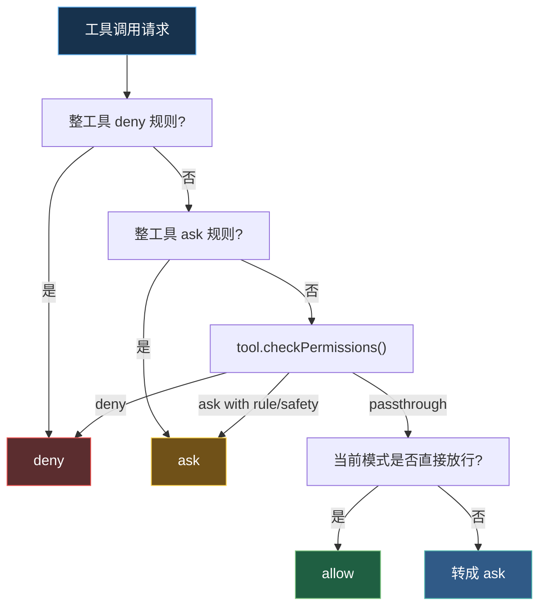
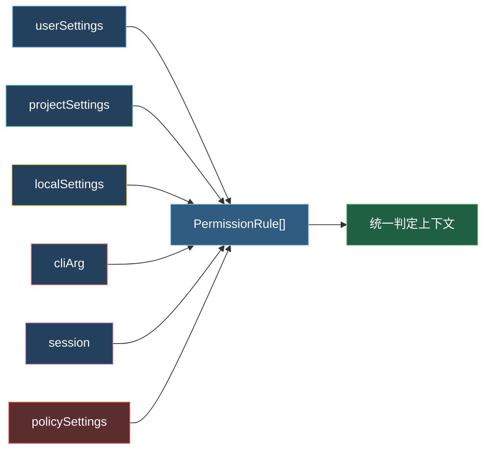
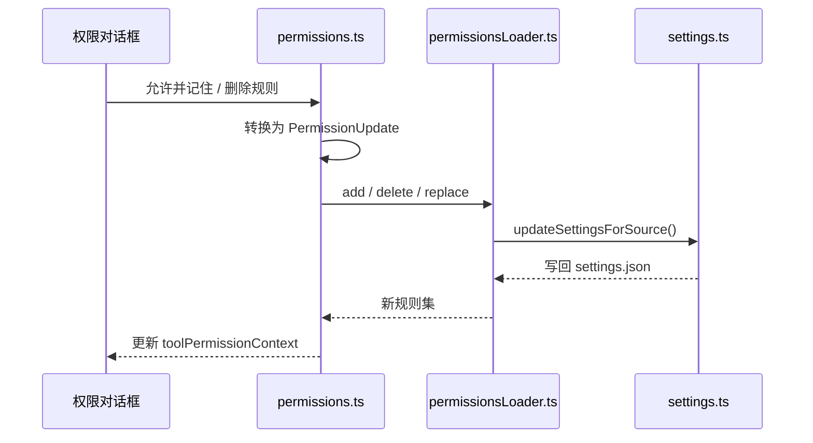
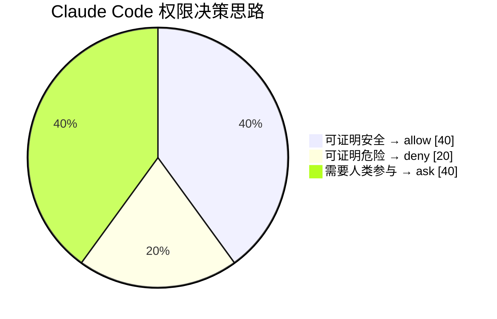

---
tags:
  - 权限系统
  - 第五编
---

# 第21章：权限系统：允许、拒绝，还是先问一句

!!! tip "生活类比：手机权限弹窗"
    手机上的相机、麦克风、定位，不是都按同一规则处理。手电筒不需要定位，导航又必须拿位置，转账 App 还会对录屏做额外限制。Claude Code 的权限系统也是这样：它不是简单地问“要不要执行”，而是问“**这件事在当前上下文下该怎么执行**”。

!!! question "这一章先回答一个问题"
    为什么有些操作会直接执行，有些会弹确认框，有些则会直接被拦下？

答案藏在三组代码里：

- `PermissionMode.ts` 负责定义“会话的大气候”；
- `permissionSetup.ts` 负责把 CLI、settings、组织策略合并成当前模式；
- `permissions.ts` 负责把某次具体工具调用判定成 `allow`、`ask`、`deny`。

---

## 21.1 权限不是一个开关，而是一套模式

`PermissionMode.ts` 把模式做成了明确的配置对象，每种模式都有 `title`、`symbol`、`color` 和对外映射。也就是说，模式不是隐藏在 if/else 里的字符串，而是一个完整的“产品状态”。

更关键的是，`permissionSetup.ts` 不会直接相信某一个来源。它会按优先级合并：

- 命令行参数
- `--dangerously-skip-permissions`
- `settings.permissions.defaultMode`
- GrowthBook/Statsig 门控
- 远程环境限制

这意味着用户“想进入某模式”，不等于系统“允许进入某模式”。

### 为什么 `bypassPermissions` 也不是绝对的

`permissionSetup.ts` 明确检查：

- 组织门控是否禁用 bypass；
- settings 是否禁用 bypass；
- 远程环境是否支持当前默认模式；
- auto 模式是否被 circuit breaker 关停。

这就是成熟系统和 demo 工具的差别：它允许“有力模式”存在，但不允许它无限制扩散。

---

## 21.2 真正的判定发生在 `permissions.ts`

权限引擎的核心逻辑可以压成一句话：

1. 先看整工具规则；
2. 再看工具自己的 `checkPermissions()`；
3. 再看当前模式能不能直接放行；
4. 最后把没有明确结论的操作转成 `ask`。

`checkRuleBasedPermissions()` 是早期过滤器，`hasPermissionsToUseToolInner()` 则是完整决策器。它们有几个非常重要的细节：

- **deny 优先于一切**；
- **content-specific ask** 不能被 bypass 模式冲掉；
- **safetyCheck** 这类路径安全检查也是 bypass-immune；
- 没被明确允许的 `passthrough` 最终会被收束成 `ask`。

也就是说，Claude Code 不是“默认都放行，特殊情况才拦”；它更像“默认先怀疑，再找理由自动放行”。

---

## 21.3 规则从哪里来：不是一层，是多源合并

权限规则的来源不止一个。`permissionsLoader.ts` 会从多个 settings source 里加载规则，再把它们转成统一的 `PermissionRule` 结构。

其中最值得注意的是 `allowManagedPermissionRulesOnly`：

- 一旦它在 `policySettings` 中开启；
- 非托管来源的权限规则会被忽略；
- “永远允许”这类选项也会在界面上隐藏。

这就是企业治理味道很重的一段代码：管理员不是“多给一个建议”，而是能**改变规则系统本身的边界**。

### 为什么要有 `localSettings`

从写书角度最容易忽略的一点是：`localSettings` 和 `projectSettings` 不是一回事。

- `projectSettings` 更像项目共享规则；
- `localSettings` 更像当前开发者的本地偏好；
- `userSettings` 则跨项目生效。

这种分层不是形式主义，而是在回答一个现实问题：什么规则是“我个人现在想这么做”，什么规则是“这个仓库里的所有人都该这么做”。

---

## 21.4 权限系统还要解决“改规则”这件事

如果规则只能读不能写，这套系统只适合管理员，不适合真实开发者工作流。所以 `permissions.ts` 和 `permissionsLoader.ts` 还处理了：

- 删除规则；
- 把规则按 source + behavior 分组；
- 同步磁盘变化；
- 在受托管限制时清空非托管来源。

这里有一个很容易被忽视但非常工程化的设计：`syncPermissionRulesFromDisk()` 在重载时会**先清空磁盘来源的 source:behavior 组合，再应用新规则**。这样删除掉的旧规则不会因为“这次没出现”而偷偷残留在内存里。

这类细节恰恰说明这不是一个“能跑就行”的权限系统，而是考虑过长期使用的状态一致性。

---

## 21.5 为什么它能同时做到“少打扰”和“少失控”

权限系统不是为了制造弹窗，而是为了降低误判成本。你可以把 Claude Code 的思路理解成三句话：

- 能明确证明安全的，自动过；
- 能明确证明危险的，直接拦；
- 其余不猜，问你。

这也是为什么它会同时保留：

- 显式规则；
- 工具内部检查；
- 模式控制；
- 组织级托管策略。

没有哪一种机制能独立解决全部问题，但合起来就形成了“可理解、可追踪、可治理”的权限体系。

!!! abstract "🔭 深水区（架构师选读）"
    这套权限系统最值得学习的地方，不是 `allow / ask / deny` 这三个词本身，而是它把“会话状态”“规则来源”“工具自检”“组织治理”这几件事拆开了。很多产品把权限只做成一个弹窗组件，结果所有复杂性都挤进 UI；Claude Code 则把 UI 变成最后呈现层，真正的语义判断发生在底下的上下文和规则引擎里。

!!! success "本章小结"
    Claude Code 的权限系统不是一套“是否弹窗”的小功能，而是一台把模式、规则、来源、状态同步到一起的判定引擎。你看到的每一个“直接执行 / 先问一句 / 直接拒绝”，背后都能追到具体源码。

!!! info "关键源码索引"
    - 模式定义：[PermissionMode.ts](/Users/champion/Documents/develop/Warwolf/OpenClaudeCode/src/utils/permissions/PermissionMode.ts#L21)
    - 初始模式选择：[permissionSetup.ts](/Users/champion/Documents/develop/Warwolf/OpenClaudeCode/src/utils/permissions/permissionSetup.ts#L695)
    - auto/bypass 门控：[permissionSetup.ts](/Users/champion/Documents/develop/Warwolf/OpenClaudeCode/src/utils/permissions/permissionSetup.ts#L1123)
    - 规则读取与 managed-only 策略：[permissionsLoader.ts](/Users/champion/Documents/develop/Warwolf/OpenClaudeCode/src/utils/permissions/permissionsLoader.ts#L27)
    - 规则判定入口：[permissions.ts](/Users/champion/Documents/develop/Warwolf/OpenClaudeCode/src/utils/permissions/permissions.ts#L1071)
    - 最终权限决策：[permissions.ts](/Users/champion/Documents/develop/Warwolf/OpenClaudeCode/src/utils/permissions/permissions.ts#L1158)
    - 规则删除与磁盘同步：[permissions.ts](/Users/champion/Documents/develop/Warwolf/OpenClaudeCode/src/utils/permissions/permissions.ts#L1329)
    - 从磁盘同步规则：[permissions.ts](/Users/champion/Documents/develop/Warwolf/OpenClaudeCode/src/utils/permissions/permissions.ts#L1419)

!!! warning "逆向提醒"
    你在界面里看到的权限弹窗，只是这一章的“表层”。真正重要的是 `toolPermissionContext` 的构造、规则来源的优先级，以及 bypass/auto 这类模式被哪些安全例外重新收紧。
