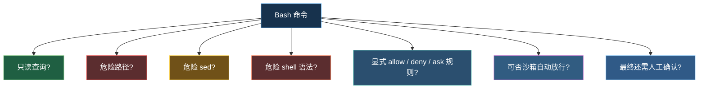
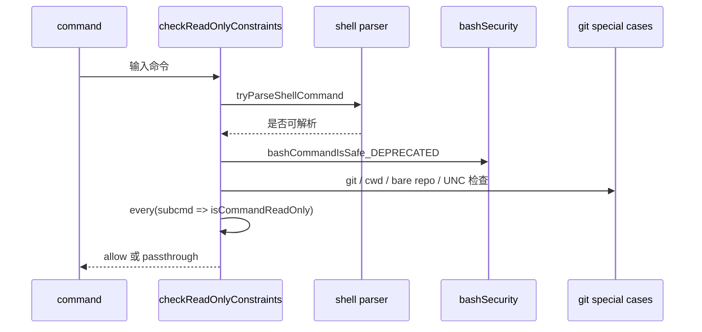
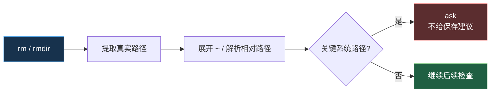
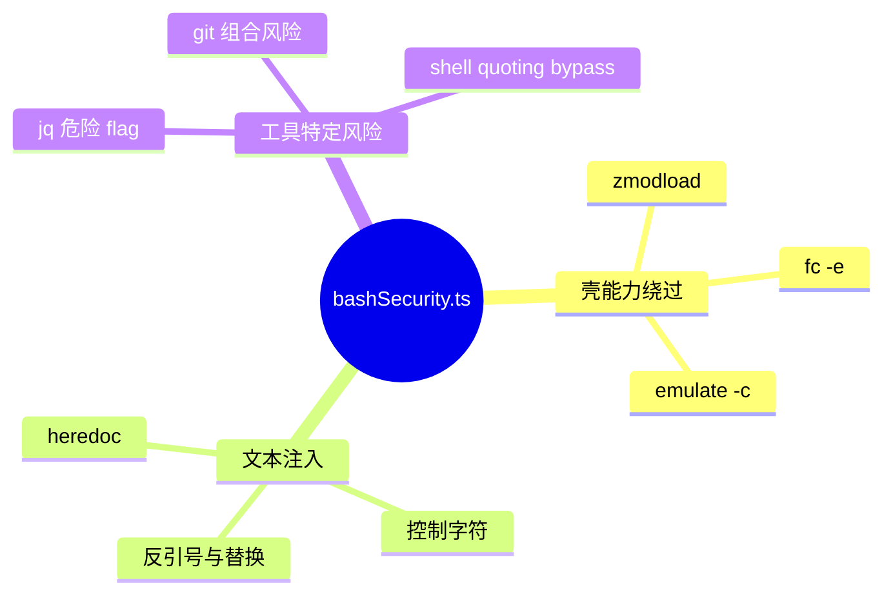
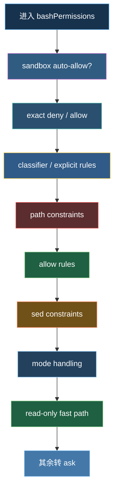

---
tags:
  - BashTool
  - 第五编
---

# 第22章：25道安全关卡：BashTool 的层层安检

!!! tip "生活类比：银行金库的多道门禁"
    银行金库不会只靠一把锁。门口有人脸识别，里层有密码门，再里面有时间锁、录像、值班员复核。BashTool 也一样，因为它几乎是 Claude Code 最强、也最危险的工具。

!!! question "这一章先回答一个问题"
    Claude Code 在执行一条 shell 命令前，到底检查了什么，为什么要检查这么多次？

如果说前一章讲的是“谁有资格过门”，这一章讲的就是“**进门之后还要过哪些闸机**”。尤其是 BashTool，它不仅能读文件、搜代码、跑测试，还能删目录、改配置、联网、开子进程。所以源码里围着它长出了一大片独立的安全代码。

---

## 22.1 为什么 BashTool 是最难做安全的工具

因为它太通用了。对模型来说，Bash 像一把万能钥匙：

- 读文件可以靠 `cat`、`sed`、`awk`
- 搜索可以靠 `grep`、`find`、`rg`
- 构建测试可以靠 `npm test`、`pytest`
- 破坏系统也可以靠 `rm -rf`、`curl | bash`、危险 `git`

所以 Claude Code 对 Bash 的态度不是“默认危险，全部拦下”，也不是“既然强大就相信模型”。它选择第三条路：把 Bash 命令拆成不同风险层级，逐层检查。

---

## 22.2 第一批闸机：先把显然安全的命令快速放行

`readOnlyValidation.ts` 的设计思路很有代表性：它不试图证明“所有命令都安全吗”，而是只证明“这批命令足够像只读操作”。

### 只读快速路径

`checkReadOnlyConstraints()` 会做这些事：

- 命令能不能可靠解析；
- 原始命令有没有明显危险模式；
- 是否含有可能触发 WebDAV 的 UNC 路径；
- 是否出现 `cd + git` 这类可组合成逃逸的模式；
- 是否在非原始工作目录里跑 git；
- 所有子命令是否都能判成只读。

特别值得注意的是几段“很像漏洞复盘”的注释：

- `cd /malicious/dir && git status`
- 在当前目录伪造 bare repo 结构
- 先写 git internal files 再执行 git

这些不是学术化威胁模型，而是把历史上踩过的坑直接写进代码。

### 为什么 `xargs` 也要单独看

`readOnlyValidation.ts` 甚至连 `xargs` 后面允许跟什么命令都做了白名单，只放 `echo`、`printf`、`wc`、`grep`、`head`、`tail` 这种纯读或纯输出工具。意思很明确：它不是按“命令名大致安全”来判，而是按“组合后还能不能继续保持只读语义”来判。

---

## 22.3 第二批闸机：危险路径和危险编辑要单独拦

不是所有危险都长得像 `rm -rf /`。有些危险是“命令长得普通，但目标路径很可怕”。

### 危险移除路径

`pathValidation.ts` 明确规定：`rm` / `rmdir` 命中关键系统目录时，必须要求显式批准，而且**不能被普通 allow 规则自动放行**。

这段代码的书写方式很有意思：它特意说明**不用解析符号链接后的真实路径**，因为像 `/tmp` 这种在 macOS 上虽然会跳到 `/private/tmp`，但用户输入层面仍应被视为危险目标。

### 危险 sed

`sedValidation.ts` 也不是一刀切禁止 `sed`。它区分：

- 普通替换；
- `-i` 原地编辑；
- 带 `w/W/e/E` 这类可能写文件或执行命令的危险表达式。

而且在 `acceptEdits` 模式下，它允许普通文件写入，但仍然会对危险 `sed` 操作保留 `ask`。

这套设计非常像一句产品原则：

> 允许“编辑”，不等于允许“顺便执行别的东西”。

---

## 22.4 第三批闸机：壳层语法本身也会变成攻击面

再往下，你会看到 `bashSecurity.ts` 这种更偏“语法安全”的检查。

它关心的不是业务语义，而是 shell 自身的绕过方式，比如：

- Zsh 的 `zmodload`
- `fc -e` 这种借编辑器执行命令的形式
- 某些危险变量上下文
- 某些 heredoc、转义、控制字符、jq 危险 flag

这一层很像“语法取证”。

它提醒我们：同样是 `grep`、`sed`、`git` 这些熟悉命令，只要被放进不同的 shell 语境里，安全含义就会立刻变化。所以 BashTool 的安全不是“列黑名单”那么简单，而是要同时懂：

- 命令名
- 参数
- 组合方式
- shell 解释规则

---

## 22.5 最后的合流：所有检查不是并列堆着，而是有顺序的

`bashPermissions.ts` 最值得细读的地方，不只是它做了很多检查，而是它把检查排出了顺序。

从代码上看，靠前的通常是：

- 明确 deny/ask
- 路径限制
- allow 规则
- sed 约束
- 模式判断
- 只读快速路径
- 最终转成确认请求

而在更上面的调用入口里，还会插入：

- 沙箱自动放行
- 分类器权限
- exact match

顺序为什么重要？

- 因为早一点发现明确 deny，就不用继续浪费算力；
- 因为危险路径要早于普通 allow，不然规则会把它吞掉；
- 因为只读快速路径要晚于语法安全检查，不然会误判；
- 因为模式放行也不能覆盖某些特殊安全例外。

这就是“25 道安全关卡”的真正含义：不只是数量多，而是每一道都在守一个不同的漏洞口。

!!! abstract "🔭 深水区（架构师选读）"
    BashTool 这一章最像“安全工程现场”。你会发现 Claude Code 并没有追求一种完美的 shell 安全证明，而是用大量保守、可解释、可叠加的约束来缩小风险面。这和现实里的安全系统很像：与其幻想一次判断永远正确，不如让不同阶段都能抓住不同类型的坏输入。

!!! success "本章小结"
    BashTool 的安全不是一条黑名单，而是一串按顺序运行的关卡：只读识别、路径校验、危险 sed、shell 语法安全、规则匹配、模式判断、沙箱配合。正因为它最强，所以它的安检也最重。

!!! info "关键源码索引"
    - 只读约束主入口：[readOnlyValidation.ts](/Users/champion/Documents/develop/Warwolf/OpenClaudeCode/src/tools/BashTool/readOnlyValidation.ts#L1867)
    - `xargs` 安全目标白名单：[readOnlyValidation.ts](/Users/champion/Documents/develop/Warwolf/OpenClaudeCode/src/tools/BashTool/readOnlyValidation.ts#L1232)
    - 危险移除路径检查：[pathValidation.ts](/Users/champion/Documents/develop/Warwolf/OpenClaudeCode/src/tools/BashTool/pathValidation.ts#L66)
    - 危险路径插入顺序：[pathValidation.ts](/Users/champion/Documents/develop/Warwolf/OpenClaudeCode/src/tools/BashTool/pathValidation.ts#L723)
    - `sed` 约束入口：[sedValidation.ts](/Users/champion/Documents/develop/Warwolf/OpenClaudeCode/src/tools/BashTool/sedValidation.ts#L634)
    - Zsh 危险命令检查：[bashSecurity.ts](/Users/champion/Documents/develop/Warwolf/OpenClaudeCode/src/tools/BashTool/bashSecurity.ts#L2178)
    - Bash 权限后半段顺序：[bashPermissions.ts](/Users/champion/Documents/develop/Warwolf/OpenClaudeCode/src/tools/BashTool/bashPermissions.ts#L1112)
    - Bash 权限前半段入口：[bashPermissions.ts](/Users/champion/Documents/develop/Warwolf/OpenClaudeCode/src/tools/BashTool/bashPermissions.ts#L1829)

!!! warning "逆向提醒"
    “25 道安全关卡”是对 BashTool 安全检查簇的概括，不是源码里排成 1 到 25 的官方清单。真正实现横跨 `bashPermissions.ts`、`readOnlyValidation.ts`、`pathValidation.ts`、`sedValidation.ts`、`bashSecurity.ts` 多个文件。
