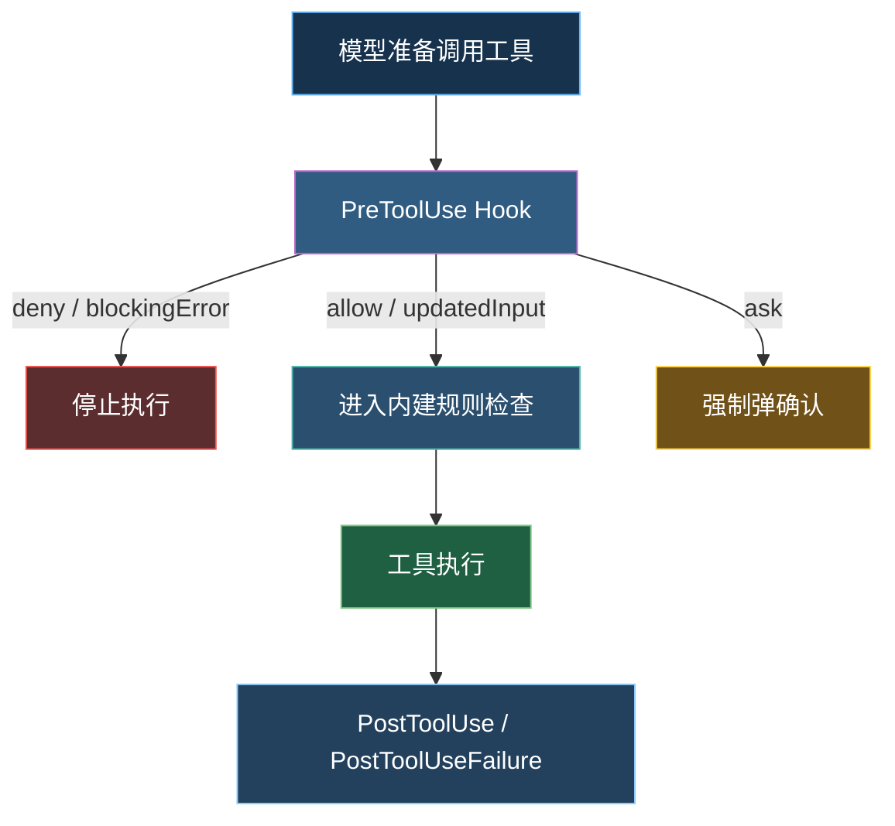
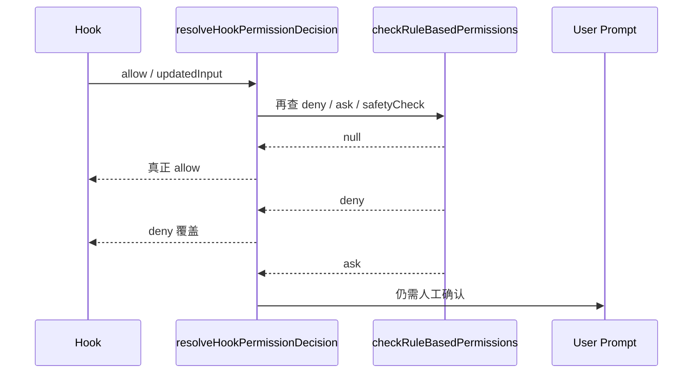
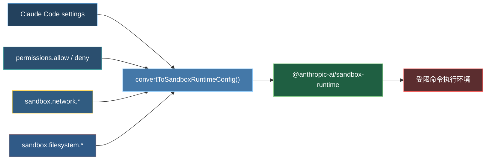
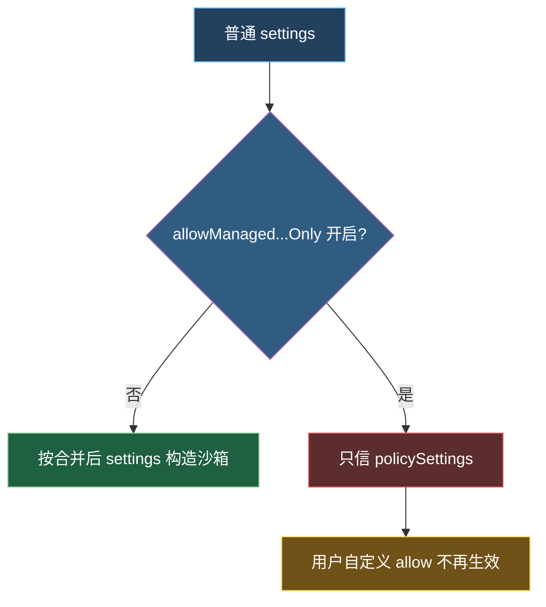
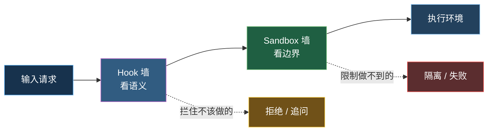

---
tags:
  - 沙箱
  - Hook
  - 第五编
---

# 第23章：沙箱与拦截：应用层之外的第二道墙

!!! tip "生活类比：化学实验室的安全柜"
    实验员再小心，也可能手抖；流程再完善，也可能有人判断失误。所以危险实验要放在安全柜里做。就算操作出错，泄漏也被控制在柜体内部。Claude Code 的沙箱就是这只“柜子”，Hook 则像柜门口的附加检查员。

!!! question "这一章先回答一个问题"
    如果上层权限判断失手了，Claude Code 还有什么办法把危险限制在小范围内？

这一章要讲两个互补系统：

- **Hook**：在应用层补充组织策略与自定义治理；
- **Sandbox**：在操作系统层提供最后的隔离边界。

---

## 23.1 Hook 不是“插件彩蛋”，而是安全闸门

`toolHooks.ts` 里最值得注意的一句注释是：**Hook 的 allow 不能绕过 settings.json 的 deny/ask 规则**。这几乎把它的定位讲透了。

Hook 在这里不是“想怎么改就怎么改”的扩展机制，而是：

- 能补充策略；
- 能修改输入；
- 能阻止继续；
- 但不能推翻更基础的安全边界。

### PreToolUse 到底能做什么

从 `runPreToolUseHooks()` 和 `resolveHookPermissionDecision()` 的逻辑看，PreToolUse Hook 主要有四种影响方式：

- 返回阻断错误，直接拒绝工具执行；
- 返回 `allow` 并可附带 `updatedInput`；
- 返回 `ask`，强制把这次操作抬升为人工确认；
- 不给权限结论，只修改输入，让后续正常权限流继续。

这种设计很聪明：Hook 有治理力，但不会把主系统变成一个“谁先写 Hook 谁说了算”的黑盒。

---

## 23.2 Hook 为什么要服从内建规则

`resolveHookPermissionDecision()` 的实现很有代表性。它专门处理一种很危险的情况：

> Hook 说 allow，但系统规则其实说 deny 或 ask。

源码的选择是：

- 如果 Hook allow，但规则层没有异议，才真的 allow；
- 如果规则层 deny，Hook allow 会被覆盖；
- 如果规则层 ask，仍然必须弹确认框。

这段逻辑非常值得读者记住，因为它体现了 Claude Code 的治理哲学：

- Hook 是“外加策略”；
- 内建规则是“底座边界”；
- 外加策略可以收紧，也可以补充，但不能把底座掀掉。

这和很多企业系统里的“审批流不能覆盖安全基线”是同一思路。

---

## 23.3 沙箱做的是另一种事：不是判断，而是隔离

Hook 负责判断，沙箱负责隔离。这两者不要混在一起。

`sandbox-adapter.ts` 做的核心工作，是把 Claude Code 内部的 settings / permission 语义，翻译成底层 sandbox runtime 能理解的配置：

- 网络允许哪些域名；
- 哪些目录可读、可写；
- 哪些 settings 文件必须拒写；
- 哪些 `.claude/skills` 路径要保护；
- 当前工作目录与原始工作目录有什么差异。

### 沙箱里最有味道的几条规则

从 `convertToSandboxRuntimeConfig()` 可以直接看到一些非常“实战派”的防护：

- 默认把当前目录和 Claude temp 目录加入可写；
- 始终拒写 settings 文件；
- 如果 cwd 变化了，还要补保护新的 `.claude/settings*.json`；
- 额外拒写 `.claude/skills`，因为技能和 commands/agents 一样会带来高权限能力；
- 对 git 内部结构进行专门保护，防止借 bare repo 结构逃逸。

这说明 Claude Code 的沙箱不是“给所有进程套个笼头”这么粗糙，而是很明确地围绕**自己系统里最危险的持久化点**来加固。

---

## 23.4 托管策略还能进一步收紧沙箱边界

`sandbox-adapter.ts` 里还有两条很重要的“组织收紧”逻辑：

- `allowManagedDomainsOnly`
- `allowManagedReadPathsOnly`

这类名字的含义很直白：当组织级 policy 打开后，允许访问哪些域名、哪些路径，不再由普通用户 settings 决定，而只看 managed settings。

这就是“应用层权限”与“组织级安全基线”真正接上的地方。不是只在 UI 里写一句“你所在组织禁用了此功能”，而是直接改变底层沙箱的构造方式。

---

## 23.5 两堵墙一起工作，才是可靠系统

如果只用 Hook，会有两个问题：

- Hook 可能写错；
- Hook 只在应用层，进程一旦真跑起来，还是靠环境约束。

如果只用沙箱，也有两个问题：

- 它不知道业务语义；
- 很多“该不该问用户”这种体验级判断不适合下沉到 OS。

所以最稳的结构，是两堵墙配合：

| 机制 | 擅长什么 | 不擅长什么 |
|---|---|---|
| Hook | 业务语义、组织策略、额外上下文 | 物理隔离 |
| Sandbox | 系统级隔离、目录/网络限制 | 高层语义判断 |

对初学者来说，可以把它记成一句最简单的话：

> Hook 负责“这件事该不该做”，沙箱负责“就算做了，也别跑出圈”。

!!! abstract "🔭 深水区（架构师选读）"
    这一章真正高级的地方，在于“Hook 不是万能管理员，Sandbox 也不是万能警察”。Claude Code 没有让两者互相替代，而是让它们互相补位：Hook 以语义为中心，Sandbox 以边界为中心。前者更像策略引擎，后者更像内核护栏。对任何带执行能力的 AI 平台，这都是值得直接借鉴的分层。

!!! success "本章小结"
    Claude Code 的第二道墙不是某一个文件，而是一种组合：Hook 负责应用层拦截，Sandbox 负责系统层隔离。两者共同确保“判断失误”不容易升级成“环境失控”。

!!! info "关键源码索引"
    - PreToolUse / PostToolUse 总线：`toolHooks.ts`
    - Hook 与规则合流：`toolHooks.ts`
    - PreToolUse 结果处理：`toolHooks.ts`
    - 内部 post-sampling hooks：`postSamplingHooks.ts`
    - 沙箱适配层入口：`sandbox-adapter.ts`
    - 路径规则翻译：`sandbox-adapter.ts`
    - 托管域名/路径限制：`sandbox-adapter.ts`
    - 沙箱配置转换：`sandbox-adapter.ts`

!!! warning "逆向提醒"
    OpenClaudeCode 这里调用的是外部包 `@anthropic-ai/sandbox-runtime`。我们能清楚看到 Claude Code 如何构造和使用沙箱配置，但更底层的运行时细节在这个仓库之外。
