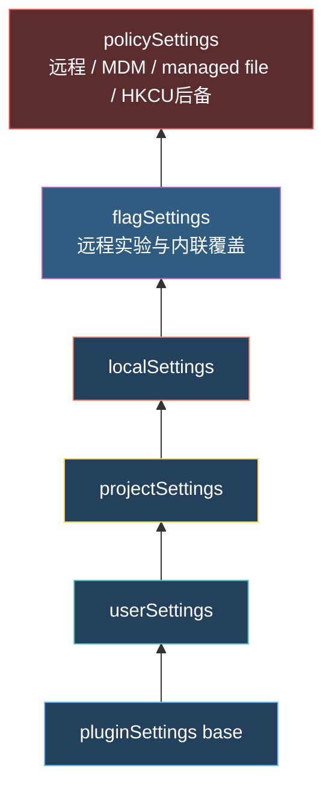
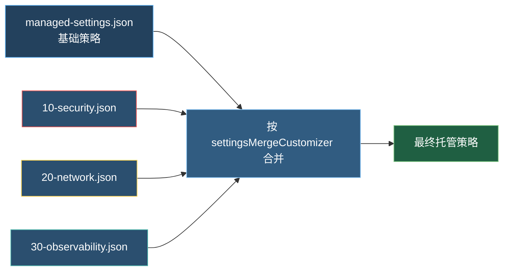
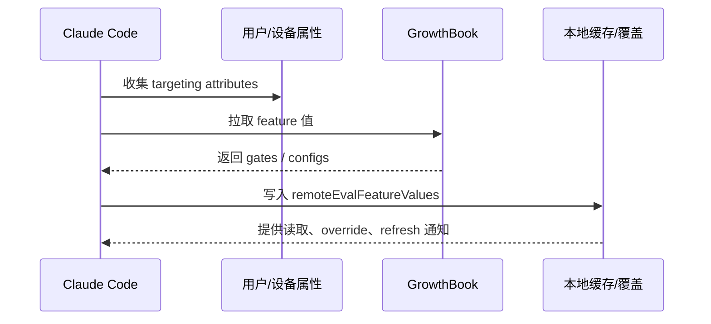
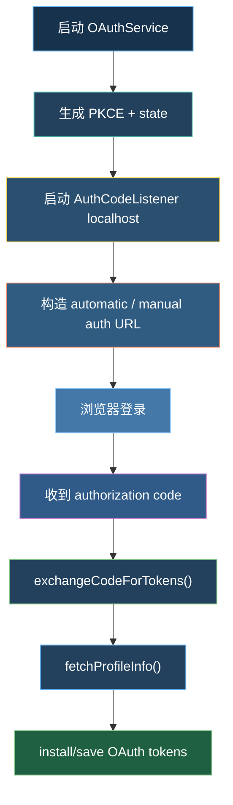
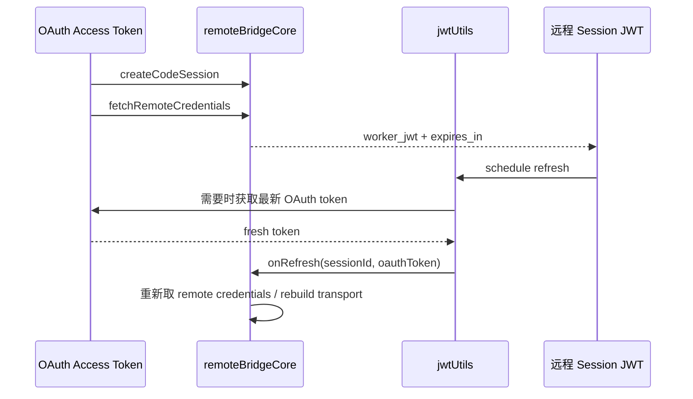
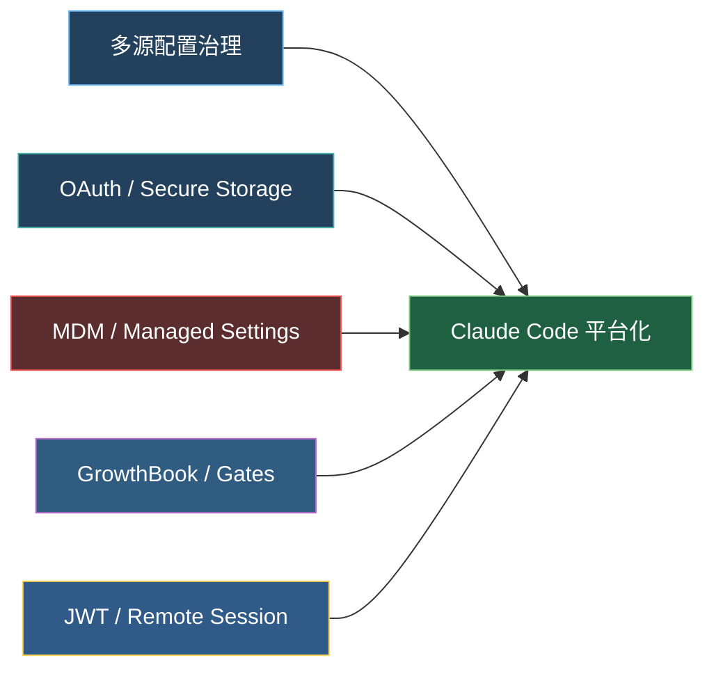

---
tags:
  - 配置治理
  - 认证
  - 第五编
---

# 第24章：配置与认证：谁能用，怎么管

!!! tip "生活类比：公司的门禁系统"
    一家公司不会只靠一把钥匙运转。员工工牌、访客证、楼层权限、总部策略、远程办公 VPN、门禁日志，全都要配合。Claude Code 的配置与认证系统也是这样：它解决的不只是“能不能登录”，而是“**谁的规则生效、谁的身份可信、令牌如何续命**”。

!!! question "这一章先回答一个问题"
    当配置散在多个来源、认证又跨 OAuth、secure storage、Bridge JWT 时，Claude Code 是怎么把它们收拢成一个体系的？

---

## 24.1 设置不是一个文件，而是一条优先级链

`settings.ts` 里最关键的不是某个 schema，而是**加载顺序**。Claude Code 会按优先级依次把不同来源叠起来，形成最终的 effective settings。

### `policySettings` 为什么最特殊

它不是简单的“再多一个配置文件”，而是“先选胜者，再整体生效”：

- 远程托管设置；
- macOS plist 或 Windows HKLM；
- `managed-settings.json` 与 `managed-settings.d/*.json`；
- 最后才是 Windows HKCU 作为低优先级兜底。

这段逻辑明显在服务企业部署场景。对普通用户来说，settings 更像偏好设置；对企业来说，settings 其实是**安全策略分发机制**。

---

## 24.2 `managed-settings.d` 这种细节，透露了很强的运维味道

`loadManagedFileSettings()` 不只读取一个 `managed-settings.json`，还会读取 `managed-settings.d/` 目录下的多个 drop-in 文件，并按文件名字母序合并。

这背后的思想非常像 Linux 生态里常见的：

- `systemd` drop-in
- `sudoers.d`
- Nginx `conf.d`

也就是说，Claude Code 的 managed settings 不是按“一个大 JSON 文件集中改”设计的，而是按“不同团队可以分别下发策略片段”设计的。

更进一步，`settingsMergeCustomizer()` 对数组用的是“拼接并去重”，而不是无脑替换。这样权限、Hooks、沙箱列表之类的数组配置就能自然叠加。

### 为什么写入又变成“数组直接替换”

`updateSettingsForSource()` 在写回某个 settings source 时，又故意对数组采用“由调用方给出最终状态，整体替换”的策略。这是为了避免局部 merge 带来的状态不一致。

简单说：

- **读配置**：尽量合并；
- **写配置**：尽量精确。

这是一种很有经验的工程取舍。

---

## 24.3 GrowthBook 不是花哨开关，而是运行时治理入口

前面很多章已经见过 feature gate，这一章要把它放回配置治理里看。

`services/analytics/growthbook.ts` 说明了几件事：

- GrowthBook 客户端带着用户与设备属性做远程评估；
- feature 值会被缓存；
- 支持环境变量覆盖；
- 支持本地 config override；
- 刷新后还能通知长期驻留对象重建。

这解释了为什么像 `auto mode`、`bypassPermissions`、某些默认模型之类的行为，不全是硬编码在本地配置里的。Claude Code 把一部分运行时治理交给了远程配置系统。

从产品角度看，这非常重要：

- 出问题时能快速熔断；
- 新特性能灰度发布；
- 企业或内部用户能有不同策略。

---

## 24.4 OAuth 登录链：从浏览器到 secure storage

`OAuthService` 做的是标准但完整的 OAuth 2.0 Authorization Code + PKCE 流程：

- 生成 `code_verifier` 与 `code_challenge`
- 启动本地回调监听
- 同时准备自动跳转 URL 和手动复制 URL
- 拿到 authorization code 后交换 token
- 再取 profile 信息并格式化成本地 token 结构

这里的“体验优化”也很有意思：

- 同时支持自动回调和手动贴码；
- `keychainPrefetch.ts` 在 macOS 上会并行预取 keychain 里的两类凭据，尽量把几十毫秒启动成本藏在主模块加载期间；
- `saveOAuthTokensIfNeeded()` 又会把 token 写进 secure storage，而不是依赖纯内存。

也就是说，Claude Code 对认证的目标不是“能登进去”，而是：

- 首次登录要稳；
- 下次启动要快；
- 多终端刷新要尽量不互相打架。

---

## 24.5 401、刷新锁与 JWT：真正难的是长期会话

一旦会话变长，真正的麻烦就不是登录，而是**持续保持有效身份**。

### OAuth token 刷新

`auth.ts` 里能看到一整套“多进程别互相抢刷”的机制：

- 401 时先清缓存，重新从 secure storage 读；
- 如果发现别的进程已经刷新过，就直接复用；
- 真的要刷新时，会加锁，避免多个进程同时刷新；
- 刷新完成后再回写 secure storage 并清掉 memoize/cache。

### Bridge JWT 刷新

远程桥接还有一层 session JWT。`jwtUtils.ts` 负责：

- 解码 `exp`
- 提前一定 buffer 安排刷新
- 在无法解码时用 fallback interval
- 失败后重试
- cancel / cancelAll 以防孤儿定时器

这也是为什么 `remoteBridgeCore.ts` 里会有专门的 `recoverFromAuthFailure()`：远程会话不是浏览器里一次请求结束就算了，它是长连接，是要和过期、掉线、唤醒、401 一直周旋的。

---

## 24.6 把这些放在一起看，就会发现它其实在做“平台治理”

这一章最容易被误读成“杂项收尾”。其实恰好相反，它是 Claude Code 从个人 CLI 走向平台级产品的关键基础设施。

如果没有这些能力，Claude Code 充其量是：

- 一个本地好用的 AI CLI；
- 一个单人开发者工具；
- 一个短会话的命令行助手。

而有了这些能力，它才可能变成：

- 可治理的组织工具；
- 可远程控制的会话平台；
- 可灰度、可熔断、可统一策略下发的产品。

!!! abstract "🔭 深水区（架构师选读）"
    这一章最值得带走的设计思想是“配置、认证、远程会话不是边角料，而是平台骨架”。很多工程团队前期把这些内容当杂务，最后产品越做越大时被迫重构。Claude Code 源码里反而很早就把 settings source、managed policy、OAuth refresh、Bridge JWT refresh 这些通路理顺了，这也是它能承载企业级场景的重要原因。

!!! success "本章小结"
    Claude Code 的配置与认证系统回答了三个问题：规则从哪里来、谁说了算、身份怎么长期有效。把这三件事理顺之后，前面几章讲的权限、沙箱、自动模式才真正有了落点。

!!! info "关键源码索引"
    - managed file 与 drop-ins：`settings.ts`
    - 设置写回与替换策略：`settings.ts`
    - settings 合并与优先级：`settings.ts`
    - 从磁盘加载全部 settings：`settings.ts`
    - MDM 首源优先逻辑：`mdm/settings.ts`
    - 托管路径约定：`managedPath.ts`
    - GrowthBook 客户端与缓存：`growthbook.ts`
    - OAuthService 与 PKCE：`oauth/index.ts`
    - 授权 URL 与 token 交换：`oauth/client.ts`
    - macOS keychain 预取：`keychainPrefetch.ts`
    - OAuth token 保存与 401 刷新：`auth.ts`
    - Bridge JWT 刷新调度：`jwtUtils.ts`
    - 远程凭据与 401 恢复：`remoteBridgeCore.ts`

!!! warning "逆向提醒"
    这一章覆盖了很多“跨目录协作”的基础设施。它们单个文件看起来像杂项，但组合起来才构成完整治理体系。阅读时不要只盯着某一个 `settings.ts` 或 `auth.ts`，要沿着调用链一起看。
