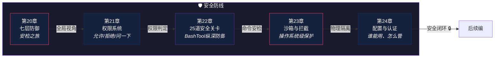

# 第五编：安全防线

> *机场安检：行李过 X 光、人过安检门、可疑物开箱检查——没有单一防线是完美的，但层层叠加后威胁穿透的概率趋近于零。*
>
> 本编解剖 Claude Code 的安全架构：**七层防御体系**、**权限判定系统**、**BashTool 25 道安全关卡**、**操作系统级沙箱**、**配置与认证**。

---

## 本编总览

---

## 本编五章速览

| 章 | 标题 | 核心问题 | 生活类比 |
|---|------|----------|----------|
| 20 | [七层防御](chapter20.md) | 一个能执行 `rm -rf` 的 AI，你敢用吗？ | 机场七层安检 |
| 21 | [权限系统](chapter21.md) | 为什么有的操作直接执行、有的要问、有的直接拒绝？ | 手机权限弹窗 |
| 22 | [25道安全关卡](chapter22.md) | 25 道关卡具体每道检查什么？能全部绕过吗？ | 银行金库25道门禁 |
| 23 | [沙箱与拦截](chapter23.md) | 应用层检查不够，操作系统还能做什么？ | 化学实验室安全柜 |
| 24 | [配置与认证](chapter24.md) | 配置散在5个地方、认证散在3个协议——怎么管？ | 公司门禁系统 |

---

## 设计思想主线

!!! tip "本编建立的认知基础"
    1. 信任不靠承诺建立，靠**架构**建立——假设 AI 随时可能犯错
    2. 七层独立防线确保**即使 AI 犯错，错误也会被拦截**
    3. 权限判定不是随机的——**三级分类（直接执行/需确认/直接拒绝）**有精确的判定逻辑
    4. BashTool 的 25 道安全关卡是**纵深防御的教科书级实现**
    5. 操作系统级沙箱是**最后一道物理防线**——即使应用层被攻破

---

## 推荐路径

=== "🌱 初学者"

    第20章的七层防御提供了全局视角——**先理解"为什么需要这么多层"**。

=== "🔧 开发者"

    第21章的权限系统和第22章的安全关卡是**构建安全 AI 应用的实战参考**。

=== "🏗️ 架构师"

    第23章的沙箱设计和第24章的配置架构展示了**企业级安全的完整方案**。

!!! note "即将上线"
    本编内容正在写作中，敬请期待。
