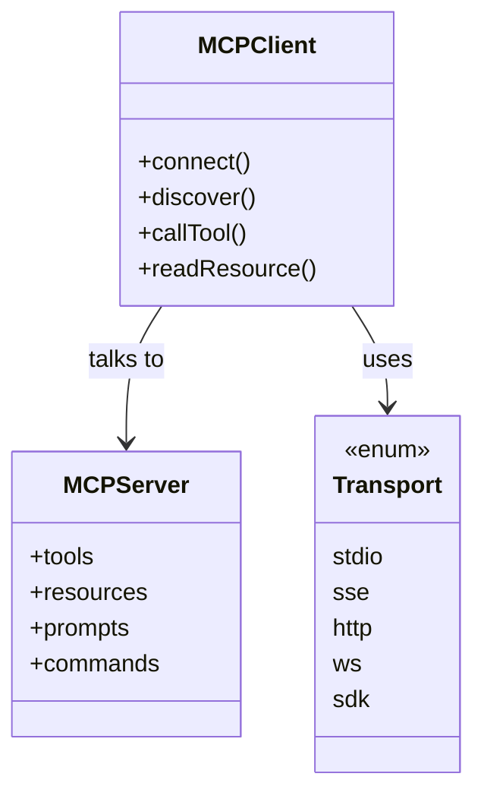
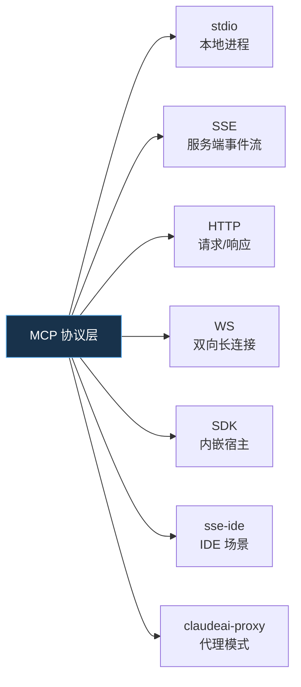
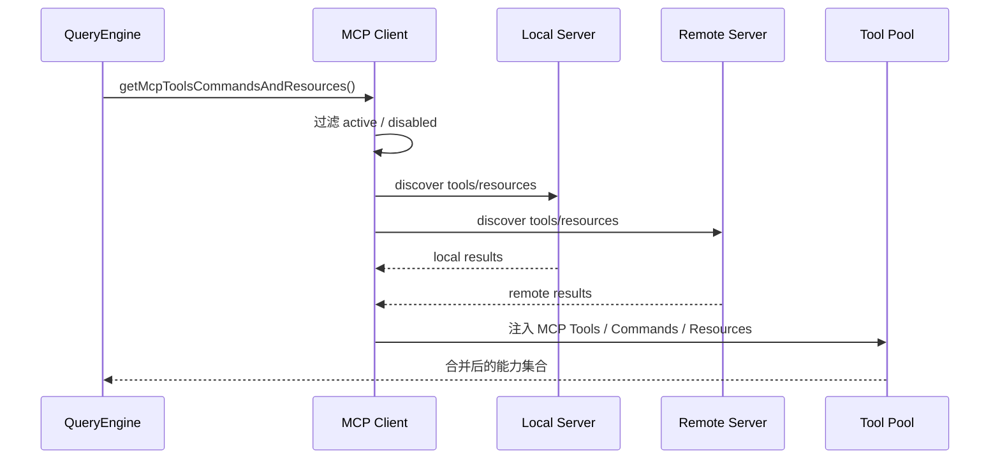
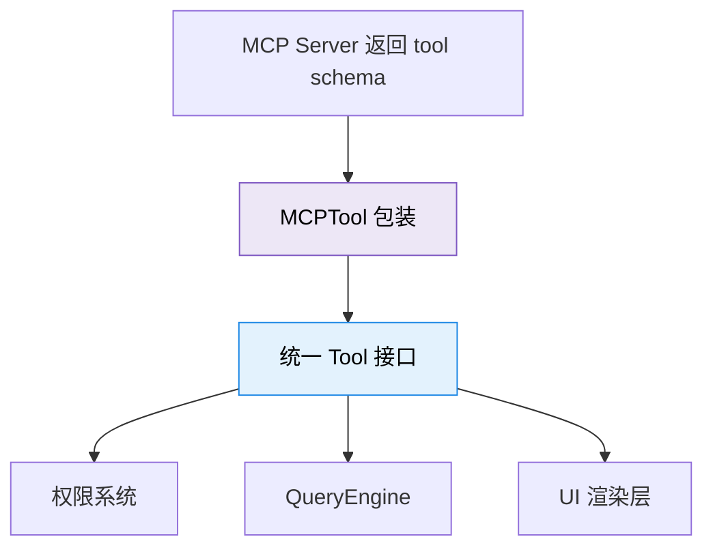

---
tags:
  - MCP
  - 第六编
---

# 第25章：MCP 协议：AI 时代的 USB

!!! tip "生活类比：USB 接口"
    在 USB 出现之前，键盘、鼠标、打印机、相机各有各的接口。统一标准之后，电脑不用提前认识每一种设备，也能把它们接进来。MCP 对 AI 工具生态做的，就是这件事。

!!! question "这一章先回答一个问题"
    Claude Code 已经有很多内置工具了，为什么还要再搞一层 MCP 协议，把外部服务接进来？

Claude Code 的答案是：**内置工具解决“常见能力”，MCP 解决“无限扩展”**。你不可能把企业内网、数据库、工单系统、设计平台、测试平台全都内建进一个 CLI，但你可以给它们一个统一接口。

---

## 25.1 MCP 不是“又一个插件系统”，它先解决的是语言统一

MCP 在源码里被拆成几类核心对象：

- Server 配置
- Transport 传输方式
- Tools / Resources / Prompts / Commands 四类能力
- Client 侧发现、缓存、调用和错误恢复

在 ``types.ts`` 里，Claude Code 先把这些概念用类型固定下来，再在 `client.ts` 里把它们串成真正的运行流程。

从读者角度看，最关键的是别把 MCP 只理解成“远程工具”。它实际上想统一四种东西：

| 能力 | 你可以把它理解成什么 |
|---|---|
| Tool | 一个能被调用的动作 |
| Resource | 一份可读取的数据 |
| Prompt | 一段预制好的上下文模板 |
| Command | 一条用户可直接触发的入口 |

这意味着 MCP 接进来的不只是“能做事的手”，还有“能读的资料”和“能启动的入口”。

---

## 25.2 七种传输方式，背后是“同一协议，不同水管”

源码里最醒目的一个细节，是 `Transport` 并不只有一种。`types.ts` 明确列出了 `stdio`、`sse`、`sse-ide`、`http`、`ws`、`sdk`，还配套了不同的 server config 变体。

为什么要这么多传输？

- 本地命令型服务，最适合 `stdio`
- 长时间推送事件的服务，适合 `SSE`
- 已有 Web 服务的系统，适合 `HTTP`
- 需要实时双向通信的系统，适合 `WS`
- 嵌入式宿主或内部集成，适合 `SDK`

所以这里不是“协议设计不统一”，恰恰相反，是**上层统一，下层适配现实世界**。

---

## 25.3 真正复杂的地方不在调用，而在发现与装配

MCP 的难点不是“发个 JSON-RPC 请求”，而是：系统如何知道现在有哪些服务连着、每个服务暴露了什么、是否可用、哪些要变成工具、哪些要变成命令。

``client.ts`` 里的 `getMcpToolsCommandsAndResources()` 就在做这件事。它会：

1. 区分 active 和 disabled servers
2. 按本地 / 远程特征分组
3. 并发拉取每个 server 的 tools、commands、skills、resources
4. 在资源能力存在时，自动补进 `ListMcpResourcesTool` 和 `ReadMcpResourceTool`
5. 把这些结果折叠进 Claude Code 自己的工具池和命令系统

这里特别能体现 Claude Code 的工程取向：它没有把 MCP 当成“外面那一套”，而是把它当成**原生能力的延伸层**。

---

## 25.4 MCPTool 的价值，是把“外部工具”伪装成“系统内工具”

`MCPTool.ts` 很短，但意义很大。它不是为某个具体工具写业务，而是做一层**协议转译**：

- 外部 server 说“我有个名叫 x 的工具”
- Claude Code 把它包装成内部 `Tool` 接口
- 后面的权限、UI、进度、结果渲染继续按统一路径走

这就是为什么从模型角度看，内置工具和 MCP 工具“长得几乎一样”。统一接口把生态复杂度压在了系统内部，而不是扔给模型。

---

## 25.5 设计取舍：开放生态最怕的不是慢，而是失控

MCP 把能力接进来以后，马上会遇到三个问题：

1. 一个外部工具是否应该出现在当前会话里？
2. 一个外部资源是否能被当前用户读到？
3. 一个外部命令是否应该直接出现在 `/` 菜单里？

Claude Code 的处理方式很成熟：**先发现，再包装，再纳入原有治理系统**。它没有单独再造一套“外部工具特权通道”。

这也是读源码时最值得学的一点：平台化不是“什么都能接”，而是“接进来以后仍然受系统秩序约束”。

!!! abstract "🔭 深水区（架构师选读）"
    MCP 在 Claude Code 里最有价值的，不是“支持外部协议”这件事本身，而是它证明了一个 CLI 型 Agent 也能长成平台。协议、类型、发现、统一工具接口、资源读写、命令透出，这些组合在一起，构成的是一个可扩展 Agent 运行时，而不只是一个会说话的命令行程序。

!!! success "本章小结"
    MCP 让 Claude Code 从“自带一组工具的产品”升级成“可接入外部能力的平台”。它的重点不是炫技，而是把多种传输和多类能力统一进既有的工具与命令体系。

!!! info "关键源码索引"
    - MCP 类型与传输枚举：`types.ts`
    - Server 配置与作用域定义：`types.ts`
    - 发现并合并工具/命令/资源：`client.ts`
    - 资源工具自动补齐：`client.ts`
    - MCPTool 统一包装层：`MCPTool.ts`

!!! warning "逆向提醒"
    MCP 相关类型和客户端代码在还原层里相对完整，但具体 server 端行为不在本仓库中。本章分析的是 Claude Code 作为 MCP Client 的实现，而不是所有外部 MCP Server 的真实能力边界。
