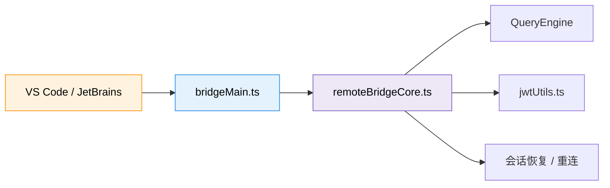
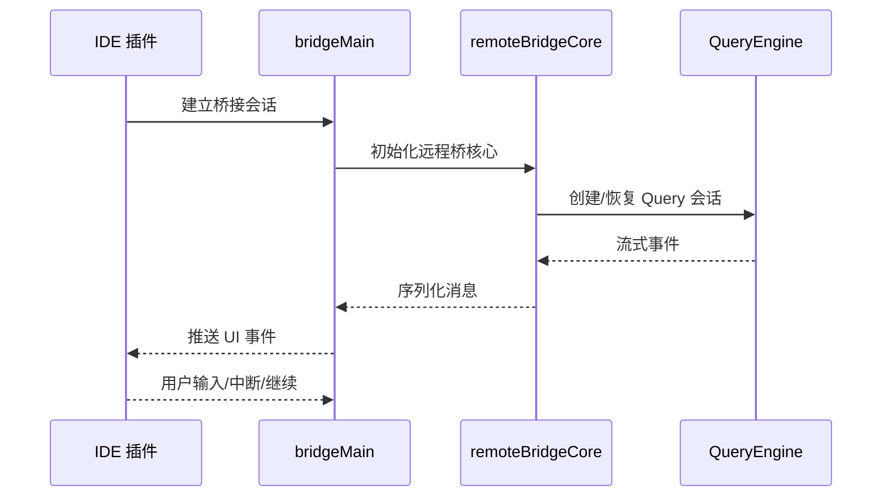
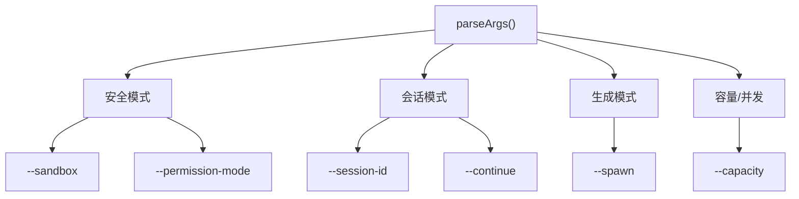
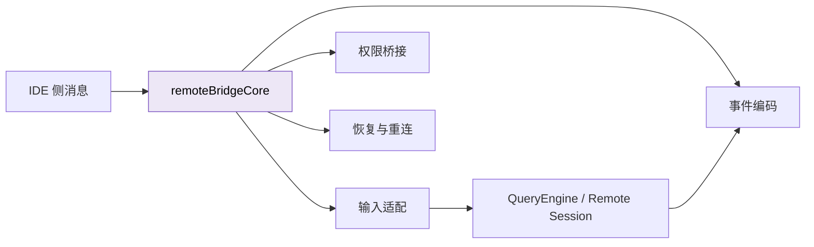
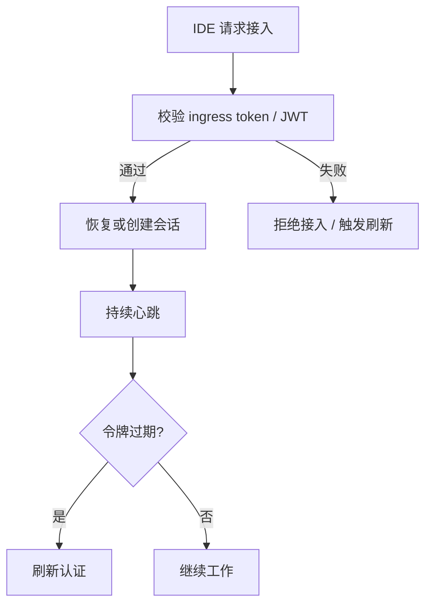
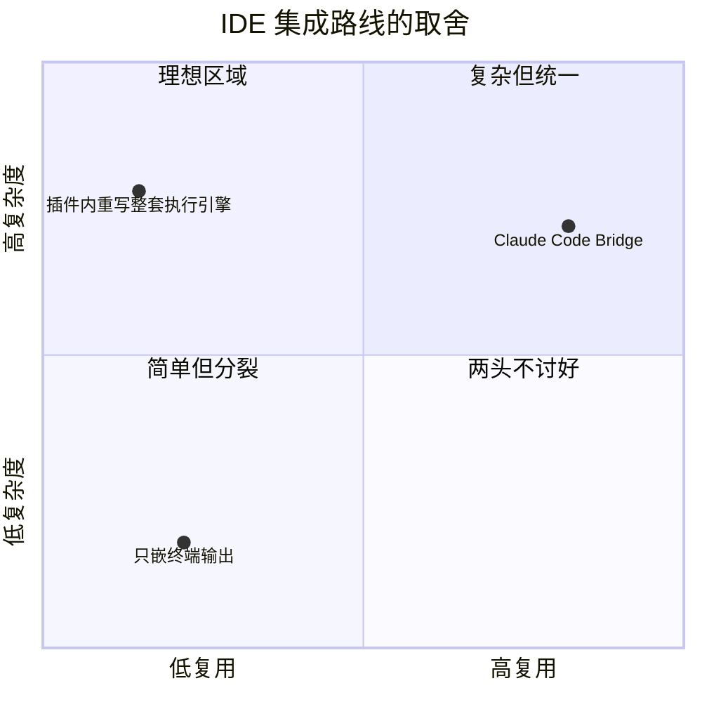

---
tags:
  - Bridge
  - 第六编
---

# 第26章：IDE 桥接：一座把 CLI 接到编辑器的桥

!!! tip "生活类比：电话的三代演进"
    固定电话解决了“远距离通话”，移动电话解决了“人不能被线拴住”，智能手机又把通信、应用和持续连接合成到了一起。Claude Code 的桥接系统，也是在一次次迭代里把 CLI 的能力送进 IDE。

!!! question "这一章先回答一个问题"
    一个本质上跑在终端里的工具，为什么要维护一大块桥接代码，还要处理会话、认证、重连、恢复和远程模式？

因为真正的开发现场不只在终端里。程序员写代码、看 diff、点文件、读报错，大多发生在编辑器里。Claude Code 如果不能把能力稳定地“伸进 IDE”，它就永远只是一把好用但割裂的外部工具。

---

## 26.1 Bridge 不是装饰层，而是“第二个入口”

从源码结构看，`bridgeMain.ts` 并不是轻飘飘的 adapter。它更像一个独立入口：

- 维护会话
- 解析命令行参数
- 管理 ingress token
- 接收 IDE 侧消息
- 与主执行引擎交换事件

这说明桥接层不是“把终端输出贴到侧边栏里”，而是另一种会话宿主。

---

## 26.2 `runBridgeLoop()` 解决的是“长连接世界”的问题

在 ``bridgeMain.ts`` 里，`runBridgeLoop()` 会持续处理活跃会话、token、兼容 ID、心跳和断线恢复。

它面对的是编辑器场景下典型的几类不稳定因素：

- IDE 进程重启
- 插件更新
- 网络波动
- 登录状态变化
- 一个项目里存在多个并发会话

这里最值得注意的是“恢复”二字。终端里一次断开，用户大不了重开；IDE 里如果每次焦点切换、插件刷新都丢上下文，体验就彻底崩了。

---

## 26.3 参数解析说明：桥接层其实支撑了很多模式

`parseArgs()` 并不只认一个简单的 `--bridge`。它还要处理：

- `--sandbox`
- `--permission-mode`
- `--session-id`
- `--continue`
- `--spawn`
- `--capacity`
- `--create-session-in-dir`

这些参数背后的意思很直白：桥接层必须能启动新会话、接管旧会话、按不同安全模式运行，还得为多实例场景留余地。

所以你可以把 Bridge 理解成：**为 IDE 场景重新包了一层更可控的 CLI 外壳**。

---

## 26.4 `remoteBridgeCore` 才是桥中间那块真正承重的钢梁

`bridgeMain.ts` 偏入口和宿主管理，`remoteBridgeCore.ts` 更像“协议和状态中心”。

它要做三件重活：

1. 把 IDE 消息翻译成 Claude Code 能吃的事件
2. 把 Claude Code 产生的流式事件，重新编码成 IDE 可消费的结构
3. 处理远程权限、认证刷新、会话恢复等复杂情形

这就是为什么桥接代码会长。它不是业务重复，而是**交互边界一旦变成“跨进程 + 跨宿主 + 可能跨网络”，复杂度就会指数上升**。

---

## 26.5 JWT 和 ingress token：桥不是谁都能走的

如果桥接系统只是“谁都能连进来”，那它就会变成一条安全后门。所以桥接层还要配合 ``jwtUtils.ts`` 处理身份和有效期。

从设计思想上说，这很像“内部系统也要零信任”。即便是本地 IDE 发来的请求，也不能默认安全。

---

## 26.6 设计取舍：为什么不用“更简单”的办法

你也许会想，为什么不直接让 IDE 插件自己集成模型调用，而一定要桥接到 CLI？

Claude Code 的答案很工程化：

- CLI 已经拥有完整的工具系统、权限系统、记忆系统
- 桥接复用这套核心，比在 IDE 里重写一遍更稳
- 统一宿主有助于让终端、SDK、IDE 三种入口共享同一个 QueryEngine

它承担了更高的桥接复杂度，换来的是核心能力只维护一份。这对长期演化是更划算的。

!!! abstract "🔭 深水区（架构师选读）"
    桥接层最值得借鉴的，不是具体的协议细节，而是“把 CLI 当成能力内核，把 IDE 当成宿主界面”的分层思想。真正昂贵的是执行引擎、一致性和治理能力，UI 宿主反而应该尽量薄。Claude Code 把这个分层做得很彻底。

!!! success "本章小结"
    Bridge 让 Claude Code 不再只是一个终端工具，而是一套可被 IDE 托管的会话系统。入口、协议、认证、恢复、重连看起来繁琐，但正是这些细节决定了编辑器内体验是否稳定。

!!! info "关键源码索引"
    - Bridge 主循环：`bridgeMain.ts`
    - 桥接参数解析：`bridgeMain.ts`
    - 远程桥核心初始化：`remoteBridgeCore.ts`
    - 桥接消息与会话处理：`remoteBridgeCore.ts`
    - 远程会话恢复末段逻辑：`remoteBridgeCore.ts`
    - JWT 工具：`jwtUtils.ts`

!!! warning "逆向提醒"
    Bridge 代码很完整，但 IDE 插件本体不在这个仓库里。本章能讲清 Claude Code 这一端“如何被接入”，却无法完全覆盖每个编辑器宿主的 UI 细节与扩展实现。
