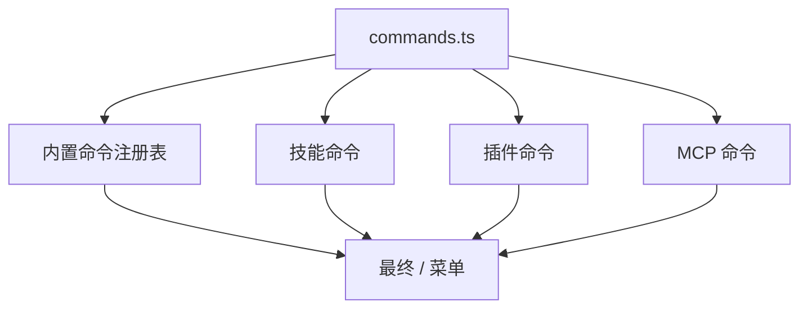
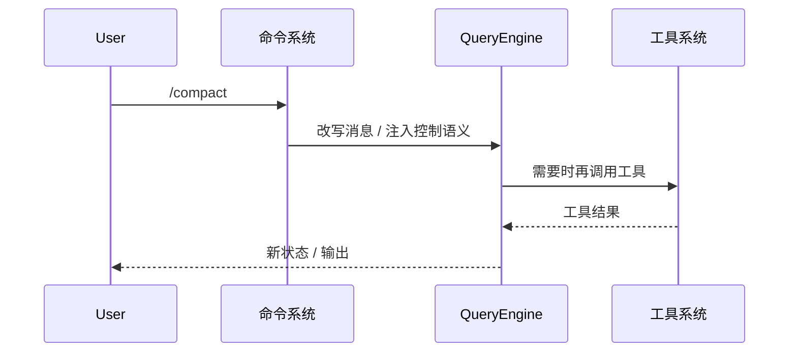
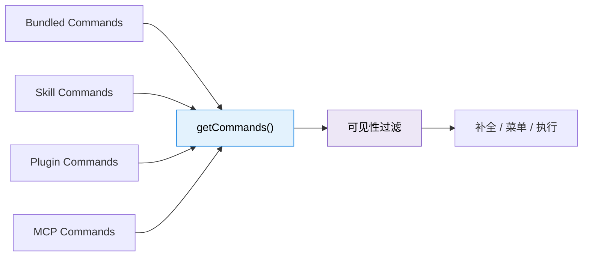
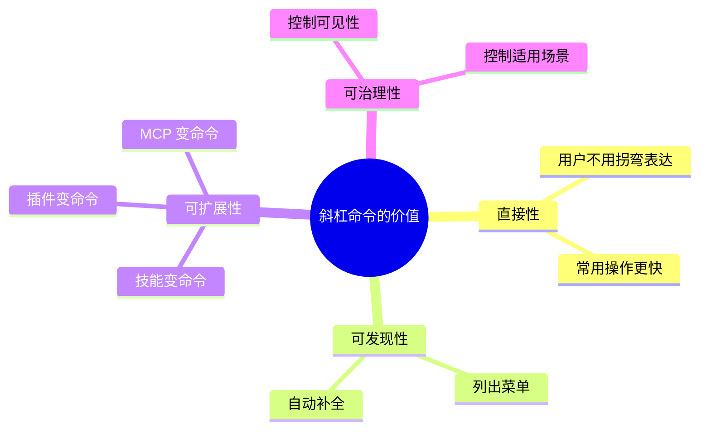
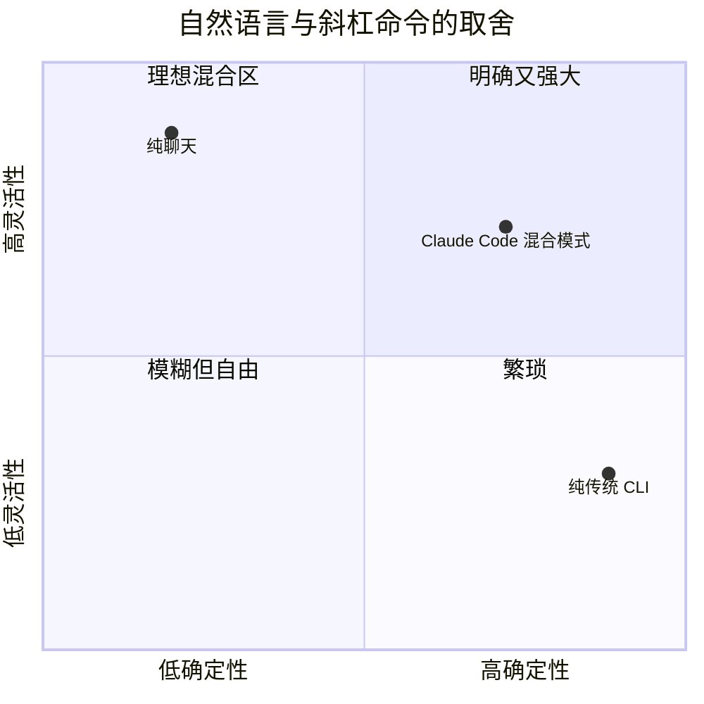

---
tags:
  - Commands
  - 第六编
---

# 第27章：斜杠命令：你给系统的直接指令

!!! tip "生活类比：餐厅菜单"
    厨房会自己决定火候，但不会自己决定你今天吃宫保鸡丁还是番茄炒蛋。菜单给顾客直接表达意图的入口。Claude Code 的斜杠命令，也是在给用户保留“直接下指令”的通道。

!!! question "这一章先回答一个问题"
    工具是 AI 在循环里自主调用的，命令是用户显式敲出来的。这两套入口为什么要并存？边界到底在哪里？

答案很关键：**工具负责执行，命令负责发令**。工具偏向“Agent 的手”，命令偏向“用户的嘴”。看懂这点，你就不会再把 `/compact`、`/batch`、`/config` 这种能力和 Bash、Read、Edit 混为一谈。

---

## 27.1 `commands.ts` 是菜单，不是厨房

``commands.ts`` 集中定义了内置命令注册表。源码里最直观的感受，就是它很“显式”：

- 每条命令都有名称和描述
- 命令是否可见、是否可用可以被过滤
- 之后还会和技能命令、插件命令、MCP 命令一起合并

这说明 `/` 不是“写死的一串命令”，而是一个会动态扩展的命令空间。

---

## 27.2 为什么命令不能直接等于工具

命令和工具最大的差别在于触发者：

| 维度 | 命令 | 工具 |
|---|---|---|
| 触发者 | 用户 | 模型 |
| 目的 | 直接表达意图 | 执行中间步骤 |
| 生命周期 | 通常是入口动作 | 常嵌在 Agent Loop 中 |
| 展示位置 | `/` 菜单、帮助、补全 | 系统提示和工具池 |

所以 `/config` 不等于某个工具，`/memory` 也不只是一个读文件动作。命令常常是**高层语义入口**，会触发一段更复杂的流程。

这就是为什么 Claude Code 同时保留两层抽象，而不是把一切都糊成“都是调用”。

---

## 27.3 真正有意思的是“命令注册表会继续长”

在 ``commands.ts`` 之后，系统还会把：

- 技能目录里生成的命令
- 插件暴露的命令
- MCP server 提供的命令

继续合并进来。`loadAllCommands()` 和 `getCommands()` 做的，就是从“内置命令世界”走向“动态命令世界”。

这很像一个现代编辑器的 Command Palette：你看到的是统一入口，背后则是多来源拼装。

---

## 27.4 命令系统为什么比看起来更重要

如果没有命令系统，Claude Code 就会变成纯聊天产品。你要做的每件事都得“绕一圈说出来”。有了命令系统以后，它变成了：

- 聊天式 Agent
- 命令式工具
- 可编排的 CLI

三者合体的产品。

这里的产品哲学很清楚：Claude Code 不想把所有交互都推给“自然语言理解”。它承认有些动作就应该有明确入口。

---

## 27.5 `loadSkillsDir` 告诉我们：命令也可以是“文档驱动生成”的

这一章最漂亮的一点，藏在技能系统和命令系统的连接处。`loadSkillsDir.ts` 会把带 frontmatter 的技能定义，变成真正能执行的命令。

这意味着：

- 命令不一定都要手写一大段 TypeScript
- 一部分命令可以由结构化文档生成
- 命令系统因此具备很强的生态扩展性

所以 Claude Code 的命令系统不是“纯代码注册”，而是“代码注册 + 文档注册”的混合体。

---

## 27.6 设计取舍：为什么菜单要显式，而不是全部自然语言

自然语言很灵活，但也很模糊。命令恰好相反：不够自由，却很明确。

Claude Code 选择的是中间路线：

- 想探索，就自然语言
- 想直达，就 `/` 命令
- 想自动执行，就让 Agent 去调用工具

三种方式各有位置，不互相取代。

!!! abstract "🔭 深水区（架构师选读）"
    命令系统的真正价值，不是“提供一堆快捷方式”，而是给产品增加第二种交互语法。用户、模型、插件、MCP 都能围绕这套语法继续扩展。长期看，这比完全押注自然语言更稳，也更适合工程产品。

!!! success "本章小结"
    斜杠命令是 Claude Code 的用户控制面。它把高频动作变成明确入口，又通过命令合并机制让技能、插件和 MCP 继续长进来，最终形成统一的命令空间。

!!! info "关键源码索引"
    - 内置命令注册表：`commands.ts`
    - 技能与插件命令合并：`commands.ts`
    - 可用性过滤：`commands.ts`
    - 统一加载入口：`commands.ts`
    - MCP Skill 命令拼接：`commands.ts`

!!! warning "逆向提醒"
    目录统计里常见“87 个命令目录”和“88 个命令”的说法，差异通常来自隐藏命令、动态命令和门控命令。读源码时要区分“目录里存在”与“运行时会出现”这两个概念。
