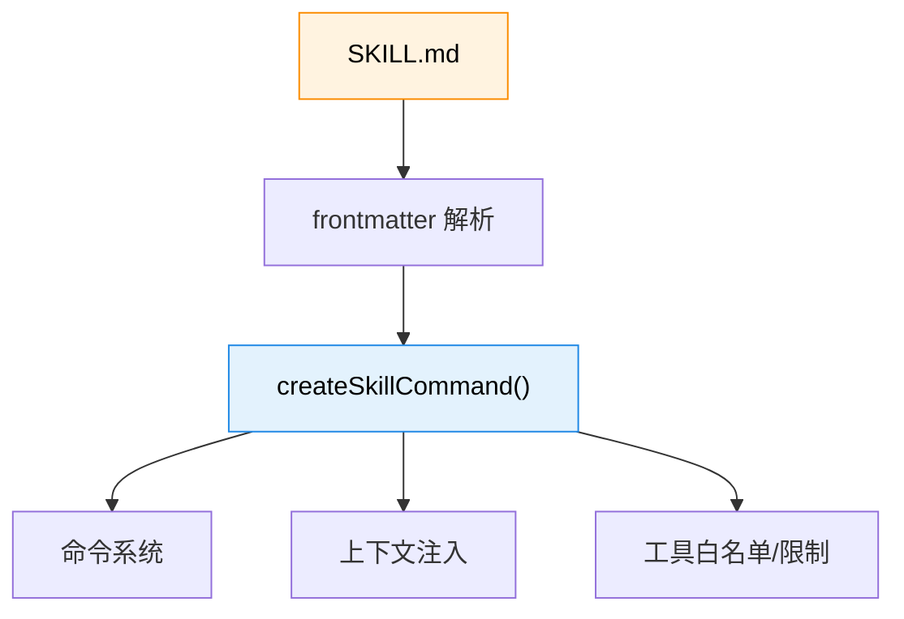
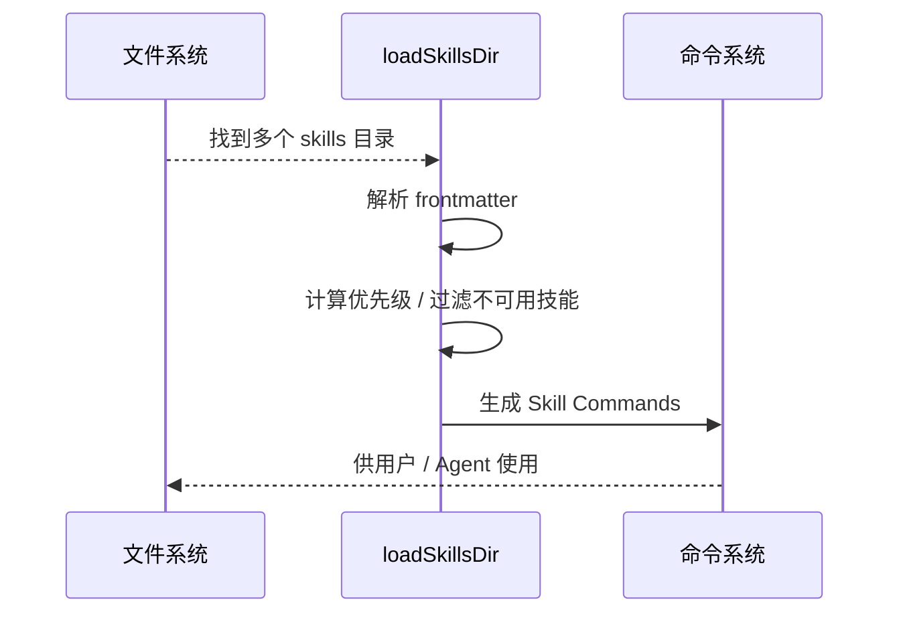
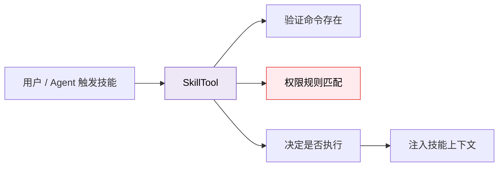
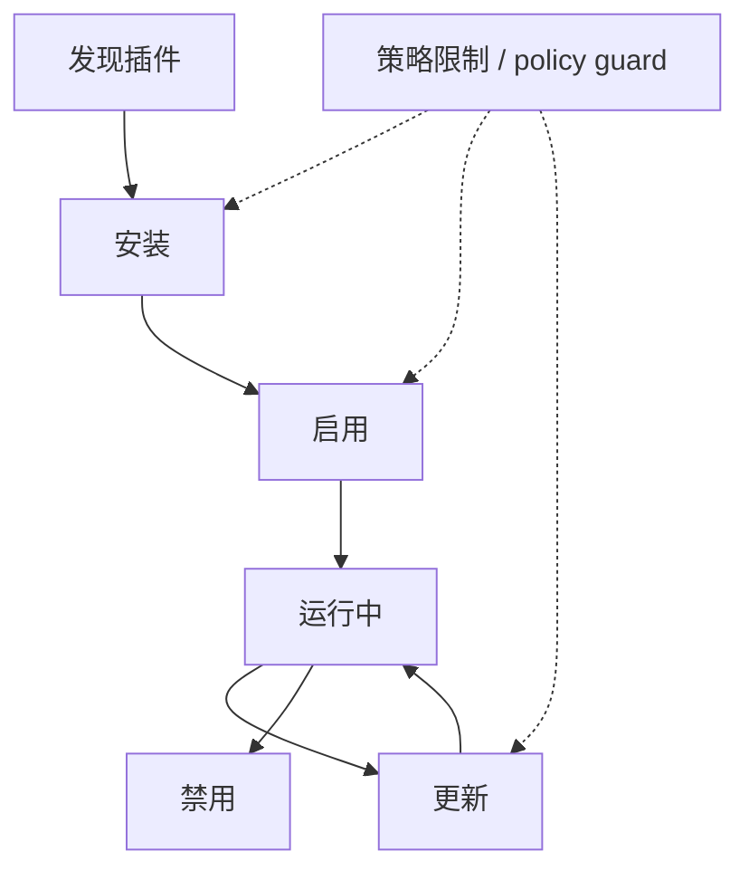
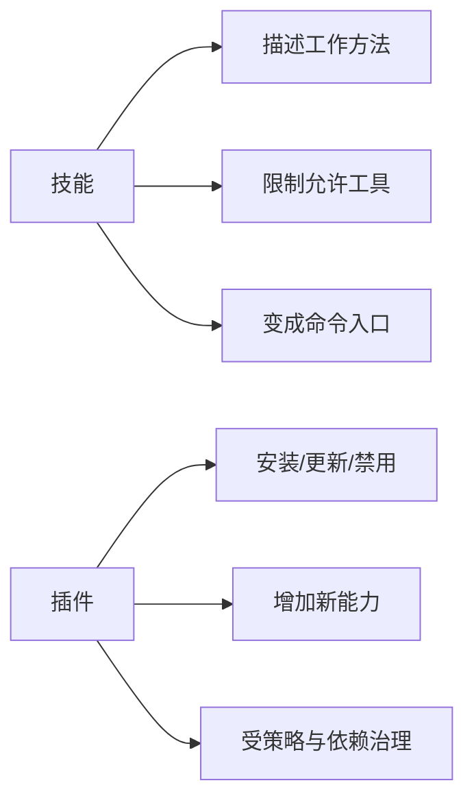
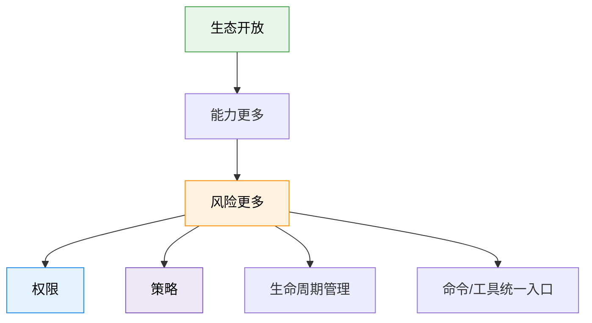

---
tags:
  - Skills
  - Plugins
  - 第六编
---

# 第28章：技能与插件：安全地扩展能力边界

!!! tip "生活类比：App Store"
    开放生态让手机变得强大，但如果任何 App 都能随便读通讯录、偷偷驻留后台、改系统设置，手机也会很快失控。Claude Code 的技能与插件系统面对的是同一个难题。

!!! question "这一章先回答一个问题"
    当第三方也能往 Claude Code 里加能力时，系统怎么做到既开放，又不把安全边界打穿？

答案不在单一审核环节，而在整套设计里：**技能是轻量提示封装，插件是带生命周期的扩展单元，最终都要回到权限、命令、工具这三条治理链里。**

---

## 28.1 技能系统的本质，是把“经验”变成可调用单元

`loadSkillsDir.ts` 里最有意思的，不是扫描文件夹，而是 frontmatter 字段非常丰富：

- `description`
- `allowed-tools`
- `argument-hint`
- `arguments`
- `when_to_use`
- `model`
- `hooks`
- `context=fork`
- `agent`
- `effort`
- `shell`

这说明技能不是一段随手写的 prompt，而是有元数据、有触发条件、有工具约束的结构化资产。

从写书角度，这一层特别值得强调：Claude Code 把“经验与流程”也当成可编排对象，而不仅仅把“代码和命令”当成对象。

---

## 28.2 技能发现机制透露了很强的项目感知能力

`loadSkillsDir.ts` 不只是读一个固定目录。它还会：

- 递归寻找 `.claude/skills`
- 按路径深度处理优先级
- 跳过 gitignore 目录
- 根据 project settings 和 plugin-only 规则决定是否启用

这意味着 Claude Code 的技能不是“全局一锅端”，而是可以跟着项目、目录和上下文变化的。

---

## 28.3 `SkillTool` 说明：技能不是纯文本，它也受权限治理

``SkillTool.ts`` 做的事情很关键：

- 校验技能命令是否存在
- 检查 deny / allow 规则
- 对远程 canonical skill 走自动放行等特定逻辑

也就是说，技能虽然长得像“提示词模板”，但执行时仍然是系统能力的一部分，必须受治理。

这和很多“提示词市场”最大的不同，就是它不是野生文本拼装，而是纳入了宿主系统的安全模型。

---

## 28.4 插件系统关心的，是安装、启用、升级、禁用这些“生命周期”

在 ``pluginOperations.ts`` 里，插件不是“拖进来就完了”。它有完整的操作面：

- install
- enable
- disable
- update
- 依赖关系处理
- built-in plugin 特殊处理
- policy guard

这说明插件在 Claude Code 里更像“被系统托管的软件包”，而不是“一段直接执行的脚本”。

---

## 28.5 为什么技能和插件要分两层

很多读者第一次看会疑惑：既然都有扩展性，为什么不把技能和插件合并？

因为两者解决的问题不同：

| 层 | 更像什么 | 主要解决什么 |
|---|---|---|
| 技能 | 一张流程卡片 | 把经验、提示、工作流封装起来 |
| 插件 | 一个功能包 | 把命令、工具、资源、生命周期接进系统 |

技能偏轻，适合快速装配工作方法；插件偏重，适合真正扩展能力。

这是一种很清醒的产品拆分：别让所有扩展都变成重型插件，也别让所有扩展都停留在提示词文本。

---

## 28.6 设计取舍：生态越开放，越要先想“怎么收口”

Claude Code 在生态层最成熟的一点，是它几乎总在问“扩展之后如何收回控制”：

- 技能能否限制工具
- 插件是否受组织策略约束
- 动态命令是否可隐藏
- 远程技能是否需要特殊放行策略

这让它的开放生态更像“可控扩张”，而不是“把系统大门全拆了”。

!!! abstract "🔭 深水区（架构师选读）"
    技能与插件这一章真正传达的，是 Claude Code 对“知识扩展”和“能力扩展”做了分层：前者用结构化文档，后者用受托管的生命周期单元。很多系统把这两种扩展混在一起，结果要么生态太重，要么治理太弱。Claude Code 的拆分非常值得借鉴。

!!! success "本章小结"
    技能负责把工作方法结构化，插件负责把外部能力正规化。两者最终都必须回到命令、工具和权限体系里，才能既开放又不失控。

!!! info "关键源码索引"
    - 技能 frontmatter 解析：`loadSkillsDir.ts`
    - 技能命令生成：`loadSkillsDir.ts`
    - 递归发现 `.claude/skills`：`loadSkillsDir.ts`
    - 动态技能启用：`loadSkillsDir.ts`
    - SkillTool 校验与权限：`SkillTool.ts`
    - 插件安装流程：`pluginOperations.ts`
    - 插件启停与更新：`pluginOperations.ts`

!!! warning "逆向提醒"
    技能目录、插件操作和命令系统在 OpenClaudeCode 中可运行度较高，但第三方插件生态本身并不包含在仓库内。本章讨论的是 Claude Code 如何承载生态，而不是某个具体社区插件的真实质量。
