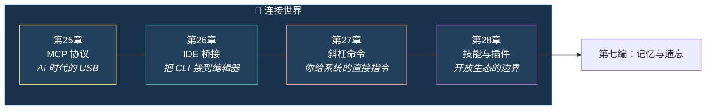
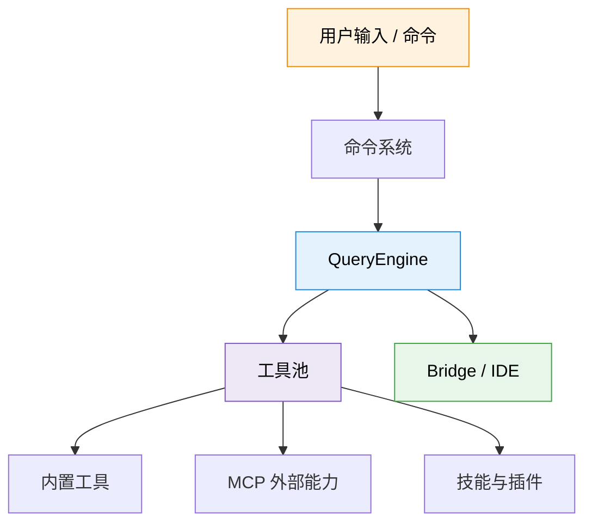

# 第六编：连接世界

> *USB 统一了键盘、鼠标、U 盘和相机的连接方式，电脑才真正变成“万物接口”。*
>
> Claude Code 的外部连接层也在做同样的事：把 **外部工具**、**IDE 编辑器**、**用户命令**、**第三方技能/插件** 接到同一套执行引擎上。

---

## 本编总览

---

## 本编四章速览

| 章 | 标题 | 核心问题 | 生活类比 |
|---|---|---|---|
| 25 | [MCP 协议：AI 时代的 USB](chapter25.md) | 内置工具已经很多了，为什么还要接外部能力？ | USB 标准接口 |
| 26 | [IDE 桥接：一座把 CLI 接到编辑器的桥](chapter26.md) | 一个命令行工具，为什么要维护一整套桥接层？ | 电话的三代演进 |
| 27 | [斜杠命令：你给系统的直接指令](chapter27.md) | 工具是 AI 调的，命令是人调的，这两套入口怎么配合？ | 餐厅菜单系统 |
| 28 | [技能与插件：安全地扩展能力边界](chapter28.md) | 开放生态以后，怎么避免系统被扩展反噬？ | 手机 App Store |

---

## 这一编建议怎么读

=== "🌱 初学者"

    先读第 27 章。它最接近日常体验，能帮你理解 `/help`、`/config`、`/batch` 这类命令背后的结构。

=== "🔧 开发者"

    第 25 章和第 28 章最关键。一个讲协议，一个讲生态，是把 Claude Code 从产品看成平台的起点。

=== "🏗️ 架构师"

    第 26 章最值得细读。CLI、桥接、远程会话、认证续期、会话恢复，这些组合在一起才是真正的系统难点。

!!! success "本编阅读目标"
    读完这一编，你应该能回答三个关键问题：Claude Code 怎样接外部世界、怎样把能力送进 IDE、怎样在开放生态里保持秩序。
