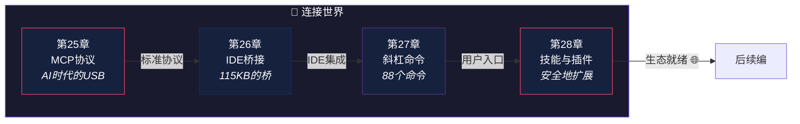

# 第六编：连接世界

> *USB 让所有设备用同一种接口连电脑——在 USB 之前，每个设备都有自己的接口。*
>
> 本编解析 Claude Code 如何与外部世界对接：**MCP 协议**、**IDE 桥接**、**斜杠命令**、**技能与插件系统**。

---

## 本编总览

---

## 本编四章速览

| 章 | 标题 | 核心问题 | 生活类比 |
|---|------|----------|----------|
| 25 | [MCP协议](chapter25.md) | 已经有 54 个内置工具，为什么还要接"外部能力"？ | USB 统一接口 |
| 26 | [IDE桥接](chapter26.md) | 一个 CLI 为什么要有 115KB 的桥接代码？ | 电话的三代演进 |
| 27 | [斜杠命令](chapter27.md) | 工具是 AI 调用的，命令是你调用的——边界在哪？ | 餐厅菜单系统 |
| 28 | [技能与插件](chapter28.md) | 任何人都能写插件——安全怎么保证？ | 手机 App Store |

---

## 设计思想主线

!!! tip "本编建立的认知基础"
    1. MCP 协议是 AI 时代的 USB——**统一接口降低接入成本，释放生态潜力**
    2. 桥接系统让 CLI 的能力"长"到 IDE 里——**三代迭代解决了稳定性和便携性**
    3. 工具服务于 AI 的自主决策，命令服务于用户的直接意图——**边界清晰**
    4. 插件系统在"开放"和"安全"之间走钢丝——**审核、沙箱、权限三管齐下**

---

## 推荐路径

=== "🌱 初学者"

    第27章的斜杠命令最贴近日常使用——**理解你每天输入的 `/` 命令背后发生了什么**。

=== "🔧 开发者"

    第25章的 MCP 协议和第28章的插件系统是**扩展 Claude Code 能力的实战指南**。

=== "🏗️ 架构师"

    第26章的桥接架构展示了**CLI 到 IDE 集成的完整技术方案**——三代迭代的取舍值得学习。

!!! note "即将上线"
    本编内容正在写作中，敬请期待。
