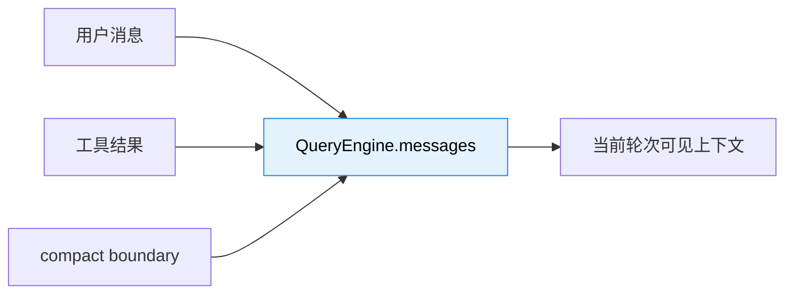
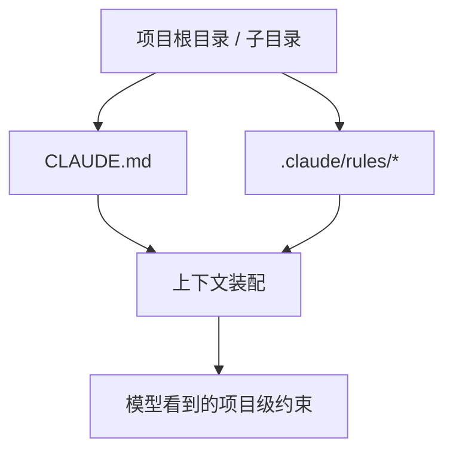
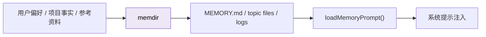
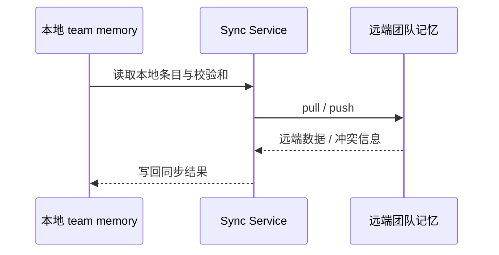
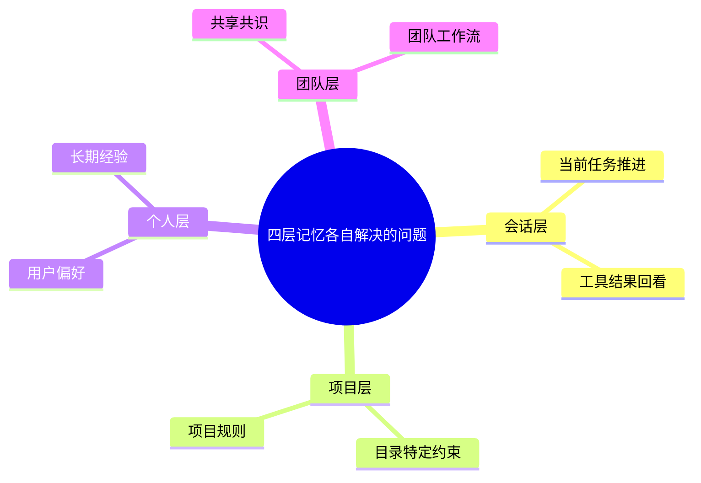
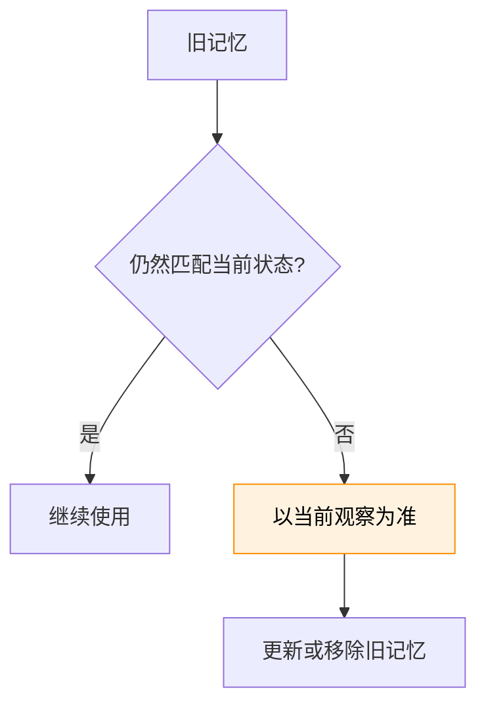

---
tags:
  - Memory
  - 第七编
---

# 第29章：四层记忆：Claude Code 怎么“记住”上下文

!!! tip "生活类比：人的四层记忆"
    我们脑子里同时有几层记忆：眼前正在处理的、今天刚学到的、长期记住的、团队共享的常识。Claude Code 也不是只有“一个上下文窗口”，而是有多层记忆一起工作。

!!! question "这一章先回答一个问题"
    你和 Claude Code 聊了一下午，它知道你的项目、习惯和团队规则。关掉终端之后，这些东西到底哪些会留下，哪些会消失？

最短的答案是：**不是所有信息都该存成同一种记忆**。Claude Code 把“现在要用的”“项目长期规则”“个人长期偏好”“团队共享共识”分到了不同层里。

---

## 29.1 第一层：会话内记忆，活得最短却最鲜活

QueryEngine 自己就维护着一大块会话状态：消息数组、工具结果、压缩边界、恢复信息、继续执行条件。这一层最像人的“工作记忆”。

这层的特点是：

- 更新最快
- 对当前任务影响最大
- 但生命周期最短

一旦会话结束，它就不再是“天然存在”的记忆了，除非被写进别的层。

---

## 29.2 第二层：项目级记忆，最像“你们项目的教科书”

项目里的 `CLAUDE.md` 和规则文件，承担的是“这个仓库长期有效的工作方式”。

它和普通聊天历史不同：

- 不是这轮对话里临时冒出来的
- 通常由项目维护者或使用者刻意维护
- 每次进入项目时会被重新装配进上下文

从设计思想上说，这层是在解决“**别让 AI 每次重新学项目文化**”的问题。

---

## 29.3 第三层：Auto Memory，最像“用户自己的长期笔记”

真正持久化的个人记忆，主要落在 `memdir` 这一层。`paths.ts` 和 `memdir.ts` 会决定自动记忆目录在哪里、是否启用、怎么生成统一的 memory prompt。

这层和 `CLAUDE.md` 的区别在于：

- `CLAUDE.md` 更像项目明规则
- auto memory 更像个人与项目互动中沉淀出来的长期经验

所以它们不是替代关系，而是互补关系。

---

## 29.4 第四层：Team Memory，让“团队共识”不再只活在人脑里

再往上一层，就是 team memory。源码里能看到：

- `teamMemPaths.ts` 约束团队记忆目录
- `teamMemorySync/index.ts` 负责与服务端同步
- secret guard 负责阻止把敏感信息写进共享记忆

这一层解决的是单人记忆无法解决的问题：**团队规则、项目共识、共享背景知识要能被多人共同维护和读取**。

---

## 29.5 四层为什么不能合成一层

如果把所有东西都扔进一个大文件里，会立刻遇到四个问题：

1. 短期消息会污染长期记忆
2. 团队共识会被个人偏好淹没
3. 项目规则和聊天废话混在一起
4. 压缩时很难知道该删什么、不该删什么

分层的核心价值，不是“更复杂”，而是“每层都能独立演化”。

---

## 29.6 设计取舍：记忆最难的不是保存，而是避免陈旧

`memoryTypes.ts` 和 `memoryAge.ts` 里有很鲜明的思路：记忆不是“写进去就永远可信”。它会老，会过期，会和当前文件状态冲突。

所以 Claude Code 的记忆设计强调两点：

- 记忆是辅助上下文，不是真理
- 真要依赖它做判断，最好再读一次当前状态

这让它更像一个“会提醒你去复核的记忆系统”，而不是“把过去写死的数据库”。

!!! abstract "🔭 深水区（架构师选读）"
    这章最值得带走的思想是：Agent 的记忆不该只有一个层次。会话、项目、个人、团队这四层各自有不同的更新频率、可信度和作用域。把它们混在一起，只会让系统越来越难维护，也更难压缩与治理。

!!! success "本章小结"
    Claude Code 的记忆不是一个大缓存，而是四层协作系统：会话层负责当前任务，项目层负责规则，个人层负责长期经验，团队层负责共享共识。

!!! info "关键源码索引"
    - QueryEngine 注入 memory prompt：[QueryEngine.ts](/Users/champion/Documents/develop/Warwolf/OpenClaudeCode/src/QueryEngine.ts#L33)
    - QueryEngine 读取 memory prompt：[QueryEngine.ts](/Users/champion/Documents/develop/Warwolf/OpenClaudeCode/src/QueryEngine.ts#L318)
    - Auto memory 开关与路径：[paths.ts](/Users/champion/Documents/develop/Warwolf/OpenClaudeCode/src/memdir/paths.ts#L30)
    - auto memory 目录解析：[paths.ts](/Users/champion/Documents/develop/Warwolf/OpenClaudeCode/src/memdir/paths.ts#L223)
    - 统一 memory prompt 构建：[memdir.ts](/Users/champion/Documents/develop/Warwolf/OpenClaudeCode/src/memdir/memdir.ts#L419)
    - team memory 路径与边界：[teamMemPaths.ts](/Users/champion/Documents/develop/Warwolf/OpenClaudeCode/src/memdir/teamMemPaths.ts#L73)
    - team memory 同步服务：[index.ts](/Users/champion/Documents/develop/Warwolf/OpenClaudeCode/src/services/teamMemorySync/index.ts#L760)

!!! warning "逆向提醒"
    记忆系统的文件化部分在仓库里很清晰，但“哪些记忆最终会被模型采纳”仍然取决于提示装配和模型行为。本章分析的是系统如何提供记忆，不是模型是否一定会完美使用这些记忆。
