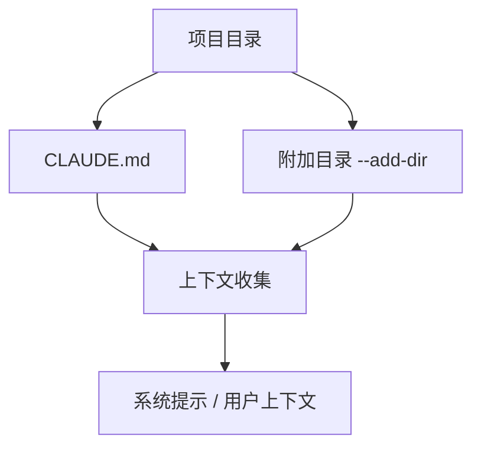
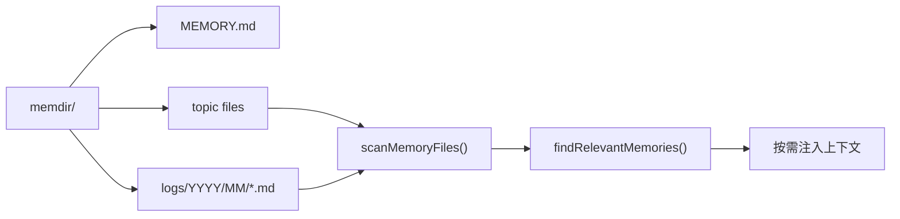
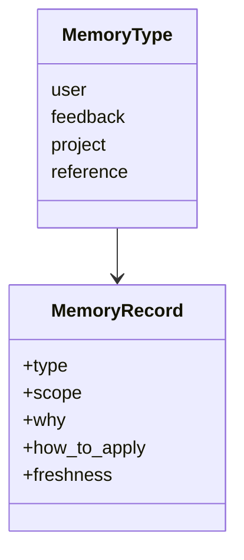
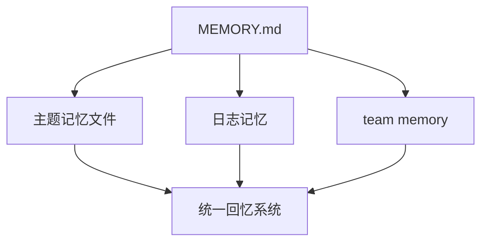
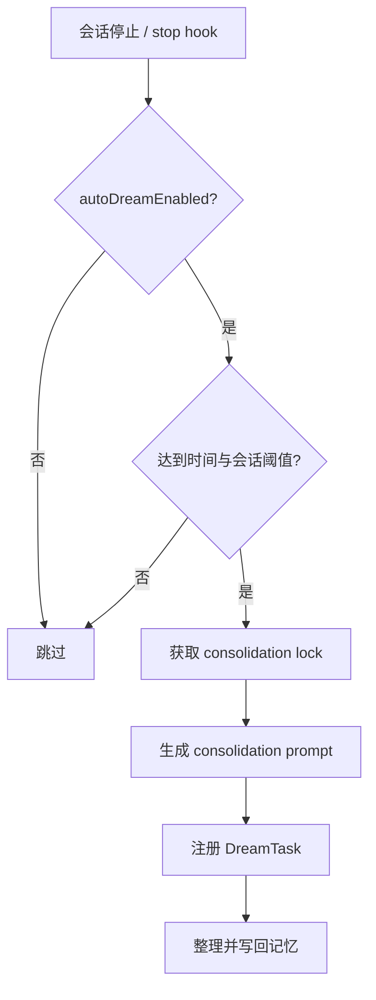
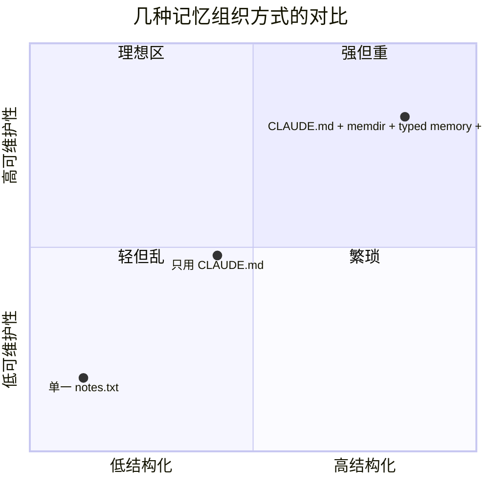

---
tags:
  - CLAUDE.md
  - Memory
  - 第七编
---

# 第30章：AI 的笔记本：CLAUDE.md 与记忆目录

!!! tip "生活类比：教科书、笔记本、错题集"
    学习不是把所有内容写在一个本子上。教科书负责稳定知识，笔记本负责自己的理解，错题集负责反复提醒。Claude Code 的 `CLAUDE.md`、`MEMORY.md`、typed memory、DreamTask，也在做类似分工。

!!! question "这一章先回答一个问题"
    为什么 Claude Code 不把所有“记忆”都塞进 `CLAUDE.md`？为什么还要有 memdir、typed memory、DreamTask 这些看起来更复杂的东西？

因为它要同时解决四件事：**稳定规则、长期经验、可检索结构、自动整理**。一个文件很难同时把这四件事都做好。

---

## 30.1 `CLAUDE.md` 解决的是“规则稳定传达”

`CLAUDE.md` 最像项目教科书。它适合放：

- 长期有效的开发规则
- 项目结构说明
- 高价值的固定约束

源码里能看到，`main.tsx` 和 `bootstrap/state.ts` 都把它当成正式上下文输入的一部分，还支持 `--add-dir` 扩展额外目录。

它的优点很明确：

- 人类可直接编辑
- 项目成员容易达成共识
- 适合作为“默认规范”

但它不适合承载太多高频变化信息。

---

## 30.2 `memdir` 解决的是“把记忆组织成目录，而不是一锅粥”

`memdir.ts`、`memoryScan.ts`、`findRelevantMemories.ts` 这一组文件，体现的设计思想是：记忆不该只是一个大文本块，而应该是**一组可扫描、可分类、可择优召回的文件**。

这比“全贴进 prompt”更高级，因为系统终于能对记忆做三件事：

- 扫描
- 过滤
- 选择性回忆

---

## 30.3 typed memory 的价值，是让系统知道“这条记忆属于哪一类”

`memoryTypes.ts` 里明确枚举了不同 memory type，并给出保存建议、示例和不该保存的内容。这一点非常像给 AI 写了一份“记忆写作规范”。

一旦有了类型，系统才能更聪明地处理：

- 哪些适合长期保留
- 哪些更容易过时
- 哪些适合 team scope
- 哪些只是个人偏好

这比“全凭一句自然语言描述”稳得多。

---

## 30.4 `MEMORY.md` 不是唯一记忆文件，而像目录入口

很多初学者会误以为 `MEMORY.md` 就是全部记忆。其实从实现上看，它更像：

- 入口页
- 索引页
- 汇总页

真正的记忆可以散落在多个主题文件、日志文件和 team memory 文件中。

这样做的好处是，记忆可以随着时间不断增长，但不会立刻把一个文件撑爆。

---

## 30.5 DreamTask 与 autoDream：系统开始自己整理笔记

`autoDream.ts` 的命名非常形象。它不是让模型“做梦”，而是让系统在合适时机自动做记忆整合。

从源码看，它会考虑：

- 是否启用 auto dream
- 是否处在 KAIROS 模式
- 距离上次 consolidation 过去多久
- 最近有没有足够多的会话值得总结
- 是否需要加锁防止并发整理

这代表一个很重要的转变：Claude Code 的记忆系统已经不是纯手工维护，而开始具备“后台整理”的能力。

---

## 30.6 为什么这套系统比一个 `notes.txt` 强太多

如果只用一个文本文件，当然也能“记东西”。但 Claude Code 需要的不是“能记”，而是“能长期用”。

Claude Code 之所以复杂，是因为它同时追求：

- 人能读
- 程序能扫
- 模型能用
- 长期不乱

这四个目标同时成立，本来就需要分层设计。

!!! abstract "🔭 深水区（架构师选读）"
    `CLAUDE.md` 与 memdir 的组合，体现的是“规则系统”和“经验系统”分离。前者适合稳定显式指令，后者适合持续积累与选择性召回。DreamTask 则开始把“记忆维护”从人工劳动变成后台任务，这是 Agent 产品向长期陪伴型系统演进的重要信号。

!!! success "本章小结"
    `CLAUDE.md` 负责稳定规则，memdir 负责结构化长期记忆，typed memory 负责分类与召回，autoDream 负责自动整理。它们分工明确，合起来才像真正可持续的记忆系统。

!!! info "关键源码索引"
    - `CLAUDE.md` 额外目录状态：`bootstrap/state.ts`
    - 设置额外 `CLAUDE.md` 目录：`bootstrap/state.ts`
    - 命令行 `--add-dir` 说明：`main.tsx`
    - typed memory 类型定义：`memoryTypes.ts`
    - typed-memory prompt 构建：`memdir.ts`
    - memory scan：`memoryScan.ts`
    - relevant memory 查找：`findRelevantMemories.ts`
    - autoDream 开关：`config.ts`
    - autoDream 主流程：`autoDream.ts`

!!! warning "逆向提醒"
    `CLAUDE.md` 的加载、memory prompt 的构建、autoDream 的触发条件都能在源码里看到，但“哪些记忆最终最有用”仍然高度依赖真实使用场景。本章分析的是系统结构，不是某个团队应当如何写记忆的唯一答案。
