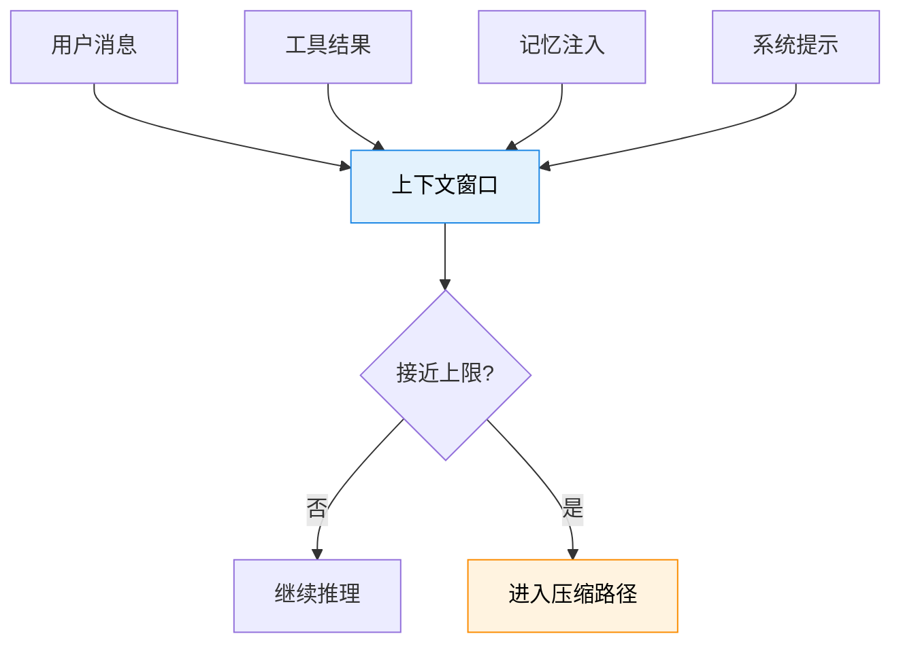
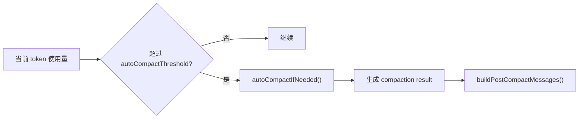
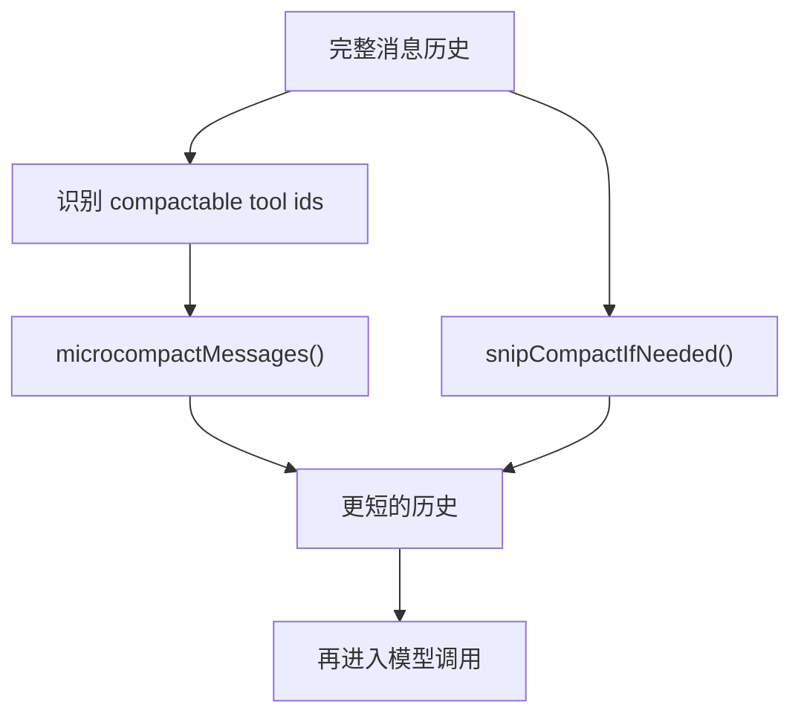
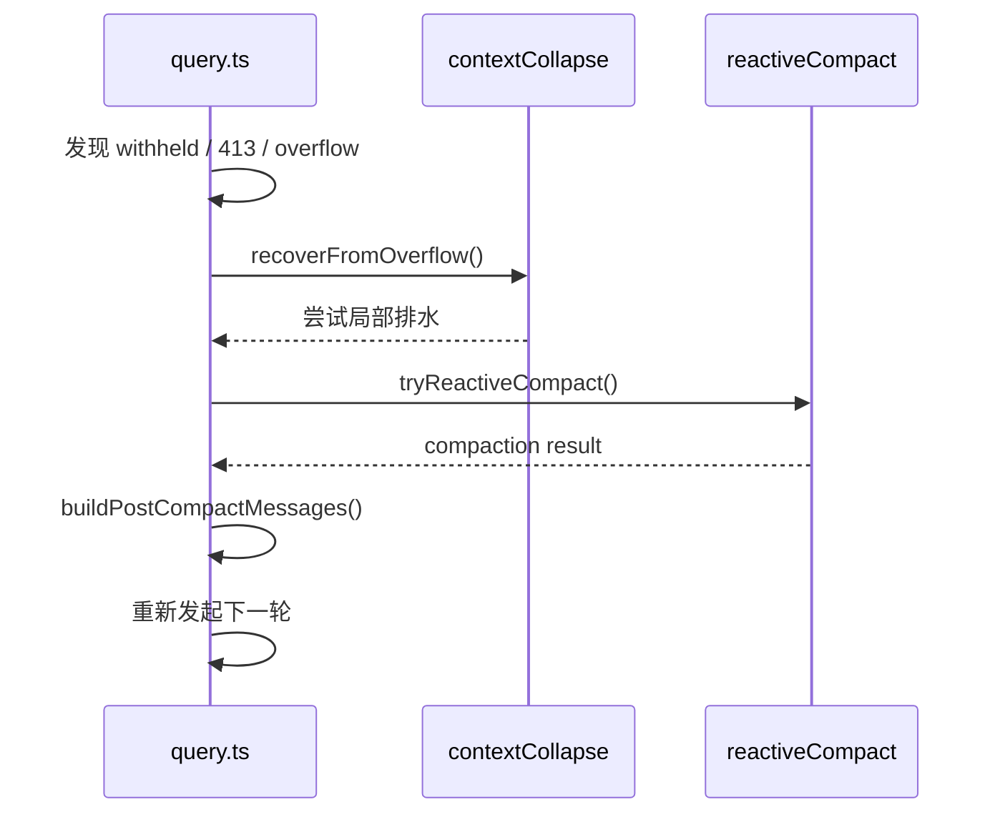
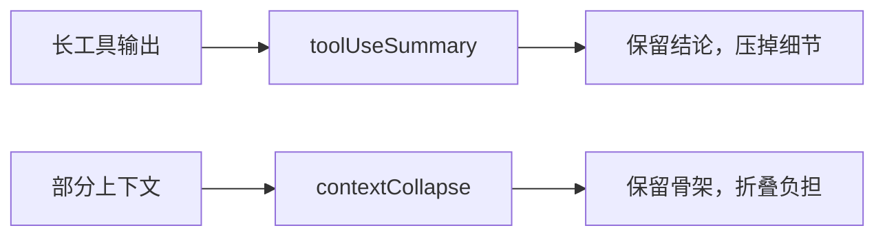
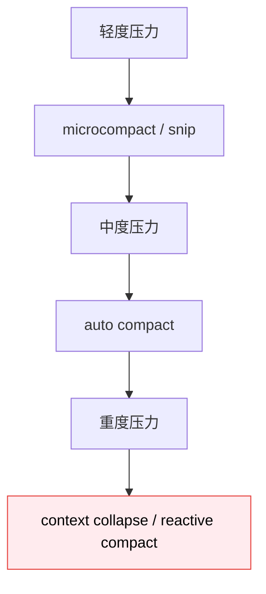

---
tags:
  - Compact
  - 第七编
---

# 第31章：当记忆装不下：压缩系统

!!! tip "生活类比：塞满的行李箱"
    行李箱快爆了，你通常有三种办法：自己整理、提前清理、快爆时紧急腾空间。Claude Code 的压缩系统，也差不多就是这三套思路。

!!! question "这一章先回答一个问题"
    对话越来越长、工具结果越来越多、上下文快超限时，Claude Code 是怎么“瘦身”而不把关键任务线索一起删掉的？

它没有只靠一种压缩，而是做了一个组合拳：**manual compact、auto compact、microcompact、reactive compact、context collapse、snip、tool summary**。

---

## 31.1 为什么“上下文压缩”是 Agent 系统的生死线

普通聊天机器人上下文满了，最多就是聊不下去。Claude Code 不一样，它在任务执行中还要保留：

- 用户目标
- 工具结果
- 中间决策
- 文件上下文
- 记忆注入

所以压缩不是优化项，而是“能不能继续工作的前提”。

---

## 31.2 auto compact：提前减肥，而不是等到完全爆掉

`autoCompact.ts` 会根据模型上下文大小和阈值判断是否需要自动压缩。它的思路很像“提前做容量管理”：

- 先看是否启用
- 计算阈值
- 到了阈值就提前压缩
- 把 tracking 信息带回主循环

这类压缩的优点，是它通常发生在系统还“比较从容”的时候，所以保真度更高。

---

## 31.3 microcompact 与 snip：优先删“最该删的部分”

Claude Code 并不是一上来就对整段历史做大摘要。`microCompact.ts` 和 `snipCompact.ts` 更像精细手术：

- 优先处理旧工具结果
- 尽量保留最近和高价值片段
- 在 API 调用前先做更细粒度瘦身

这很重要，因为“粗暴摘要整段对话”太容易把任务骨架也丢掉。微压缩和 snip 的价值，就是先拿掉体积大但信息密度低的部分。

---

## 31.4 reactive compact：真的快爆了，才动用紧急策略

在 `query.ts` 里，`reactiveCompact` 和 `contextCollapse.recoverFromOverflow()` 出现在错误恢复链上。也就是说，这些手段更像**应急逃生通道**：

- 上下文已被 withheld
- 或媒体/提示过大
- 普通路径无法继续
- 这时才触发更激进的紧急瘦身

这类压缩保真度通常不如提前压缩，但胜在能救回一次本该失败的对话。

---

## 31.5 context collapse 与 tool summary：让“骨架”继续露在外面

有意思的是，Claude Code 并不总是选择“全部压成摘要”。`contextCollapse` 和 `generateToolUseSummary()` 更像在做结构化保留：

- 让一些片段折叠，而不是彻底消失
- 把冗长工具结果改写成摘要
- 保留边界消息和任务骨架

这是一种很高级的“信息密度管理”思路：不只问“删掉什么”，还问“怎样删得更聪明”。

---

## 31.6 设计取舍：压缩系统为什么一定要多层

如果只有一种压缩策略，它迟早会在某种场景下失效。Claude Code 选择多层压缩，本质上是在处理不同级别的上下文压力：

这背后的产品观也很清楚：

- 平时少动大刀
- 先删低价值负担
- 真危险了再走激进路径

这样既能保住体验，也能保住任务连续性。

!!! abstract "🔭 深水区（架构师选读）"
    上下文压缩最难的不是“压缩率”，而是“压完还能不能继续工作”。Claude Code 把压缩设计成一条渐进式流水线：先微调，再自动，再应急。这个层级结构，比单一摘要器要稳得多，也更适合 Agent 场景。

!!! success "本章小结"
    Claude Code 的压缩系统不是单点功能，而是一套多层策略：microcompact 和 snip 负责精细减重，auto compact 负责提前管理，context collapse 和 reactive compact 负责应急救火。

!!! info "关键源码索引"
    - `query.ts` 引入 compact 体系：`query.ts`
    - Snip 预处理：`query.ts`
    - context collapse 应用：`query.ts`
    - overflow 恢复：`query.ts`
    - reactive compact 重试：`query.ts`
    - auto compact 阈值与入口：`autoCompact.ts`
    - autoCompactIfNeeded：`autoCompact.ts`
    - buildPostCompactMessages：`compact.ts`
    - microcompact 主入口：`microCompact.ts`
    - snipCompactIfNeeded：`snipCompact.ts`
    - recoverFromOverflow：`index.ts`

!!! warning "逆向提醒"
    压缩效果和模型行为强相关。源码能解释“什么时候压、怎么压、压后消息如何重建”，但不能保证任何一次压缩都保留了最优语义，这依然是运行时策略和模型质量共同决定的结果。
